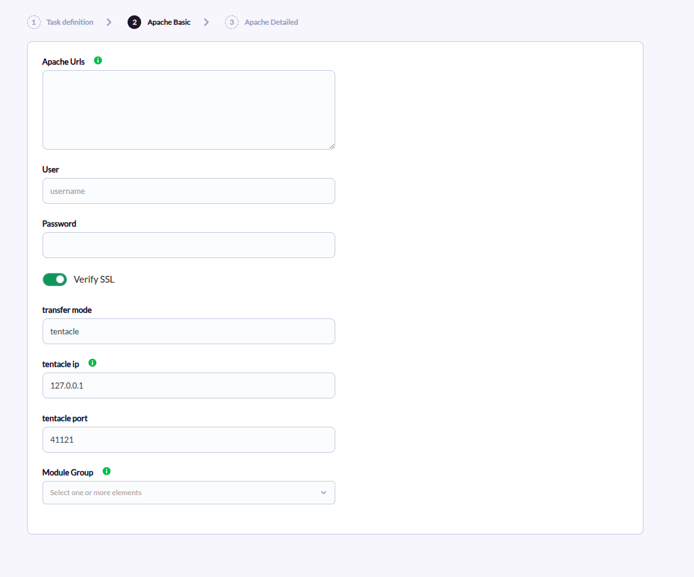
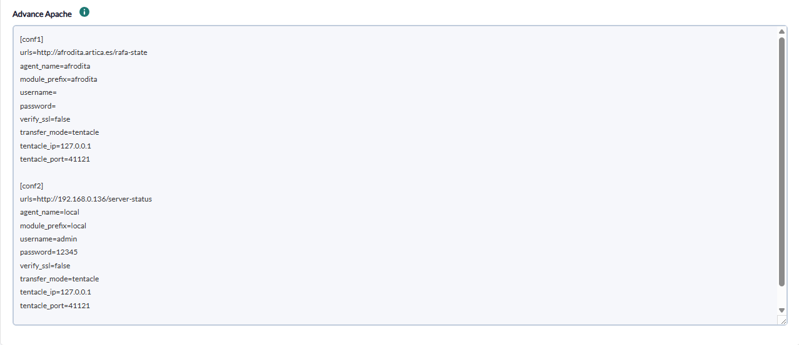
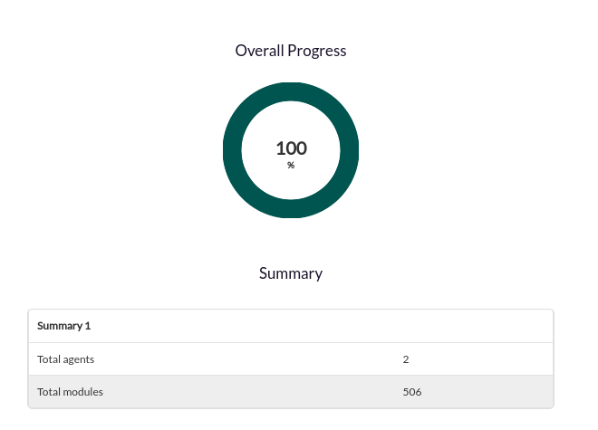

# Apache Discovery

## Introduction

This Apache discovery plugin (version 1.5) for Pandora FMS is designed to automate the monitoring of Apache HTTP Server instances by leveraging the information provided by `mod_status`. By interacting with the server status page (`server-status`), the plugin collects real-time metrics that are crucial to understanding the performance and health of your Apache environment. The plugin creates one agent per configured Apache instance, with one module per available metric plus a fixed connection/availability module.

## Compatibility matrix

| **Systems where tested** | An `httpd:alpine` container exposing `server-status` over plain HTTP (the plugin's own test environment) |
| --- | --- |
| **Systems where it works** | Any Linux system supported by Pandora FMS. The plugin ships as a compiled binary that bundles its dependencies, so it needs no Python installation on the host. The host operating systems it has been run on are not recorded. |

## Prerequisites

- The plugin is distributed as a compiled binary that already contains all the dependencies needed for its use, so it does not require installing Python or additional libraries.
- The Apache `mod_status` module must be enabled and the `server-status` location accessible. See the [Apache Configuration](#apache-configuration) section for the steps.

## Apache Configuration

For the plugin to obtain the statistics, Apache must expose the `server-status` endpoint through `mod_status`. Enable it by editing the Apache configuration (for example a file included from `httpd.conf`):

```apache
LogFormat "%h %l %u %t \"%r\" %>s %b \"%{Referer}i\" \"%{User-agent}i\"" combined-status

<Location "/server-status">
    SetHandler server-status
    Require all granted
</Location>

SetEnvIf Request_URI "^/server-status" log_combined_status
CustomLog /proc/self/fd/1 combined-status env=log_combined_status
```

Restrict access to the trusted host running the plugin instead of `Require all granted` in production, for example `Require ip 192.168.1.50`.

After modifying the Apache configuration, reload the service to apply the changes:

```bash
sudo systemctl reload apache2
```

### Verification

To verify that the endpoint responds correctly, make a manual request to the status page with the `?auto` query string, which returns the machine-readable `key: value` format the plugin parses:

```bash
curl http://192.168.0.1/server-status?auto
```

The output must be plain text with a `Key: value` format per line, for example:

```
Total Accesses: 14733
Total kBytes: 2461799
CPULoad: .0828951
Uptime: 11979
ReqPerSec: 1.2299
BytesPerSec: 210442
BytesPerReq: 171104
BusyWorkers: 6
IdleWorkers: 35
```

The exact set of fields present depends on the Apache version, the active MPM, and which optional modules (such as `mod_cache`) are compiled in.

## Parameters

**Simple mode**

| Parameter | Description |
| --- | --- |
| `--urls` | Apache `server-status` endpoint URL(s), comma or newline separated. Each URL generates an agent, unless `agent_name` is set. |
| `--user` | username, if the Apache server requires it, optional |
| `--password` | password, if the Apache server requires it, optional |
| `--ssl` | whether to require and verify an HTTPS certificate for the URL, optional |
| `--transfer_mode` | data transfer mode, optional |
| `--tentacle_ip` | tentacle IP, optional |
| `--tentacle_port` | tentacle port, optional |
| `--user_agent` | custom User-Agent header sent to Apache, optional |
| `-in` / `--interval` | monitoring interval in seconds, optional |
| `--as_server_plugin` | when `true`, print a single `1` (agents were created without errors) or `0` instead of the Discovery JSON summary, so the plugin can be used as a regular server plugin, optional (default `false`) |

**Advanced mode**

| Parameter | Description |
| --- | --- |
| `--conf` | path to a configuration file with a single `[CONF]` block, equivalent to simple mode |
| `--string_conf` | path to a configuration file containing one or more named blocks (`[block_name]`), each describing a separate Apache target |

**Configuration file (`--conf` / `--string_conf` block)**

```
urls= Apache server-status URL(s)
agent_name= specific agent name, optional
module_prefix= prefix added to every module name, optional
username= username, if the Apache server requires it, optional
password= password, if the Apache server requires it, optional
verify_ssl= whether to require and verify an HTTPS certificate, optional
transfer_mode= data transfer mode, optional
tentacle_ip= tentacle IP, optional
tentacle_port= tentacle port, optional
interval= monitoring interval in seconds, optional
user_agent= custom User-Agent header sent to Apache, optional
module_group= module group for the created modules, optional
```

**Example**

```bash
urls=https://192.168.0.1/example
agent_name=example
module_prefix=apache
username=admin
password=12345
verify_ssl=true
transfer_mode=tentacle
tentacle_ip=127.0.0.1
tentacle_port=41121
user_agent=Mozilla/5.0 (Windows NT 10.0; Win64; x64) AppleWebKit/537.36 (KHTML, like Gecko) Chrome/125.0.0.0 Safari/537.36
```

`--string_conf` files can contain several named blocks, each becoming an independent Apache target with its own agent:

```ini
[conf1]
urls=http://192.168.0.1/example
agent_name=local
module_prefix=apache
username=admin
password=12345
verify_ssl=true
tentacle_ip=127.0.0.1
tentacle_port=41121
```

## Manual execution

The execution returns a JSON output with information about the run, and generates one XML file per monitored agent, which is sent to the Pandora FMS server using the transfer method indicated in the configuration.

### Execution format

The plugin execution format is as follows:

```bash
./pandora_apache --urls <Apache server-status URL(s)> --user <username> --password <password> --ssl <true|false> --transfer_mode <transfer mode> --tentacle_ip <tentacle IP> --tentacle_port <tentacle port> --user_agent <User-Agent> --interval <seconds> --conf <path to configuration file> --string_conf <path to configuration file with named blocks> --as_server_plugin <true|false>
```

#### Examples

to run in simple mode

```bash
./pandora_apache --urls http://192.168.0.1/server --ssl false --transfer_mode tentacle --tentacle_ip 127.0.0.1 --tentacle_port 41121
```

to run in advanced mode

```bash
./pandora_apache --urls http://192.168.0.1/server --ssl false --transfer_mode tentacle --tentacle_ip 127.0.0.1 --tentacle_port 41121 --conf /file/file.conf
```

#### Verbose mode

The plugin has no verbose or debug flag. Its only diagnostic channel is the informational text included in the Discovery/JSON execution output, which reports request errors and, when fewer metrics are found than expected for a target, which ones are missing.

## Configuration in PandoraFMS

This plugin can be integrated with Pandora FMS *Discovery*.

To do so, load the ".disco" package that you can download from the Pandora FMS library:

[https://pandorafms.com/library/](https://pandorafms.com/library/)

Once loaded, Apache instances can be monitored by creating *Discovery* tasks from the *Management &gt; Discovery &gt; Application &gt; Apache* section.

For each task the following minimum data is requested in the **Apache Basic** step:

- **Apache urls:** Apache server-status URL(s)
- **User:** server username, if required, optional
- **Password:** server password, if required, optional
- **Verify SSL:** active if the URL SSL certificate needs to be verified, active by default
- **Tentacle Mode:** transfer mode, optional
- **Tentacle IP:** tentacle IP, optional
- **Tentacle port:** tentacle port, optional
- **Module group:** selector with the module groups available



In the **Apache Detailed** step a text area is provided to add the configuration of each Apache block to monitor:

- **Block:** block name, for example `[conf]`, required.
- **Apache urls:** Apache server-status URL.
- **Agent name:** specific agent name, optional.
- **Module prefix:** prefix for each module, optional.
- **User:** server username, if required, optional.
- **Password:** server password, if required, optional.
- **Verify SSL:** active if the URL SSL certificate needs to be verified, active by default.
- **User_agent:** custom User-Agent header sent to Apache, optional.
- **Tentacle Mode:** transfer mode, optional.
- **Tentacle IP:** tentacle IP, optional.
- **Tentacle port:** tentacle port, optional.

There is also a task-level field to set a custom User-Agent.



Successfully completed tasks show an execution summary with the following information:

- **Total agents:** total number of agents generated by the task.
- **Total modules:** total number of modules generated by the task.



## Agent and modules generated by the plugin

The plugin creates one agent per instance. In simple mode the agent name is taken from the URL. In advanced mode, one agent is created per submitted block, named after the **agent name** field; if it is not specified, the name is taken from the URL. Each agent always includes an **Apache Connection** module (`generic_proc`), reflecting whether the `server-status` endpoint responded: value `1` if it did, `0` if it could not be reached, with the error described in the module description on failure. This connection module is created even when the request fails, so availability is monitored regardless of the rest of the metrics.

The remaining modules depend on the configuration and Apache server version: a recent Apache installation with every relevant module enabled exposes all of them. They are created as `generic_data` (numeric values) or `generic_data_string` (non-numeric values) depending on the type of the parsed value:

| Module | Description |
| --- | --- |
| ServerVersion | The Apache service version (e.g., Apache/2.4.62) |
| ServerMPM | The Multi-Processing Module (MPM) currently in use by Apache (e.g., event, prefork, worker) |
| ServerBuilt | The date and time when the Apache server binary was compiled |
| ParentServerConfigGeneration | The configuration generation of the parent Apache process. Increments with each graceful restart |
| ParentServerMPMGeneration | The MPM generation of the parent Apache process |
| ServerUptimeSeconds | The service uptime expressed in seconds |
| Load1 | The system load average over the last 1 minute |
| Load5 | The system load average over the last 5 minutes |
| Load15 | The system load average over the last 15 minutes |
| Total Accesses | The total number of client requests received by the server since its last start/restart |
| Total kBytes | The total kilobytes of data served by the Apache server since its last start/restart |
| Total Duration | The cumulative time spent processing all requests since the server started (microseconds or milliseconds, depending on Apache version and configuration) |
| CPUUser | The CPU time used by Apache processes in user mode since the server started, as a percentage |
| CPUSystem | The CPU time used by Apache processes in system (kernel) mode since the server started, as a percentage |
| CPUChildrenUser | The CPU time used by child processes of Apache in user mode |
| CPUChildrenSystem | The CPU time used by child processes of Apache in system (kernel) mode |
| CPULoad | The overall CPU load percentage consumed by all Apache processes combined since the server started |
| Uptime | The human-readable representation of the server's uptime (e.g., "2 days 4 hours 40 minutes"), derived from ServerUptimeSeconds |
| ReqPerSec | The average number of requests served per second since the server was started/restarted. Not used by the plugin, as it counts the average since the last Apache start |
| BytesPerSec | The average number of bytes served per second since the server was started/restarted. Not used by the plugin, as it counts the average since the last Apache start |
| BytesPerReq | The average number of bytes served per request since the server was started/restarted |
| DurationPerReq | The average time it took to serve each request since the server was started/restarted (milliseconds or microseconds) |
| BusyWorkers | The total number of worker threads/processes currently busy handling requests |
| GracefulWorkers | The number of worker processes currently in a graceful shutdown state |
| IdleWorkers | The total number of worker threads/processes currently idle and ready to handle new requests |
| Processes | The number of active Apache processes (not threads) currently running |
| Stopping | The number of worker processes currently in a stopping state |
| ConnsTotal | The total number of connections to the Apache server |
| ConnsAsyncWriting | The number of asynchronous connections in writing state (applicable only to the event MPM) |
| ConnsAsyncKeepAlive | The number of asynchronous connections in keep-alive state (applicable only to the event MPM) |
| ConnsAsyncClosing | The number of asynchronous connections in closing state (applicable only to the event MPM) |
| CacheType | The type of cache mechanism used by Apache (e.g., SHMCB for shared memory caching) |
| CacheSharedMemory | The total amount of shared memory allocated for the cache |
| CacheCurrentEntries | The current number of entries stored in the cache |
| CacheSubcaches | The number of subcaches within the main cache |
| CacheIndexesPerSubcaches | The number of index entries per subcache |
| CacheIndexUsage | The percentage of the cache index space currently in use |
| CacheUsage | The overall percentage of the cache memory currently in use |
| CacheStoreCount | The total number of times an item has been successfully stored in the cache |
| CacheReplaceCount | The total number of times an existing cache entry has been replaced |
| CacheExpireCount | The total number of times a cache entry has expired |
| CacheDiscardCount | The total number of times a cache entry has been discarded |
| CacheRetrieveHitCount | The total number of times a requested item was found in the cache (cache hit) |
| CacheRetrieveMissCount | The total number of times a requested item was not found in the cache (cache miss) |
| CacheRemoveHitCount | The total number of times an item was successfully removed from the cache when it was found |
| CacheRemoveMissCount | The total number of times an item was attempted to be removed from the cache but was not found |


