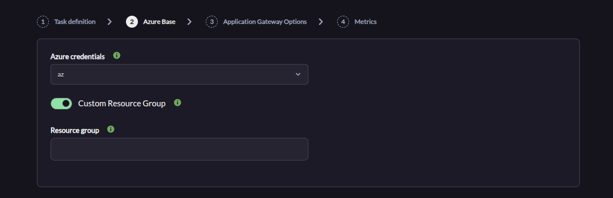
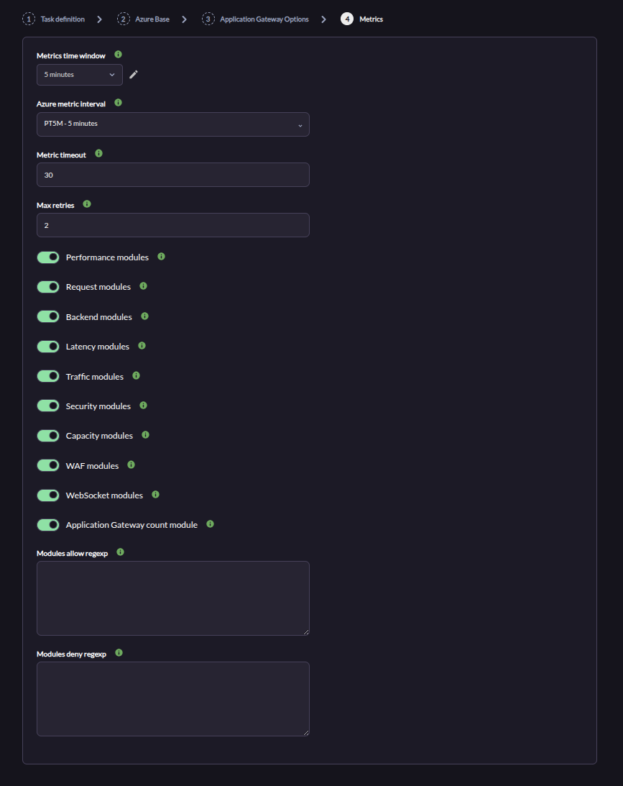
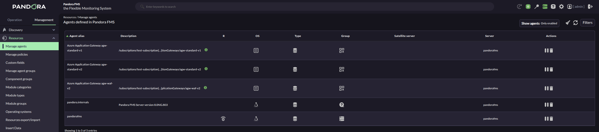
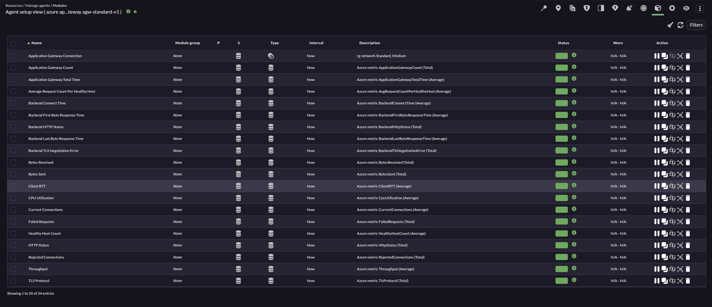
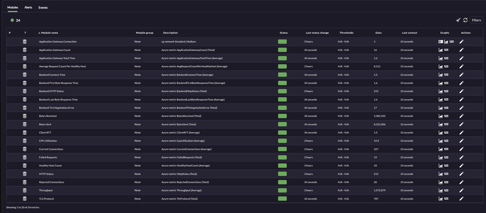

# Azure Application Gateway Discovery

*Article last updated: 2026-09-16.*

## What it monitors

The Azure Application Gateway Discovery plugin discovers the Azure Application Gateways in a Microsoft Azure subscription and turns their Azure Monitor metrics into Pandora FMS agents and modules: performance, request and backend health counters, latency, traffic, security, capacity, Web Application Firewall (WAF), WebSocket activity and a per-Application-Gateway count.

By default it creates **one agent per Application Gateway**, named with the Application Gateway name and an optional prefix. It can also consolidate every discovered Application Gateway onto a single agent. Each agent carries a reachability module plus one module per enabled metric.

## Prepare

### Compatibility

| Scope | State | Evidence |
| --- | --- | --- |
| Plugin version `1.0` (`pandorafms.azure.gateway`) | Documented target | The version this page describes. See [Plugin identity](#plugin-identity) |
| Microsoft Azure Network and Azure Monitor | `Required` | The plugin enumerates Application Gateways with the Network API and reads their metrics with the Monitor API |
| A Microsoft Entra service principal able to list Application Gateways and read their Azure Monitor metrics | `Required` | Prerequisite, not a compatibility statement. See [Prepare Azure access](#prepare-azure-access) |
| A Pandora FMS agent group with an ID greater than `0` | `Required` | The `All` group has ID `0` and cannot be used |
| Sovereign or custom Azure clouds | `Not validated` | The endpoints are the public Azure ones; no test record establishes operation against a non-public cloud |
| Host operating system running the plugin | `Not validated` | No test record establishes operating-system compatibility |

### Prerequisites

1. **A Pandora FMS server with Discovery enabled** to execute the task, and the console to define it.
2. **A Microsoft Azure subscription** containing Application Gateways.
3. **An Azure credential** stored in the Pandora FMS credential store, or its values supplied directly for a manual run.
4. **A valid agent group** for the task. The `All` group is not valid, because its ID is `0`.

The plugin is distributed as a self-contained executable: the packaged Discovery app ships `bin/pandora_azure_gateway`, so no additional runtime has to be installed on the Pandora FMS server or for a manual run.

### Prepare Azure access

Create a Microsoft Entra service principal that can enumerate the Application Gateways and read their Azure Monitor metrics, over the subscription or the Resource Group to be discovered. The plugin lists the Application Gateways with the Azure Network API and reads the metrics with the Azure Monitor API, so the principal needs read access to both. Do not grant a broader role than your policy requires.

Store its **Client ID**, **Application secret**, **Tenant or domain name** and **Subscription id** as an Azure credential in the Pandora FMS credential store, so the task references the credential instead of carrying the secret itself.

A `Reader` role over the subscription or the Resource Group is enough in most environments. The principal is created from Azure CLI with:

```bash
az ad sp create-for-rbac \
  --name pandora-azure-application-gateway-discovery \
  --role Reader \
  --scopes /subscriptions/<SUBSCRIPTION_ID>
```

The command returns the values to store, mapped as follows:

```text
tenant       -> Tenant or domain name
appId        -> Client ID
password     -> Application secret
subscription -> Subscription id
```

### Install the plugin

Upload the `.disco` package from **Management → Discovery → Extension manager**. Once loaded, **Azure Application Gateway** appears under the **Cloud** category of the Discovery wizard.

## Configure the Discovery task

Create the task from **Management → Discovery → Cloud → Azure Application Gateway**. The wizard's generic first step defines the task; the package adds **Azure Base**, **Application Gateway Options** and **Metrics**. Every field is documented in [Task parameters](#task-parameters).

**Step 1 — Task definition.** Name, group, server and interval. The group must have an ID greater than `0`; `All` cannot be used. The group and interval are passed to the plugin and inherited by every generated agent.

**Step 2 — Azure Base.** Which subscription to read and how much of it:

- **Azure credentials** selects the stored Azure credential. The credential contains the Client ID, Application secret, Tenant or domain name and Subscription ID.
- **Custom Resource Group** limits discovery to a single Resource Group, and **Resource group** names it exactly. Regular expressions are not accepted here.



**Step 3 — Application Gateway Options.** Agent layout, discovery cache and diagnostics:

- **Target agent** is used only when **Create one agent per Application Gateway** is disabled.
- **Scan Application Gateways** queries Azure to discover the current Application Gateways; when disabled the cached entities file is reused.
- **Create one agent per Application Gateway** decides the agent layout: one agent per resource, or every module on the single **Target agent**.
- **Agent autodisable mode** creates the generated agents in Pandora FMS mode `2`.
- **Application Gateway agent prefix** names the per-Application-Gateway agents.
- **Modules prefix** is prepended to every generated module name.
- **Enable entities file re-scan interval** and **Entities re-scan interval** control how long the discovered cache is reused before being rebuilt.
- **Debug** reveals the local mock option, which exists for testing only.

<!-- SCREENSHOT NEEDED: Application Gateway Options wizard step showing the agent layout, cache and Debug fields in the order of the final plugin (Target agent, Scan Application Gateways, Create one agent per Application Gateway, Agent autodisable mode, prefixes, cache interval, Debug and Mock Azure API URL). -->

**Step 4 — Metrics.** Which metric families are collected:

- **Metrics time window** is the range queried in Azure Monitor and **Azure metric interval** is the time grain.
- **Metric timeout** bounds each request and **Max retries** covers temporary Azure errors and HTTP 429 responses.
- One toggle per metric family: **Performance modules**, **Request modules**, **Backend modules**, **Latency modules**, **Traffic modules**, **Security modules**, **Capacity modules**, **WAF modules**, **WebSocket modules** and **Application Gateway count module**.
- **Modules allow regexp** and **Modules deny regexp** filter the final module names.



## Verify the first run

Force the task from **Management → Discovery → Task list** and check the result in this order.

1. **The task summary** reports `application_gateways_discovered`, `application_gateways_vanished`, `modules`, `errors`, `unsupported_metrics` and `scan_source`. Expect one agent per discovered Application Gateway, or one **Target agent** when per-Application-Gateway creation is disabled.

2. **The agents.** Named `<Application Gateway agent prefix><Application Gateway name>` by default, so `Azure Application Gateway agw-standard-v1`. Each one reports `Azure` as its operating system and `sku.name sku.tier` as its version, and inherits the task's group and interval.

3. **`Application Gateway Connection`** is `1` on every discovered Application Gateway. A `0` means the Application Gateway was in the cache but is no longer discoverable — see [Troubleshoot](#troubleshoot).

4. **The metric modules** for each enabled family, for those metrics Azure Monitor actually reports for the resource.



If no agent appears at all, the credential or its permissions are the first thing to check.

## Understand the results

### Agent layout

**With Create one agent per Application Gateway enabled**, which is the default, the plugin creates one agent per Application Gateway, named `<Application Gateway agent prefix><Application Gateway name>`. A separator is inserted when the prefix does not end in a space, a hyphen or an underscore, so a prefix of `Azure Application Gateway` behaves like `Azure Application Gateway `.

**With it disabled**, every module goes to the single **Target agent** and the Application Gateway name is prepended to each module name instead. This matters for filtering: the allow and deny regular expressions are evaluated against the *final* module name, which in consolidated mode includes that Application Gateway prefix.

Generated agents report `Azure` as their operating system, inherit the task's group and interval, and are created in Pandora FMS agent mode `2` when **Agent autodisable mode** is enabled, or mode `1` when it is disabled. The agent address is the Application Gateway name and its description is the Azure resource ID.

### Discovery cache and disappearing resources

The plugin keeps a task-scoped entities cache under `entities_list`, seeded from the Application Gateway API and reused across runs. The cache is scoped per task, so two tasks configured over the same subscription do not share their discovered entities.

`Application Gateway Connection` is always created, as `generic_proc`, with value `1` for a discovered Application Gateway. When a cached Application Gateway stops being discoverable, its agent is kept and this module reports `0` until the entity is dropped during a cache rebuild.

### What gets created

`Application Gateway Connection` is the only `generic_proc` module; the description records the Resource Group and SKU. Everything else is `generic_data`, grouped by the option that enables it:

| Enabled by | What you get |
| --- | --- |
| Performance modules | `CPU Utilization`, `Current Connections`, `Throughput` and `New Connections Per Second` |
| Request modules | `Failed Requests`, `HTTP Status` and `Total Requests` |
| Backend modules | `Healthy Host Count`, `Unhealthy Host Count`, `Average Request Count Per Healthy Host` and `Backend HTTP Status` |
| Latency modules | `Backend Connect Time`, `Backend First Byte Response Time`, `Backend Last Byte Response Time`, `Application Gateway Total Time` and `Client RTT` |
| Traffic modules | `Bytes Sent` and `Bytes Received` |
| Security modules | `TLS Protocol`, `Backend TLS Negotiation Error` and `Rejected Connections` |
| Capacity modules | `Compute Units`, `Capacity Units`, `Estimated Billed Capacity Units` and `Fixed Billable Capacity Units` |
| WAF modules | `WAF Matched Count`, `WAF Blocked Requests`, `WAF Blocked Count`, `WAF Total Requests`, `WAF Security Rule`, `WAF Custom Rule`, `WAF Bot Protection`, `WAF JS Challenge Request Count`, `WAF Penalty Box Hits`, `WAF Penalty Box Size` and `WAF Captcha Challenge Request Count` |
| WebSocket modules | `WebSocket Active Connections` and `WebSocket Specific Close Status Code` |
| Application Gateway count module | `Application Gateway Count` |

Every module is read from Azure Monitor and carries the description `Azure metric <MetricName> (<Aggregation>)`. Capacity metrics and `New Connections Per Second` are only collected for v2 SKUs, and WAF metrics only for WAF SKUs; on top of that, the plugin asks Azure Monitor which metrics are available for the resource and skips the rest. A metric that Azure rejects is retried on its own and, if it keeps failing, counted in `unsupported_metrics` instead of aborting the run. The exhaustive module inventory is in [Generated modules](#generated-modules).





## Troubleshoot

- **The task fails on the group** — the agent group must have an ID greater than `0`. `All` is group `0` and cannot be used.
- **No Application Gateway is discovered** — check the service principal in this order: the credential values, then that it can list the Application Gateways and read their metrics, then whether **Custom Resource Group** is narrowing the search.
- **`tenant_id, client_id and client_secret are required`** — no usable Azure credential was resolved. Select a valid Azure credential in **Azure Base**, or, for a manual run, provide `credentials` or the `tenant_id`, `client_id` and `client_secret` keys.
- **An agent survives with `Application Gateway Connection` at `0`** — the Application Gateway is in the entity cache but is no longer discoverable, because it was deleted, renamed, or moved out of the configured scope. The agent is kept until the cache is rebuilt, which happens after **Entities re-scan interval**.
- **Expected modules are missing** — the allow and deny regular expressions are evaluated against the final module name. In consolidated mode that name carries the Application Gateway name, so an expression written for per-Application-Gateway mode will not match. SKU-specific metrics that Azure Monitor does not report for the resource are also skipped, and counted in `unsupported_metrics`.
- **Azure rejects a metric request with HTTP 400 `Failed to find metric configuration`** — one metric in the batch is not valid for that SKU. The plugin retries the metrics individually and skips the unsupported one, so the run still succeeds; check `unsupported_metrics` for the list.
- **Requests time out or fail with a retryable HTTP status** — raise **Metric timeout** or **Max retries**. The plugin retries the Azure HTTP statuses 429, 500, 502, 503 and 504 up to **Max retries** times, honoring the `Retry-After` header when present.
- **Debug, Mock Azure API URL** exist to point the plugin at a local mock during testing. Leave **Debug** off in real environments.

## Reference

### Task parameters

The console presents the task fields in three steps after the generic task definition. The macro column is the identifier used in the generated task configuration.

#### Azure Base

| Field | Macro | Type | Default | Notes |
| --- | --- | --- | --- | --- |
| Azure credentials | `_credentials_` | select | — | Azure credential from the Pandora FMS credential store. Required |
| Custom Resource Group | `_customresourcegroup_` | checkbox | off | Limits discovery to one Resource Group |
| Resource group | `_resourcegroup_` | string | — | Exact Resource Group name. Shown only when the previous option is enabled; not a regular expression |

#### Application Gateway Options

| Field | Macro | Type | Default | Notes |
| --- | --- | --- | --- | --- |
| Target agent | `_targetagent_` | string | `Azure Application Gateways` | Agent used in consolidated mode. Only used when **Create one agent per Application Gateway** is disabled |
| Scan Application Gateways | `_scanagw_` | checkbox | on | Queries Azure to discover the current Application Gateways |
| Create one agent per Application Gateway | `_agentperagw_` | checkbox | on | Disabled sends every module to **Target agent** |
| Agent autodisable mode | `_agentautodisable_` | checkbox | off | Creates agents in mode `2` when enabled, mode `1` otherwise |
| Application Gateway agent prefix | `_agwagentprefix_` | string | `Azure Application Gateway ` | Prefix for per-Application-Gateway agents |
| Modules prefix | `_modulesprefix_` | string | — | Prefix prepended to every generated module name |
| Enable entities file re-scan interval | `_enableentitiesinterval_` | checkbox | on | Reuses the discovered cache until the interval expires |
| Entities re-scan interval | `_entitiesinterval_` | select | `3600` | Seconds before the cache is rebuilt. Shown only when the previous option is enabled |
| Debug | `_debug_` | checkbox | off | Reveals the local mock option below, which exists only for testing |
| Mock Azure API URL | `_mockapiurl_` | string | — | Local mock base URL. Shown only when **Debug** is enabled; leave empty in real environments |

#### Metrics

| Field | Macro | Type | Default | Notes |
| --- | --- | --- | --- | --- |
| Metrics time window | `_timewindow_` | select | `300` | Range queried in Azure Monitor for each request, in seconds |
| Azure metric interval | `_metricinterval_` | select | `PT5M` | Azure Monitor time grain (`PT1M`, `PT5M`, `PT15M`, `PT30M`, `PT1H`, `PT6H`, `PT12H`, `P1D`) |
| Metric timeout | `_metrictimeout_` | number | `30` | Request timeout in seconds; `0` or negative uses `30` |
| Max retries | `_maxretries_` | number | `2` | Retries for temporary Azure errors and HTTP 429 responses |
| Performance modules | `_checkperformance_` | checkbox | on | `CPU Utilization`, `Current Connections`, `Throughput` and `New Connections Per Second` |
| Request modules | `_checkrequest_` | checkbox | on | `Failed Requests`, `HTTP Status` and `Total Requests` |
| Backend modules | `_checkbackend_` | checkbox | on | `Healthy Host Count`, `Unhealthy Host Count`, `Average Request Count Per Healthy Host` and `Backend HTTP Status` |
| Latency modules | `_checklatency_` | checkbox | on | `Backend Connect Time`, `Backend First Byte Response Time`, `Backend Last Byte Response Time`, `Application Gateway Total Time` and `Client RTT` |
| Traffic modules | `_checktraffic_` | checkbox | on | `Bytes Sent` and `Bytes Received` |
| Security modules | `_checksecurity_` | checkbox | on | `TLS Protocol`, `Backend TLS Negotiation Error` and `Rejected Connections` |
| Capacity modules | `_checkcapacity_` | checkbox | on | `Compute Units`, `Capacity Units`, `Estimated Billed Capacity Units` and `Fixed Billable Capacity Units`. v2 SKUs |
| WAF modules | `_checkwaf_` | checkbox | on | WAF matched, blocked, rule, bot protection, challenge and penalty box metrics. WAF SKUs |
| WebSocket modules | `_checkwebsocket_` | checkbox | on | `WebSocket Active Connections` and `WebSocket Specific Close Status Code` |
| Application Gateway count module | `_checkcount_` | checkbox | on | `Application Gateway Count` |
| Modules allow regexp | `_moduleallowlist_` | textarea | — | One expression per line. Only module names matching at least one are kept |
| Modules deny regexp | `_moduledenylist_` | textarea | — | One expression per line. Matching module names are excluded. Deny takes precedence over allow |

### Configuration file keys

The Discovery task builds this file from its own fields; a manual run supplies it with `--conf`. The allow and deny lists are passed as file paths with the `module_allow_list_file` and `module_deny_list_file` keys, one expression per line.

| Key | Description | Default |
| --- | --- | --- |
| `agents_group_id` | Pandora FMS group ID assigned to generated agents. Must be greater than `0` | Required |
| `interval` | Monitoring interval inherited from the Discovery task | `300` for manual runs |
| `credentials` | Base64-encoded Azure credential generated by Pandora FMS | Empty |
| `subscription_id`, `tenant_id`, `client_id`, `client_secret` | Manual credential values, used when `credentials` is not provided | Empty |
| `resource_group` | Limits discovery to one exact Resource Group | Empty |
| `target_agent` | Agent used in consolidated mode | `Azure Application Gateways` |
| `agent_per_application_gateway` | Creates one agent per Application Gateway when enabled | `1` |
| `agent_autodisable` | Uses Pandora FMS agent mode `2` when enabled and mode `1` otherwise | `0` |
| `application_gateway_agent_prefix` | Prefix for per-Application-Gateway agents | `Azure Application Gateway ` |
| `modules_prefix` | Prefix for all generated module names | Empty |
| `scan_application_gateways` | Queries Azure to discover the Application Gateways | `1` |
| `entities_list` | Path to the Application Gateway entity cache | Empty in manual runs |
| `task_md5` | Task identifier used to scope the entity cache to this task | Empty in manual runs |
| `enable_entities_interval` | Retains cached entities until the configured interval expires | `1` |
| `entities_interval` | Entity cache rebuild interval in seconds | `3600` |
| `time_window` | Range queried in Azure Monitor, in seconds | `300` |
| `metric_interval` | Azure Monitor time grain | `PT5M` |
| `metric_timeout` | Azure request timeout in seconds | `30` |
| `max_retries` | Retries for retryable Azure errors and HTTP 429 | `2` |
| `output_format` | Output format, `json` or `xml` | `json` |
| `module_allow_list` / `module_allow_list_file` | Inline or file-based module allow regular expressions | Empty |
| `module_deny_list` / `module_deny_list_file` | Inline or file-based module deny regular expressions | Empty |
| `check_performance_modules` | Enables the performance modules | `1` |
| `check_request_modules` | Enables the request modules | `1` |
| `check_backend_modules` | Enables the backend modules | `1` |
| `check_latency_modules` | Enables the latency modules | `1` |
| `check_traffic_modules` | Enables the traffic modules | `1` |
| `check_security_modules` | Enables the security modules | `1` |
| `check_capacity_modules` | Enables the capacity modules | `1` |
| `check_waf_modules` | Enables the WAF modules | `1` |
| `check_websocket_modules` | Enables the WebSocket modules | `1` |
| `check_application_gateway_count` | Enables the Application Gateway count module | `1` |
| `mock_api_url` | Local mock base URL. Testing only | Empty |

The plugin retries the Azure HTTP statuses `429`, `500`, `502`, `503` and `504` up to **Max retries** times, honoring the `Retry-After` header when present; the retry count is configurable through **Max retries**.

### Command-line execution

The plugin reads a single configuration file. A manual run reproduces what the Discovery server does per task execution.

```bash
./pandora_azure_gateway --conf <PATH_TO_CONFIG>
```

| Option | Description |
| --- | --- |
| `--conf` | Required path to the configuration file |
| `--version` | Prints the plugin version and exits |

A minimal configuration file for a manual run:

```ini
[CONF]
subscription_id=<SUBSCRIPTION_ID>
tenant_id=<TENANT_ID>
client_id=<CLIENT_ID>
client_secret=<CLIENT_SECRET>
agents_group_id=<GROUP_ID>
```

That file holds a credential in plain text. Restrict it to the account that runs the plugin, keep it out of shared directories and version control, and prefer the Pandora FMS credential store for task runs, where the task references the credential instead of carrying it.

### Generated modules

Every module below carries the Application Gateway name prefix when **Create one agent per Application Gateway** is disabled, and the **Modules prefix** when set.

**Always created**

- `Application Gateway Connection`: `generic_proc`, `1` for a discovered Application Gateway. Description is the Resource Group and SKU.

**Performance modules**

- `CPU Utilization`: `generic_data`, Azure metric `CpuUtilization`, Average aggregation.
- `Current Connections`: `generic_data`, Azure metric `CurrentConnections`, Average aggregation.
- `Throughput`: `generic_data`, Azure metric `Throughput`, Average aggregation.
- `New Connections Per Second`: `generic_data`, Azure metric `NewConnectionsPerSecond`, Average aggregation. v2 SKUs.

**Request modules**

- `Failed Requests`: `generic_data`, Azure metric `FailedRequests`, Total aggregation.
- `HTTP Status`: `generic_data`, Azure metric `HttpStatus`, Total aggregation.
- `Total Requests`: `generic_data`, Azure metric `TotalRequests`, Total aggregation.

**Backend modules**

- `Healthy Host Count`: `generic_data`, Azure metric `HealthyHostCount`, Average aggregation.
- `Unhealthy Host Count`: `generic_data`, Azure metric `UnhealthyHostCount`, Average aggregation.
- `Average Request Count Per Healthy Host`: `generic_data`, Azure metric `AvgRequestCountPerHealthyHost`, Average aggregation.
- `Backend HTTP Status`: `generic_data`, Azure metric `BackendHttpStatus`, Total aggregation.

**Latency modules**

- `Backend Connect Time`: `generic_data`, Azure metric `BackendConnectTime`, Average aggregation.
- `Backend First Byte Response Time`: `generic_data`, Azure metric `BackendFirstByteResponseTime`, Average aggregation.
- `Backend Last Byte Response Time`: `generic_data`, Azure metric `BackendLastByteResponseTime`, Average aggregation.
- `Application Gateway Total Time`: `generic_data`, Azure metric `ApplicationGatewayTotalTime`, Average aggregation.
- `Client RTT`: `generic_data`, Azure metric `ClientRTT`, Average aggregation.

**Traffic modules**

- `Bytes Sent`: `generic_data`, Azure metric `BytesSent`, Total aggregation.
- `Bytes Received`: `generic_data`, Azure metric `BytesReceived`, Total aggregation.

**Security modules**

- `TLS Protocol`: `generic_data`, Azure metric `TlsProtocol`, Total aggregation.
- `Backend TLS Negotiation Error`: `generic_data`, Azure metric `BackendTlsNegotiationError`, Total aggregation.
- `Rejected Connections`: `generic_data`, Azure metric `RejectedConnections`, Total aggregation.

**Capacity modules**

- `Compute Units`: `generic_data`, Azure metric `ComputeUnits`, Average aggregation. v2 SKUs.
- `Capacity Units`: `generic_data`, Azure metric `CapacityUnits`, Average aggregation. v2 SKUs.
- `Estimated Billed Capacity Units`: `generic_data`, Azure metric `EstimatedBilledCapacityUnits`, Average aggregation. v2 SKUs.
- `Fixed Billable Capacity Units`: `generic_data`, Azure metric `FixedBillableCapacityUnits`, Average aggregation. v2 SKUs.

**WAF modules**

- `WAF Matched Count`: `generic_data`, Azure metric `WafMatchedCount`, Total aggregation. WAF SKUs.
- `WAF Blocked Requests`: `generic_data`, Azure metric `WafBlockedRequests`, Total aggregation. WAF SKUs.
- `WAF Blocked Count`: `generic_data`, Azure metric `WafBlockedCount`, Total aggregation. WAF SKUs.
- `WAF Total Requests`: `generic_data`, Azure metric `WafTotalRequests`, Total aggregation. WAF SKUs.
- `WAF Security Rule`: `generic_data`, Azure metric `WafSecRule`, Total aggregation. WAF SKUs.
- `WAF Custom Rule`: `generic_data`, Azure metric `WafCustomRule`, Total aggregation. WAF SKUs.
- `WAF Bot Protection`: `generic_data`, Azure metric `WafBotProtection`, Total aggregation. WAF SKUs.
- `WAF JS Challenge Request Count`: `generic_data`, Azure metric `WafJsChallengeRequestCount`, Total aggregation. WAF SKUs.
- `WAF Penalty Box Hits`: `generic_data`, Azure metric `WafPenaltyBoxHits`, Average aggregation. WAF SKUs.
- `WAF Penalty Box Size`: `generic_data`, Azure metric `WafPenaltyBoxSize`, Average aggregation. WAF SKUs.
- `WAF Captcha Challenge Request Count`: `generic_data`, Azure metric `WafCaptchaChallengeRequestCount`, Total aggregation. WAF SKUs.

**WebSocket modules**

- `WebSocket Active Connections`: `generic_data`, Azure metric `WebSocketActiveConnections`, Average aggregation.
- `WebSocket Specific Close Status Code`: `generic_data`, Azure metric `WebSocketSpecificCloseStatusCode`, Total aggregation.

**Application Gateway count module**

- `Application Gateway Count`: `generic_data`, Azure metric `ApplicationGatewayCount`, Total aggregation.

### Plugin identity

| Field | Value |
| --- | --- |
| App short name | `pandorafms.azure.gateway` |
| Plugin version | `1.0` |
| Type | Discovery application (`.disco`) |
| Section | Discovery → Cloud |
