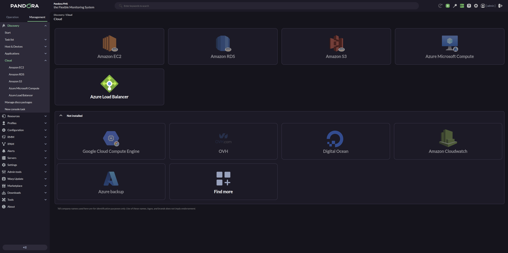
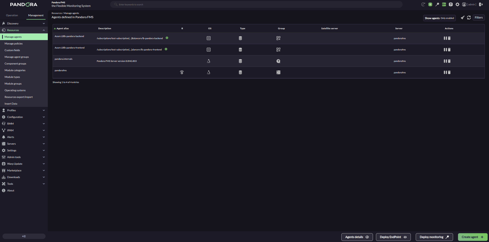
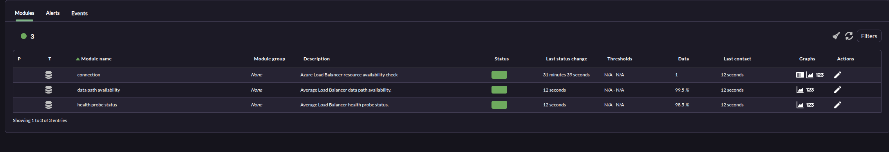
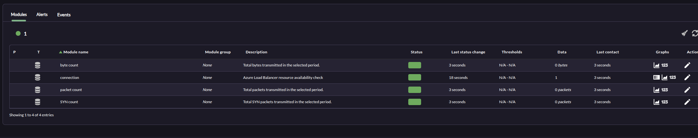
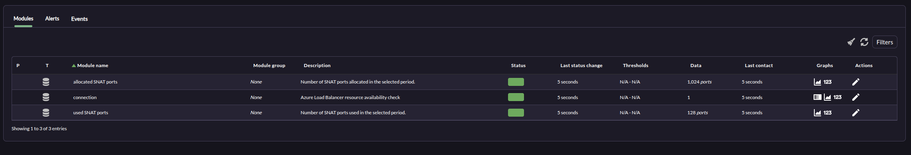
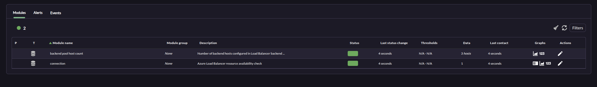
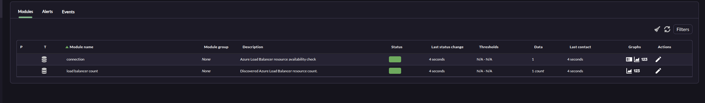

# Azure Load Balancer Discovery

*Article last updated: 2026-09-08.*

## What it monitors

The Azure Load Balancer Discovery plugin discovers the Azure Load Balancers in a Microsoft Azure subscription and turns their state and Azure Monitor metrics into Pandora FMS agents and modules: data path availability, health probe status, byte, packet and SYN traffic, allocated and used SNAT ports, SNAT connections, backend pool host count and a per-load-balancer count.

By default it creates **one agent per Load Balancer**, named with the load balancer name and an optional prefix. It can also consolidate every discovered Load Balancer onto a single agent. Each agent carries a reachability module plus one module per enabled metric.

## Prepare

### Compatibility

| Scope | State | Evidence |
| --- | --- | --- |
| Plugin version `1.0` (`pandorafms.azure_load_balancer`) | Documented target | The version this page describes. See [Plugin identity](#plugin-identity) |
| Microsoft Azure Network and Azure Monitor | `Required` | The plugin enumerates Load Balancers and reads their metrics through these APIs |
| A Microsoft Entra service principal able to list Load Balancers and read their Azure Monitor metrics | `Required` | The plugin lists Load Balancers with the Network client and reads metrics with the Monitor client. Prerequisite, not a compatibility statement. See [Prepare Azure access](#prepare-azure-access) |
| A Pandora FMS agent group with an ID greater than `0` | `Required` | The `All` group has ID `0` and cannot be used |
| Sovereign or custom Azure clouds | `Not validated` | The endpoints are the public Azure ones; no test record establishes operation against a non-public cloud |
| Host operating system running the plugin | `Not validated` | No test record establishes operating-system compatibility |

### Prerequisites

1. **A Pandora FMS server with Discovery enabled** to execute the task, and the console to define it.
2. **A Microsoft Azure subscription** containing Load Balancers.
3. **An Azure credential** stored in the Pandora FMS credential store, or its values supplied directly for a manual run.
4. **A valid agent group** for the task. The `All` group is not valid, because its ID is `0`.

The plugin is distributed as a self-contained executable: the packaged Discovery app ships `bin/pandora_azure_load_balancer`, so no additional runtime has to be installed on the Pandora FMS server or for a manual run.

### Prepare Azure access

Create a Microsoft Entra service principal that can enumerate the Load Balancers and read their Azure Monitor metrics, over the subscription or the Resource Group to be discovered. The plugin lists the Load Balancers with the Azure Network client and reads the metrics with the Azure Monitor client, so the principal needs read access to both. Do not grant a broader role than your policy requires.

Store its **Account ID** (the client ID), **Application secret**, **Tenant or domain name** and **Subscription id** as an Azure credential in the Pandora FMS credential store, so the task references the credential instead of carrying the secret itself. The credential store maps these four values to the Azure client ID, application secret, tenant and subscription.

### Install the plugin

Upload the `.disco` package from **Management → Discovery → Extension manager**. Once loaded, **Azure Load Balancer** appears under the **Cloud** category of the Discovery wizard.



## Configure the Discovery task

Create the task from **Management → Discovery → Cloud → Azure Load Balancer**. The wizard's generic first step defines the task; the package adds **Azure Base**, **Azure Load Balancer Options** and **Metrics**. Every field is documented in [Task parameters](#task-parameters).

**Step 1 — Task definition.** Name, group, server and interval. The group must have an ID greater than `0`; `All` cannot be used. The group and interval are passed to the plugin and inherited by every generated agent.

**Step 2 — Azure Base.** Which subscription to read and how much of it:

- **Azure credentials** selects the stored Azure credential. The credential contains the Account ID, Application secret, Tenant or domain name and Subscription ID.
- **Custom Resource Group** limits discovery to a single Resource Group, and **Resource group** names it exactly. Regular expressions are not accepted here.

<!-- SCREENSHOT NEEDED: Azure Base wizard step showing the credential selector, the Custom Resource Group toggle and the Resource group field. -->

**Step 3 — Azure Load Balancer Options.** Agent layout, discovery cache and diagnostics:

- **Create one agent per Load Balancer** decides the agent layout, and **Target agent** is used only when it is disabled.
- **Load Balancer agent prefix** names the per-load-balancer agents.
- **Scan Load Balancers** queries Azure to discover the current Load Balancers; when disabled the cached entities file is reused.
- **Enable entities file re-scan interval** and **Entities re-scan interval** control how long the discovered cache is reused before being rebuilt.
- **Agent autodisable mode** creates the generated agents in Pandora FMS mode `2`.
- **Modules prefix** is prepended to every generated module name.
- **Debug** reveals the local mock options, which exist for testing only.

<!-- SCREENSHOT NEEDED: Azure Load Balancer Options wizard step showing the agent layout, cache and Debug fields. -->

**Step 4 — Metrics.** Which metric families are collected:

- **Max threads** processes the discovered Load Balancers in parallel.
- **Metrics time window** is the range queried in Azure Monitor, **Azure metric interval** is the time grain, **Metric timeout** bounds each request, and **Max retries** covers temporary Azure errors and HTTP 429 responses.
- One toggle per metric family: **Availability modules**, **Traffic modules**, **SNAT modules**, **Backend pool host count module** and **Load Balancer count module**.
- **Modules allow regexp** and **Modules deny regexp** filter the final module names.

<!-- SCREENSHOT NEEDED: Metrics wizard step showing the metric toggles, the time window, interval, timeout and retry fields and the allow and deny regular expressions. -->

## Verify the first run

Force the task from **Management → Discovery → Task list** and check the result in this order.

1. **The task summary** reports the generated agents and the up and down targets. Expect one agent per discovered Load Balancer, or one **Target agent** when per-load-balancer creation is disabled.

2. **The agents.** Named `<Load Balancer agent prefix><load balancer name>` by default, so `Azure LB panda-frontend`. Each one reports `Azure Load Balancer` as its operating system and inherits the task's group and interval.

3. **`connection`** is `1` on every discovered Load Balancer. A `0` means the Load Balancer was in the cache but is no longer discoverable — see [Troubleshoot](#troubleshoot).

4. **The metric modules** for each enabled family. The module set depends on the toggles: availability, traffic, SNAT, backend pool host count and load balancer count.



If no agent appears at all, the credential or its permissions are the first thing to check.

## Understand the results

### Agent layout

**With Create one agent per Load Balancer enabled**, which is the default, the plugin creates one agent per Load Balancer, named `<Load Balancer agent prefix><load balancer name>`. A separator is inserted when the prefix does not end in a space, hyphen, period, underscore, slash or colon, so a prefix of `Azure LB` behaves like `Azure LB `.

**With it disabled**, every module goes to the single **Target agent** and the load balancer name is prepended to each module name instead. This matters for filtering: the allow and deny regular expressions are evaluated against the *final* module name, which in consolidated mode includes that load balancer prefix.

Generated agents report `Azure Load Balancer` as their operating system, inherit the task's group and interval, and are created in Pandora FMS agent mode `2` when **Agent autodisable mode** is enabled, or mode `1` when it is disabled.

### What gets created

`connection` is always created, as `generic_proc`, with value `1` for a discovered Load Balancer. When a cached Load Balancer stops being discoverable, its agent is kept and this module reports `0` until the entity is dropped during a cache rebuild.

Everything else is `generic_data` or `generic_data_inc`, grouped by the option that enables it:

| Enabled by | What you get |
| --- | --- |
| Availability modules | `data path availability` and `health probe status` |
| Traffic modules | `byte count`, `packet count` and `SYN count` |
| SNAT modules | `allocated SNAT ports`, `used SNAT ports` and `SNAT connection count` |
| Backend pool host count module | `backend pool host count` |
| Load Balancer count module | `load balancer count` |

The `backend pool host count` and `load balancer count` modules are calculated by the plugin from the Load Balancer backend pool configuration and the number of discovered resources; the other modules are read from Azure Monitor. The exhaustive module inventory, types and units are in [Generated modules](#generated-modules).

## Troubleshoot

- **The task fails on the group** — the agent group must have an ID greater than `0`. `All` is group `0` and cannot be used.
- **No Load Balancer is discovered** — check the service principal in this order: the credential values (Account ID, Application secret, Tenant or domain, Subscription id), then that it can list the Load Balancers and read their metrics, then whether **Custom Resource Group** is narrowing the search.
- **An agent survives with `connection` at `0`** — the Load Balancer is in the entity cache but is no longer discoverable, because it was deleted, renamed, or moved out of the configured scope. The agent is kept until the cache is rebuilt, which happens after **Entities re-scan interval**.
- **Expected modules are missing** — the allow and deny regular expressions are evaluated against the final module name. In consolidated mode that name carries the load balancer name, so an expression written for per-load-balancer mode will not match.
- **Requests time out or fail with a retryable HTTP status** — raise **Metric timeout** or **Max retries**. The plugin retries the Azure HTTP statuses 408, 429, 500, 502, 503 and 504 up to **Max retries** times, honoring the `Retry-After` header when present.
- **Debug, Mock Azure API URL** exist to point the plugin at a local mock during testing. Leave **Debug** off in real environments.

## Reference

### Task parameters

The console presents the task fields in three steps after the generic task definition. The macro column is the identifier used in the generated task configuration.

#### Azure Base

| Field | Macro | Type | Default | Notes |
| --- | --- | --- | --- | --- |
| Azure credentials | `_credentials_` | select | — | Azure credential from the Pandora FMS credential store. Required |
| Custom Resource Group | `_customResourceGroup_` | checkbox | off | Limits discovery to one Resource Group |
| Resource group | `_resourceGroup_` | string | — | Exact Resource Group name. Shown only when the previous option is enabled; not a regular expression |

#### Azure Load Balancer Options

| Field | Macro | Type | Default | Notes |
| --- | --- | --- | --- | --- |
| Target agent | `_engineAgent_` | string | `Azure Load Balancer` | Agent used in consolidated mode. Only used when **Create one agent per Load Balancer** is disabled |
| Create one agent per Load Balancer | `_agentPerLoadBalancer_` | checkbox | on | Disabled sends every module to **Target agent** |
| Load Balancer agent prefix | `_prefixAgent_` | string | `Azure LB ` | Prefix for per-load-balancer agents. Shown only when **Create one agent per Load Balancer** is enabled |
| Agent autodisable mode | `_agentAutodisable_` | checkbox | off | Creates agents in mode `2` when enabled, mode `1` otherwise |
| Modules prefix | `_prefixModuleName_` | string | — | Prefix prepended to every generated module name |
| Scan Load Balancers | `_scanLoadBalancers_` | checkbox | on | Queries Azure to discover the current Load Balancers |
| Enable entities file re-scan interval | `_enableEntitiesInterval_` | checkbox | off | Reuses the discovered cache until the interval expires |
| Entities re-scan interval | `_entitiesInterval_` | select | `86400` | Seconds before the cache is rebuilt. Shown only when the previous option is enabled |
| Debug | `_debugMode_` | checkbox | off | Reveals the local mock options below, which exist only for testing |
| Mock Azure API URL | `_mockApiUrl_` | string | — | Local mock base URL. Shown only when **Debug** is enabled; leave empty in real environments |

#### Metrics

| Field | Macro | Type | Default | Notes |
| --- | --- | --- | --- | --- |
| Max threads | `_threads_` | number | `1` | Parallel workers that process the discovered Load Balancers |
| Metrics time window | `_timeWindow_` | select | `300` | Range queried in Azure Monitor for each request, in seconds |
| Azure metric interval | `_metricInterval_` | select | `PT5M` | Azure Monitor time grain (`PT1M`, `PT5M`, `PT15M`, `PT30M`, `PT1H`, `PT6H`, `PT12H`, `P1D`) |
| Metric timeout | `_metricTimeout_` | number | `30` | Request timeout in seconds; `0` or negative uses `30` |
| Max retries | `_maxRetries_` | number | `3` | Retries for temporary Azure errors and HTTP 429 responses |
| Availability modules | `_checkAvailabilityModules_` | checkbox | on | `data path availability` and `health probe status` |
| Traffic modules | `_checkTrafficModules_` | checkbox | on | `byte count`, `packet count` and `SYN count` |
| SNAT modules | `_checkSnatModules_` | checkbox | on | `allocated SNAT ports`, `used SNAT ports` and `SNAT connection count` |
| Backend pool host count module | `_checkBackendPoolHostCount_` | checkbox | on | `backend pool host count` |
| Load Balancer count module | `_checkLoadBalancerCount_` | checkbox | on | `load balancer count` |
| Modules allow regexp | `_moduleallowlist_` | textarea | — | One expression per line. Only module names matching at least one are kept |
| Modules deny regexp | `_moduledenylist_` | textarea | — | One expression per line. Matching module names are excluded. Deny takes precedence over allow |

### Configuration file keys

The Discovery task builds this file from its own fields; a manual run supplies it with `--conf`. The allow and deny lists are passed as file paths with `--module_allow_list_file` and `--module_deny_list_file`, one expression per line.

| Key | Description | Default |
| --- | --- | --- |
| `agents_group_id` | Pandora FMS group ID assigned to generated agents. Must be greater than `0` | Required |
| `interval` | Monitoring interval inherited from the Discovery task | `300` for manual runs |
| `credentials` | Base64-encoded Azure credential generated by Pandora FMS | Empty |
| `subscription_id`, `tenant_id`, `client_id`, `client_secret` | Manual credential values, used when `credentials` is not provided | Empty |
| `resource_group` | Limits discovery to one exact Resource Group | Empty |
| `target_agent` | Agent used in consolidated mode | `Azure Load Balancer` |
| `modules_prefix` | Prefix for all generated module names | Empty |
| `scan_load_balancers` | Queries Azure to discover the Load Balancers | `1` |
| `agent_per_load_balancer` | Creates one agent per Load Balancer when enabled | `1` |
| `lb_agent_prefix` | Prefix for per-load-balancer agents | `Azure LB ` |
| `agent_autodisable` | Uses Pandora FMS agent mode `2` when enabled and mode `1` otherwise | `0` |
| `entities_list` | Path to the Load Balancer entity cache | Empty in manual runs |
| `enable_entities_interval` | Retains cached entities until the configured interval expires | `1` |
| `entities_interval` | Entity cache rebuild interval in seconds | `86400` |
| `time_window` | Range queried in Azure Monitor, in seconds | `300` |
| `metric_interval` | Azure Monitor time grain | `PT5M` |
| `metric_timeout` | Azure request timeout in seconds | `30` |
| `max_retries` | Retries for retryable Azure errors and HTTP 429 | `3` |
| `check_availability_modules` | Enables the availability modules | `1` |
| `check_traffic_modules` | Enables the traffic modules | `1` |
| `check_snat_modules` | Enables the SNAT modules | `1` |
| `check_backend_pool_host_count` | Enables the backend pool host count module | `1` |
| `check_load_balancer_count` | Enables the load balancer count module | `1` |
| `debug` | Enables the local mock options below. Testing only | `0` |
| `mock_api_url` | Local mock base URL. Testing only | Empty |

The plugin retries the Azure HTTP statuses `408`, `429`, `500`, `502`, `503` and `504` up to **Max retries** times, honored by the `Retry-After` header when present; the retry count is configurable through **Max retries**.

### Command-line execution

The plugin reads a single configuration file. A manual run reproduces what the Discovery server does per task execution.

```bash
./pandora_azure_load_balancer --conf <PATH_TO_CONFIG>
```

| Option | Description |
| --- | --- |
| `--conf` | Required path to the configuration file |
| `--module_allow_list_file` | Optional path to the module allow regular-expression file |
| `--module_deny_list_file` | Optional path to the module deny regular-expression file |

A minimal configuration file for a manual run:

```ini
[CONF]
subscription_id=<SUBSCRIPTION_ID>
tenant_id=<TENANT_ID>
client_id=<CLIENT_ID>
client_secret=<CLIENT_SECRET>
agents_group_id=<GROUP_ID>
```

That file holds a credential in plain text. Restrict it to the account that runs the plugin, keep it out of shared directories and version control, and prefer the Pandora FMS credential store for task runs, where the task references the credential instead of carrying it.

### Generated modules

Every module below carries the load balancer name prefix when **Create one agent per Load Balancer** is disabled, and the **Modules prefix** when set.

**Always created**

- `connection`: `generic_proc`, `1` for a discovered Load Balancer.

**Availability modules**

- `data path availability`: `generic_data`, average data path availability; unit `%`.
- `health probe status`: `generic_data`, average health probe status; unit `%`.

**Traffic modules**

- `byte count`: `generic_data_inc`, total bytes transmitted; unit `bytes`.
- `packet count`: `generic_data_inc`, total packets transmitted; unit `packets`.
- `SYN count`: `generic_data_inc`, total SYN packets transmitted; unit `packets`.

**SNAT modules**

- `allocated SNAT ports`: `generic_data`, number of SNAT ports allocated; unit `ports`.
- `used SNAT ports`: `generic_data`, number of SNAT ports used; unit `ports`.
- `SNAT connection count`: `generic_data_inc`, new SNAT connections created; unit `connections`.

**Backend pool host count module**

- `backend pool host count`: `generic_data`, number of backend hosts configured in the load balancer backend pools; unit `hosts`. Calculated by the plugin from the Load Balancer backend pool configuration.

**Load Balancer count module**

- `load balancer count`: `generic_data`, discovered Azure Load Balancer resource count; unit `count`. Calculated by the plugin, one per discovered Load Balancer.

The console module views for each family:











### Plugin identity

| Field | Value |
| --- | --- |
| App short name | `pandorafms.azure_load_balancer` |
| Plugin version | `1.0` |
| Type | Discovery application (`.disco`) |
| Section | Discovery → Cloud |