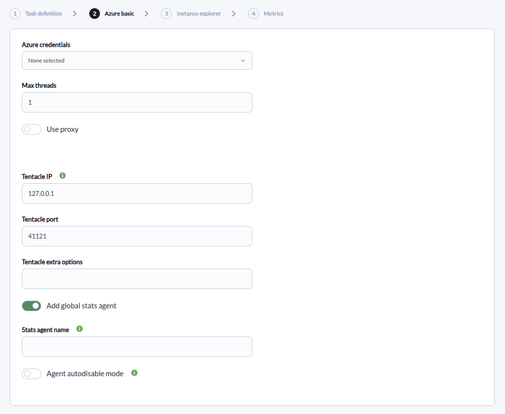
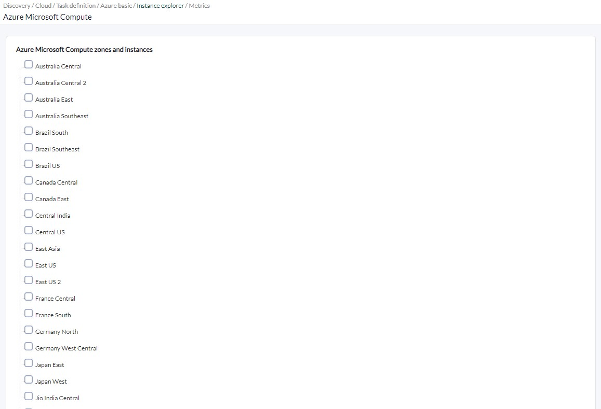
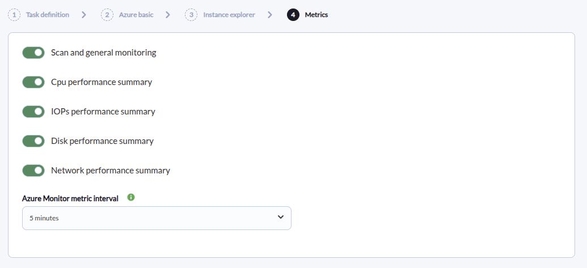

# Azure Microsoft Compute Discovery

*Article last updated: 2026-09-08.*

## What it monitors

The Azure Microsoft Compute Discovery plugin reads the virtual machines of a Microsoft Azure subscription through the Azure Resource Manager and Azure Monitor APIs and turns them into Pandora FMS agents and modules: one optional global agent per subscription, one agent per monitored zone (Azure region), and one agent per monitored virtual machine.

Zone and instance agents always report the machine state. When **Scan and general monitoring** is enabled they add CPU, disk, IOPS and network metrics read from Azure Monitor. A Discovery task selects the zones, VM sizes or individual virtual machines to monitor; selecting a zone monitors the zone and every instance it contains.

## Prepare

### Compatibility

| Scope | State | Evidence |
| --- | --- | --- |
| Plugin version `1.4` (`pandorafms.azure.mc`) | Documented target | The version this page describes, as identified by the package definition. See [Plugin identity](#plugin-identity). |
| Rocky Linux and Fedora 34 | `Tested` | The official compatibility matrix lists these systems as tested for this plugin. |
| Any Linux system | `Known compatible` | The official compatibility matrix states the plugin works on any Linux system. |
| A Microsoft Azure subscription with virtual machines | `Required` | The plugin reads virtual machines and metrics through the Azure Resource Manager and Azure Monitor APIs. Prerequisite, not a compatibility statement. |
| An Azure app registration credential | `Required` | The plugin authenticates against Azure with a service principal. Prerequisite, not a compatibility statement. See [Prepare Azure access](#prepare-azure-access). |
| A specific Pandora FMS version | `Not validated` | No published test record establishes console or server version compatibility. |

### Prerequisites

1. **A Pandora FMS server with Discovery enabled** to run the task, and a console to define it.
2. **A Microsoft Azure subscription** containing the virtual machines to monitor.
3. **An Azure credential** stored in the Pandora FMS credential store.
4. **A target agent group and a monitoring interval** for the generated agents. Both come from the Discovery task and are inherited by every generated agent.
5. **Network reachability to the Tentacle destination**: the plugin delivers the generated agent data through Tentacle, using the **Tentacle IP** and **Tentacle port** of the task.

The plugin is distributed as a Pandora FMS Discovery application (`.disco` package). It ships the `bin/pandora_azure_mc` and `bin/azure_vm` binaries with their dependencies bundled, so no additional runtime has to be installed on the Discovery server or for a manual run.

### Prepare Azure access

Create a Microsoft Entra (Azure AD) app registration and give it a client secret. The plugin authenticates with the **Client ID**, **Client secret**, **Tenant or domain** and **Subscription id** of that registration. Store these four values as an Azure credential in the Pandora FMS credential store, so the task references the credential instead of carrying the secret itself.

Assign the **Reader** role to the app over the subscription, or over the narrower scope to be monitored, as the official prerequisites direct. The plugin only reads virtual machines and metrics and never changes Azure configuration.

### Install the plugin

Load the `.disco` package from **Management → Discovery → Extension manager**. Once loaded, **Azure Microsoft Compute** appears under the **Cloud** category of the Discovery wizard.

## Configure the Discovery task

Create the task from **Management → Discovery → Cloud → Azure Microsoft Compute**. The generic first step defines the task; the package adds **Azure basic**, **Instance explorer** and **Metrics**. Every field is documented in [Task parameters](#task-parameters).

**Step 1 — Task definition.** Name, agent group, server and interval. The group and the interval are passed to the plugin and inherited by every generated agent.

**Step 2 — Azure basic.** Connection, concurrency and delivery:

- **Azure credentials** selects the stored Azure credential used to query the subscription.
- **Max threads** distributes the zones and instances across parallel workers.
- **Use proxy**, **Proxy url** and **Verify proxy SSL** route the Azure requests through an HTTPS proxy when the Discovery server cannot reach Azure directly.
- **Tentacle IP**, **Tentacle port** and **Tentacle extra options** set the Tentacle destination that receives the generated agent data.
- **Add global stats agent** enables the per-subscription statistics agent, and **Stats agent name** overrides its default name (`azure`).
- **Agent autodisable mode** creates the generated agents in Pandora FMS mode `2`, which disables an agent when all its modules become unknown.



**Step 3 — Instance explorer.** A tree of the subscription populated by querying Azure with the selected credential. Each level can be marked for monitoring:

- Selecting a **zone** (Azure region) monitors the zone itself and every virtual machine it contains, including machines added later.
- Selecting a **VM size** within a region monitors the virtual machines of that subgroup.
- Selecting an individual **instance** monitors it regardless of whether its zone is selected.



**Step 4 — Metrics.** Which performance data is collected:

- **Scan and general monitoring** enables the Azure Monitor metric queries.
- **Cpu performance summary**, **IOPs performance summary**, **Disk performance summary** and **Network performance summary** select the metric families collected, and are shown only when **Scan and general monitoring** is enabled.
- **Azure Monitor metric interval** sets the time range and time grain used for the metric queries.



The task references the stored Azure credential; when it runs, the Discovery server resolves it into the temporary configuration that the plugin reads. Restrict access to Pandora FMS and to its Discovery configuration and temporary files according to your deployment's security policy.

## Verify the first run

Force the task from **Management → Discovery → Task list** and check the result in this order.

1. **The task summary** reports **Total agents**, **Zones agents** and **Instances agents**.

2. **The agents.** With **Add global stats agent** enabled, a global agent appears first; one zone agent appears per selected zone, and one instance agent per monitored virtual machine.

3. **The state modules.** Every zone agent carries `summary.azure.compute.instances`, and every instance agent carries `State` and `Instance State (bool)`.

4. **The performance modules.** With **Scan and general monitoring** enabled, running instances carry their CPU, disk, IOPS and network modules, and their zones carry the matching summary modules.

If no agent appears at all, the credential values, the **Reader** role and the reachability of the Azure endpoints are the first things to check.

## Understand the results

### Agent layout

The plugin creates one global agent per subscription when **Add global stats agent** is enabled, one zone agent per selected zone, and one instance agent per monitored virtual machine. Zone and instance agents belong to the task's agent group and inherit its interval.

The global agent is named `azure` by default, or with the name in **Stats agent name**. Zone agents use the Azure region selected for the zone, and instance agents use `<resource group>/<VM name>` as their alias. The internal Pandora FMS name of each agent is the MD5 hash of the subscription ID plus that agent's own identifier (`azure`, the zone region, or `<resource group>/<VM name>`); the only exception is the global agent when **Stats agent name** is set, which uses that literal name directly. Identities are therefore stable across runs of the same task and change when the subscription or the selected scope changes.

Instance agents are linked under the zone agent of their zone, and zone agents under the global agent when it is enabled.

### Modules by agent

| Agent | Created when | Modules it carries |
| --- | --- | --- |
| Global stats agent | **Add global stats agent** enabled | `Azure MC Instances count` |
| Zone agent | A zone is selected | `summary.azure.compute.instances`, plus the `summary.azure.compute.*` performance modules for each enabled family |
| Instance agent | The virtual machine is monitored | `State` and `Instance State (bool)` always; the CPU, disk, IOPS and network modules when **Scan and general monitoring** is enabled and the machine is running |

`summary.azure.compute.instances` reports the number of distinct virtual-machine size entries collected in the zone (each `VM size|region` combination counts once), not the number of machines. The zone performance summaries aggregate the per-instance values collected during the run: CPU as an average and the rest as totals.

The exhaustive module inventory, types and units are in [Generated modules and agents](#generated-modules-and-agents).

## Troubleshoot

| Symptom | Check |
| --- | --- |
| No agent is created and the task fails | Confirm the stored Azure credential (Client ID, Client secret, Tenant or domain, Subscription id), that the app has the **Reader** role over the monitored scope, and that the Discovery server can reach the Azure endpoints, directly or through the configured proxy. |
| A task with nothing selected in the Instance explorer produces only the global agent, with `Azure MC Instances count` at `0` | Select at least one zone, VM size or instance in the Instance explorer step. |
| The Instance explorer shows no tree | The credential is invalid, the **Reader** role is missing, or the Azure endpoints are unreachable. The proxy fields only take effect when **Use proxy** is enabled. |
| An instance shows `State` as `Unknown` and `Instance State (bool)` as `0` | The plugin could not read the instance view of that machine. Check that the **Reader** role covers its resource group. |
| Performance modules are missing on an instance | They are created only when **Scan and general monitoring** is enabled, the matching performance family is on, and the machine is running at collection time. |
| The zone performance summaries stay at `0` | They aggregate the per-instance values collected in the same run; a zone whose machines are stopped, or whose performance families are disabled, reports zeros. |
| `summary.azure.compute.instances` does not match the number of machines | The module counts distinct VM-size entries per zone, not machines. |
| Generated agent data is not received | Confirm **Tentacle IP** and **Tentacle port** and that the server accepts Tentacle connections on them. |

## Reference

### Task parameters

The console presents the fields in two steps after the generic task definition, plus a tree step. The macro column is the identifier used in the generated task configuration.

#### Azure basic

| Field | Macro | Type | Default | Notes |
| --- | --- | --- | --- | --- |
| Azure credentials | `_credentials_` | select | — | Azure credential from the Pandora FMS credential store. Required |
| Max threads | `_threads_` | number | `1` | Workers that distribute zones and instances |
| Use proxy | `_useProxy_` | checkbox | off | Routes Azure requests through an HTTPS proxy |
| Proxy url | `_proxyUrl_` | string | — | Proxy URL. Shown only when **Use proxy** is enabled |
| Verify proxy SSL | `_sslCheck_` | checkbox | off | Verifies the proxy TLS certificate. Shown only when **Use proxy** is enabled |
| Tentacle IP | `_tentacleIP_` | string | `127.0.0.1` | Tentacle destination for the generated agent data |
| Tentacle port | `_tentaclePort_` | number | `41121` | Tentacle destination port |
| Tentacle extra options | `_tentacleExtraOpt_` | string | — | Additional options passed to the Tentacle client |
| Add global stats agent | `_statsAgent_` | checkbox | on | Creates the per-subscription statistics agent |
| Stats agent name | `_statsAgentName_` | string | — | Overrides the default name (`azure`). Shown only when **Add global stats agent** is enabled |
| Agent autodisable mode | `_agentautodisable_` | checkbox | off | Creates agents in Pandora FMS mode `2`, which disables an agent when all its modules become unknown |

#### Metrics

| Field | Macro | Type | Default | Notes |
| --- | --- | --- | --- | --- |
| Scan and general monitoring | `_azureMCInstanceSummary_` | checkbox | off | Enables the Azure Monitor metric queries |
| Cpu performance summary | `_azureMCCpuPerfSummary_` | checkbox | off | CPU utilization modules. Shown only when **Scan and general monitoring** is enabled |
| IOPs performance summary | `_azureMCIopsPerfSummary_` | checkbox | off | Disk operation modules. Shown only when **Scan and general monitoring** is enabled |
| Disk performance summary | `_azureMCDiskPerfSummary_` | checkbox | off | Disk read and write bytes modules. Shown only when **Scan and general monitoring** is enabled |
| Network performance summary | `_azureMCNetworkPerfSummary_` | checkbox | off | Network traffic modules. Shown only when **Scan and general monitoring** is enabled |
| Azure Monitor metric interval | `_azureMCMetricInterval_` | select | `PT5M` | Time range and time grain for the Azure Monitor metric queries |

### Configuration file keys

The Discovery task builds a temporary key/value file from its own fields and passes it to the plugin with `--conf`. A manual run supplies that file directly. The file has no section header; the plugin reads it as a `[CONF]` section. Zone, size and instance selections are written as JSON arrays.

| Key | Default | Description |
| --- | --- | --- |
| `agents_group_name` | `azure` | Agent group of the generated agents, from the task |
| `interval` | `300` | Monitoring interval in seconds, inherited by the generated agents |
| `metric_interval` | `PT5M` | Azure Monitor time range and time grain. Accepted values `PT1M`, `PT5M`, `PT15M`, `PT30M`, `PT1H`, `PT6H`, `PT12H`, `P1D`; any other value falls back to `PT5M` |
| `threads` | `1` | Workers that distribute zones and instances |
| `transfer_mode` | `local` | `tentacle` or `local`. The task writes `tentacle` |
| `tentacle_ip` | `127.0.0.1` | Tentacle destination |
| `tentacle_port` | `41121` | Tentacle destination port |
| `tentacle_opts` | Empty | Additional options passed to the Tentacle client |
| `tentacle_client` | `tentacle_client` | Tentacle client executable name |
| `data_dir` | `/var/spool/pandora/data_in/` | Destination for the agent XML files when `transfer_mode` is `local` |
| `temporal` | `/tmp` | Temporary directory for the agent XML files |
| `use_proxy` | `0` | Routes Azure requests through an HTTPS proxy |
| `proxy_url` | Empty | Proxy URL |
| `ssl_check` | `0` | Verifies the proxy TLS certificate |
| `advance_monitoring` | `1` | Enables the Azure Monitor metric queries |
| `cpu_summary` | `1` | CPU performance modules |
| `iops_summary` | `1` | Disk operation modules |
| `disk_summary` | `1` | Disk read and write bytes modules |
| `network_summary` | `1` | Network traffic modules |
| `stats_agent` | `1` | Creates the per-subscription statistics agent |
| `stats_agent_name` | Empty | Name of the statistics agent; `azure` when empty |
| `agent_autodisable` | `0` | Creates agents in Pandora FMS mode `2` when enabled |
| `azure_zones` | `[]` | JSON list of Azure regions to monitor |
| `azure_sizes` | `[]` | JSON list of `VM size|region` entries to monitor |
| `azure_instances` | `[]` | JSON list of `<resource group>/<VM name>` instances to monitor |
| `creds_b64` | Empty | Base64-encoded JSON Azure credential (`client_id`, `application_secret`, `tenant_domain`, `subscription_id`) |

The file holds the credential in plain text (base64-encoded) when the task runs. Restrict it and the Discovery temporary directory to the account that runs the plugin, keep them out of shared directories, logs and version control, and follow your deployment's policy for the Azure credentials.

### Command-line execution

A manual run replicates what the Discovery server does per task execution. The plugin accepts a single configuration file:

```bash
./pandora_azure_mc --conf <PATH_TO_CONFIG>
```

| Option | Description |
| --- | --- |
| `--conf` | Required path to the configuration file |
| `--help`, `-h` | Displays command help |

Example configuration file:

```ini
agents_group_name=azure
interval=300
threads=1
metric_interval=PT5M
transfer_mode=tentacle
tentacle_ip=<PANDORA_FMS_SERVER_IPV4>
tentacle_port=41121
advance_monitoring=1
cpu_summary=1
iops_summary=1
disk_summary=1
network_summary=1
stats_agent=1
stats_agent_name=
azure_zones=["<AZURE_REGION>"]
azure_instances=[]
azure_sizes=[]
creds_b64=<BASE64_AZURE_CREDENTIAL>
```

That file holds a credential in plain text. Restrict it to the account that runs the plugin and keep it out of shared directories, logs and version control.

A successful run prints a JSON summary of the generated agents, for example `{"summary": {"Total agents": 35, "Zones agents": 5, "Instances agents": 29}}`, and delivers one XML data file per generated agent to the Pandora FMS server through the configured transfer mode.

The instance tree shown in the wizard is produced by the bundled `azure_vm` helper, called with `--creds`, `--use_proxy`, `--proxy_url` and `--ssl_check`. It prints the tree as JSON and is executed by the Discovery wizard, not meant for manual runs.

### Generated modules and agents

**Global stats agent**

- `Azure MC Instances count`: `generic_data`, number of virtual machines the plugin monitored in the run.

**Zone agent** (`<azure region>`)

- `summary.azure.compute.instances`: `generic_data`, number of distinct VM-size entries collected in the zone (each `VM size|region` combination counts once).
- `summary.azure.compute.CPUUtilization`: `generic_data`, average of the CPU-utilization values collected for the zone's instances.
- `summary.azure.compute.DiskReadBytes`: `generic_data`, bytes read; unit `Bytes`.
- `summary.azure.compute.diskWriteBytes`: `generic_data`, bytes written; unit `Bytes`.
- `summary.azure.compute.DiskReadOps`: `generic_data`, disk read operations.
- `summary.azure.compute.DiskWriteOps`: `generic_data`, disk write operations.
- `summary.azure.compute.NetworkPacketsIn`: `generic_data`, incoming network traffic; unit `packets`.
- `summary.azure.compute.NetworkPacketsOut`: `generic_data`, outgoing network traffic; unit `packets`.

**Instance agent** (`<resource group>/<VM name>`)

- `State`: `generic_data_string`, Azure power-state text of the machine.
- `Instance State (bool)`: `generic_proc`, `1` when the machine is running, `0` otherwise.
- `CPUUtilization`: `generic_data`, CPU usage percentage.
- `DiskReadBytes`: `generic_data`, bytes read; unit `Bytes`.
- `DiskWriteBytes`: `generic_data`, bytes written; unit `Bytes`.
- `DiskReadOps`: `generic_data`, disk read operations.
- `DiskWriteOps`: `generic_data`, disk write operations.
- `NetworkPacketsIn`: `generic_data`, incoming network traffic; unit `packets`.
- `NetworkPacketsOut`: `generic_data`, outgoing network traffic; unit `packets`.

The instance performance modules are created only when **Scan and general monitoring** is enabled, the matching performance family is on, and the machine is running at collection time. The zone performance summary modules are created only when **Scan and general monitoring** is enabled and their family is on.

### Plugin identity

| Field | Value |
| --- | --- |
| App short name | `pandorafms.azure.mc` |
| Plugin version | `1.4` |
| Type | Discovery application (`.disco`) |
| Section | Discovery → Cloud |