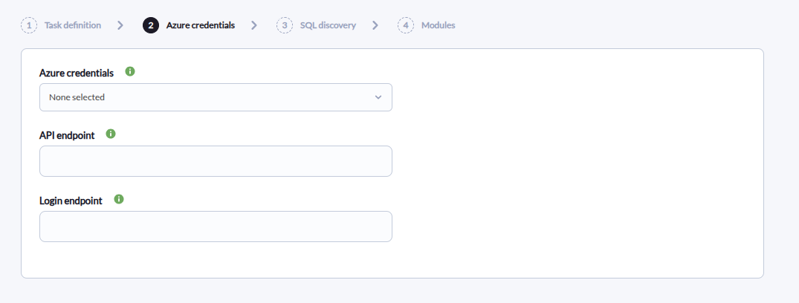
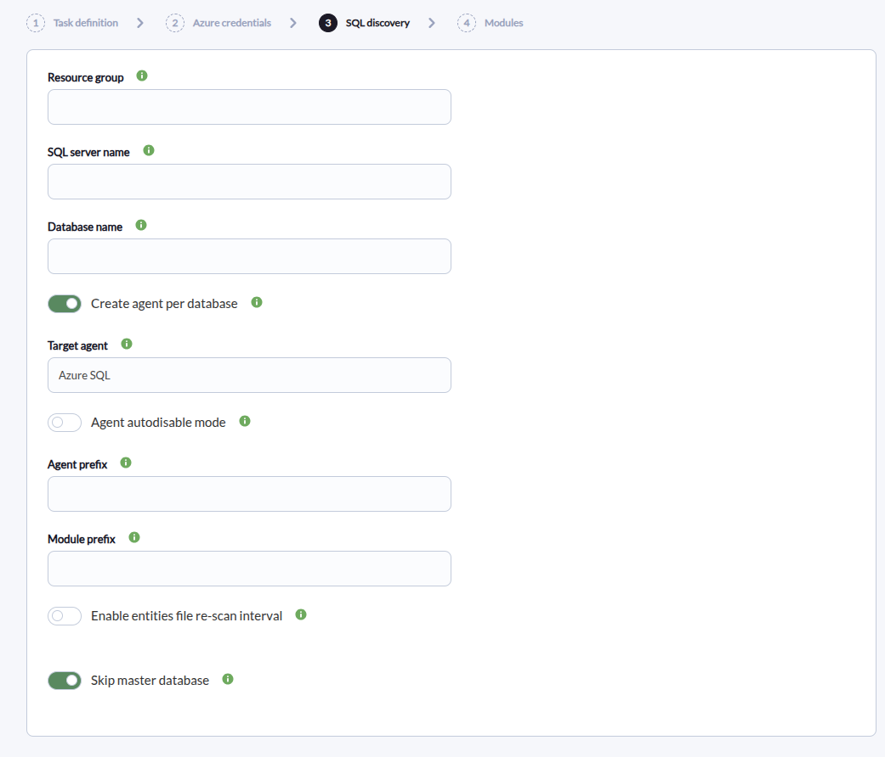
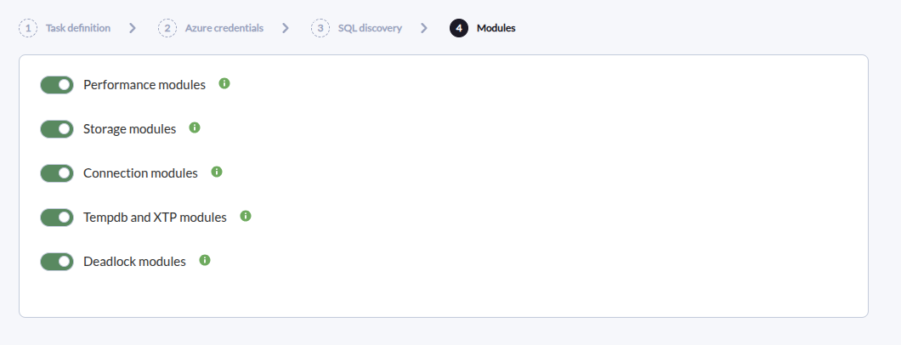
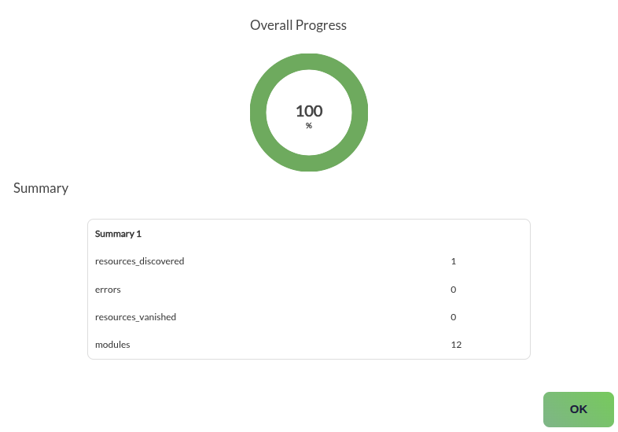

# Azure SQL Discovery

*Article last updated: 2026-09-08.*

## What it monitors

The Azure SQL Discovery plugin discovers the Azure SQL databases in a Microsoft Azure subscription and turns their state and Azure Monitor metrics into Pandora FMS agents and modules: CPU, DTU and I/O performance, storage usage, connections, TempDB and XTP usage, and deadlocks.

By default it creates **one agent per database**, named `[Agent prefix]Azure SQL <server>/<database>`. It can also consolidate every discovered database onto a single **Target agent**, with the server and database prepended to each module name. Each agent carries a reachability module, a database online module and one module per enabled metric group.

## Prepare

### Compatibility

| Scope | State | Evidence |
| --- | --- | --- |
| Plugin version `1.0` (`pandorafms.azure.sql`) | Documented target | The version this page describes. See [Plugin identity](#plugin-identity) |
| An Azure subscription with Azure SQL Database resources | `Required` | The plugin discovers and reads Azure SQL databases. Prerequisite, not a compatibility statement |
| A Microsoft Entra service principal with read permissions on the subscription or the Resource Group | `Required` | The plugin lists SQL servers and databases and reads their Azure Monitor metrics. The `Reader` role is usually enough. Prerequisite, not a compatibility statement. See [Prepare Azure access](#prepare-azure-access) |
| A Pandora FMS agent group with an ID greater than `0` | `Required` | The `All` group has ID `0` and cannot be used |
| Sovereign or custom Azure clouds | `Not validated` | The endpoints are configurable, but no test record establishes operation against a non-public cloud |
| Host operating system running the plugin | `Not validated` | No test record establishes operating-system compatibility |

### Prerequisites

1. **A Pandora FMS server with Discovery enabled** to execute the task, and the console to define it.
2. **A Microsoft Azure subscription** containing Azure SQL databases.
3. **An Azure credential** stored in the Pandora FMS credential store, or its values supplied directly for a manual run.
4. **A valid agent group** for the task. The `All` group is not valid, because its ID is `0`.

The plugin is distributed as a self-contained executable: the packaged Discovery app ships `bin/pandora_azure_sql`, so no additional runtime has to be installed on the Pandora FMS server or for a manual run.

### Prepare Azure access

Create a Microsoft Entra service principal with read-only permissions and assign it the **Reader** role over the subscription or the Resource Group to be discovered. In most environments `Reader` is enough; when access is limited to a single Resource Group, configure the **Resource group** field in the task as well. The service principal must be able to:

- List `Microsoft.Sql/servers` resources.
- List `Microsoft.Sql/servers/databases` resources.
- Read basic database properties such as status, edition, SKU and maximum size.
- Query Azure Monitor metrics for each database.

Store the service principal's **Client ID**, **Application secret**, **Tenant or domain name** and **Subscription id** as an Azure credential in the Pandora FMS credential store, so the task references the credential instead of carrying the secret itself.

### Install the plugin

Upload the `.disco` package from **Management → Discovery → Extension manager**. Once loaded, **Azure SQL** appears under the **Cloud** category of the Discovery wizard.

## Configure the Discovery task

Create the task from **Management → Discovery → Cloud → Azure SQL**. The wizard's generic first step defines the task; the package adds **Azure credentials**, **SQL discovery** and **Modules**. Every field is documented in [Task parameters](#task-parameters).

**Step 1 — Task definition.** Name, group, server and interval. The group must have an ID greater than `0`; `All` cannot be used. The group and interval are passed to the plugin and inherited by every generated agent.

**Step 2 — Azure credentials.** The credential and the Azure endpoints:

- **Azure credentials** selects the stored Azure credential. It is required.
- **API endpoint** and **Login endpoint** override the Azure Resource Manager and Azure authentication endpoints for sovereign or custom clouds. Empty values use the public Azure endpoints.



**Step 3 — SQL discovery.** What to discover and how the agents are laid out:

- **Resource group**, **SQL server name** and **Database name** filter discovery. Each accepts several exact, case-insensitive values separated with `;`. Empty discovers everything.
- **Create agent per database** decides the agent layout, and **Target agent** is used only when it is disabled.
- **Agent prefix** and **Module prefix** are prepended to the agent names and module names.
- **Agent autodisable mode** creates the generated agents in Pandora FMS mode `2`.
- **Enable entities file re-scan interval** and **Re-scan entities file interval** control how long the discovered-database cache is reused before being rebuilt.
- **Skip master database** excludes the `master` database.



**Step 4 — Modules.** Which metric families are collected:

- **Performance modules**: CPU, DTU, physical data read, log write, sessions and workers percent.
- **Storage modules**: data space used and allocated.
- **Connection modules**: successful, failed and firewall-blocked connections.
- **Tempdb and XTP modules**: TempDB data and log size, TempDB log used percent and XTP storage percent.
- **Deadlock modules**: the deadlock count.



## Verify the first run

Force the task from **Management → Discovery → Task list** and check the result in this order.

1. **The task summary** reports `resources_discovered`, `resources_vanished`, `modules` and `errors`. Expect one discovered resource per database, and `errors` at `0`.

2. **The agents.** With **Create agent per database** enabled, one agent appears per discovered database, named `[Agent prefix]Azure SQL <server>/<database>`. Each one reports `Azure` as its operating system and inherits the task's group and interval.

3. **`Azure SQL Connection`** is `1` on every discovered database, and **`Database online`** is `1` when the database status is `Online` or `Ready`.

4. **The metric modules** for each enabled family.

If no agent appears at all, the credential, its permissions or the filters are the first thing to check.



## Understand the results

### Agent layout

**With Create agent per database enabled**, which is the default, the plugin creates one agent per database, named `[Agent prefix]Azure SQL <server>/<database>`, with the server FQDN as its address and the database resource ID as its description.

**With it disabled**, every module goes to the single **Target agent** and the server and database are prepended to each module name as `<server>/<database> <module name>`. This matters when reading the modules: in consolidated mode the module name identifies the database.

Generated agents report `Azure` as their operating system, inherit the task's group and interval, and are created in Pandora FMS agent mode `2` when **Agent autodisable mode** is enabled, or mode `1` when it is disabled.

### Discovery and filters

The **Resource group**, **SQL server name** and **Database name** filters use exact, case-insensitive matches rather than regular expressions; separate multiple values with `;`. The **Skip master database** option excludes the `master` database.

The discovered databases are persisted in the entities file. A stored entity that no longer appears in a scan is counted in `resources_vanished` and generates only `Azure SQL Connection` with value `0`, so a deleted or renamed database is visible instead of silently disappearing. When the re-scan interval expires, the cache is rebuilt without comparing against the previous entities.

### What gets created

| Enabled by | What you get |
| --- | --- |
| Always | `Azure SQL Connection` and `Database online` |
| Performance modules | `CPU percent`, `DTU consumption percent`, `Physical data read percent`, `Log write percent`, `Sessions percent`, `Workers percent` |
| Storage modules | `Data space used GB`, `Data space used percent`, `Data space allocated GB` |
| Connection modules | `Successful connections`, `Failed connections`, `Blocked by firewall connections` |
| Tempdb and XTP modules | `Tempdb data size MB`, `Tempdb log size MB`, `Tempdb log used percent`, `XTP storage percent` |
| Deadlock modules | `Deadlocks` |

The plugin reads the metrics from Azure Monitor and only creates a metric module when the database exposes that metric and supports its aggregation. The exhaustive module inventory, types, units and aggregations are in [Generated modules](#generated-modules).

## Troubleshoot

- **The task fails on the group** — the agent group must have an ID greater than `0`. `All` is group `0` and cannot be used.
- **No database is discovered** — check the service principal in this order: the credential values, then that it has the **Reader** role over the right scope, then whether **Resource group**, **SQL server name** or **Database name** are filtering out the databases. These fields match complete, case-insensitive values separated with `;`; they are not regular expressions.
- **An agent survives with `Azure SQL Connection` at `0`** — the database is in the entity cache but is no longer discoverable, because it was deleted or renamed. The agent is kept until the cache is rebuilt, which happens after **Re-scan entities file interval**.
- **Some metric modules are missing** — a database may not expose every metric, or may not support the aggregation the plugin uses. The plugin asks Azure for the supported metric definitions and skips the metrics that are not available.
- **Requests fail against a sovereign or custom cloud** — set **API endpoint** and **Login endpoint**. Empty values use `https://management.azure.com` and `https://login.microsoftonline.com`.
- **Requests time out** — raise the request timeout in the configuration file. The minimum applied value is `30` seconds.
- **Debug** displays full exceptions during a manual run; leave it off in production.

## Reference

### Task parameters

The console presents the task fields in three steps after the generic task definition. The macro column is the identifier used in the generated task configuration.

#### Azure credentials

| Field | Macro | Type | Default | Notes |
| --- | --- | --- | --- | --- |
| Azure credentials | `_credentials_` | select | — | Azure credential from the Pandora FMS credential store. Required |
| API endpoint | `_apiendpoint_` | string | — | Azure Resource Manager endpoint. Empty uses `https://management.azure.com` |
| Login endpoint | `_loginendpoint_` | string | — | Azure authentication endpoint. Empty uses `https://login.microsoftonline.com` |

#### SQL discovery

| Field | Macro | Type | Default | Notes |
| --- | --- | --- | --- | --- |
| Resource group | `_resourcegroup_` | string | — | Exact Resource Group filter, `;`-separated. Empty discovers every Resource Group |
| SQL server name | `_servername_` | string | — | Exact SQL server filter, `;`-separated. Empty discovers every server |
| Database name | `_databasename_` | string | — | Exact database filter, `;`-separated. Empty discovers every database |
| Create agent per database | `_agentperdatabase_` | checkbox | on | Disabled sends every module to **Target agent** |
| Target agent | `_targetagent_` | string | `Azure SQL` | Agent used in consolidated mode |
| Agent autodisable mode | `_agentautodisable_` | checkbox | off | Creates agents in mode `2` when enabled, mode `1` otherwise |
| Agent prefix | `_agentprefix_` | string | — | Prefix prepended to the per-database agent names |
| Module prefix | `_moduleprefix_` | string | — | Prefix prepended to every generated module name |
| Enable entities file re-scan interval | `_enableentitiesinterval_` | checkbox | off | Reuses the discovered-database cache until the interval expires |
| Re-scan entities file interval | `_entitiesinterval_` | select | `86400` | Seconds before the cache is rebuilt. Shown only when the previous option is enabled |
| Skip master database | `_skipmaster_` | checkbox | on | Excludes the `master` database |

#### Modules

| Field | Macro | Type | Default | Notes |
| --- | --- | --- | --- | --- |
| Performance modules | `_performance_` | checkbox | on | CPU, DTU, I/O, log, sessions and workers percent |
| Storage modules | `_storage_` | checkbox | on | Data space used and allocated |
| Connection modules | `_connections_` | checkbox | on | Successful, failed and firewall-blocked connections |
| Tempdb and XTP modules | `_tempdbxtp_` | checkbox | on | TempDB data and log size, TempDB log used percent and XTP storage |
| Deadlock modules | `_deadlocks_` | checkbox | on | Deadlock count |

### Configuration file keys

The Discovery task builds this file from its own fields; a manual run supplies it with `--conf`. It has a `[CONF]` section.

| Key | Description | Default |
| --- | --- | --- |
| `credentials` | Base64-encoded Azure credential generated by Pandora FMS | Empty |
| `tenant_id`, `subscription_id`, `client_id`, `client_secret` | Manual credential values, used when `credentials` is not provided | Empty |
| `api_endpoint` | Azure Resource Manager endpoint | `https://management.azure.com` |
| `login_endpoint` | Azure authentication endpoint | `https://login.microsoftonline.com` |
| `resource_group` | Exact Resource Group filter, `;`-separated | Empty |
| `server_name` | Exact SQL server filter, `;`-separated | Empty |
| `database_name` | Exact database filter, `;`-separated | Empty |
| `agent_per_database` | Creates one agent per database when enabled | `1` |
| `target_agent` | Agent used in consolidated mode | `Azure SQL` |
| `agent_autodisable` | Uses Pandora FMS agent mode `2` when enabled and mode `1` otherwise | `0` |
| `agent_prefix` | Prefix for the per-database agent names | Empty |
| `module_prefix` | Prefix for all generated module names | Empty |
| `interval` | Monitoring interval inherited from the Discovery task | `300` |
| `group_id` | Pandora FMS group ID assigned to generated agents. Must be greater than `0` | Required |
| `timeout` | HTTP timeout in seconds. The minimum applied value is `30` | `30` |
| `scan_databases` | Enables database discovery | `1` |
| `entities_list` | Path to the entities file | `/tmp/pandora_azure_sql_entities.txt` |
| `enable_entities_interval` | Rebuilds the entities file after the interval | `0` |
| `entities_interval` | Entities file rebuild interval in seconds | `86400` |
| `skip_master_database` | Skips the `master` database | `1` |
| `performance_metrics_enabled` | Enables the performance modules | `1` |
| `storage_metrics_enabled` | Enables the storage modules | `1` |
| `connection_metrics_enabled` | Enables the connection modules | `1` |
| `tempdb_xtp_metrics_enabled` | Enables the TempDB and XTP modules | `1` |
| `deadlock_metrics_enabled` | Enables the deadlock module | `1` |

The entities file is scoped per task: the plugin appends a hash of the subscription, endpoints and filters, so caches from different tasks never mix.

### Command-line execution

The plugin reads a single configuration file. A manual run reproduces what the Discovery server does per task execution.

```bash
./pandora_azure_sql --conf <PATH_TO_CONFIG>
```

Every configuration key can also be passed as a command-line option, which overrides the file:

| Option | Description |
| --- | --- |
| `--conf`, `-c` | Path to the configuration file |
| `--credentials` | Base64-encoded Azure credential |
| `--tenant-id` | Azure tenant identifier |
| `--subscription-id` | Azure subscription identifier |
| `--client-id` | Service principal application identifier |
| `--client-secret` | Service principal secret |
| `--api-endpoint` | Azure Resource Manager endpoint |
| `--login-endpoint` | Azure authentication endpoint |
| `--resource-group` | Exact Resource Group filter, `;`-separated |
| `--server-name` | Exact SQL server filter, `;`-separated |
| `--database-name` | Exact database filter, `;`-separated |
| `--agent-per-database` | Enables one agent per database |
| `--target-agent` | Destination agent for consolidated mode |
| `--agent-autodisable` | Enables agent autodisable mode |
| `--agent-prefix` | Optional agent prefix |
| `--module-prefix` | Optional module prefix |
| `--interval` | Agent interval in seconds |
| `--group-id` | Agent group identifier. It must be greater than `0` |
| `--timeout` | HTTP timeout in seconds. The minimum applied value is `30` |
| `--scan-databases` | Enables database discovery |
| `--entities-list` | Path to the entities file |
| `--enable-entities-interval` | Enables periodic reconstruction of the entities file |
| `--entities-interval` | Entities file reconstruction interval |
| `--skip-master-database` | Skips the `master` database |
| `--performance-metrics-enabled` | Enables the performance modules |
| `--storage-metrics-enabled` | Enables the storage modules |
| `--connection-metrics-enabled` | Enables the connection modules |
| `--tempdb-xtp-metrics-enabled` | Enables the TempDB and XTP modules |
| `--deadlock-metrics-enabled` | Enables the deadlock module |
| `--debug` | Displays full exceptions |

A minimal configuration file for a manual run:

```ini
[CONF]
subscription_id=<SUBSCRIPTION_ID>
tenant_id=<TENANT_ID>
client_id=<CLIENT_ID>
client_secret=<CLIENT_SECRET>
group_id=<GROUP_ID>
```

That file holds a credential in plain text. Restrict it to the account that runs the plugin, keep it out of shared directories and version control, and prefer the Pandora FMS credential store for task runs, where the task references the credential instead of carrying it.

### Generated modules

Modules are named `[Module prefix]<base name>` in per-database mode, and `[Module prefix]<server>/<database> <base name>` in consolidated mode. Every metric module is `generic_data` and is created only when the database exposes the metric and supports its aggregation.

**Always created**

- `Azure SQL Connection`: `generic_proc`, `1` for a discovered database and `0` for a vanished entity.
- `Database online`: `generic_proc`, `1` when the database status is `Online` or `Ready`, `0` otherwise.

**Performance modules** (average)

- `CPU percent`: `%`.
- `DTU consumption percent`: `%`.
- `Physical data read percent`: `%`.
- `Log write percent`: `%`.
- `Sessions percent`: `%`.
- `Workers percent`: `%`.

**Storage modules** (average)

- `Data space used GB`: `GB`.
- `Data space used percent`: `%`.
- `Data space allocated GB`: `GB`.

**Connection modules** (total)

- `Successful connections`: `Count`.
- `Failed connections`: `Count`.
- `Blocked by firewall connections`: `Count`.

**Tempdb and XTP modules** (average)

- `Tempdb data size MB`: `MB`.
- `Tempdb log size MB`: `MB`.
- `Tempdb log used percent`: `%`.
- `XTP storage percent`: `%`.

**Deadlock modules** (total)

- `Deadlocks`: `Count`.

### Plugin identity

| Field | Value |
| --- | --- |
| App short name | `pandorafms.azure.sql` |
| Plugin version | `1.0` |
| Type | Discovery application (`.disco`) |
| Section | Discovery → Cloud |