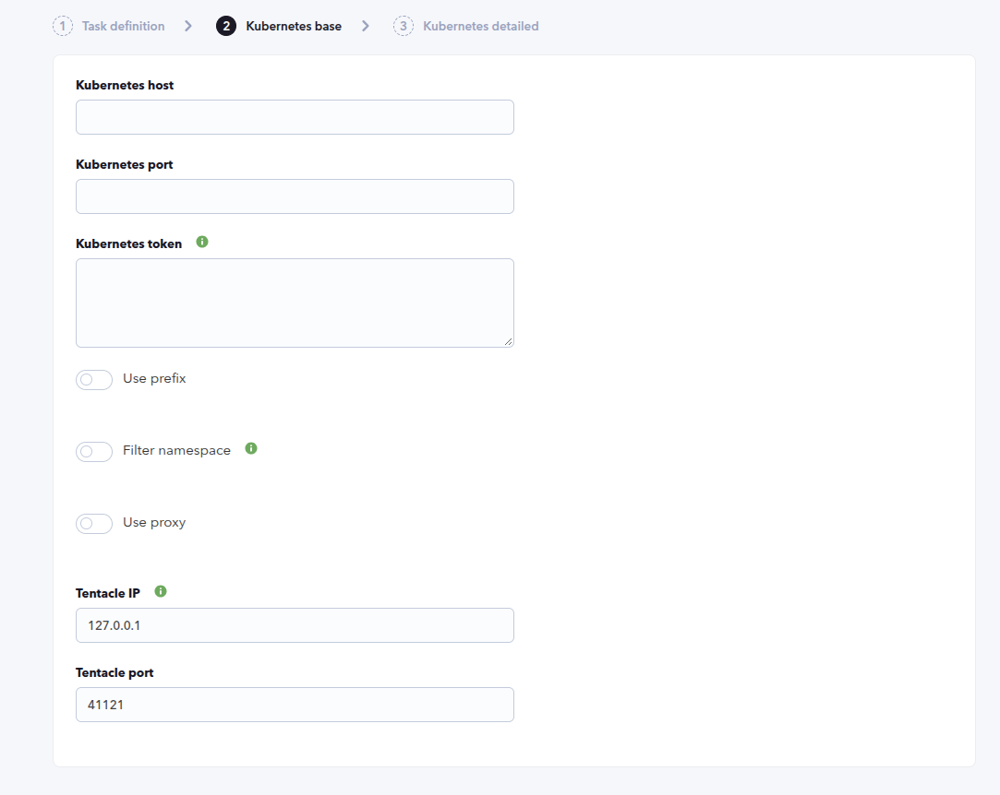
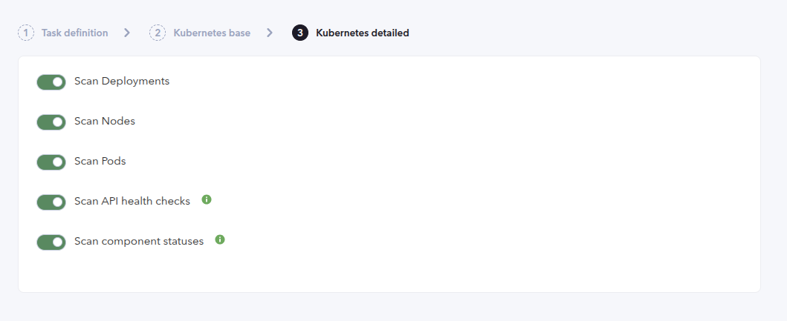
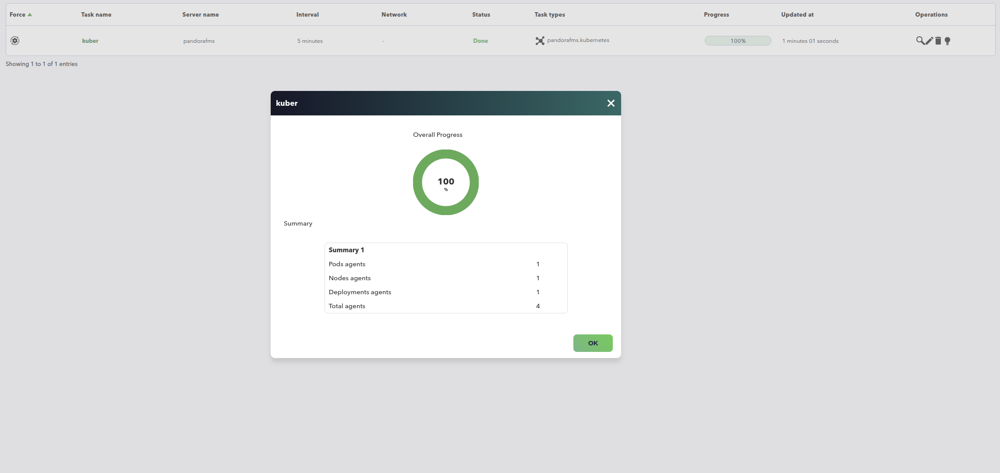
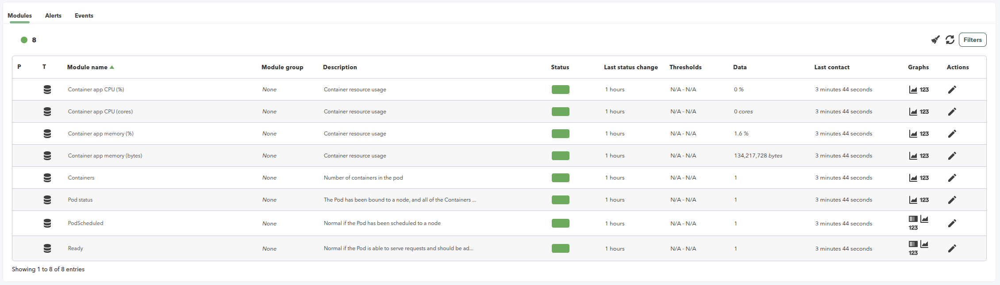

# Kubernetes Discovery

*Article last updated: 2026-09-28.*

## What it monitors

The Kubernetes Discovery plugin connects to the Kubernetes API server of a cluster and discovers its workloads and infrastructure: nodes, pods, deployments, namespaces, services, component statuses and the API health endpoints. It generates one Pandora FMS agent per discovered resource and fills it with availability, capacity and performance modules read from the API.

The plugin generates agents for:

- the cluster itself, through a global **Kubernetes** agent;
- every node, when **Scan Nodes** is enabled;
- every deployment, when **Scan Deployments** is enabled;
- every pod already scheduled to a node, when **Scan Pods** is enabled.

The global agent also carries the cluster-wide API status, health endpoints, service count, namespace count and component statuses.

The plugin runs as a Discovery task: the console creates the task, the Discovery server runs the plugin, and the generated agents and modules are created automatically. The task delivers the generated agent data through Tentacle.

## Prepare

### Compatibility

| Scope | State | Evidence |
| --- | --- | --- |
| Plugin version `1.3` (`pandorafms.kubernetes`) | Documented target | The version this page describes, as identified by the package definition. See [Plugin identity](#plugin-identity) |
| A Kubernetes cluster exposing the API server over HTTPS | `Required` | The plugin connects to `https://<host>:<port>` and reads the API resources. Prerequisite, not a compatibility statement |
| A Bearer token that can read the queried API resources | `Required` | The plugin authenticates with `Authorization: Bearer <token>` to list nodes, pods, deployments, services, namespaces and component statuses. Prerequisite, not a compatibility statement |
| The Kubernetes Metrics API (`metrics.k8s.io`) for CPU and memory usage | `Required` | Node and container CPU and memory modules are read from `/apis/metrics.k8s.io/v1beta1`. Prerequisite, not a compatibility statement |
| A specific Kubernetes version | `Not validated` | No published test record establishes compatibility with a concrete Kubernetes release |
| Host operating system running the plugin | `Not validated` | No published test record establishes operating-system compatibility |

### Requirements

1. **A Pandora FMS server with Discovery enabled** to run the task, and the console to define it.
2. **A Kubernetes API server reachable from the Discovery server**, addressed by host and port. The plugin always uses HTTPS; enter the host without a scheme.
3. **A Bearer token** for the API server. It is required to read the protected endpoints; grant it read access to the resources the task queries and no more. The **Scan API health checks** and **Scan component statuses** options may need elevated API permissions, as noted in the task tips.
4. **A target agent group and a monitoring interval** for the generated agents. Both come from the Discovery task and are inherited by every generated agent.
5. **Network reachability to the Tentacle destination**, because the task transfers the generated agent data through Tentacle.
6. The plugin is distributed as a Pandora FMS Discovery application (`.disco` package) that the Discovery server executes on the Pandora FMS server.

The plugin always uses the HTTPS scheme and does not verify the API server certificate, so it works with self-signed certificates but the TLS connection is not authenticated. The Bearer token is stored in the task configuration; protect the Pandora FMS console and its server according to your security policy.

### Install the plugin

Upload the `.disco` package from **Management → Discovery → Extension manager**. Once loaded, **Kubernetes** appears under the **Applications** category of the Discovery wizard.

## Configure the Discovery task

Create the task from **Management → Discovery → Applications → Kubernetes**. The wizard walks through the generic task definition and two plugin steps: **Kubernetes base** and **Kubernetes detailed**. Every field is documented in [Task parameters](#task-parameters).

### Step 1 — Task definition

The generic step asks for the task **name**, the **agent group** and **server** on which the task runs, and the **interval**. The group and the interval are passed to the plugin and inherited by every generated agent.

### Step 2 — Kubernetes base

Connection details and the Tentacle destination:

- **Kubernetes host** is the address or hostname of the API server.
- **Kubernetes port** is the API server port.
- **Kubernetes token** is the Bearer token used to authenticate against the API.
- **Use prefix** prepends a prefix to the name of every generated agent; **Prefix** is that prefix.
- **Filter namespace** restricts discovery to a set of namespaces, and **Namespace** is the list of namespaces to monitor.
- **Use proxy** routes the API requests through a proxy; **Proxy url** is that proxy.
- **Tentacle IP** and **Tentacle port** set the Tentacle destination for the generated data. Leave the defaults unless your environment needs another Tentacle target.



### Step 3 — Kubernetes detailed

What to scan:

- **Scan Deployments**, **Scan Nodes** and **Scan Pods** enable or disable each resource category.
- **Scan API health checks** generates the API health endpoint modules. Health endpoints may require elevated API permissions.
- **Scan component statuses** generates the component count and the component condition modules. Component statuses may require elevated API permissions.



## Verify the first run

Run the task from **Management → Discovery → Task list** and check the result in this order.

1. **The task summary** shows the overall progress and a summary with the number of node agents, pod agents and deployment agents generated, and the total number of agents.
2. **The agents.** Expect the global **Kubernetes** agent plus one agent per discovered node, deployment and scheduled pod.
3. **The modules.** Every generated agent carries the modules of its resource; a reachable cluster with the Metrics API available populates the CPU and memory values.
4. **The execution information.** A successful run reports no errors; any per-request failure is recorded there.



If the task fails before generating anything, the host, the port, the network reachability and the token are the first things to check.

## Understand the results

### Agents and identity

The plugin creates one agent per discovered resource. Agent names are built from the original resource name plus the optional prefix.

| Agent | Name | Parent agent |
| --- | --- | --- |
| Global | `[Prefix]Kubernetes` | — |
| Node | `[Prefix]<node>` | The global agent |
| Deployment | `[Prefix]<deployment>` | The global agent |
| Pod | `[Prefix]<namespace>/<pod>` | The node agent that runs the pod |

Deployment and node agents are children of the global Kubernetes agent; each pod agent is a child of the node agent it runs on and uses the pod IP as its address. The global agent is described as `Kubernetes global agent`, node agents as `Kubernetes node`, deployment agents as `Kubernetes deployment` and pod agents as `Kubernetes pod`.

Only pods already scheduled to a node are discovered: a pod without an assigned node is skipped, as are resources the API returns without a name.

Changing **Prefix** later changes the identity of every generated agent. The **Filter namespace** option applies only to deployments and pods, because nodes are cluster-scoped. Namespace matching is exact and case-sensitive, and the list is entered as a JSON array, for example `["default","kube-system"]`. When **Filter namespace** is enabled, list at least one namespace: an empty list matches no workload and no deployment or pod agent is generated.

### Modules by agent

Every agent receives the modules of its resource. The values are read from the API during every task run; the exact name, type and unit of each module are listed in [Generated modules](#generated-modules).

| Agent | Modules it carries |
| --- | --- |
| Global | API status, API health endpoints, service count, namespace count, component statuses, deployment count |
| Node | Pod usage against the node allocatable, node conditions and, when the Metrics API is available, CPU and memory usage |
| Deployment | Replica counts, readiness and availability of the deployment |
| Pod | Pod phase and conditions, container count and, when the Metrics API is available, per-container CPU and memory usage |



## Operate

### Manual execution

The plugin can also be run outside the Discovery wizard with a configuration file. This is useful for testing connectivity or for a one-off run. Write a configuration file with the `key=value` pairs listed in [Configuration file keys](#configuration-file-keys), then run the plugin entry point with the file as argument:

```bash
pandora_kubernetes --conf <PATH_TO_CONFIG>
```

The command-line interface accepts only `--conf`, so every option is set through the configuration file. When the plugin runs as a Discovery task, the Discovery server builds that file from the task fields.

## Troubleshoot

| Symptom | Check |
| --- | --- |
| The execution reports a request error | Confirm **Kubernetes host** and **Kubernetes port**, that the API server is reachable from the Discovery server, and that the host does not include a scheme. |
| Requests fail with `401` or `403` | The token is missing, invalid or lacks read access to the queried resources. Health checks and component statuses may need elevated permissions. |
| No deployments or pods are generated but nodes are | Review **Filter namespace**: when it is enabled, names must match exactly and in the same case, and an empty list matches nothing. |
| Expected pods are missing | Only pods already scheduled to a node are discovered. A pod in `Pending` without an assigned node is not generated. |
| Node CPU and memory modules are missing | The Kubernetes Metrics API is not available in the cluster. |
| Some global, health or component modules are missing | Those endpoints returned `401`, `403` or `404`, or the corresponding scan option is disabled. The plugin skips an optional endpoint that is not accessible instead of failing the whole run. |
| **API status** is `0` | The `/healthz` endpoint did not return `ok`. Check the API server health itself. |
| API requests time out | Requests use a fixed 5-second timeout and it is not configurable. Confirm the latency between the Discovery server and the API server. |
| Tentacle transfer fails | Confirm the Discovery server can reach **Tentacle IP** on **Tentacle port**. |
| The global agent uses proxy mode but is not authenticated | When **Use proxy** is enabled the plugin sends requests to **Proxy url** and does not add the Bearer token. |

## Reference

### Task parameters

The console presents these fields after the generic task definition. The macro column is the identifier used in the generated task configuration.

#### Kubernetes base

| Field | Macro | Type | Default | Notes |
| --- | --- | --- | --- | --- |
| Kubernetes host | `_ip_` | string | — | API server address or hostname, without a scheme |
| Kubernetes port | `_port_` | number | — | API server port |
| Kubernetes token | `_token_` | textarea | — | Bearer token used to authenticate against the API. Required to read protected endpoints |
| Use prefix | `_usePrefix_` | checkbox | off | Prepends a prefix to every generated agent name |
| Prefix | `_prefix_` | string | — | Prefix used when **Use prefix** is enabled |
| Filter namespace | `_filterNamespace_` | checkbox | off | Restricts discovery to the listed namespaces |
| Namespace | `_namespace_` | textarea | `[]` | JSON array of namespaces, for example `["default","kube-system"]`. Shown when **Filter namespace** is enabled |
| Use proxy | `_useProxy_` | checkbox | off | Routes API requests through **Proxy url** |
| Proxy url | `_proxyUrl_` | string | — | Proxy base URL. Shown when **Use proxy** is enabled |
| Tentacle IP | `_tentacleIP_` | string | `127.0.0.1` | Tentacle transfer destination |
| Tentacle port | `_tentaclePort_` | number | `41121` | Tentacle transfer destination port |

#### Kubernetes detailed

| Field | Macro | Type | Default | Notes |
| --- | --- | --- | --- | --- |
| Scan Deployments | `_scanDeployments_` | checkbox | on | Generates an agent per deployment |
| Scan Nodes | `_scanNodes_` | checkbox | on | Generates an agent per node |
| Scan Pods | `_scanPods_` | checkbox | on | Generates an agent per scheduled pod |
| Scan API health checks | `_healthChecks_` | checkbox | on | Generates the API health endpoint modules. May require elevated API permissions |
| Scan component statuses | `_componentChecks_` | checkbox | on | Generates the component count and component condition modules. May require elevated API permissions |

### Configuration file keys

The Discovery task builds this file from its own fields; a manual run supplies it with `--conf`. It is a plain text file of `key=value` lines.

| Key | Description | Default |
| --- | --- | --- |
| `ip` | Kubernetes API server address or hostname | Empty |
| `port` | Kubernetes API server port | Empty |
| `token` | Bearer token for the API | Empty |
| `agents_group_name` | Agent group inherited from the Discovery task | From the task |
| `interval` | Monitoring interval inherited from the Discovery task | `300` |
| `transfer_mode` | Transfer method for the generated data | `tentacle` |
| `tentacle_ip` | Tentacle destination address | `127.0.0.1` |
| `tentacle_port` | Tentacle destination port | `41121` |
| `use_prefix` | `1` prepends the prefix to every agent name | `0` |
| `prefix` | Prefix for the generated agent names | Empty |
| `use_namespace` | `1` restricts deployments and pods to the listed namespaces | `0` |
| `filter_namespace` | JSON array of namespaces | `[]` |
| `use_proxy` | `1` routes requests to `proxy_url` and does not add the Bearer token | `0` |
| `proxy_url` | Proxy base URL | Empty |
| `deployments` | `1` enables deployment discovery | `1` |
| `nodes` | `1` enables node discovery | `1` |
| `pods` | `1` enables pod discovery | `1` |
| `health_checks` | `1` enables the API health endpoint modules | `1` |
| `component_checks` | `1` enables the component status modules | `1` |

### Command line

| Command | Description |
| --- | --- |
| `pandora_kubernetes --conf <PATH_TO_CONFIG>` | Runs the plugin with a configuration file |

### Generated modules

#### Global agent

| Module name | Type | What it reports |
| --- | --- | --- |
| `API status` | generic_proc | `1` when `/healthz` returns `ok`, `0` otherwise. Created only when `/healthz` responds |
| One module per health endpoint | generic_proc | `1` when the endpoint returns `ok`. Only when **Scan API health checks** is enabled |
| `Services` | generic_data | Number of services |
| `Namespaces` | generic_data | Number of namespaces |
| `Components` | generic_data | Number of component statuses. Only when **Scan component statuses** is enabled |
| `<component>.<condition>` | generic_data | `1` when the component condition status is `TRUE`, `0` otherwise |
| `Deployments` | generic_data | Number of deployments |

The health endpoint modules query these paths: `/healthz`, `/healthz/ping`, `/healthz/log`, `/healthz/etcd` and the `/healthz/poststarthook/...` endpoints the API server exposes. A module is created only for an endpoint that responds.

#### Node agents

| Module name | Type | Unit | What it reports |
| --- | --- | --- | --- |
| `Pods` | generic_data | — | Pods currently scheduled on the node |
| `Pods (%)` | generic_data | % | Scheduled pods against the allocatable pods of the node. Created only when the node reports allocatable pods |
| `CPU (cores)` | generic_data | cores | CPU used by the node. Requires the Metrics API |
| `CPU (%)` | generic_data | % | CPU used against the allocatable CPU. Requires the Metrics API |
| `Memory (bytes)` | generic_data | bytes | Memory used by the node. Requires the Metrics API |
| `Memory (%)` | generic_data | % | Memory used against the allocatable memory. Requires the Metrics API |
| `NetworkUnavailable`, `MemoryPressure`, `DiskPressure`, `PIDPressure`, `Ready` | generic_proc | — | Node condition status |

The node CPU and memory modules are created only when the node exposes the Metrics API values and its allocatable CPU and memory are known.

#### Deployment agents

| Module name | Type | Unit | What it reports |
| --- | --- | --- | --- |
| `Ready` | generic_proc | — | `1` when the ready replicas equal the desired replicas, `0` otherwise |
| `Age` | generic_data | timeticks | Time elapsed since the deployment was created |
| `Replicas` | generic_data | — | Desired replicas |
| `Updated replicas` | generic_data | — | Replicas updated to the desired template |
| `Ready replicas` | generic_data | — | Ready replicas |
| `Available replicas` | generic_data | — | Available replicas |
| `Unavailable replicas` | generic_data | — | Replicas still required for the deployment to reach full availability |
| `Available` | generic_data | — | Deployment condition (`Available` or `Progressing`). Warning threshold at `2`, critical at `0` |

#### Pod agents

| Module name | Type | Unit | What it reports |
| --- | --- | --- | --- |
| `Pod status` | generic_data | — | Pod phase: `0` Failed, `1` Running, `2` Succeeded, `3` Pending, `4` Unknown or other |
| `PodScheduled`, `Ready`, `Initialized`, `Unschedulable`, `ContainersReady` | generic_proc | — | Pod condition status |
| `Containers` | generic_data | — | Number of containers in the pod |
| `Container <name> CPU (cores)` | generic_data | cores | CPU used by the container. Requires the Metrics API |
| `Container <name> CPU (%)` | generic_data | % | CPU used by the container against the allocatable CPU of its node. Requires the Metrics API |
| `Container <name> memory (bytes)` | generic_data | bytes | Memory used by the container. Requires the Metrics API |
| `Container <name> memory (%)` | generic_data | % | Memory used by the container against the allocatable memory of its node. Requires the Metrics API |

A per-container module is created only when the container exposes that metric.

### Plugin identity

| Field | Value |
| --- | --- |
| App short name | `pandorafms.kubernetes` |
| Plugin version | `1.3` |
| Type | Discovery application (`.disco`) |
| Section | Discovery → Applications |
