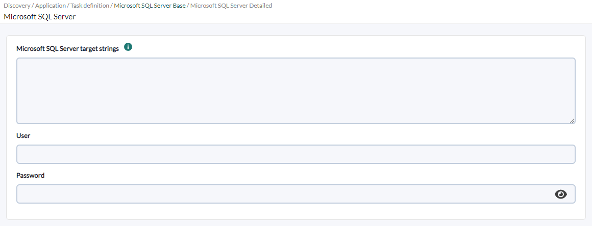
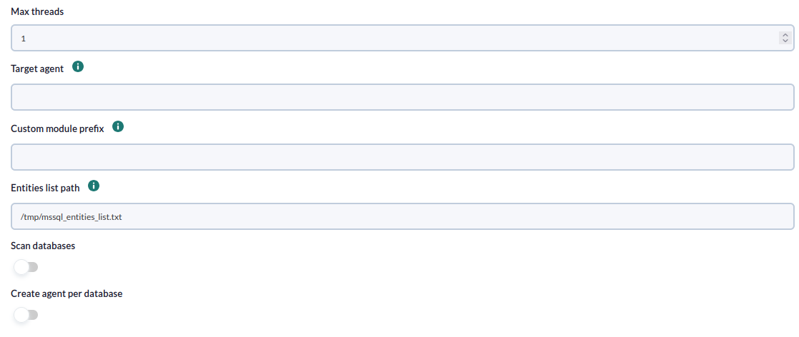
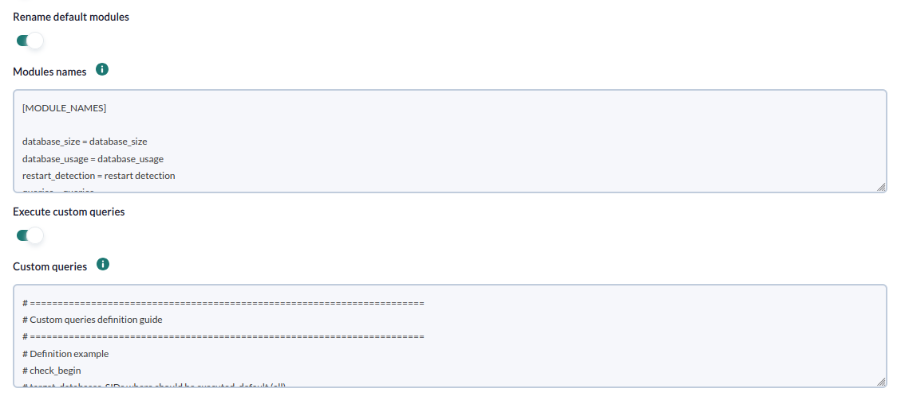
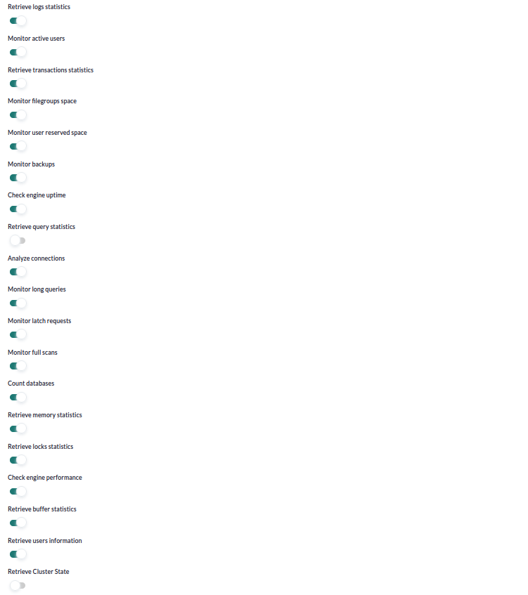
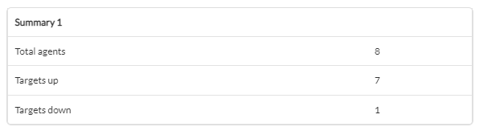

# Microsoft SQL Server Discovery

*Article last updated: 2026-09-08.*

## What it monitors

The Microsoft SQL Server Discovery plugin connects to Microsoft SQL Server instances and databases and turns their state and performance into Pandora FMS agents and modules. It reads a list of target instances, connects with a SQL Server login, and collects instance-wide metrics and per-database metrics through system views and performance counters.

A Discovery task creates one agent per target instance by default, and one agent per database when **Create agent per database** is enabled. Each agent carries the instance metrics of its target and the metrics of the databases it monitors. Custom queries can be defined to add one module per query and target.

## Prepare

### Compatibility

| Scope | State | Evidence |
| --- | --- | --- |
| Plugin version `1.13` (`pandorafms.mssql`) | Documented target | The version this page describes, as identified by the package definition. See [Plugin identity](#plugin-identity). |
| A reachable Microsoft SQL Server instance | `Required` | The plugin establishes remote connections to each monitored instance. Prerequisite, not a compatibility statement. |
| A SQL Server login with **VIEW SERVER STATE** | `Required` | Needed to read the instance system views and execution requests. Prerequisite, not a compatibility statement. See [Prepare SQL Server access](#prepare-sql-server-access). |
| A SQL Server login with **SELECT** | `Required` | Needed to run the custom queries against tables and views. Prerequisite, not a compatibility statement. |
| The Microsoft ODBC Driver 17 for SQL Server and unixODBC | `Required` | Needed only when **ODBC mode** is enabled; the plugin connects through that ODBC driver name. |
| A specific Pandora FMS version | `Not validated` | No published test record establishes console or server version compatibility. |
| A specific host operating system | `Not validated` | No published test record establishes operating-system compatibility for the machine that runs the plugin. |

### Prerequisites

1. **A Pandora FMS server with Discovery enabled** to run the task, and a console to define it.
2. **Connectivity** between the Pandora FMS server and each Microsoft SQL Server instance (default port `1433`).
3. **A SQL Server login** with the required permissions. See [Prepare SQL Server access](#prepare-sql-server-access).
4. **A target agent group and a monitoring interval** for the generated agents, taken from the Discovery task.
5. **For ODBC mode**, the Microsoft ODBC Driver 17 for SQL Server and unixODBC installed on the machine that runs the plugin.

The plugin is distributed as a Pandora FMS Discovery application (`.disco` package) with its Python dependencies bundled, so no extra Python libraries have to be installed on the Discovery server.

### Prepare SQL Server access

The login used by the task must reach each instance over the network and hold the permissions the monitor needs. From the official prerequisites:

- **VIEW SERVER STATE** to run `SELECT @@VERSION`, to read `sys.dm_os_sys_info` (server uptime), `sys.dm_exec_requests` (active requests), `@@MAX_CONNECTIONS` (maximum allowed connections), and to run `sp_who 'ACTIVE'` (active sessions).
- **SELECT** to execute the custom queries against the specific tables or views they target.

Grant the login the access required by your monitoring policy; the plugin only reads and never changes SQL Server configuration.

### Install the plugin

Load the `.disco` package from **Management → Discovery → Extension manager** (the *Manage disco packages* view). The package is available from the [Pandora FMS library](https://pandorafms.com/library/mssql-discovery/). Once loaded, **Microsoft SQL Server** appears under the **Applications** category of the Discovery wizard.

## Configure the Discovery task

Create the task from **Management → Discovery → Applications → Microsoft SQL Server**. The generic first step defines the task; the package adds **Microsoft SQL Server Base** and **Microsoft SQL Server Detailed**. Every field is documented in [Task parameters](#task-parameters).

**Step 1 — Task definition.** Name, agent group, server and interval. The group ID and the interval are passed to the plugin and applied to every generated agent.

**Step 2 — Microsoft SQL Server Base.** What to connect to and how:

- **Microsoft SQL Server target strings** is the list of instances to monitor, comma-separated or one per line. Each target is `SERVER`, `SERVER:PORT`, `SERVER\INSTANCE` or `SERVER:PORT\INSTANCE`. Lines starting with `#` are comments. To monitor specific databases of an instance, append `|db1;db2`; to monitor every database except a set, append `!` before the `|`. See [Target databases](#target-databases).
- **User** and **Password** are the SQL Server login used to connect.
- **ODBC mode** connects through the ODBC driver instead of the native `pymssql` driver.



**Step 3 — Microsoft SQL Server Detailed.** Execution, agent layout and which metrics to collect:

- **Max threads** distributes the targets and databases across parallel workers.
- **Target agent** sets the agent names for the targets, comma-separated or one per line, matching the position of the target list; a blank entry uses the target string as the agent name.
- **Custom module prefix** is prepended to every generated module name.
- **Scan databases** enumerates the databases of each instance automatically.
- **Create agent per database** creates one agent per database, with **Custom database agent prefix** naming them.
- **Enable entities file re-scan interval** and **Re-scan entities file interval** control how often the discovered-database cache is rebuilt.
- The **Database monitoring modules** and **Instance monitoring modules** toggles select which metric groups are collected.
- **Rename default modules** and **Modules names** let you replace the default module labels, and **Execute custom queries** and **Custom queries** define the custom queries.







## Verify the first run

Force the task from **Management → Discovery → Task list** and check the result in this order.

1. **The task summary** reports **Total agents**, **Targets up** and **Targets down**. With **Create agent per database** enabled, it also reports **Databases agents**. Targets up are the instances the plugin managed to connect to.

2. **The agents.** One agent appears per reachable target instance, named by the **Target agent** list or by the target string. With **Create agent per database**, one agent appears per discovered or listed database.

3. **The instance modules.** A reachable instance carries its engine, memory, buffer, connection, query and availability metrics according to the enabled toggles.

4. **The database modules.** Each monitored database carries its state, availability, transaction, log, backup, filegroup and table-space metrics according to the enabled toggles, and the custom query modules.

Targets that cannot be reached are counted in **Targets down** and do not produce agents.



## Understand the results

### Agents and identity

The plugin creates one agent per target instance by default. The agent name is the value from the **Target agent** list that matches the target position, or the target string itself when none is given. Each generated agent reports `MSSQL` as its operating system, its `os_version` is the SQL Server version returned by `SELECT @@VERSION` (or `Discovery` when it cannot be read), its `address` is the instance host, and it belongs to the task's group (by ID) with the task interval.

With **Create agent per database**, the plugin also creates one agent per database, named `<Custom database agent prefix><instance> <database>`, and counts them in **Databases agents**. The database modules are then placed on those agents.

Databases to monitor are either listed explicitly after `|` in the target string, or discovered by scanning when **Scan databases** is enabled. The list of discovered databases is persisted in the entities file, and **Enable entities file re-scan interval** decides when that file is rebuilt so new databases are picked up and removed ones are dropped. Explicitly listed databases are always monitored.

### Modules by agent

| Agent | Created when | Modules it carries |
| --- | --- | --- |
| Instance agent | A target instance is reachable and no **Create agent per database** for its databases | The instance metrics of the target, plus the database metrics of the databases it monitors |
| Database agent | **Create agent per database** enabled and a database is monitored | The database metrics of that database, plus its custom query modules |

Module names are `<Custom module prefix>`, the database name when the module is per-database, and the module name. The exhaustive module inventory and the toggle that enables each group are in [Generated modules and agents](#generated-modules-and-agents).

## Operate

### Manual execution

The plugin can run outside Discovery, from a Pandora FMS agent or directly from the command line, with a configuration file and the target, agent and custom-query files created manually:

```bash
./pandora_mssql --conf <PATH_TO_CONFIG> --target_databases <PATH_TO_TARGETS> --target_agents <PATH_TO_AGENTS> --custom_queries <PATH_TO_QUERIES>
```

Only `--conf` and `--target_databases` are required; `--target_agents` and `--custom_queries` are optional. The plugin connects to each target in parallel according to **Max threads** and produces the agents and modules in its Discovery JSON output.

The configuration file and the target lists hold the SQL Server password in plain text. Restrict them to the account that runs the plugin and keep them out of shared directories, logs and version control. Following the Discovery workflow for task runs means the console builds these files for you.

## Troubleshoot

| Symptom | Check |
| --- | --- |
| No agent is created and the target is reported **Targets down** | Confirm the instance is reachable from the Pandora FMS server on its port (default `1433`), that the SQL Server service is running, and that the **User** and **Password** are correct. |
| Instance modules are missing and the execution information logs retrieval warnings | The login needs **VIEW SERVER STATE** for the instance system views and performance counters. Grant that permission. |
| Custom query modules are missing | The query must be inside `check_begin`/`check_end`, use a `SELECT` statement, and the login needs **SELECT** on the referenced tables or views. Check the crontab expression if the query is scheduled. |
| A database is not monitored | Either list it after `|` in the target string or enable **Scan databases**. The discovered database list is cached and refreshed only after **Re-scan entities file interval**. |
| Database agents are not created | Enable **Create agent per database**. Without it, the database modules are placed on the instance agent. |
| ODBC mode fails to connect | Install the Microsoft ODBC Driver 17 for SQL Server and unixODBC on the machine that runs the plugin. The connection uses that driver name. |
| A custom query is rejected | Only `SELECT` statements are allowed; other statements are removed and reported in the execution information. |
| Expected modules are missing | Review the **Database monitoring modules** and **Instance monitoring modules** toggles: a disabled group produces no modules. |

## Reference

### Task parameters

The console presents the task fields in two steps after the generic task definition. The macro column is the identifier used in the generated task configuration.

#### Microsoft SQL Server Base

| Field | Macro | Type | Default | Notes |
| --- | --- | --- | --- | --- |
| Microsoft SQL Server target strings | `_dbstrings_` | textarea | — | List of target instances. Required |
| User | `_dbuser_` | string | — | SQL Server login. Required |
| Password | `_dbpass_` | password | — | SQL Server password. Required |
| ODBC mode | `_odbcMode_` | checkbox | off | Connects through the ODBC driver instead of the native driver |

#### Microsoft SQL Server Detailed

| Field | Macro | Type | Default | Notes |
| --- | --- | --- | --- | --- |
| Max threads | `_threads_` | number | `1` | Workers that distribute the targets and databases |
| Target agent | `_engineAgent_` | string | — | Agent names for the targets, matching the target list position; blank uses the target string |
| Custom module prefix | `_prefixModuleName_` | string | — | Prefix prepended to every module name |
| Scan databases | `_scanDatabases_` | checkbox | off | Enumerates the databases of each instance |
| Create agent per database | `_agentPerDatabase_` | checkbox | off | Creates one agent per database |
| Custom database agent prefix | `_prefixAgent_` | string | — | Prefix for the database agents. Shown only when **Create agent per database** is enabled |
| Enable entities file re-scan interval | `_enableEntitiesInterval_` | checkbox | off | Rebuilds the discovered-database cache after the interval |
| Re-scan entities file interval | `_entitiesInterval_` | select | `86400` | Seconds before the cache is rebuilt. Shown only when the previous option is enabled |
| Retrieve logs statistics | `_checkLogs_` | checkbox | on | Log flush, growth, shrink, size, usage and cache modules per database |
| Monitor active users | `_monitorUsers_` | checkbox | on | Active user transactions per database |
| Retrieve transactions statistics | `_checkTransactions_` | checkbox | on | Transactions and active transactions per database |
| Monitor filegroups space | `_checkFilegroups_` | checkbox | on | Free space per filegroup |
| Monitor user reserved space | `_checkUserSpace_` | checkbox | on | Reserved space per user table |
| Monitor backups | `_checkBackups_` | checkbox | on | Time since and date of the last backup |
| Check engine uptime | `_checkUptime_` | checkbox | on | Server restart detection |
| Retrieve query statistics | `_queryStats_` | checkbox | off | Number of running `SELECT`, `INSERT`, `DELETE` and `UPDATE` queries |
| Analyze connections | `_checkConnections_` | checkbox | on | Session usage against the maximum connections |
| Monitor long queries | `_checkLongQueries_` | checkbox | on | Long-running queries and their output |
| Monitor latch requests | `_checkLatchRequests_` | checkbox | on | Latch serialization requests |
| Monitor full scans | `_checkFullScans_` | checkbox | on | Full table or index scans |
| Count databases | `_checkDatabasesCount_` | checkbox | on | Number of existing databases |
| Retrieve memory statistics | `_checkMemory_` | checkbox | on | Lock, connection, optimizer, SQL cache and total server memory |
| Retrieve locks statistics | `_checkLocks_` | checkbox | on | Deadlocks, lock timeouts, lock requests and lock waits |
| Check engine performance | `_checkEnginePerformance_` | checkbox | on | CPU and I/O busy percentage of the instance |
| Retrieve buffer statistics | `_checkBuffer_` | checkbox | on | Buffer cache hit ratio and free connections |
| Retrieve users information | `_checkUsersInformation_` | checkbox | on | Active, locked and blocked users and the connection ratio |
| Retrieve Cluster State | `_checkClusterState_` | checkbox | off | AlwaysOn availability group and replica states |
| Rename default modules | `_renameModules_` | checkbox | on | Replaces the default module labels |
| Modules names | `_ModulesNames_` | textarea | — | `[MODULE_NAMES]` block renaming the default modules. Shown only when **Rename default modules** is enabled |
| Execute custom queries | `_executeCustomQueries_` | checkbox | on | Enables the custom queries |
| Custom queries | `_customQueries_` | textarea | — | Definition of the custom queries. Shown only when **Execute custom queries** is enabled |

### Configuration file

The Discovery task builds a temporary `--conf` file from its own fields. A manual run supplies it directly. The file has a `[CONF]` section and an optional `[MODULE_NAMES]` section.

Engine and monitoring preferences:

| Key | Default | Description |
| --- | --- | --- |
| `agents_group_id` | `10` | ID of the group where the agents are created |
| `interval` | `300` | Monitoring interval in seconds, inherited by the agents |
| `user` | Empty | Connection user. Required |
| `password` | Empty | Password for the user. Required |
| `threads` | `1` | Number of parallel workers |
| `modules_prefix` | Empty | Prefix for the module names |
| `entities_list` | `/tmp/mssql_entities_list.txt` | File that caches the discovered databases |
| `enable_entities_interval` | `1` | Rebuilds the database cache after the interval |
| `entities_interval` | `300` | Seconds before the database cache is rebuilt |
| `scan_databases` | `0` | Enumerates the databases of each instance |
| `odbc_mode` | `0` | Connects through the ODBC driver |
| `agent_per_database` | `0` | Creates one agent per database |
| `db_agent_prefix` | Empty | Prefix for the database agent names |
| `rename_modules` | `1` | Applies the `[MODULE_NAMES]` labels |
| `execute_custom_queries` | `1` | Enables the custom queries |

Monitoring toggles (each `1` enables the group, each `0` disables it):

| Key | Default | Enables |
| --- | --- | --- |
| `engine_uptime` | `1` | Restart detection |
| `query_stats` | `1` | `SELECT`/`INSERT`/`DELETE`/`UPDATE` query counts |
| `analyze_connections` | `1` | Session usage |
| `count_databases` | `1` | Database count |
| `retrieve_memory_statistics` | `1` | Memory statistics |
| `retrieve_locks_statistics` | `1` | Locks statistics |
| `retrieve_buffer_statistics` | `1` | Buffer cache hit ratio and free connections |
| `monitor_latch_requests` | `1` | Latch waits |
| `monitor_full_scans` | `1` | Full scans |
| `check_engine_performance` | `1` | Server CPU and I/O |
| `retrieve_users_information` | `1` | Users information |
| `monitor_long_queries` | `1` | Long queries |
| `retrieve_cluster_state` | `0` | AlwaysOn cluster state |
| `retrieve_logs_statistics` | `1` | Log statistics |
| `monitor_active_users` | `1` | Active user transactions |
| `retrieve_transactions_statistics` | `1` | Transactions |
| `monitor_filegroups_space` | `1` | Filegroup space |
| `monitor_user_reserved_space` | `1` | User table space |
| `monitor_backups` | `1` | Backups |

The `[MODULE_NAMES]` section maps each default module key to the label that appears in the console, for example `database_size = database_size` and `restart_detection = restart detection`. Only the enabled toggle groups are renamed.

The `--conf` file and the target lists hold the SQL Server password in plain text. Restrict them to the account that runs the plugin and keep them out of shared directories, logs and version control.

### Target databases

The `--target_databases` file holds one or more target strings, comma-separated or one per line. Lines starting with `#` and blank lines are ignored.

Each target follows `SERVER`, `SERVER:PORT`, `SERVER\INSTANCE` or `SERVER:PORT\INSTANCE`. To monitor specific databases of an instance, append `|` and separate the databases with `;`:

```text
172.17.0.4:1433\DEVENV|pandora;testing;model
```

To monitor every database except a set, append `!` before the `|`:

```text
172.17.0.4:1433\DEVENV!|pandora;testing;model
```

### Target agents

The optional `--target_agents` file holds one agent name per target, comma-separated or one per line. The position of each name matches the position of the corresponding target in the target list; blank lines are ignored. A blank entry leaves the agent named after the target string (its IP or FQDN).

```text
agente1,,agente3
agente4
agente5,agente6,agente7,,agente9
```

### Command-line execution

The plugin accepts a configuration file, a target databases file, an optional target agents file and an optional custom queries file:

```bash
./pandora_mssql --conf <PATH_TO_CONFIG> --target_databases <PATH_TO_TARGETS> --target_agents <PATH_TO_AGENTS> --custom_queries <PATH_TO_QUERIES>
```

| Option | Description |
| --- | --- |
| `--conf` | Required path to the configuration file |
| `--target_databases` | Required path to the file with the target instances |
| `--target_agents` | Optional path to the file with the target agent names |
| `--custom_queries` | Optional path to the file with the custom queries |

Example configuration file:

```ini
[CONF]
agents_group_id=10
interval=300
user=<SQL_LOGIN>
password=<SQL_PASSWORD>
threads=1
modules_prefix=
execute_custom_queries=1
engine_uptime=1
query_stats=1
analyze_connections=1
count_databases=1
retrieve_memory_statistics=1
retrieve_locks_statistics=1
check_engine_performance=1
retrieve_buffer_statistics=1
retrieve_users_information=1
monitor_long_queries=1
monitor_latch_requests=1
monitor_full_scans=1
retrieve_logs_statistics=1
monitor_active_users=1
retrieve_transactions_statistics=1
monitor_filegroups_space=1
monitor_user_reserved_space=1
monitor_backups=1
agent_per_database=0
scan_databases=1

[MODULE_NAMES]
database_size=database_size
database_usage=database_usage
restart_detection=restart detection
```

### Custom queries

Each custom query creates one module per task agent and is defined between `check_begin` and `check_end`:

| Field | Description |
| --- | --- |
| `name` | Module name |
| `description` | Module description |
| `operation` | `value` returns a single value, `full` returns all rows as a string |
| `datatype` | `generic_data`, `generic_data_string` or `generic_proc` |
| `min_warning`, `max_warning` | Numeric warning thresholds |
| `str_warning` | String warning condition |
| `warning_inverse` | `1` inverts the warning threshold interval |
| `min_critical`, `max_critical` | Numeric critical thresholds |
| `str_critical` | String critical condition |
| `critical_inverse` | `1` inverts the critical threshold interval |
| `module_interval` | Module interval, as a multiplier of the agent interval |
| `crontab` | 5-field cron expression; the query runs only when the date/time matches. Empty runs every interval |
| `target` | The query, a `SELECT` only |
| `target_databases` | Targets or databases where the module is created; `all` or empty applies to all |
| `target_scope` | `instances`, `databases` or `all`; empty applies to both |
| `ignore_databases` | Targets or databases where the module is not created |

The `crontab` field follows the standard 5-field format (`minute hour day_of_month month day_of_week`) and supports `*`, exact values, ranges, steps and lists. On the first run after enabling a scheduled query only an occurrence inside the current interval is picked up, so a daily or monthly query does not run immediately.

```text
check_begin
name Select 1
description Number of invalid objects
operation value
datatype generic_data
min_warning 5
target SELECT 1;
target_databases all
check_end
```

### Generated modules and agents

Module names are `[<Custom module prefix>][<database name> ]<module name>`. The labels below are the default `[MODULE_NAMES]` values; with **Rename default modules** enabled they can be replaced.

**Instance metrics (on the instance agent)**

Always created:

- `database_size`: `generic_data`, the size of the database; MB.
- `database_usage`: `generic_data`, percentage of the database that is used; unit `%`.
- `server_startup`: `generic_data`, uptime of the database server in days.
- `page_reads`: `generic_data_inc`, database page reads per second.
- `page_writes`: `generic_data_inc`, database page writes per second.
- `locks_used`: `generic_data`, used lock and lock owner blocks; unit `%`.
- `workspace_memory`: `generic_data`, granted workspace memory; unit `%`.
- `average_waittime`: `generic_data`, average lock wait time; unit `ms`.

Created when the matching toggle is enabled:

- **Check engine uptime**: `restart detection` (`generic_proc`, `0` when a restart is detected, `1` otherwise).
- **Retrieve query statistics**: `queries`, `insert`, `delete`, `update` (`generic_data`, count of running queries by type, within the interval).
- **Analyze connections**: `session usage` (`generic_data`, current sessions as a percentage of the maximum; unit `%`).
- **Count databases**: `database_count` (`generic_data`, number of existing databases).
- **Retrieve memory statistics**: `lock_memory`, `connection_memory`, `optimizer_memory`, `sqlcache_memory`, `total_memory` (`generic_data`, bytes).
- **Retrieve locks statistics**: `deadlocks` (`generic_data`, deadlocks per second), `lock_timeouts`, `lock_requests`, `lock_waits` (`generic_data_inc`). `lock_waits` carries a critical threshold at `90`.
- **Retrieve buffer statistics**: `buf_cachehit_ratio` (`generic_data`, pages found in the buffer cache; unit `%`), `free_connections` (`generic_data`, free connections; unit `%`).
- **Monitor latch requests**: `latch_waits` (`generic_data_inc`, latch requests per second).
- **Monitor full scans**: `full_scans` (`generic_data_inc`, full scans per second).
- **Check engine performance**: `server_cpu` (`generic_data`, CPU usage by the instance; unit `%`, critical at `90`), `server_io` (`generic_data_inc`, I/O busy; unit `%`, critical at `80`).
- **Retrieve users information**: `active_connection_ratio` (`generic_data_string`, active to total connections; unit `%`), `locked_users`, `blocked_users`, `active_users` (`generic_data`).
- **Monitor long queries**: `long_queries` (`generic_data`, seconds of the longest running query; unit `s`, critical at `600`), `long_queries_string` (`async_string`, the output of the long-running queries).
- **Retrieve Cluster State**: `aag_cluster_quorum_state`, `aag_cluster_members_state <member>`, `aag_synchronization_health`, `aag_replica_synchronization_health <replica>`, `aag_replica_connected_state <replica>`, `aag_replica_recovery_health`, `aag_replica_operational_state`, `aag_db_replica_synchronization_state <database>` (`generic_proc`), `aag_listener_state <replica>` (`generic_data`, AlwaysOn availability group and replica states, with inverted critical thresholds).

**Database metrics (on the database agent, or on the instance agent when **Create agent per database** is disabled)**

Always created:

- `availability`: `generic_proc`, `1` when the database exists.
- `state`: `generic_data`, the database state.

Created when the matching toggle is enabled:

- **Monitor active users**: `active users` (`generic_data`, active user transactions for the database).
- **Retrieve transactions statistics**: `transactions` (`generic_data_inc`, transactions per second), `active transactions` (`generic_data`).
- **Retrieve logs statistics**: `log_flush_waits` (`generic_data_inc`), `log_file_growths` (`generic_data`, unit `%`), `log_file_shrinks` (`generic_data`), `logfile_size` (`generic_data`, MB), `logfile_usage` (`generic_data`, free space in the log files; unit `%`, critical at `15`), `log_cachehit_ratio` (`generic_data`, unit `%`).
- **Monitor backups**: `backup_status_minutes` (`generic_data`, minutes since the last backup), `backup_status_last_backup` (`generic_data` or `generic_data_string`, date of the last backup, or `NEVER`).
- **Monitor filegroups space**: `fg_free_space` (`generic_data`, free space in the filegroups; unit `%`, critical at `15`).
- **Monitor user reserved space**: one `table_space <table>` module per table (`generic_data`, KB) and one `table_space <table> free %` (`generic_data`, unit `%`).
- **Execute custom queries**: one module per custom query, with the datatype and thresholds defined in the query.

### Plugin identity

| Field | Value |
| --- | --- |
| App short name | `pandorafms.mssql` |
| Plugin version | `1.13` |
| Type | Discovery application (`.disco`) |
| Section | Discovery → Applications |