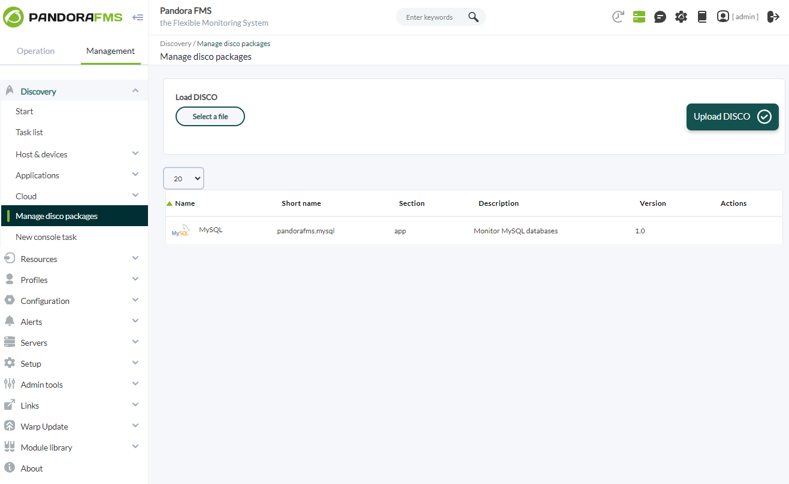
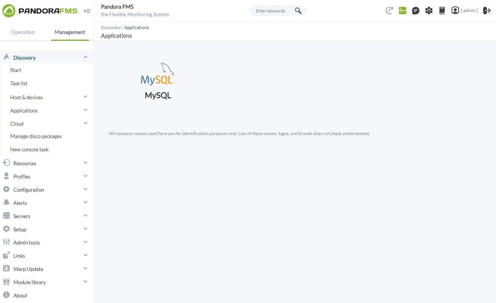
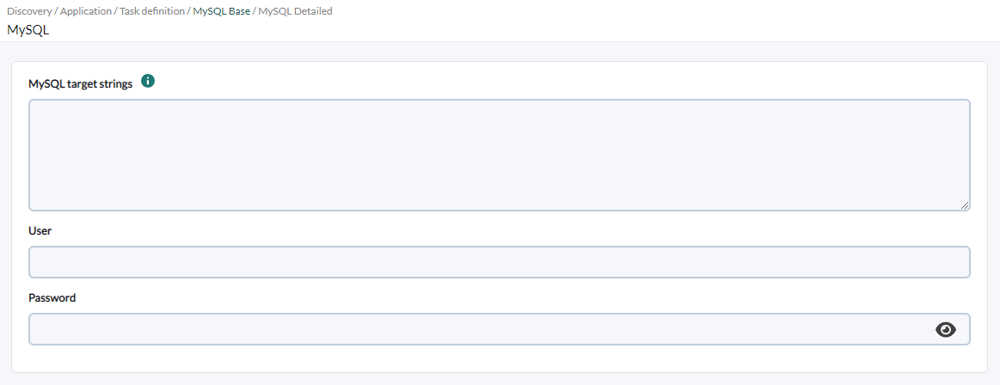
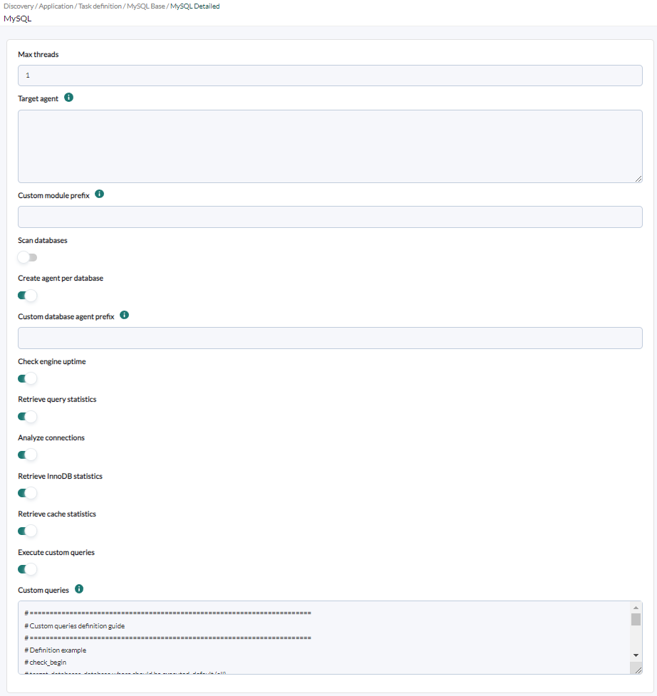
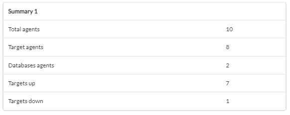

# MySQL Discovery

*Article last updated: 2026-09-08.*

## What it monitors

The MySQL Discovery plugin connects to MySQL instances and databases and turns their state and performance into Pandora FMS agents and modules. It reads a list of target instances, connects with a MySQL user, and collects engine metrics through `SHOW GLOBAL STATUS`, `SHOW VARIABLES` and the `information_schema` tables.

A Discovery task creates one agent per target instance. When **Scan databases** is enabled it also collects per-database metrics, and when **Create agent per database** is enabled it creates one agent per discovered database. Custom queries can be defined to add one module per query and database.

## Prepare

### Compatibility

| Scope | State | Evidence |
| --- | --- | --- |
| Plugin version `1.5` (`pandorafms.mysql`) | Documented target | The version this page describes, as identified by the package definition. See [Plugin identity](#plugin-identity). |
| A reachable MySQL instance | `Required` | The plugin establishes remote connections to each monitored instance. Prerequisite, not a compatibility statement. |
| A MySQL user with **SELECT** on the database tables and on the `INFORMATION_SCHEMA` tables | `Required` | Needed to read the engine and per-database metrics. Prerequisite, not a compatibility statement. See [Prepare MySQL access](#prepare-mysql-access). |
| A MySQL user with **SHOW STATUS** and **SHOW VARIABLES** | `Required` | Needed to read the server status and configuration variables. Prerequisite, not a compatibility statement. |
| A specific MySQL version | `Not validated` | No published test record establishes compatibility with a concrete MySQL release. |
| A specific Pandora FMS version | `Not validated` | No published test record establishes console or server version compatibility. |
| A specific host operating system | `Not validated` | No published test record establishes operating-system compatibility for the machine that runs the plugin. |

### Prerequisites

1. **A Pandora FMS server with Discovery enabled** to run the task, and a console to define it.
2. **Connectivity** between the Pandora FMS server and each MySQL instance (default port `3306`).
3. **A MySQL user** with the required permissions. See [Prepare MySQL access](#prepare-mysql-access).
4. **A target agent group and a monitoring interval** for the generated agents, taken from the Discovery task.

The plugin is distributed as a Pandora FMS Discovery application (`.disco` package) with its Python dependencies bundled, so no extra Python libraries have to be installed on the Discovery server.

### Prepare MySQL access

The user used by the task must reach each instance over the network and hold the permissions the monitor needs. From the official prerequisites:

- **SELECT** on the database tables.
- **SELECT** on the `INFORMATION_SCHEMA` tables.
- **SHOW STATUS** to consult the status of the server.
- **SHOW VARIABLES** to access the server configuration variables.

Grant the user only the access required by your monitoring policy; the plugin only reads and never changes MySQL configuration.

### Install the plugin

Load the `.disco` package from **Management → Discovery → Extension manager** (the *Manage disco packages* view). The package is available from the [Pandora FMS library](https://pandorafms.com/library/mysql-discovery/). Once loaded, **MySQL** appears under the **Applications** category of the Discovery wizard.





## Configure the Discovery task

Create the task from **Management → Discovery → Applications → MySQL**. The generic first step defines the task; the package adds **MySQL Base** and **MySQL Detailed**. Every field is documented in [Task parameters](#task-parameters).

**Step 1 — Task definition.** Name, agent group, server and interval. The group ID and the interval are passed to the plugin and applied to every generated agent.

**Step 2 — MySQL Base.** What to connect to and how:

- **MySQL target strings** is the list of instances to monitor, comma-separated or one per line. Each target is `SERVER:PORT` or `SERVER`; the default port is `3306`. Lines starting with `#` are comments.
- **User** and **Password** are the MySQL user used to connect.



**Step 3 — MySQL Detailed.** Execution, agent layout and which metrics to collect:

- **Max threads** distributes the targets across parallel workers.
- **Target agent** sets the agent names for the targets, matching the position of the target list; a blank entry uses the server IP address or FQDN.
- **Custom module prefix** is prepended to every generated module name.
- **Scan databases** collects the per-database metrics of each instance, and **Create agent per database** creates one agent per database, with **Custom database agent prefix** naming them.
- **Agent autodisable mode** creates the generated agents in Pandora FMS mode `2`, which disables an agent when all its modules become unknown.
- **Check engine uptime**, **Retrieve query statistics**, **Analyze connections**, **Retrieve InnoDB statistics** and **Retrieve cache statistics** select the engine metric groups collected.
- **Execute custom queries** and **Custom queries** define the custom queries.



## Verify the first run

Force the task from **Management → Discovery → Task list** and check the result in this order.

1. **The task summary** reports **Total agents**, **Target agents**, **Databases agents**, **Targets up** and **Targets down**. Targets up are the instances the plugin managed to connect to.

2. **The agents.** One agent appears per reachable target instance, named by the **Target agent** list or by the server address. With **Create agent per database**, one agent appears per discovered database.

3. **The engine modules.** A reachable instance carries its connection, uptime, query, connection, InnoDB and cache modules according to the enabled toggles.

4. **The database modules.** With **Scan databases** enabled, each database carries its availability, fragmentation, size and custom query modules.

Targets that cannot be reached are counted in **Targets down** and do not produce agents.



## Understand the results

### Agents and identity

The plugin creates one agent per target instance by default. The agent name is the value from the **Target agent** list that matches the target position, or the server address when none is given. Each generated agent reports `MySQL` as its operating system, its `os_version` is the value returned by `SELECT @@VERSION` (or `Discovery` when it cannot be read), its `address` is the instance host, and it belongs to the task's group (by ID) with the task interval. With **Agent autodisable mode** enabled the agents are created in Pandora FMS mode `2`.

With **Create agent per database**, the plugin also creates one agent per database, named `<Custom database agent prefix><target agent> <database name>`, and counts them in **Databases agents**. Those agents declare the target agent as parent.

The databases to monitor are collected from `SHOW DATABASES` when **Scan databases** is enabled; the core databases `mysql`, `information_schema`, `performance_schema` and `sys` are skipped. The engine metrics always go to the target agent, and the per-database metrics go to the database agents when **Create agent per database** is enabled, or to the target agent otherwise.

### Modules by agent

| Agent | Created when | Modules it carries |
| --- | --- | --- |
| Target agent | A target instance is reachable | `MySQL connection`, the engine metrics enabled by the toggles, and the per-database modules when **Scan databases** is enabled without **Create agent per database** |
| Database agent | **Create agent per database** enabled and a database is discovered | `<database> availability`, `<database> fragmentation ratio`, `<database> size` and the custom query modules |

Module names are `<Custom module prefix>` plus the module name; the database modules also include the database name. The exhaustive module inventory and the toggle that enables each group are in [Generated modules and agents](#generated-modules-and-agents).

## Operate

### Manual execution

The plugin can run outside Discovery, from a Pandora FMS agent or directly from the command line, with a configuration file and the target, agent and custom-query files created manually:

```bash
./pandora_mysql --conf <PATH_TO_CONFIG> --target_databases <PATH_TO_TARGETS> --target_agents <PATH_TO_AGENTS> --custom_queries <PATH_TO_QUERIES>
```

Only `--conf` and `--target_databases` are required; `--target_agents` and `--custom_queries` are optional. The plugin connects to each target in parallel according to **Max threads** and produces the agents and modules in its Discovery JSON output.

The configuration file and the target lists hold the MySQL password in plain text. Restrict them to the account that runs the plugin and keep them out of shared directories, logs and version control. Following the Discovery workflow for task runs means the console builds these files for you.

## Troubleshoot

| Symptom | Check |
| --- | --- |
| No agent is created and the target is reported **Targets down** | Confirm the instance is reachable from the Pandora FMS server on its port (default `3306`), that the MySQL service is running, and that the **User** and **Password** are correct. |
| Engine modules are missing and the execution information logs retrieval errors | The user needs **SHOW STATUS** and **SHOW VARIABLES** for the engine metrics, and **SELECT** on `INFORMATION_SCHEMA` for the per-database metrics. Grant those permissions. |
| Per-database modules are missing | Enable **Scan databases**. The core databases `mysql`, `information_schema`, `performance_schema` and `sys` are never monitored. |
| Database agents are not created | Enable **Create agent per database**. Without it, the database modules are placed on the target agent. |
| Custom query modules are missing | The query must be inside `check_begin`/`check_end`, be a `SELECT`, and the user needs **SELECT** on the referenced tables. Check the crontab expression if the query is scheduled. |
| Expected modules are missing | Review the **Detailed** toggles: a disabled group produces no modules. |

## Reference

### Task parameters

The console presents the task fields in two steps after the generic task definition. The macro column is the identifier used in the generated task configuration.

#### MySQL Base

| Field | Macro | Type | Default | Notes |
| --- | --- | --- | --- | --- |
| MySQL target strings | `_dbstrings_` | textarea | — | List of target instances. Required |
| User | `_dbuser_` | string | — | MySQL user. Required |
| Password | `_dbpass_` | password | — | MySQL password. Required |

#### MySQL Detailed

| Field | Macro | Type | Default | Notes |
| --- | --- | --- | --- | --- |
| Max threads | `_threads_` | number | `1` | Workers that distribute the targets |
| Target agent | `_engineAgent_` | textarea | — | Agent names for the targets, matching the target list position; blank uses the server address |
| Custom module prefix | `_prefixModuleName_` | string | — | Prefix prepended to every module name |
| Scan databases | `_scanDatabases_` | checkbox | off | Collects the per-database metrics of each instance |
| Create agent per database | `_agentPerDatabase_` | checkbox | off | Creates one agent per database |
| Custom database agent prefix | `_prefixAgent_` | string | — | Prefix for the database agents. Shown only when **Create agent per database** is enabled |
| Agent autodisable mode | `_agentautodisable_` | checkbox | off | Creates agents in Pandora FMS mode `2`, which disables an agent when all its modules become unknown |
| Check engine uptime | `_checkUptime_` | checkbox | on | Server restart detection |
| Retrieve query statistics | `_queryStats_` | checkbox | on | Query counters and rates |
| Analyze connections | `_checkConnections_` | checkbox | on | Current connections, connection ratio and aborted connections |
| Retrieve InnoDB statistics | `_checkInnodb_` | checkbox | on | InnoDB buffer pool and disk activity |
| Retrieve cache statistics | `_checkCache_` | checkbox | on | Query cache state and hit ratio |
| Execute custom queries | `_executeCustomQueries_` | checkbox | on | Enables the custom queries |
| Custom queries | `_customQueries_` | textarea | — | Definition of the custom queries. Shown only when **Execute custom queries** is enabled |

### Configuration file

The Discovery task builds a temporary `--conf` file from its own fields. A manual run supplies it directly. The file has a `[CONF]` section; the plugin reads it without a section header.

| Key | Default | Description |
| --- | --- | --- |
| `agents_group_id` | `10` | ID of the group where the agents are created |
| `interval` | `300` | Monitoring interval in seconds, inherited by the agents |
| `user` | Empty | Connection user. Required |
| `password` | Empty | Password for the user. Required |
| `threads` | `1` | Number of parallel workers |
| `modules_prefix` | Empty | Prefix for the module names |
| `execute_custom_queries` | `1` | Enables the custom queries |
| `analyze_connections` | `1` | Connection modules |
| `scan_databases` | `0` | Collects the per-database metrics |
| `agent_per_database` | `0` | Creates one agent per database |
| `agent_autodisable` | `0` | Creates agents in Pandora FMS mode `2` when enabled |
| `db_agent_prefix` | Empty | Prefix for the database agents |
| `innodb_stats` | `1` | InnoDB statistics |
| `engine_uptime` | `1` | Engine uptime |
| `query_stats` | `1` | Query statistics |
| `cache_stats` | `1` | Cache statistics |
| `cron_state_dir` | Empty | Folder for the custom query crontab state; derived from the task temporary path |

The `--conf` file and the target lists hold the MySQL password in plain text. Restrict them to the account that runs the plugin and keep them out of shared directories, logs and version control.

### Target databases

The `--target_databases` file holds one or more target strings, comma-separated or one per line. Lines starting with `#` and blank lines are ignored. Each target is `SERVER:PORT` or `SERVER`; the default port is `3306`.

```text
172.17.0.4:3306
172.17.0.5
```

### Target agents

The optional `--target_agents` file holds one agent name per target, comma-separated or one per line. The position of each name matches the position of the corresponding target in the target list; blank lines are ignored. A blank entry leaves the agent named after the server IP address or FQDN.

### Command-line execution

The plugin accepts a configuration file, a target databases file, an optional target agents file and an optional custom queries file:

```bash
./pandora_mysql --conf <PATH_TO_CONFIG> --target_databases <PATH_TO_TARGETS> --target_agents <PATH_TO_AGENTS> --custom_queries <PATH_TO_QUERIES>
```

| Option | Description |
| --- | --- |
| `--conf` | Required path to the configuration file |
| `--target_databases` | Required path to the file with the target instances |
| `--target_agents` | Optional path to the file with the target agent names |
| `--custom_queries` | Optional path to the file with the custom queries |

Example configuration file:

```ini
[CONF]
agents_group_id=10
interval=300
user=<MYSQL_USER>
password=<MYSQL_PASSWORD>
threads=1
modules_prefix=
execute_custom_queries=1
engine_uptime=1
query_stats=1
analyze_connections=1
innodb_stats=1
cache_stats=1
scan_databases=1
agent_per_database=0
```

### Custom queries

Each custom query creates one module per task agent and is defined between `check_begin` and `check_end`:

| Field | Description |
| --- | --- |
| `name` | Module name |
| `description` | Module description |
| `operation` | `value` returns a single value, `full` returns all rows as a string |
| `datatype` | `generic_data`, `generic_data_string` or `generic_proc` |
| `min_warning`, `max_warning` | Numeric warning thresholds |
| `str_warning` | String warning condition |
| `warning_inverse` | `1` inverts the warning threshold interval |
| `min_critical`, `max_critical` | Numeric critical thresholds |
| `str_critical` | String critical condition |
| `critical_inverse` | `1` inverts the critical threshold interval |
| `module_interval` | Module interval, as a multiplier of the agent interval |
| `crontab` | 5-field cron expression; the query runs only when the date/time matches. Empty runs every interval |
| `target` | The query, a `SELECT` only |
| `target_databases` | Databases where the module is created; `all` or empty applies to all |

The `target` and `name` fields accept the reserved word `$__self_dbname`, which is replaced with the database name currently being analyzed. The `crontab` field follows the standard 5-field format and supports `*`, exact values, ranges, steps and lists; on the first run after enabling a scheduled query only an occurrence inside the current interval is picked up.

```text
check_begin
name ConnectionCount
description Number of connections
operation value
datatype generic_data
min_warning 10
target SELECT COUNT(*) AS ConnectionCount FROM $__self_dbname.processlist
target_databases all
check_end
```

### Generated modules and agents

Module names are `[<Custom module prefix>]<module name>`, and the database modules also include the database name.

**Target agent** (one per reachable instance)

Always created:

- `MySQL connection`: `generic_proc`, `1` when the instance is reachable, `0` otherwise.

Created when the matching toggle is enabled:

- **Check engine uptime**: `restart detection` (`generic_proc`, `0` when a restart is detected, `1` otherwise). The description carries the running time.
- **Retrieve query statistics**: `queries` (`generic_data_inc_abs`, total), `query rate` (`generic_data_inc`), `query select`, `query update`, `query delete`, `query insert` (`generic_data_inc_abs`).
- **Analyze connections**: `current connections` (`generic_data`, warning at 90% and critical at 98% of `max_connections`), `connections ratio` (`generic_data`, unit `%`, warning at `85` and critical at `90`), `aborted connections` (`generic_data_inc_abs`).
- **Retrieve InnoDB statistics**: `Innodb buffer pool pages total` (`generic_data`), `Innodb buffer pool read requests`, `Innodb buffer pool write requests` (`generic_data_inc_abs`), `Innodb disk reads`, `Innodb disk writes` (`generic_data_inc_abs`), `Innodb disk data read`, `Innodb disk data written` (`generic_data_inc_abs`, unit `MB`).
- **Retrieve cache statistics**: `query cache enabled` (`generic_proc`, `1` when the query cache is enabled), `query hit ratio` (`generic_data`, unit `%`, created only when the query cache is enabled).

**Database modules** (on the target agent or on the database agent, created when **Scan databases** is enabled, for each database other than the core ones)

- `<database> availability`: `generic_proc`, `1`.
- `<database> fragmentation ratio`: `generic_data`, unit `%`.
- `<database> size`: `generic_data`, unit `MB`.
- The custom query modules that target the database.

### Plugin identity

| Field | Value |
| --- | --- |
| App short name | `pandorafms.mysql` |
| Plugin version | `1.5` |
| Type | Discovery application (`.disco`) |
| Section | Discovery → Applications |