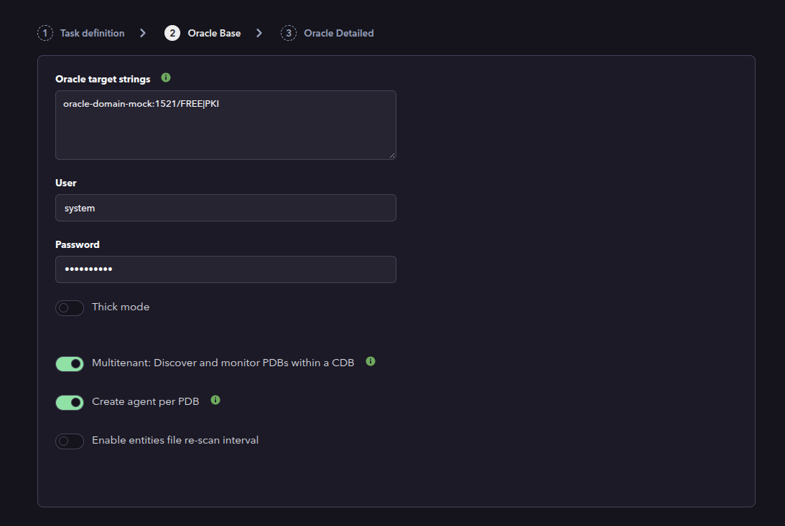
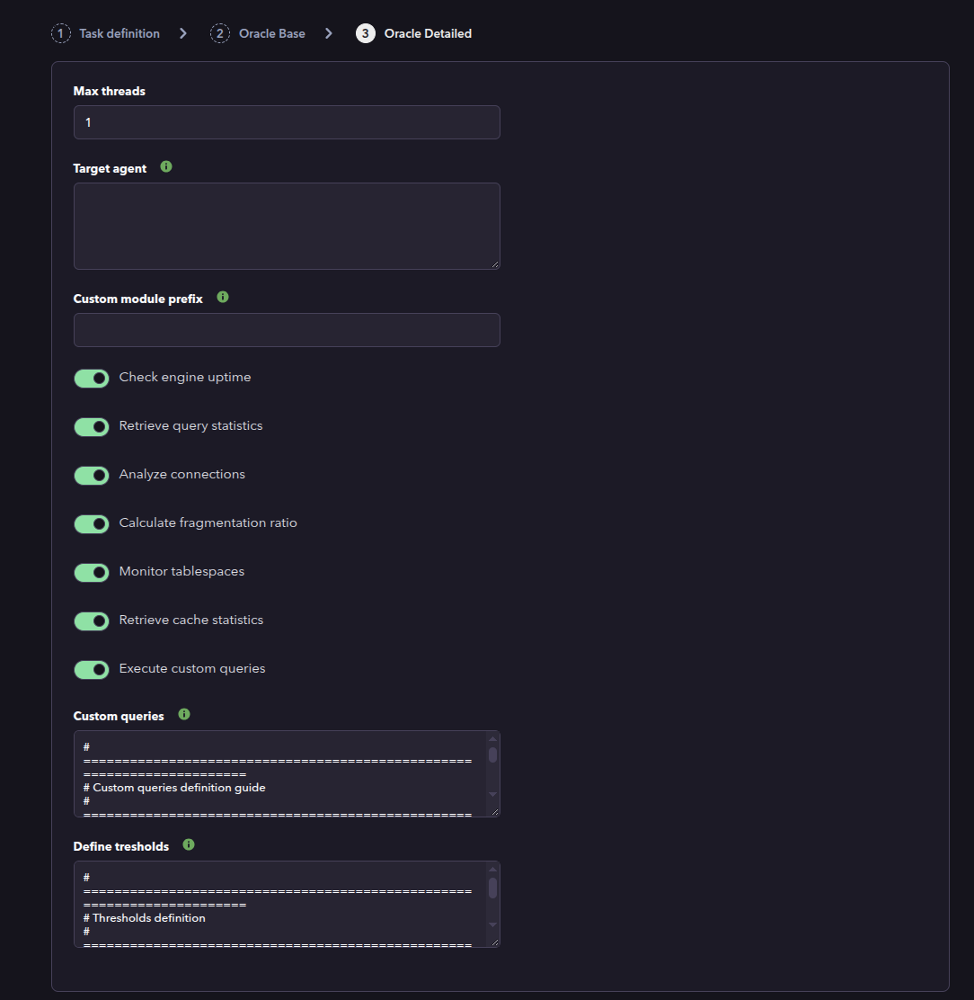
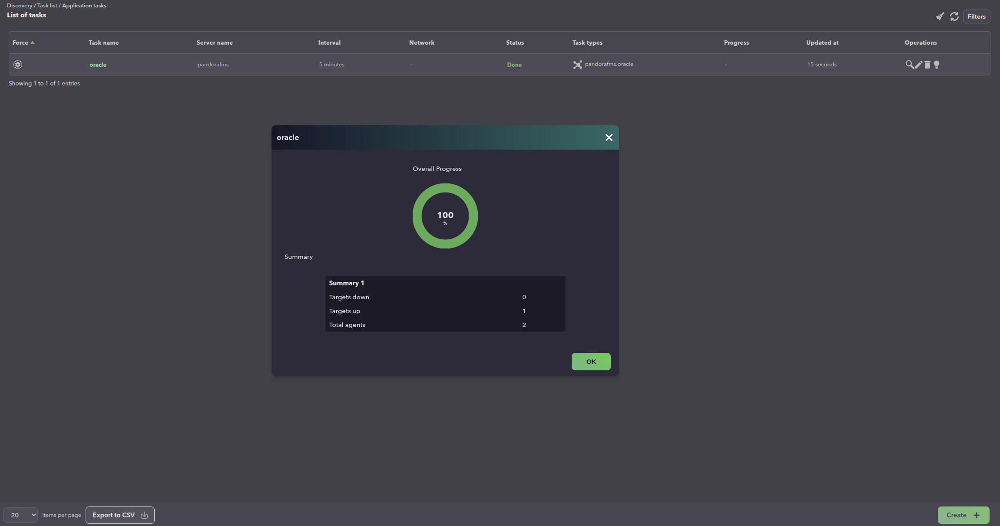
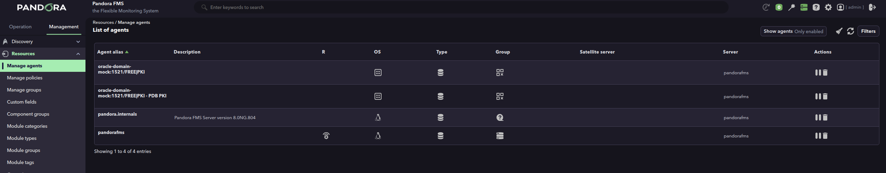
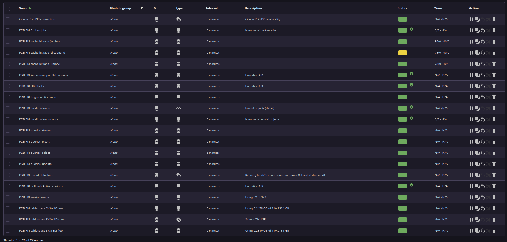

# Oracle Discovery

*Article last updated: 2026-09-14.*

## What it monitors

The Oracle Discovery plugin monitors Oracle databases by running SQL queries against them and turning the results into Pandora FMS monitoring modules. It collects availability, session and connection usage, query counts, restart detection, tablespace usage and status, fragmentation, cache hit ratios, and any custom SQL query the operator defines.

The plugin creates **one agent per target database**. When the target is an Oracle multitenant container database (CDB), it can additionally discover its pluggable databases (PDBs) and monitor them either inside the container agent or as **one agent per PDB**.

The plugin is designed for use through the Pandora FMS **Discovery** system. It does not generate XML agent files: it returns the discovered agents and modules in the JSON output of the execution, and the Discovery task creates them.

## Prepare

### Compatibility

| Scope | State | Evidence |
|-------|-------|----------|
| Plugin version `1.9` (`pandorafms.oracle`) | Documented target | The version this page describes. See [Plugin identity](#plugin-identity) |
| Oracle multitenant CDB/PDB whose PDB services are registered in the listener under a `db_domain` name | `Tested` | Ticket #24889 verification run: the task completed with `Targets up` and generated the PDB agent and its modules. See [Multitenant PDB service resolution](#multitenant-pdb-service-resolution) |
| Network reachability from the Discovery server to every target database listener | `Required` | The plugin opens a remote Oracle connection per target |
| Oracle Instant Client, when **Thick mode** is enabled | `Required` | Prerequisite, not a compatibility statement. See [Prerequisites](#prerequisites) |
| Oracle Database 11 or earlier | `Not validated` | The official quick guide states thick mode is needed for Oracle 11 and earlier |
| Host operating system running the plugin | `Not validated` | No host operating system has been recorded |
| Oracle Database server versions | `Not validated` | Compatibility was established against the SQL queries and connection contract, not a version matrix |

### Prerequisites

1. **Network connectivity** between the Discovery server and every target database listener.
2. **Pandora FMS**: a Discovery server to run the task, and the console to define it.
3. **A database user** with permission to connect, and with `SELECT` privileges on the views used by the modules you enable.
4. **Oracle Instant Client** installed on the Discovery server, only when **Thick mode** is used.

The plugin is distributed as a self-contained Discovery application: the `.disco` package ships its own executable, so no additional runtime has to be installed for a normal run.

### Grant the required privileges

The connection user needs at least the `CREATE SESSION` privilege:

```sql
GRANT CREATE SESSION TO pandora;
```

Each module reads specific Oracle views. Grant only what the enabled modules need.

| Module group | Oracle views | Grant |
|--------------|--------------|-------|
| Connections (`checkConnections`) | `V$SESSION`, `V$PARAMETER` | `GRANT SELECT ON V_$SESSION TO pandora;`<br>`GRANT SELECT ON V_$PARAMETER TO pandora;` |
| Uptime (`checkUptime`) | `V$SESSION` | `GRANT SELECT ON V_$SESSION TO pandora;` |
| Query statistics (`queryStats`) | `V$SQLSTATS` | `GRANT SELECT ON V_$SQLSTATS TO pandora;` |
| Tablespaces (`checkTablespaces`) | `DBA_TABLESPACE_USAGE_METRICS`, `DBA_TABLESPACES`, and `DBA_DATA_FILES` / `DBA_FREE_SPACE` for the Oracle 10g and earlier fallback | `GRANT SELECT ON DBA_TABLESPACE_USAGE_METRICS TO pandora;`<br>`GRANT SELECT ON DBA_TABLESPACES TO pandora;`<br>`GRANT SELECT ON DBA_DATA_FILES TO pandora;`<br>`GRANT SELECT ON DBA_FREE_SPACE TO pandora;` |
| Fragmentation (`checkFragmentation`) | `DBA_TABLES` | `GRANT SELECT ON DBA_TABLES TO pandora;` |
| Cache (`checkCache`) | `V$LIBRARYCACHE`, `V$ROWCACHE`, `V$SYSSTAT` | `GRANT SELECT ON V_$LIBRARYCACHE TO pandora;`<br>`GRANT SELECT ON V_$ROWCACHE TO pandora;`<br>`GRANT SELECT ON V_$SYSSTAT TO pandora;` |
| Multitenant PDB discovery (`multitenant`) | `V$PDBS` and `V$ACTIVE_SERVICES` | `GRANT SELECT ON V_$PDBS TO pandora;`<br>`GRANT SELECT ON V_$ACTIVE_SERVICES TO pandora;` |
| Database version | `PRODUCT_COMPONENT_VERSION` | `GRANT SELECT ON PRODUCT_COMPONENT_VERSION TO pandora;` |
| Custom queries | Depends on the query | Grant `SELECT` on any table or view the custom queries reference |

> Version `1.9` reads `V$ACTIVE_SERVICES` to resolve the listener service name of each PDB. Without this grant the multitenant PDB discovery query fails and no PDB is monitored.

For convenience, `SELECT_CATALOG_ROLE` covers most `V$` and `DBA_` views:

```sql
CREATE USER pandora IDENTIFIED BY <PASSWORD>;
GRANT CREATE SESSION TO pandora;
GRANT SELECT_CATALOG_ROLE TO pandora;
```

When multitenant monitoring is used, the user must also be able to connect to **each PDB** and hold the module grants inside it:

```sql
ALTER SESSION SET CONTAINER = <PDB_NAME>;
GRANT CREATE SESSION TO pandora;
-- Repeat the module grants inside the PDB.
```

### Install the plugin

Load the `.disco` package for `pandorafms.oracle` from the Pandora FMS Marketplace:

[https://marketplace.pandorafms.com/entries/pandorafms.oracle](https://marketplace.pandorafms.com/entries/pandorafms.oracle)

Once loaded, the **Oracle** application is available when creating Discovery tasks.

## Configure the Discovery task

Create the task from **Management → Discovery → Applications → Oracle**. The console presents the fields in two steps: **Oracle Base** and **Oracle Detailed**. Every field is documented in [Task parameters](#task-parameters).

1. **Oracle Base** — the targets and how to reach them:

    - **Oracle target strings**: one or more Oracle targets, separated by commas or one per line. Each line creates one agent. See [Target strings](#target-strings).
    - **User** and **Password**: credentials used for every target in the task.
    - **Thick mode** and **Client path**: use the Oracle Instant Client; the client path is required when thick mode is enabled.
    - **Multitenant: Discover and monitor PDBs within a CDB**: enables PDB discovery on multitenant architectures.
    - **Create agent per PDB**: creates a separate agent for each discovered PDB instead of adding its modules to the container agent.
    - **Enable entities file re-scan interval** and **Re-scan entities file interval**: keep and periodically refresh the list of discovered PDBs.

    

    In the example above, the target string `oracle-domain-mock:1521/FREE|PKI` monitors the container database `FREE` and restricts multitenant monitoring to the PDB `PKI`.

2. **Oracle Detailed** — monitoring scope and optional shaping:

    - **Max threads**: number of concurrent connections used to monitor the targets.
    - **Target agent**: names to assign to the generated agents, positionally matched with the target strings. Empty means the target string is used as the agent name.
    - **Custom module prefix**: prepended to every generated module name.
    - **Check engine uptime**, **Retrieve query statistics**, **Analyze connections**, **Calculate fragmentation ratio**, **Monitor tablespaces**, **Retrieve cache statistics**: select the module groups to create.
    - **Execute custom queries** and **Custom queries**: run operator-defined SQL and create one module per query.
    - **Define tresholds**: regular-expression thresholds applied to generated modules (except custom-query modules). See [Thresholds](#thresholds).

    

The task's own group and interval, set in the generic task-definition step, become the agent group and the module interval.

## Verify the first run

Force the task from **Management → Discovery → Task list** and check the result in this order.

1. **The task summary.** A completed Oracle task reports:

    - **Total agents**: the number of agents generated by the task.
    - **Targets up**: targets the plugin connected to.
    - **Targets down**: targets it could not connect to.

    With **Create agent per PDB** enabled, `Total agents` includes the container agent plus one agent per monitored PDB.

    

2. **The agents.** One per target string, plus one per PDB when **Create agent per PDB** is enabled. Every PDB agent is named `<container agent> - PDB <pdb name>`.

    

3. **The modules on each agent.** A reachable target produces the availability module and one module per enabled group and discovered resource. The module list of the PDB agent shows the resolved service in the connection module and the `PDB PKI ` prefix on every PDB metric.

    

If the task reports `Targets down` for a target, work back through [Troubleshoot](#troubleshoot).

## Understand the results

### Agents and cardinality

- **One agent per target string.** The agent name is the target string, unless a **Target agent** name is given for that position. The agent's OS is reported as `Oracle` and its OS version as the connected database version.
- **One agent per PDB, optionally.** When **Create agent per PDB** is enabled, each discovered PDB gets its own agent named `<container agent> - PDB <pdb name>` and addressed as `HOST:PORT/<pdb name>`. When it is disabled, each PDB's modules are added to the container agent with a `PDB <pdb name> ` prefix.

### Module groups

A reachable target always produces the availability module `<prefix>Oracle connection`, with value `1` when the connection succeeded and `0` when it did not.

| Group | Modules | Type | Notes |
|-------|---------|------|-------|
| Availability | `<prefix>Oracle connection` | `generic_proc` | `1` connected, `0` not connected |
| Uptime | `<prefix>restart detection` | `generic_proc` | `0` when the engine restarted within the last two intervals, `1` otherwise |
| Query statistics | `<prefix>queries: select`, `<prefix>queries: insert`, `<prefix>queries: delete`, `<prefix>queries: update` | `generic_data` | Number of statements of each kind active during the last interval |
| Tablespaces | `<prefix>tablespace <name> free` and `<prefix>tablespace <name> status` | `generic_data` (%) and `generic_proc` | Free percentage and `1` when the tablespace is `ONLINE` |
| Connections | `<prefix>session usage` | `generic_data` (%) | Current sessions against the configured maximum |
| Fragmentation | `<prefix>fragmentation ratio` | `generic_data` (%) | Average fragmentation ratio |
| Cache | `<prefix>cache hit ratio (dictionary)`, `<prefix>cache hit ratio (library)`, `<prefix>cache hit ratio (buffer)` | `generic_data` (%) | With default warning/critical thresholds |
| Custom queries | `<prefix><query name>` | Per query | One module per custom query |

The exhaustive inventory, including PDB prefixes and default thresholds, is in [Generated modules](#generated-modules).

### Multitenant PDB service resolution

In Oracle multitenant, a PDB name is not necessarily the service name the listener exposes. A PDB can exist while its listener service is only registered under a qualified name, for example when the database has a `db_domain` configured. Connecting to the PDB name alone then fails with `DPY-6001: Service "..." is not registered with the listener` (equivalent to `ORA-12514`).

Version `1.9` resolves this by discovering the real service names registered for each PDB and trying them in order:

1. The listener service names registered for that PDB.
2. The same service names qualified with the database domain (`db_domain`) when the listener exposes them as fully qualified names.
3. The PDB name itself, as a last resort.

Only when every candidate fails is a warning reported, and (with **Create agent per PDB**) the PDB agent is created with its connection module at value `0`.

The **Oracle target strings** field can restrict which PDBs are monitored by appending `|<pdb>` or `|<pdb1>;<pdb2>;...` to a target, as shown in [Configure the Discovery task](#configure-the-discovery-task).

### Custom queries

Each custom query generates one module on every agent the query applies to. A query can be limited to the container scope (`cdb`), to PDBs (`pdb`), or both (`all`), and can be scheduled with a five-field crontab expression. Scheduled queries keep their last successful execution, so an occurrence that was missed while the plugin was not running is executed on the next task run. See [Custom queries reference](#custom-queries-reference).

## Troubleshoot

The plugin reports its diagnostics in the JSON execution summary printed to standard output: connection warnings, Oracle error codes, and skipped queries are added there.

- **`DPY-6001: Service "..." is not registered with the listener` (or `ORA-12514`)** — the PDB service is not reachable under the name that was tried. Version `1.9` resolves the registered service name and the `db_domain` qualification automatically; if it still fails, verify that the user has `SELECT` on `V$ACTIVE_SERVICES` and that the PDB service is actually registered with the listener.
- **`Targets down` for a target** — the container connection failed. Check network access from the Discovery server, the target string format, and the credentials.
- **No PDBs discovered** — the discovery query failed (often a missing grant on `V$PDBS` or `V$ACTIVE_SERVICES`), or no PDB matches the `|PDB` filter in the target string.
- **A PDB is skipped** — only PDBs in `READ WRITE` open mode are monitored; skipped PDBs are named in the execution summary.
- **`ORA-00942: table or view does not exist`** — the monitoring user lacks `SELECT` on a required view. Grant the privilege for the enabled module group and re-run.
- **`agent_per_pdb` has no effect** — it only applies when **Multitenant** is enabled.
- **An invalid crontab expression is ignored** — a custom query `crontab` must have five fields. An invalid expression produces a warning and the query is skipped.
- **Thick mode fails to start** — **Client path** must point to the Oracle Instant Client libraries installed on the Discovery server.

## Reference

### Task parameters

#### Oracle Base

| Field | Macro | Type | Default | Notes |
|-------|-------|------|---------|-------|
| Oracle target strings | `_dbstrings_` | textarea | — | Mandatory. Comma separated or one per line. `#` comments a line. Each entry creates one agent. See [Target strings](#target-strings) |
| User | `_dbuser_` | string | — | Mandatory. Connection user |
| Password | `_dbpass_` | password | — | Mandatory. Connection password |
| Thick mode | `_thickMode_` | checkbox | off | Use the Oracle Instant Client instead of the default driver mode |
| Client path | `_clientPath_` | string | — | Visible when **Thick mode** is enabled. Path to the Oracle Instant Client libraries |
| Multitenant: Discover and monitor PDBs within a CDB | `_multiTenant_` | checkbox | off | Discovers PDBs on multitenant architectures; harmless warning on non-CDB |
| Create agent per PDB | `_agentPerPdb_` | checkbox | off | Visible when **Multitenant** is enabled. One agent per PDB instead of modules on the container agent |
| Enable entities file re-scan interval | `_enableEntitiesInterval_` | checkbox | off | Visible when **Multitenant** is enabled. Periodically refresh the discovered PDB list |
| Re-scan entities file interval | `_entitiesInterval_` | select | `86400` | Visible when **Enable entities file re-scan interval** is enabled. Refresh interval, in the intervals offered by the selector |

#### Oracle Detailed

| Field | Macro | Type | Default | Notes |
|-------|-------|------|---------|-------|
| Max threads | `_threads_` | number | `1` | Concurrent monitoring threads |
| Target agent | `_engineAgent_` | textarea | — | Agent names, positionally matched with the target strings. Empty uses the target string |
| Custom module prefix | `_prefixModuleName_` | string | — | Prepended to every generated module name |
| Check engine uptime | `_checkUptime_` | checkbox | on | Creates the restart detection module |
| Retrieve query statistics | `_queryStats_` | checkbox | off | Creates the `queries:` modules |
| Analyze connections | `_checkConnections_` | checkbox | on | Creates the session usage module |
| Calculate fragmentation ratio | `_checkFragmentation_` | checkbox | on | Creates the fragmentation ratio module |
| Monitor tablespaces | `_checkTablespaces_` | checkbox | on | Creates the tablespace free and status modules |
| Retrieve cache statistics | `_checkCache_` | checkbox | on | Creates the cache hit ratio modules |
| Execute custom queries | `_executeCustomQueries_` | checkbox | on | Enables the custom queries block |
| Custom queries | `_customQueries_` | textarea | — | Visible when **Execute custom queries** is enabled. See [Custom queries reference](#custom-queries-reference) |
| Define tresholds | `_configTresholds_` | textarea | — | Visible always. See [Thresholds](#thresholds) |

### Target strings

The **Oracle target strings** field accepts one target per line or comma separated. Blank lines and lines starting with `#` are ignored. Each target can use any of these formats:

```
HOST/SID
HOST:PORT/SID
HOST:PORT/SERVICE_NAME
dsn=(DESCRIPTION=(ADDRESS=(PROTOCOL=TCP)(HOST=<HOST>)(PORT=1521))(CONNECT_DATA=(SID=<SID>)))
```

When the port is omitted, `1521` is used.

A full DSN string can also describe a failover configuration with several addresses:

```
dsn=(DESCRIPTION=(FAILOVER=ON)(ADDRESS_LIST=(ADDRESS=(PROTOCOL=TCP)(HOST=<HOST_1>)(PORT=1521))(ADDRESS=(PROTOCOL=TCP)(HOST=<HOST_2>)(PORT=1521)))(CONNECT_DATA=(SID=<SID>)))
```

When the target is a multitenant container and **Multitenant** is enabled, a PDB filter can be appended with `|`:

```
HOST:PORT/SERVICE_NAME|PDB1
HOST:PORT/SERVICE_NAME|PDB1;PDB2
```

Without a filter, every eligible PDB is monitored.

### Configuration file

A Discovery task builds this file from its own fields. A manual run supplies it with `--conf`.

| Key | Description |
| --- | --- |
| `agents_group_id` | Group id assigned to the generated agents |
| `interval` | Agent and module interval in seconds |
| `user` | Connection user |
| `password` | Connection password |
| `thick_mode` | `1` enables thick mode |
| `client_path` | Path to the Oracle Instant Client libraries; used with thick mode |
| `threads` | Number of concurrent monitoring threads |
| `modules_prefix` | Prefix for generated module names |
| `multitenant` | `1` discovers and monitors PDBs |
| `agent_per_pdb` | `1` creates one agent per PDB; requires `multitenant=1` |
| `execute_custom_queries` | `1` runs custom queries |
| `analyze_connections` | `1` creates the session usage module |
| `engine_uptime` | `1` creates the restart detection module |
| `query_stats` | `1` creates the query statistics modules |
| `cache_stats` | `1` creates the cache hit ratio modules |
| `fragmentation_ratio` | `1` creates the fragmentation ratio module |
| `check_tablescpaces` | `1` creates the tablespace modules |
| `entities_list` | Path of the file where discovered PDBs are stored |
| `enable_entities_interval` | `1` enables the PDB list re-scan |
| `entities_interval` | Re-scan interval in seconds |
| `cron_state_dir` | Directory where the last successful execution of scheduled custom queries is stored |

Example:

```ini
[CONF]
agents_group_id=10
interval=300
user=<USERNAME>
password=<PASSWORD>
thick_mode=0
multitenant=1
agent_per_pdb=1
execute_custom_queries=1
analyze_connections=1
engine_uptime=1
query_stats=0
cache_stats=1
fragmentation_ratio=1
check_tablescpaces=1
```

### Command-line execution

The plugin can be executed by hand, which is the fastest way to confirm a target and its credentials before wiring it into a task.

```bash
./pandora_oracle \
    --conf <PATH_TO_CONFIG> \
    --target_databases <PATH_TO_TARGETS> \
    [ --target_agents <PATH_TO_AGENT_NAMES> ] \
    [ --custom_queries <PATH_TO_CUSTOM_QUERIES> ]
```

| Parameter | Description |
| --- | --- |
| `--conf` | Path to the configuration file |
| `--target_databases` | Path to the file containing the target databases |
| `--target_agents` | Path to the file containing the agent names, positionally matched with the targets |
| `--custom_queries` | Path to the file containing the custom queries |

The run returns a JSON summary of the execution. The collected data is exposed in the summary's `monitoring_data` field for the Discovery server to consume.

### Custom queries reference

Each custom query is a block delimited by `check_begin` and `check_end`. Only `SELECT` statements are allowed.

| Key | Description |
| --- | --- |
| `name` | Module name. Mandatory |
| `description` | Module description |
| `target` | SQL query to execute. Mandatory. Only `SELECT` statements are accepted |
| `target_databases` | Comma-separated target strings (or PDB names) the query applies to. `all` or empty applies it everywhere |
| `target_scope` | `cdb`, `pdb` or `all`. Default `cdb`. `pdb` requires multitenant monitoring |
| `operation` | `value` returns a single value; `full` returns all rows as a string |
| `datatype` | `generic_data`, `generic_data_string` or `generic_proc`. `full` operations are forced to `generic_data_string` |
| `min_warning`, `max_warning` | Warning thresholds |
| `min_critical`, `max_critical` | Critical thresholds |
| `warning_inverse`, `critical_inverse` | Set to `1` to invert the corresponding threshold interval |
| `str_warning`, `str_critical` | String thresholds |
| `module_interval` | Module interval as a multiplier of the agent interval |
| `crontab` | Five-field cron expression. When present, the query only runs when an occurrence is due |

Example:

```
check_begin
name Invalid objects count
description Number of invalid objects
operation value
datatype generic_data
min_warning 5
target SELECT COUNT(*) FROM ALL_OBJECTS WHERE STATUS != 'VALID'
target_scope all
check_end
```

The console ships a commented guide with the field, and a set of example queries, as the default content of the **Custom queries** textarea.

### Thresholds

The **Define tresholds** field applies thresholds to the generated modules by module name, except custom-query modules. One definition per line, with a regular expression matching the module name and the thresholds separated by `|`:

```
<REGEX> = <threshold>|<threshold>|...
```

Example:

```
^tablespace = min_warning 10|max_warning 20|min_critical 0|max_critical 10
```

### Generated modules

All module names carry the **Custom module prefix** when one is set. Modules created for a PDB keep the container prefix and add a `PDB <pdb name> ` segment.

#### Container agent

| Module | Type | Group | Enabled by |
|--------|------|-------|------------|
| `<prefix>Oracle connection` | `generic_proc` | Availability | Always |
| `<prefix>restart detection` | `generic_proc` | Uptime | Check engine uptime |
| `<prefix>queries: select` | `generic_data` | Query statistics | Retrieve query statistics |
| `<prefix>queries: insert` | `generic_data` | Query statistics | Retrieve query statistics |
| `<prefix>queries: delete` | `generic_data` | Query statistics | Retrieve query statistics |
| `<prefix>queries: update` | `generic_data` | Query statistics | Retrieve query statistics |
| `<prefix>tablespace <name> free` | `generic_data` | Tablespaces | Monitor tablespaces |
| `<prefix>tablespace <name> status` | `generic_proc` | Tablespaces | Monitor tablespaces |
| `<prefix>session usage` | `generic_data` | Connections | Analyze connections |
| `<prefix>fragmentation ratio` | `generic_data` | Fragmentation | Calculate fragmentation ratio |
| `<prefix>cache hit ratio (dictionary)` | `generic_data` | Cache | Retrieve cache statistics |
| `<prefix>cache hit ratio (library)` | `generic_data` | Cache | Retrieve cache statistics |
| `<prefix>cache hit ratio (buffer)` | `generic_data` | Cache | Retrieve cache statistics |
| `<prefix><query name>` | Per query | Custom queries | Execute custom queries |

The cache hit ratio modules carry default thresholds:

| Module | `max_warning` | `max_critical` |
|--------|---------------|----------------|
| `cache hit ratio (dictionary)` | `98` | `40` |
| `cache hit ratio (library)` | `98` | `40` |
| `cache hit ratio (buffer)` | `89` | `40` |

#### PDB modules (Create agent per PDB disabled)

The same modules as the container agent, with `PDB <pdb name> ` inserted after the custom prefix, for example `<prefix>PDB <pdb name> tablespace <name> free`.

#### PDB agent (Create agent per PDB enabled)

Each PDB agent is named `<container agent> - PDB <pdb name>` and addressed as `HOST:PORT/<pdb name>`. It contains:

- `<prefix>Oracle PDB <pdb name> connection` (availability)
- Every enabled module group, prefixed with `PDB <pdb name> `
- The custom queries whose scope applies to PDBs

### Plugin identity

| Field | Value |
|-------|-------|
| App short name | `pandorafms.oracle` |
| Plugin version | `1.9` |
| Type | Discovery application (`.disco`) |
| Section | Discovery → Applications |
| Availability | Pandora FMS Marketplace (`pandorafms.oracle`) |
