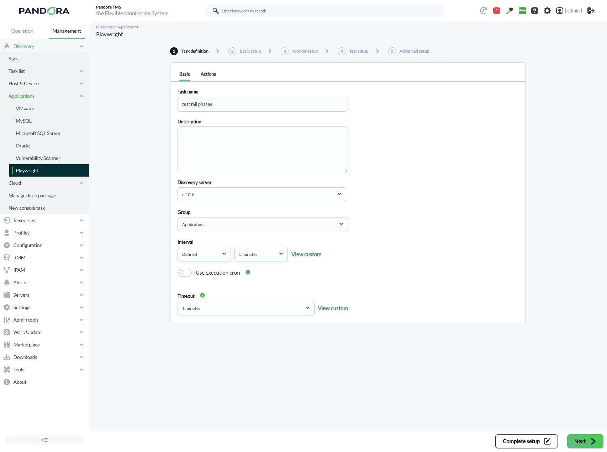
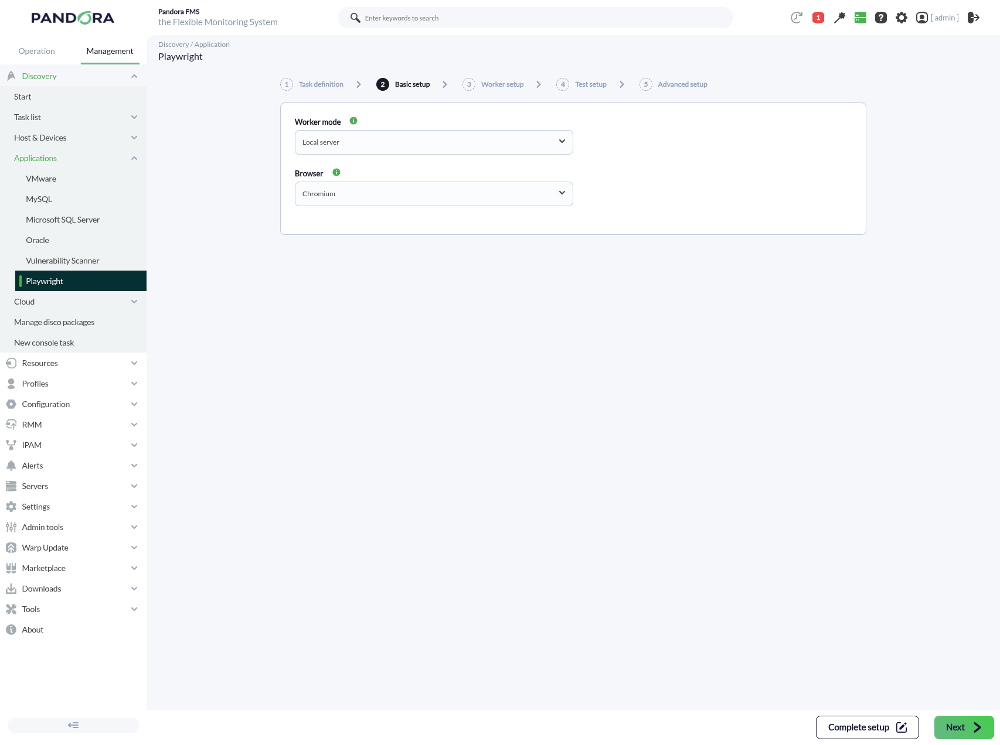
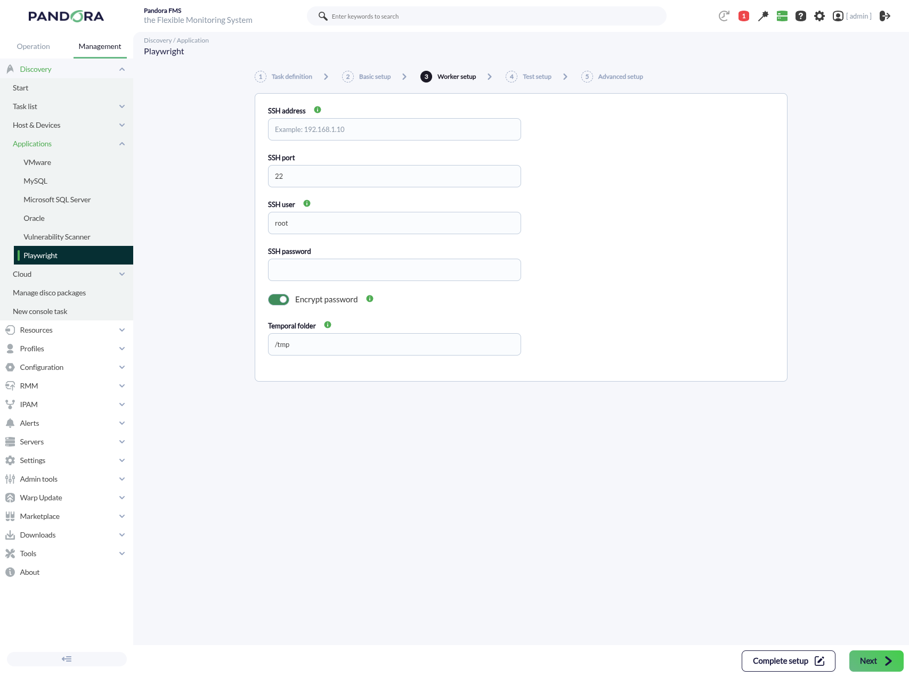
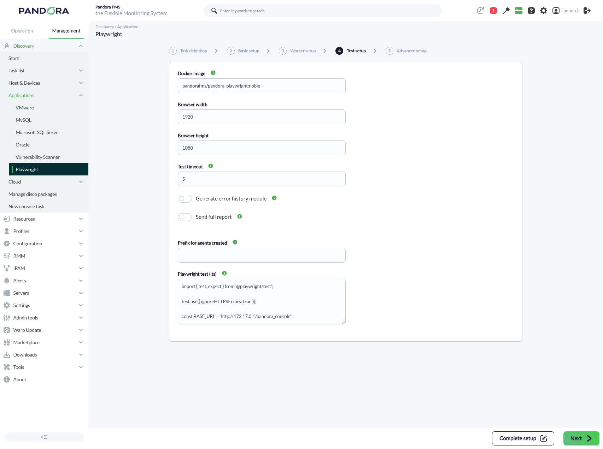
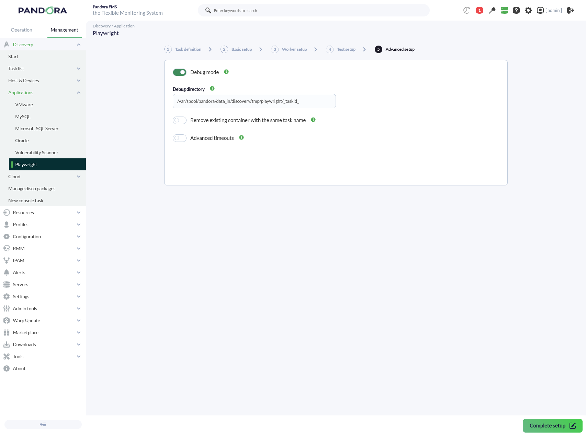
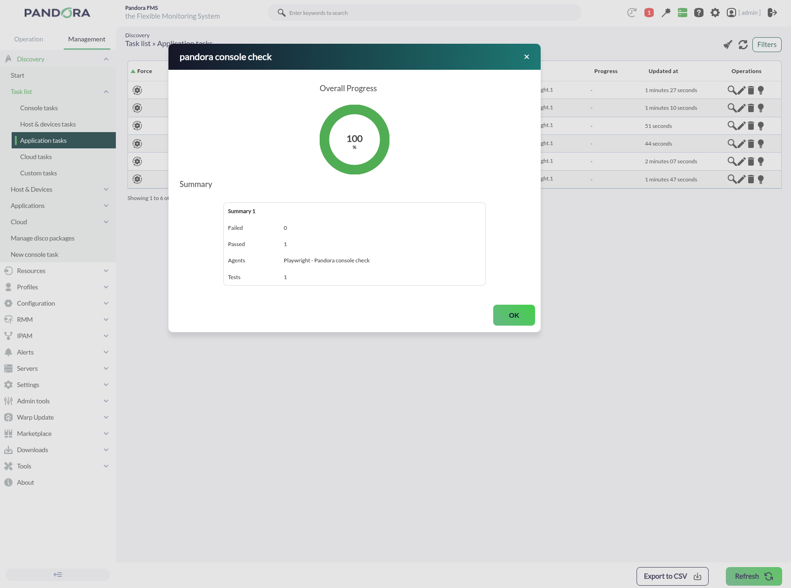
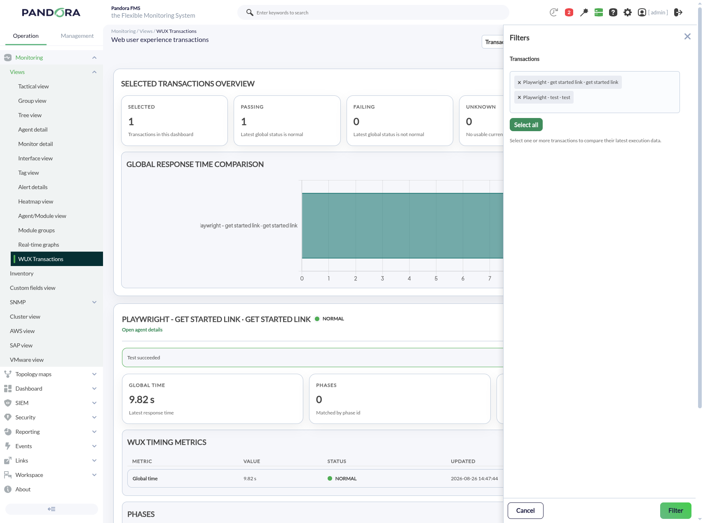
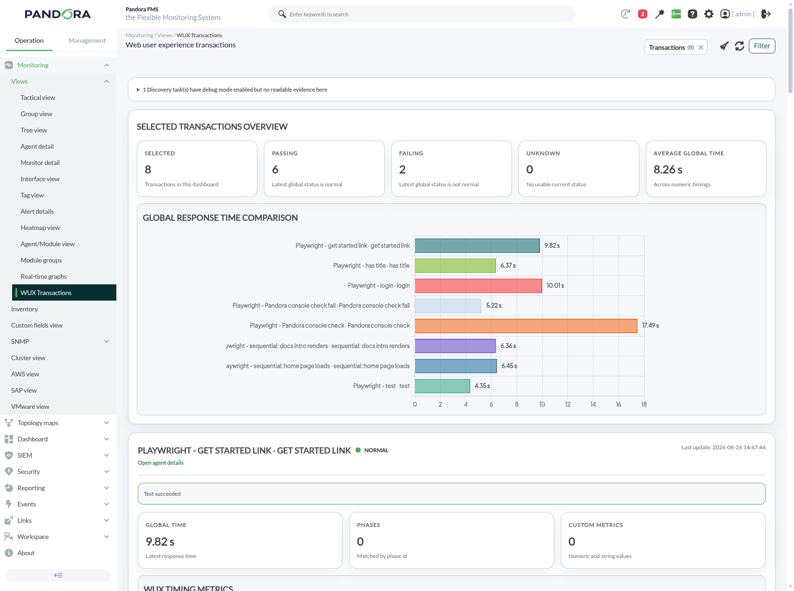
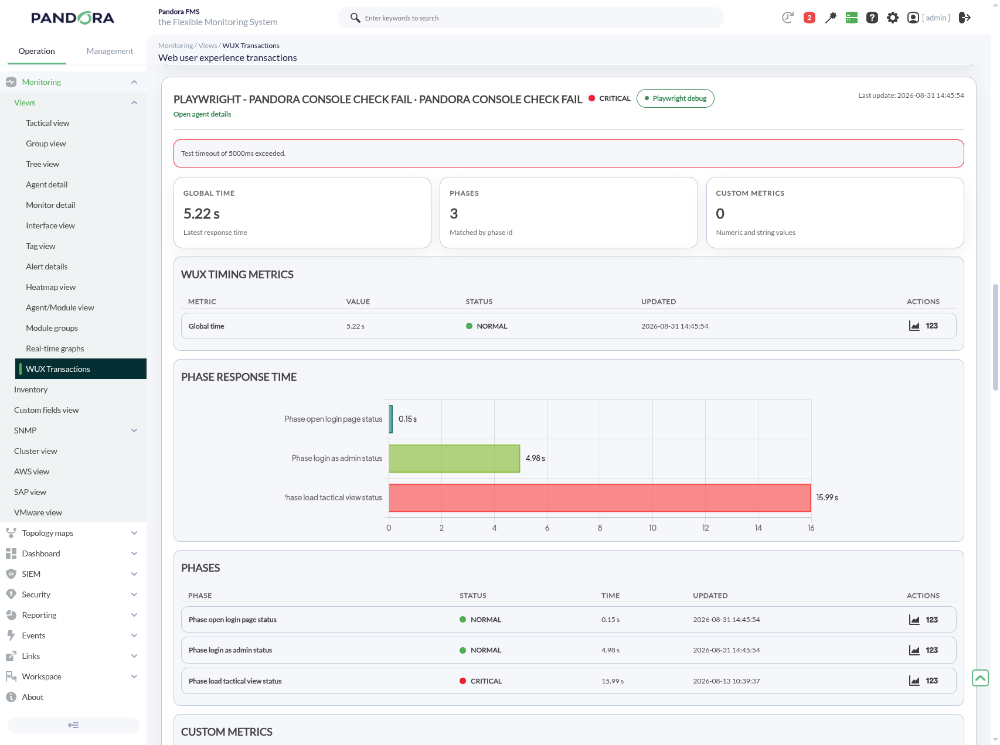
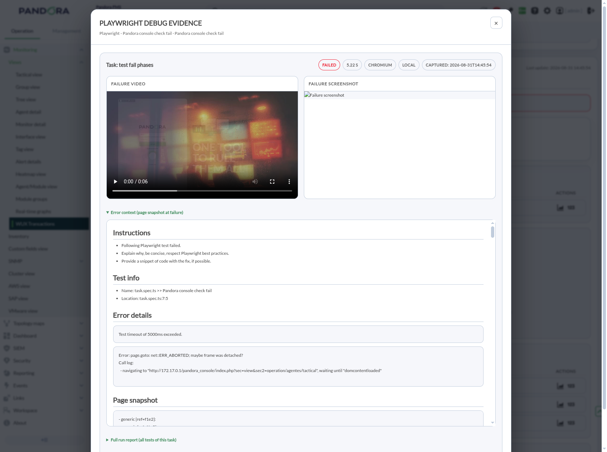

# Playwright

*Article last updated: 2026-09-01.*

## What it monitors

The Playwright Discovery plugin provides synthetic web monitoring with [Playwright](https://playwright.dev/): you supply a single Playwright `.ts` test, the plugin runs it inside a preconfigured Docker container (locally or on a remote host over SSH) and turns the result into Pandora FMS monitoring modules that plug into the console's WUX transactional view — global status and time, per-phase status and time, error screenshot and custom metrics.

The execution model is built around Playwright's native behavior:

1. The Discovery task (or a manual CLI run) launches a Docker container from the Playwright image (`pandorafms/pandora_playwright:noble`).
2. The `.ts` test is copied into the container and executed with `npx playwright test --reporter=json`.
3. The plugin reads the JSON reporter and builds **one agent per Playwright `test(...)`**, with modules for the overall status and time, each `test.step` as a phase, an error screenshot on failure, and any custom metrics.
4. Results are returned as Discovery monitoring data, or (with `-x`) sent as agent XML via Tentacle.

It is the Playwright counterpart of `pandorafms.selenium.4`, but there is **no custom library to import and no DSL to learn**: you write standard Playwright code and the plugin harvests everything from Playwright's JSON reporter. Execution is always in Docker; with `worker_mode = remote` the container runs on a remote host reached over SSH.

## Prepare

### Compatibility

| Scope | State | Evidence |
|-------|-------|----------|
| Plugin version `1.0` (`pandorafms.playwright.1`) | Documented target | The version this page describes. See [Plugin identity](#plugin-identity) |
| Playwright runtime **1.62.0** on Node 24 | `Tested` | Runtime the plugin was validated against |
| Docker image `pandorafms/pandora_playwright:noble` (Ubuntu 24.04 base, browsers preinstalled) | `Tested` | Default value of the **Docker image** field |
| Browsers Chromium, Mozilla Firefox and WebKit | `Tested` | The three values of the **Browser** field |
| Worker modes `local` and `remote` (SSH) | `Tested` | Both execution paths exercised end to end |
| Pandora FMS server and console **800.5 LTS** and **804 FR** | `Tested` | End-to-end run against a real Tentacle, with the WUX transactional view rendered in the console |
| Docker on the host that runs the test | `Required` | Prerequisite, not a compatibility statement. See [Prerequisites](#prerequisites) |
| Any other Pandora FMS server version | `Not validated` | No evidence for a per-version matrix beyond the versions above |
| Docker host operating system other than Linux | `Not validated` | The image is Ubuntu 24.04 based; the host operating system used in testing was Linux |

### Prerequisites

1. **Docker** on the machine that runs the test: the Discovery server itself for `worker_mode = local`, or the SSH target for `worker_mode = remote`.
2. **The Playwright Docker image** `pandorafms/pandora_playwright:noble` available on that machine (browsers preinstalled), pulled from the registry:

    ```bash
    docker pull pandorafms/pandora_playwright:noble
    ```

    This is the recommended way to get it. To layer your own dependencies on top, see [Use a custom Docker image](#use-a-custom-docker-image).

3. **Pandora FMS**: a Discovery server enabled (`discoveryserver 1` in `pandora_server.conf`) to execute tasks, and the console to define them.
4. **Remote worker only** (`worker_mode = remote`): an SSH account on the remote host that can run Docker (address, port, user, and password or encrypted password).

    The **SSH user** field defaults to `root`. Root is not required by the plugin: any account that can run `docker` on that host works, so prefer a dedicated unprivileged account added to the group that grants Docker access. Note that such access is equivalent to administrative access on that host.

The plugin is distributed as a self-contained executable: the packaged Discovery app ships `bin/pandora_playwright`, so no additional runtime has to be installed, on the Discovery server or for a manual CLI run.

### Install the plugin

The plugin is installed from the Discovery plugin store. There are **two copies** on disk:

- `<homedir>/attachment/discovery/pandorafms.playwright.1/` — used by the console for the task form.
- `<remote_config>/discovery/pandorafms.playwright.1/`, usually `/var/spool/pandora/data_in/discovery/pandorafms.playwright.1/` — **the copy the Discovery server executes**.

Updating only the first copy silently keeps the old build running on the Discovery server.

## Configure

Configuring a monitored transaction is two things: creating the Discovery task, and writing the Playwright test it runs. Start with the task, so you can see where every field lives; [Write the Playwright transaction](#write-the-playwright-transaction) covers the test you paste into it.

### Create the Discovery task

A task is created in the console as a Discovery task of the **Playwright** app:

1. Go to **Discovery → Tasks → New task**, pick the Playwright app and set the task name, group, server and interval — the wizard's own generic **Task definition** step.

    

2. Walk the wizard steps: **Basic setup** (worker mode, browser), **Worker setup** (only for `remote`), **Test setup** (image, viewport, timeout, full report, agent prefix, the Playwright test itself, error history module) and **Advanced setup** (debug mode, debug directory, advanced timeouts, remove existing container). Every field is documented in [Task parameters](#task-parameters).

    

    

    

    

3. Paste the full `.ts` into the **Playwright test (.ts)** field, pick the browser and worker mode, and save. If you do not have the test yet, write it first — see [Write the Playwright transaction](#write-the-playwright-transaction).

The SSH password can be stored encrypted: the console calls the `password_encrypter` binary (AES-256-CBC) when **Encrypt password** is on, which is the default.

### Write the Playwright transaction

A "transaction" is just a standard Playwright test. You write plain Playwright — no Pandora FMS import required — and the plugin maps three native constructs:

| You write | Becomes |
|-----------|---------|
| `test.step('name', ...)` | a monitored **phase** (status + time) |
| `test.info().annotations.push({ type: 'pandora.metric', description: 'name=value' })` | a custom **metric** module |
| a failing assertion | the test fails; a **screenshot** is captured automatically |

To get the starting code for the flow, record it with any of the tools below, or have a coding agent write it against the live target.

#### Record with Playwright codegen

On any machine with Playwright installed, launch the recorder against your site (see the [Playwright test generator](https://playwright.dev/docs/codegen-intro)):

```bash
npx playwright codegen https://your-app.example.com
```

Click through your flow in the browser; Playwright writes the equivalent code. Copy that code as the starting point.

#### Record with the Playwright VS Code extension

Install the **Playwright Test for VS Code** extension by Microsoft ([Visual Studio Marketplace](https://marketplace.visualstudio.com/items?itemName=ms-playwright.playwright); requires Playwright v1.38+ in your project). Open the **Test Explorer** sidebar and use the recorder tools:

- **Record new**: opens a browser window where you navigate and interact with the site; the generated test is written into a new `.spec.ts` file in real time.
- **Record at cursor**: inserts newly recorded actions at the current cursor position inside an existing test.
- **Pick locator**: hover over an element in the browser and click to copy its best locator to the clipboard.

The extension works on a Playwright project, so record into any throwaway project and copy the resulting `.ts` as your starting point.

#### Record with the Playwright browser extension

Install **Playwright CRX** from the [Chrome Web Store](https://chromewebstore.google.com/detail/playwright-crx/jambeljnbnfbkcpnoiaedcabbgmnnlcd) (community extension by ruifigueira). It bundles the same recorder used by `playwright codegen` as a browser extension, so you can record directly in your own Chrome/Chromium/Edge:

- Attach the current tab with the extension button (or the context menu), or use the side panel; `Alt + Shift + R` starts recording and `Alt + Shift + C` starts inspecting.
- Perform the flow in the page; the recorder generates the Playwright code, in the selected language.
- Copy or export the generated script and use it as your starting point.

#### Generate the transaction with an AI coding agent

Instead of hand-writing the `.ts` transaction (or recording it once and hoping the selectors hold), you can have a local coding agent — Claude Code, opencode, `pi`, or similar — drive a real browser through the flow and write the transaction for you, validating every locator against the live target before handing it over.

This works because these agents can use a **Playwright CLI/browser-automation skill** (a tool that opens a real browser, clicks, fills, and reads the DOM under agent control) to actually execute the flow step by step, not just guess selectors from a screenshot. A recorder records literal actions but has no way to know which element grouping is unique, whether a badge or status text repeats elsewhere, or whether the real DOM text matches what CSS makes it *look* like; an agent that can re-run each locator against the live page, see a strict-mode violation, and fix the scope before delivering the file catches exactly the class of bug that makes a transaction flaky in production.

Prompt template:

```
Validate [FLOW NAME] on [URL] and write it as a Playwright transaction for the
pandorafms.playwright.1 plugin.

What the transaction should check:
- [step 1, e.g. "open the page and confirm the title"]
- [step 2, e.g. "log in and confirm the dashboard loads"]
- [step 3, e.g. "read a value and publish it as a pandora.metric"]

Deliverable:
- Plain Playwright: wrap each meaningful step in `test.step('name', ...)` so it
  becomes a WUX phase, and use
  `test.info().annotations.push({ type: 'pandora.metric', description: 'name=value' })`
  for anything that should become a custom metric module.
- No Pandora FMS import, no DSL - this plugin harvests everything from
  Playwright's own JSON reporter.
- Validate every locator against the real target yourself (drive the browser,
  don't just infer from a snapshot) before handing me the file - fix anything
  ambiguous or strict-mode-violating first.
- If a later step depends on a hard assertion in an earlier step, tell me
  whether to keep it that way or switch to `expect.soft()` so every phase gets
  measured even when one fails.
```

Never put real credentials in the prompt or in the delivered file: use a test account, and treat whatever you paste into the task as stored task configuration.

#### Structure it into phases and add metrics

Whichever way you produced the flow, wrap each meaningful part in `test.step(...)` so it becomes a phase, and add assertions to actually validate the result:

```typescript
import { test, expect } from '@playwright/test';

test('checkout flow', async ({ page }) => {
  await test.step('open home', async () => {
    await page.goto('https://your-app.example.com');
    await expect(page).toHaveTitle(/Shop/);
  });

  await test.step('login', async () => {
    await page.fill('#user', '<USERNAME>');
    await page.fill('#password', '<PASSWORD>');
    await page.click('#submit');
    await expect(page.locator('.dashboard')).toBeVisible();
  });

  await test.step('add to cart', async () => {
    await page.click('text=Add to cart');
    const count = await page.locator('.cart-count').innerText();
    // publish a custom metric module:
    test.info().annotations.push({ type: 'pandora.metric', description: `cart_items=${count}` });
  });
});
```

Only the test's **top-level** `test.step` calls become phases — the plugin reads the top-level `steps` array of Playwright's JSON reporter, so a step nested inside another step is not reported as a separate phase. Keep steps flat (one level) for anything you want to see as an independent phase in the console.

Metrics are parsed from the annotation with these exact rules:

- `type` must be the literal string `pandora.metric`; anything else is ignored.
- `description` must be `name=value`, split on the **first** `=` only — so a value containing `=` (for example a URL query string) is not truncated.
- `name` and `value` are trimmed of surrounding whitespace. If `description` has no `=`, or `name` is empty after trimming, that annotation is silently skipped.
- The module type is inferred from the value: parses as a number → `generic_data`; anything else → `generic_data_string`. The module is named exactly `name` and tagged `extra_data = pw:metric:<name>`.

Writing tips:

- **Naming**: the module names come from your `test.step` titles, so keep them descriptive (`'login'`, `'add to cart'`). Renaming a test starts a new agent.
- **Continue after a failure**: with a normal `expect`, a failed phase aborts the test and later phases do not run. If you want every phase measured even when one fails, use soft assertions: `await expect.soft(locator).toHaveText('x')`.
- **Multiple transactions**: several `test(...)` blocks in one `.ts` produce several agents. See [Multiple tests in one file](#multiple-tests-in-one-file).
- **Recorded code is a starting point, not the deliverable**: review the recorded locators against the live page before wiring it into a Discovery task.
- **Credentials**: the test content is stored with the task. Use dedicated monitoring accounts with the least privilege the flow needs.

## Verify the first run

Force the task from **Discovery → Task list → Application tasks** and check the result in this order.

1. **The task summary.** The console shows an execution summary with the overall progress and pass/fail count:

    

2. **The agents.** One agent per `test(...)` in your file, with the alias `Playwright - <test title>` (prefixed when **Prefix for agents created** is set).

3. **The modules on each agent.** A successful run produces at least:

    | Module | Expected value on a passing test |
    |--------|----------------------------------|
    | `Global status` | `1` (a failing test reports `0`) |
    | `Global time` | The test duration in seconds |
    | `Phase <name> status` / `Phase <name> time` | One pair per top-level `test.step` |
    | `Last error screenshot` | `None` on success; a `data:image/png;base64,...` value on failure |
    | `<metric name>` | The value published by each `pandora.metric` annotation |

4. **The WUX transactional view.** Open the agent in the console and confirm the transactional view lists the phases and that `Last error screenshot` renders as an image rather than as text. The dedicated view is described in [WUX Transactions console extension](#wux-transactions-console-extension).

If nothing is produced, run the same configuration manually with `-v` to see the step-by-step trace — see [Command-line execution](#command-line-execution) — and then [Troubleshooting](#troubleshooting).

## Understand the results

### Agents and modules generated

**One agent per Playwright `test(...)`.** The agent name is `a + md5(<agent prefix> + <full title>)`, where the full title is the `describe > test` path and the prefix is the optional **Prefix for agents created** field (empty by default). The alias is `Playwright - <agent prefix><full title>`. The name does **not** depend on the task, so deleting and recreating the task reports to the same agent and keeps history.

That task independence has a flip side: **two tasks running a test of the same title report to the same agent**, alternating their data on the same modules. When that is not what you want — typically the same transaction pointed at two environments — give each task its own prefix (for example `prod-`, `dev-`) to split them into separate agents. Leaving it empty reproduces the original naming exactly, so existing agents are never orphaned by an upgrade.

| Module | Type | Source | `extra_data` |
|--------|------|--------|--------------|
| `Global status` | `generic_proc` | test result (`passed` → 1) | `wux:global_status:<test>` |
| `Global time` | `generic_data` (s) | test duration | `wux:global_time:<test>` |
| `Phase <name> status` | `generic_proc` | each `test.step` | `wux:phase_status:<n>:<test>` |
| `Phase <name> time` | `generic_data` (s) | each `test.step` duration | `wux:phase_time:<n>:<test>` |
| `Last error screenshot` | `generic_data_string` (image) | screenshot on failure | `wux:error_screenshot:<test>` |
| `Global error` | `generic_data_string` | `OK` or the test's error text (with **Generate error history module** on) | `wux:global_error:<test>` |
| `Phase <name> error` | `generic_data_string` | `OK` or the phase's error text (with **Generate error history module** on) | `wux:phase_error:<n>:<test>` |
| `<metric name>` | `generic_data` / `generic_data_string` | `pandora.metric` annotation | `pw:metric:<name>` |
| `Full report` | `async_string` | verbose report derived from the JSON reporter | `pw:full_report` |

The `wux:*` modules render in the console's WUX transactional view. `pw:*` modules are regular agent modules (metrics and the full report).

### WUX Transactions console extension

The plugin ships a companion console extension, **WUX Transactions** (`wux_transactions_ext`), which registers a **"WUX Transactions"** option in the operation menu (under the section that hosts monitoring/state views) and renders the view identified by the "Monitoring → Views → WUX Transactions" breadcrumb. Opening it requires the user to hold at least one of the **AR** or **RR** ACLs; the extension also applies group ACL (AR over the module's group) to everything it lists.

The view provides the transactional monitoring layer for WUX data:

- **Transactions are discovered from module `extra_data`.** The extension lists every module whose `extra_data` starts with `wux:global_status:` (the WUX agent's own `extra_data` is empty, so module markers are the source of transactions). A multi-select filter ("Select transactions") picks one or more transactions to compare their latest execution data.

    

- **Overview cards** aggregate the selected transactions: Selected / Passing / Failing / Unknown counts and the Average global time. When several Discovery tasks report to the same transaction, a "Shared transactions" warning is shown (for tasks with debug mode enabled, which is all the extension can detect); the recommended fix is a different agent prefix per task.

    

- **Per-transaction panels** show the global status and time, the phases table (Phase, Status, Time, Updated, plus module graph and detail actions), WUX timing metrics, custom metrics (`pw:metric` values emitted by the test), and the evidence block: **Last error screenshot** (when the module holds a valid `data:image/...` value) and the **Full WUX report** when **Send full report** is on.

    

- **Playwright debug evidence**: for tasks of the app `pandorafms.playwright.1` with Debug mode enabled, the extension reads the task's **Debug directory** field from `tdiscovery_apps_tasks_macros`, substitutes the task ID placeholder with `md5(id_rt)` exactly like the runner does, reads the `manifest.json` left by the last run and indexes it by agent name. A "Playwright debug" button on the transaction panel opens a modal with one block per task run: Passed/Failed tag, capture timestamp, **failure video** (webm), **failure screenshot** (png), **error context** (markdown page snapshot at failure), the full run report and the Playwright API transaction log (`pw:api`). Artifacts are streamed through an endpoint that only serves the whitelisted kinds (screenshot, video, error context), enforces group ACL and is never cached.

    

- **No-evidence reporting**: tasks whose evidence cannot be read are listed at the top of the view with the task, its debug directory and the reason — see the four-reason table in [If the console shows no evidence](#if-the-console-shows-no-evidence).

## Operate and troubleshoot

### Timeouts

Playwright has several independent timeouts. **Test timeout** is the one always on the wizard, and it is **not** the per-step timeout most people mean. The three per-step ones are off by default and appear in **Advanced setup** once **Advanced timeouts** is checked; they can also be set in the test file, which always wins.

| Timeout | What it bounds | Where to set it | Value in this plugin |
|---------|----------------|-----------------|----------------------|
| Per-test | one whole `test(...)`, including every `test.step`, action and assertion inside it | task field **Test timeout** → `npx playwright test --timeout=<s × 1000>` | `120` s by default |
| Action | each individual action: `click`, `fill`, `press`, `check`, `selectOption`... | task field **Action timeout**, or the test file | unset → Playwright default `0` (no limit) |
| Navigation | each navigation: `goto`, `waitForURL`, `waitForNavigation`, `reload` | task field **Navigation timeout**, or the test file | unset → Playwright default `0` (no limit) |
| Expect | each web-first assertion: `expect(locator).toBeVisible()`, `toHaveText`... | task field **Expect timeout**, or the test file | unset → Playwright default `5000` ms |
| Container TTL | the whole run inside Docker | derived, not configurable | `min(3600, max(120, <Test timeout> × 20))` → `2400` s by default |
| SSH connect | opening the SSH session (`remote` worker only) | derived, not configurable | `<Test timeout>` → `120` s by default |

With **Advanced timeouts** off, the generated config declares none of the three, so Playwright's own defaults apply and there is exactly one place — the task, or your test — where a value can come from.

#### Test timeout: per test, not per step and not per task

The field maps straight to Playwright's `--timeout`, which is the **budget for one `test(...)` block as a whole**. All of its steps, actions and assertions spend from the same budget.

When a test exceeds it, Playwright aborts **that test only** and marks it `timedOut`: its `Global status` module reports `0` and the phase that was running is reported as failed. **The remaining `test(...)` blocks in the file still run, and the Discovery task is not killed.** The plugin passes no `--global-timeout` and sets no timeout on the process or SSH command it runs, so nothing in it aborts a run for taking too long overall — with the single exception of the container TTL described below.

#### Advanced timeouts: per-step timeouts from the task

Check **Advanced timeouts** in **Advanced setup** and the three per-step fields appear, prefilled with Playwright's own defaults (`0`, `0`, `5` seconds). Leaving them at those values changes nothing.

None of the three has a command-line flag, and only action and navigation are `use` options: `expect.timeout` lives at the top level of the config and cannot be reached from a test file at all. So instead of rewriting your test, the three values are added to the generated config — the file the runner writes into the container on every execution and that already carries the viewport and the capture settings. Your test is not touched, and anything it declares still wins.

#### Per-step timeouts, set in the test file

The same three timeouts can be set in the `.ts` you paste into **Playwright test**, either at file level or per test. This overrides the task fields, and is the only option if you need a different value per test rather than one for the whole task.

At file level (also valid inside a `test.describe`, but **not** inside `beforeEach` or `beforeAll`):

```ts
import { test, expect as baseExpect } from '@playwright/test';

// Each action gets 5 s, each navigation 10 s
test.use({ actionTimeout: 5000, navigationTimeout: 10000 });

// Each web-first assertion gets 5 s
const expect = baseExpect.configure({ timeout: 5000 });

test('login', async ({ page }) => {
  await page.goto('https://example.com');       // 10 s
  await page.getByRole('button').click();       // 5 s
  await expect(page.getByText('Welcome')).toBeVisible(); // 5 s
});
```

Per call, when only one step needs a different limit:

```ts
await page.goto('https://slow.example.com', { timeout: 60000 });
await page.getByRole('button').click({ timeout: 2000 });
await expect(page.getByText('Report ready')).toBeVisible({ timeout: 30000 });
```

#### Precedence: the test always wins over the task field

When the same test is given a timeout in both places, **the test file wins**. Playwright resolves the per-test timeout in this order, from lowest to highest priority:

```
generated task config  <  --timeout (task field)  <  test.describe.configure({ timeout })  <  test.setTimeout()
```

The task field is a *default* the runner puts on the command line, not a ceiling. It overrides the generated config, and anything the test declares overrides it in turn — per test, so the rest of the file keeps the task value.

```ts
// Task field says 120. This one test gets 5 min; every other test still gets 120 s.
test('long transaction', async ({ page }) => {
  test.setTimeout(300000);
  // ...
});
```

Action, navigation and expect timeouts resolve the same way: **Advanced timeouts** puts them in a config, which is the weakest level, so whatever the test declares overrides it. Either way, **Test timeout** still bounds them in wall-clock terms.

**But the task field is the only thing that sets the container TTL.** The TTL is computed before Docker starts, from the task field alone; no `test.setTimeout()` can raise it. A test that grants itself more time than the TTL allows still gets killed with the container (`Playwright produced no report`). So `test.setTimeout()` is safe to **lower** a test's budget, or to raise it within the room the TTL already gives you; to go beyond that, raise **Test timeout** in the task — it is the only input that moves the TTL with it.

#### Making per-step timeouts actually fire

The per-test budget always wins. If **Test timeout** is `120` and a step is given `actionTimeout: 180000`, that step never reaches its own limit: the test dies at 120 s first, and the failure is reported as a test timeout rather than as the step that hung. For per-step timeouts to be the deciding limit, the per-test budget must be larger than the sum of the steps you expect — raise **Test timeout** in the task, or override it for one test from the file. Note that raising **Test timeout** also raises the container TTL and the SSH connect timeout, since both are derived from it; `test.setTimeout()` does not.

#### Container TTL — the only limit that aborts a whole run

The runner starts the test container as `docker run -d --rm --name <task container> <image> sleep <ttl>` and then runs the test through `docker exec`. The TTL is derived from **Test timeout**:

```
ttl = min(3600, max(120, <Test timeout> × 20))
```

The clamp matters: the TTL only tracks **Test timeout** between `6` s and `180` s. Below that it is always `120` s, above it always `3600` s. With the default `120` s that is `2400` s (40 min). If a run's **total** duration exceeds the TTL, the `sleep` ends, the container stops and takes the in-flight `docker exec` with it: no report is produced and the task fails with `Playwright produced no report`. This is the closest thing to a whole-task timeout in the plugin — if you run several long tests in one file, size **Test timeout** so that `× 20` still covers the whole file, not just the slowest test.

### Multiple tests in one file

A single `.ts` can carry several `test(...)` blocks. The plugin treats each one as an independent transaction: **one agent per `test(...)`**, each with its own `Global status` and `Global time`, phases, screenshot and metrics. All of them run inside the same Docker container, in a single `npx playwright test` invocation.

#### Default behavior: sequential

Playwright's default is that **test files run in parallel with each other, but the tests inside a single file run one after another in the same worker process**. This plugin always runs a single file, so file-level parallelism never applies: your tests start in the order they are written and each one finishes before the next begins.

Consequences:

- Total run time is the **sum** of every test's duration.
- Each `test(...)` gets a fresh browser context and page, so a test cannot leak state into the next one.
- A failing test does **not** abort the others: Playwright reports every test independently and the plugin builds each agent from its own result.
- With a hard `expect`, a failed assertion aborts *that* test — its later phases do not run, and any `pandora.metric` annotation pushed after the failure is never reached (push metrics as they are computed). Use `expect.soft()` to keep measuring the remaining phases.

#### Running them in parallel at test level

If the tests are independent, wrap them in `test.describe.parallel(...)` and Playwright will spread them across multiple worker processes inside the container:

```typescript
import { test, expect } from '@playwright/test';

test.describe.parallel('independent checks', () => {
  test('checkout flow', async ({ page }) => { /* ... */ });
  test('login flow', async ({ page }) => { /* ... */ });
});

test('always sequential', async ({ page }) => { /* ... */ });
```

`test.describe.configure({ mode: 'parallel' })` at file scope is the equivalent form that applies to the whole file. The default is `mode: 'serial'`, so you only need to opt in.

Caveats:

- Playwright's default worker count is **half of the container's logical CPU cores**, and the plugin does not override it (`--workers` is not passed). With a single-core container the parallel block still runs one test at a time; with two or more cores the tests actually run concurrently.
- Each parallel test runs its own browser instance inside the container, so concurrency raises CPU and memory usage — size the container and the load on the target site accordingly.
- Parallel tests must not share state or depend on execution order. If any of them needs to run strictly after another, keep it outside the parallel block or use `test.describe.configure({ mode: 'serial' })` for that group.

### Self-signed certificates

By default Playwright validates TLS certificates like a real browser, so a target using a self-signed or internally-issued certificate makes every `page.goto(...)` fail with `net::ERR_CERT_AUTHORITY_INVALID` before your test logic even runs.

There is no plugin-level toggle for this — set it explicitly in the transaction with Playwright's own `test.use()`:

```typescript
import { test, expect } from '@playwright/test';

test.use({ ignoreHTTPSErrors: true });

test('checkout flow', async ({ page }) => {
  await page.goto('https://internal.example.com');
  // ...
});
```

- `test.use({ ignoreHTTPSErrors: true })` placed at the top level of the file applies to every `test(...)` below it in that transaction.
- To scope it to only some tests in the same file, wrap them in their own `test.describe(...)` block and call `test.use({ ignoreHTTPSErrors: true })` as the first line inside that block, instead of at the top level.
- This only disables **certificate validation**, not TLS itself — the connection stays encrypted, it just no longer requires a trusted CA chain. Prefer installing the internal CA in a custom image over disabling validation on a public target.

### Use a custom Docker image

Every task runs inside the image named in the **Docker image** field, `pandorafms/pandora_playwright:noble` by default. The runner generates the complete Playwright configuration on every execution and writes it into the running container, so the image has to satisfy **one** requirement only:

> `@playwright/test` installed in `/pandora/node_modules`, at the same version as the browsers in the image.

Any image that satisfies that line works as a **Docker image** value.

If your tests need something extra — a font pack, an internal CA bundle, a VPN client, an npm library the test imports — layer **on top** of the published image instead of assembling one from scratch. You keep the browser/runner version pairing and inherit future fixes:

```dockerfile
FROM pandorafms/pandora_playwright:noble

# Extra system packages your tests need.
USER root
RUN apt-get update && apt-get install -y fonts-noto-cjk && rm -rf /var/lib/apt/lists/*

# Extra npm libraries your tests import, installed into the same project so
# `npx playwright test` resolves them: /pandora/node_modules.
WORKDIR /pandora
RUN npm install -D otplib          # e.g. tests that need a TOTP second factor
```

Build it, make it available on the machine that runs the tests — the Discovery server for `worker_mode = local`, the SSH target for `remote` — and point the task's **Docker image** field at it, for example `mycompany/pandora_playwright:noble-corp`.

Three rules for a custom image:

- **Do not move `WORKDIR` away from `/pandora`.** The runner writes the test and the generated config there by absolute path, and runs `cd /pandora` before `npx playwright test`.
- **Install npm packages into `/pandora`**, not globally. Node resolves a test's imports from its own project tree.
- **Keep `@playwright/test` and the browsers on the same version.** The browsers are baked into the image and `@playwright/test` only drives the browser build it was released with. A mismatch does not fail at build time; it fails at run time, usually as a browser that refuses to launch:

    ```
    browserType.launch: Executable doesn't exist at /ms-playwright/chromium-1234/chrome-linux/chrome
    ```

Changing the Playwright version moves the runtime the whole plugin was validated against, so re-verify the flow in [Verify the first run](#verify-the-first-run) and check the version against the [Compatibility](#compatibility) table.

### Debug a test

When a transaction fails and the plugin's screenshot and `Full report` are not enough to see what happened, there are two ways to get richer evidence: let the task itself capture it automatically (**Debug mode**), or drop into the image interactively and browse Playwright's own HTML report. Both use the same capture settings — `trace: 'on-first-retry'`, `screenshot: 'only-on-failure'`, `video: 'retain-on-failure'` — but they get them from different places: a task run from the generated config, a manual run from a config you write inside the container yourself (the image ships none).

#### Debug mode (automated, per task run)

Enable **Debug mode** in the task's **Advanced setup** and set a **Debug directory** (see the default and the placeholder in [Task ID placeholder](#task-id-placeholder)). Debug output always ends up **centralized on the Discovery server**, at that same path, regardless of `worker_mode`:

1. The runner wipes and recreates the debug directory on the Docker host (the Discovery server itself for `worker_mode = local`, or the SSH worker for `remote`), makes it writable so the container can write into it regardless of its internal user, and bind-mounts it into the container at `/pandora/debug`.
2. The test runs with the generated config, which carries the debug capture settings, and `--output` redirected into that mount, so screenshots, trace and video land directly under `<debug_directory>/test-results/<test>/` on that host.
3. The runner writes a `report.md` summary (status, phases, errors) into the same directory.
4. For `worker_mode = remote` only: the runner downloads the whole debug directory from the remote worker back onto the Discovery server (over the same SSH session, at the identical absolute path), then removes the remote copy — but only once the local copy is confirmed on disk. If the download fails, the remote copy is left in place instead of being deleted.
5. Finally the runner writes `manifest.json` into the directory, mapping each agent this run reported to its own artifacts.

The directory holds a **single run's worth of artifacts** — it is wiped, not appended to, on every execution, so only the latest run is kept. It is world-writable while a run is in progress, so place it on a path only operators can read: failure screenshots, videos and page snapshots of a monitored transaction can contain session content.

#### manifest.json: mapping agents back to their evidence

An agent produced by this plugin is named from its test title alone — the task plays no part in that name. The relationship between tasks and agents is genuinely N:M: one task produces many agents, and one agent may come from many tasks. `manifest.json` resolves that link from the side that can own it: each task's debug directory declares which agents *that* run produced, so a consumer can index every manifest by agent name and get an exact mapping.

```json
{
  "task_id": "<md5(id_rt)>",
  "generated": "2026-08-11T15:53:39.264478",
  "worker_mode": "local",
  "browser": "chromium",
  "report": "report.md",
  "tests": [
    {
      "title": "failing check",
      "agent_name": "a9e960014d5185274a2d527b6f457ee96",
      "status": "failed",
      "passed": false,
      "duration_ms": 1654,
      "error": "Error: expect(locator).toHaveText(expected) failed…",
      "artifacts": {
        "screenshot": "test-results/task-failing-check-chromium/test-failed-1.png",
        "video": "test-results/task-failing-check-chromium/video.webm",
        "error-context": "test-results/task-failing-check-chromium/error-context.md"
      }
    }
  ]
}
```

Notes for consumers:

- `artifacts` paths are **relative to the debug directory**, and only cover files Playwright wrote inside it; a test that passed usually has none, since Playwright only captures screenshot and video on failure.
- Artifact paths come from Playwright's own JSON reporter, not from scanning directories, so they stay correct regardless of how Playwright slugifies test titles into folder names.
- The manifest is written **after** the remote fetch, so for `remote` tasks it describes files that are already local. A missing manifest means the run captured nothing (orchestration failed, or a remote fetch that did not land).
- The console's WUX Transactions extension consumes exactly this file to offer per-transaction debug evidence.

#### If the console shows no evidence

The extension reads each task's own **Debug directory** field — there is no path to configure on its side — and lists, at the top of the view, every debug-enabled task whose evidence it could not read, with the reason:

| Reason | Cause |
|--------|-------|
| No absolute debug directory is set | Debug on with an empty or relative path. The run also aborts, since the runner validates it |
| Directory does not exist on this console | Either the task has not run yet, or console and Discovery server are **different hosts** — the path is valid on the server only. Share `data_in` over NFS or sync it |
| Directory exists but holds no `manifest.json` | An **older plugin build** is running (see [Install the plugin](#install-the-plugin)), the run failed before capturing anything, or a `remote` fetch failed — in which case the evidence is still on the worker |
| Manifest unreadable or malformed | Permissions, or a run interrupted mid-write |

#### Manual interactive debugging

**1. Start the container**, mounting your `.ts` test directly if you already have it:

```bash
docker run -it --rm \
  -v "$(pwd)/test.spec.ts:/pandora/test.spec.ts" \
  -p 9323:9323 \
  pandorafms/pandora_playwright:noble bash
```

Or start without mounting anything and write the test inside the container.

**2. Write a debug config.** The image ships no Playwright config — a task run generates its own and throws it away with the container. For a manual run, write one yourself inside `/pandora`. `video` and `reporter` have no command-line flag, so a config is the only way to get them:

```bash
cat > playwright.config.debug.ts <<'EOF'
import { defineConfig } from '@playwright/test';

export default defineConfig({
  reporter: [
    ['html', { host: '0.0.0.0', port: 9323, open: 'never' }],
    ['list'],
  ],
  use: {
    trace: 'on-first-retry',
    screenshot: 'only-on-failure',
    video: 'retain-on-failure',
  },
});
EOF
```

These are the same capture settings **Debug mode** puts in the generated config, plus the HTML reporter, which a task run never uses because the runner always passes `--reporter=json`.

**3. Run the test with it:**

```bash
npx playwright test test.spec.ts --config=playwright.config.debug.ts --browser=chromium --timeout=30000
```

**4. Serve and view the report:**

```bash
npx playwright show-report --host 0.0.0.0 --port 9323
```

With `-p 9323:9323` published on `docker run`, open `http://localhost:9323` on the host to browse the report: per-step results, the trace viewer, and the **video of the failure**. The report server binds to every interface inside the container, so publish the port only on a trusted network and stop the container when you are done.

### Troubleshooting

- **`docker: ... name is already in use`** — a previous run was interrupted before its cleanup and left the container that owns this task's derived name; its `sleep` can hold the name until the TTL ends. The container is always started with `--rm`, so an orphan frees the name on its own once the `sleep` ends. To recover immediately, remove it (`docker rm -f <container name>`) or enable **Remove existing container with the same task name** in the task's Advanced setup so the runner does it before every run.
- **`Playwright produced no report`** — the test failed to run (syntax error, bad import, missing browser), or the run exceeded the container TTL. Run with `-v` and read the `docker exec` stderr; see [Container TTL](#container-ttl-the-only-limit-that-aborts-a-whole-run).
- **Screenshot shows as text, not an image** — the value must be `generic_data_string` with a `data:image/png;base64,` prefix, which the plugin handles; check that the Discovery server runs a build that includes it, see [Install the plugin](#install-the-plugin).
- **`Cannot find module '@playwright/test'`** — the test must be executed from `/pandora` inside the image so Node resolves `node_modules`; the plugin copies it there for this reason. A custom image that moves `WORKDIR` breaks this, see [Use a custom Docker image](#use-a-custom-docker-image).
- **Agents land in the wrong group (`-x` mode)** — Pandora FMS agent XML expects the group **name**, not the numeric id, so `-g 0` is the only value guaranteed to land where you expect unless a group is actually named after the number you pass. The Discovery `monitoring_data` path uses the numeric group id correctly.
- **A later phase shows "ok" after an earlier failure** — with hard assertions a failed phase aborts the run, so later phases keep their previous value. Use `expect.soft()` if you want every phase measured on every run.
- **The console task form still runs an old build** — update the copy under `<remote_config>/discovery/`, not only the console's attachment. See [Install the plugin](#install-the-plugin).

## Reference

### Task parameters

The console presents the task fields in **four wizard steps**: Basic setup, Worker setup (only for `remote`), Test setup and Advanced setup. The macro column is the identifier used in the stored task configuration.

#### Basic setup

| Field | Macro | Values | Default | Notes |
|-------|-------|--------|---------|-------|
| Worker mode | `_workerMode_` | `local`, `remote` | `local` | `remote` runs Docker on an SSH host |
| Browser | `_browser_` | `chromium`, `firefox`, `webkit` | `chromium` | |

#### Worker setup (only shown for `remote`)

| Field | Macro | Type | Default | Notes |
|-------|-------|------|---------|-------|
| SSH address | `_sshAddress_` | string | — | Host that runs Docker |
| SSH port | `_sshPort_` | number | `22` | |
| SSH user | `_sshUser_` | string | `root` | Must be able to run Docker; root is not required |
| SSH password | `_sshPassword_` | password | — | Encryptable |
| Encrypt password | `_sshPasswordEncrypt_` | checkbox | on | Stores the password encrypted in the task config |
| Temporal folder | `_sshTemp_` | string | `/tmp` | Where the test file is copied on the host |

#### Test setup

| Field | Macro | Type | Default | Notes |
|-------|-------|------|---------|-------|
| Docker image | `_dockerImage_` | string | `pandorafms/pandora_playwright:noble` | See [Use a custom Docker image](#use-a-custom-docker-image) |
| Browser width | `_browserWidth_` | number | `1920` | Viewport width in pixels, applied through the generated config, since `viewport` has no command-line flag. A non-positive value falls back to the default |
| Browser height | `_browserHeight_` | number | `1080` | Viewport height in pixels, same mechanism as the width |
| Test timeout | `_globalTimeout_` | number | `120` | Overall timeout in **seconds** for each test: the budget of a whole `test(...)`, not per step and not per task. It also derives the container TTL. See [Timeouts](#timeouts) |
| Generate error history module | `_errorHistoryModule_` | checkbox | off | Adds a synchronous string module per status/phase (`OK` or the error text), so Pandora FMS keeps a historic value series of errors |
| Send full report | `_fullReport_` | checkbox | off | Adds a verbose text report module |
| Full report agent name | `_reportAgent_` | string | — | Agent that holds the full report; empty uses the first test's agent. Only shown when **Send full report** is checked |
| Prefix for agents created | `_prefixAgents_` | string | — | Optional. Prepended before the test title when deriving the agent name and alias, so two tasks running a test of the same title do not share one agent. Empty keeps the original naming, and existing agents, untouched |
| Playwright test (.ts) | `_playwrightTest_` | textarea | — | The full test file content |

#### Advanced setup

| Field | Macro | Type | Default | Notes |
|-------|-------|------|---------|-------|
| Debug mode | `_debug_` | checkbox | off | Runs the test with Playwright's debug config (trace, screenshot, video) and leaves the artifacts in the debug directory. See [Debug a test](#debug-a-test) |
| Debug directory | `_debugDirectory_` | string | `/var/spool/pandora/data_in/discovery/tmp/playwright/_taskid_` | **Absolute path** on the machine that actually runs Docker — the local Discovery server for `worker_mode = local`, or the remote SSH host for `remote` — **not** on this console. Docker rejects a relative bind-mount path outright, so the runner validates that the path is absolute and fails fast if it is not. Required when Debug mode is enabled: the console form cannot express a conditionally-mandatory field, so the runner validates it too. See [Task ID placeholder](#task-id-placeholder) |
| Remove existing container with the same task name | `_overrideContainer_` | checkbox | off | The runner always starts the test container with `--rm`, so a container orphaned by an interrupted run deletes itself when its `sleep` ends and frees the task name. When enabled, the runner additionally removes (`docker rm -f`) any container that already holds this task's derived name before starting, so a leftover cannot block the next execution with a Docker "name already in use" error. Only enable it if you hit that error: if the same task is ever launched twice at the same time, this removes the other running instance too |
| Advanced timeouts | `_advancedTimeouts_` | checkbox | off | Exposes Playwright's three per-step timeouts, which have no command-line flag. When enabled, the three values below are added to the generated config. **The test file is never modified.** See [Timeouts](#timeouts) |
| Action timeout | `_actionTimeout_` | number | `0` | Seconds for each action (`click`, `fill`, `press`, `check`, `selectOption`...). `0` = no limit, Playwright's default. Only shown when **Advanced timeouts** is checked |
| Navigation timeout | `_navigationTimeout_` | number | `0` | Seconds for each navigation (`goto`, `waitForURL`, `waitForNavigation`, `reload`). `0` = no limit, Playwright's default. Only shown when **Advanced timeouts** is checked |
| Expect timeout | `_expectTimeout_` | number | `5` | Seconds for each web-first assertion (`expect(locator).toBeVisible()`, `toHaveText`...). Playwright's default is `5`; `0` = no limit. Only shown when **Advanced timeouts** is checked |

### Task configuration JSON

At execution time the Discovery server invokes the plugin with the command declared by the app definition, substituting the task macros:

```
'_exec1_' -c '_tempfileConf_' -s '_tempfileTest_' -t __taskMD5__ -i __taskInterval__ -g __taskGroupID__
```

`_tempfileConf_` expands to the task configuration JSON, `_tempfileTest_` to the test file content, and `__taskMD5__` is `md5(id_rt)`. The same JSON is what a manual CLI run passes with `-c`:

```json
{
  "worker_mode": "local",
  "browser": "chromium",
  "ssh_address": "", "ssh_port": "22", "ssh_user": "root",
  "ssh_password": "", "ssh_password_encrypt": "0", "ssh_temp_folder": "/tmp",
  "docker_image": "pandorafms/pandora_playwright:noble",
  "browser_width": "1920", "browser_height": "1080",
  "global_timeout": "120",
  "full_report": "0",
  "report_agent": "",
  "agent_prefix": "",
  "error_history_module": "0",
  "override_container": "0",
  "advanced_timeouts": "0",
  "action_timeout": "0", "navigation_timeout": "0", "expect_timeout": "5",
  "debug": "0",
  "debug_directory": ""
}
```

### Command-line execution

The runner entrypoint is the `pandora_playwright` executable. A manual run reproduces what the Discovery server does per task execution, but without an `id_rt`: it derives the Docker container name from the `-t` task name (hashing it when it is not already an md5) instead of using `md5(id_rt)`.

```
pandora_playwright -c <conf.json> -s <test.ts> -t <task_name> [options]
```

| Option | Long | Required | Default | Description |
|--------|------|----------|---------|-------------|
| `-c` | `--conf` | yes | — | Path to the task configuration JSON |
| `-s` | `--test` | yes | — | Path to the Playwright `.ts` test file |
| `-t` | `--task` | yes | — | Task name (used to derive the container name) |
| `-i` | `--interval` | no | `300` | Agent interval (seconds) |
| `-g` | `--group` | no | `0` | Group id for the created agents |
| `-x` | `--xml_mode` | no | off | Build agent XML and send it via Tentacle |
| `-S` | `--server` | no | `127.0.0.1:41121` | Tentacle `server:port` (with `-x`) |
| `-T` | `--temp` | no | `/tmp` | Temp folder for the XML (with `-x`) |
| `-v` | `--verbose` | no | off | Step-by-step trace to STDERR |

Examples:

```bash
# Local run: STDOUT is the Discovery monitoring data
./pandora_playwright -c conf.json -s transaction.spec.ts -t <TASK_NAME> -g 0

# Remote run over SSH (conf.json sets worker_mode = remote)
./pandora_playwright -c conf_remote.json -s transaction.spec.ts -t <TASK_NAME> -g 0

# End to end against a Pandora FMS Tentacle: creates real agents and modules
./pandora_playwright -x -S 127.0.0.1:41121 \
    -c conf.json -s transaction.spec.ts -t <TASK_NAME> -g 0 -T /tmp
```

`password_encrypter` encrypts a value for the `ssh_password` field, and supports `-e/--encrypt`, `-d/--decrypt` and `-p/--password <password>` (`-e` and `-d` are mutually exclusive):

```bash
./password_encrypter -e -p <SSH_PASSWORD>
```

Passing a secret as a command-line argument exposes it in the shell history and in the operating system process list of that machine. Clear the history entry afterwards, or run it on a host where that is acceptable.

#### Verbose mode

`-v` prints a timestamped, step-by-step trace to STDERR. It logs every Docker and SSH command verbatim (`$` local, `ssh$` remote) plus the config summary, report size, screenshot harvest, per-agent build, full-report size and emission. Example (remote):

```
Task <id>: worker=remote browser=chromium image=...:noble timeout=15s ...
Connecting SSH to <SSH_HOST>:22 as <SSH_USER>
SSH authenticated
SCP test.ts -> /tmp/<id>.spec.ts
ssh$ docker run -d --name <id> ...:noble sleep 300
ssh$ docker cp "/tmp/<id>.spec.ts" <id>:/pandora/task.spec.ts
ssh$ docker exec <id> sh -c 'cd /pandora && ... npx playwright test ... --reporter=json'
ssh$ docker exec <id> cat /tmp/report.json
Report retrieved (10744 bytes)
Screenshot harvested: .../test-failed-1.png (7416 b64 chars)
ssh$ docker rm -f <id>
Agent a...  [passing checkout]: PASS, 2 phases, 9 modules
Emitting monitoring_data: 2 agents
```

### Task ID placeholder

The **Debug directory** field accepts a `_taskid_` placeholder, substituted at runtime with `md5(id_rt)` — the same value Discovery computes internally as `__taskMD5__`. This is a plugin-specific convention, not a Discovery feature: Discovery's own macros are substituted server-side at execution time, so a field's default value reaches the plugin literally, and the plugin performs this substitution itself after the value has arrived inside the task's JSON config. Anything else with access to the task's `id_rt` can recompute the same value and land on the exact same directory name — which is how the console extension finds a task's evidence.

Replace it with a fixed absolute path to reuse the same folder across runs of a different task. In a manual CLI run (`-t <task_name>` with a human-readable name) the plugin hashes that name instead, since `-t` also becomes the Docker container name.

### Plugin identity

| Field | Value |
|-------|-------|
| App short name | `pandorafms.playwright.1` |
| App id | `10` |
| Plugin version | `1.0` |
| Type | Discovery application (`.disco`) |
| Section | Discovery → Applications |
