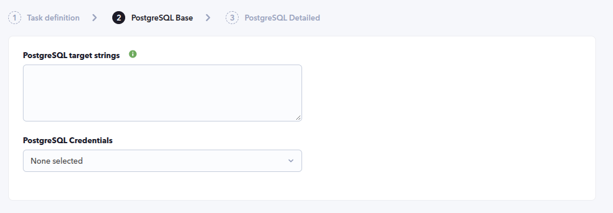
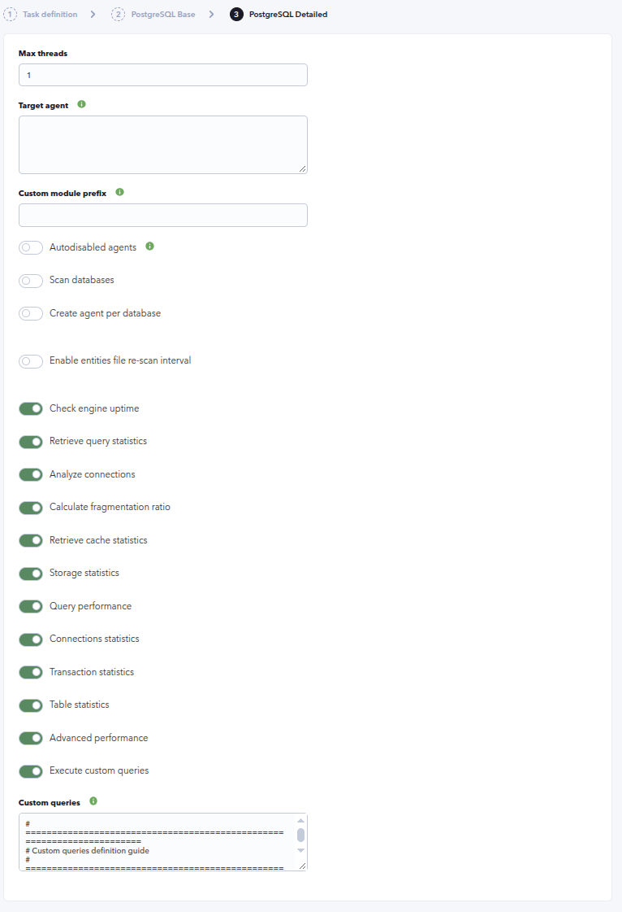
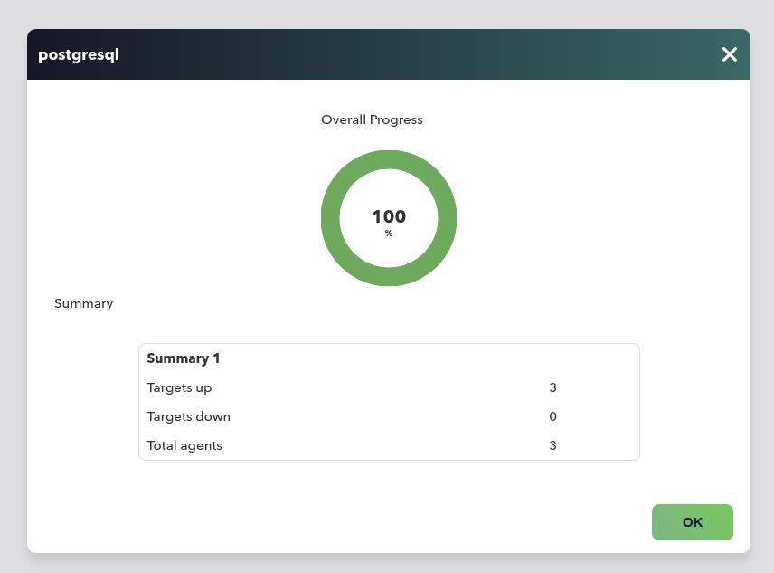
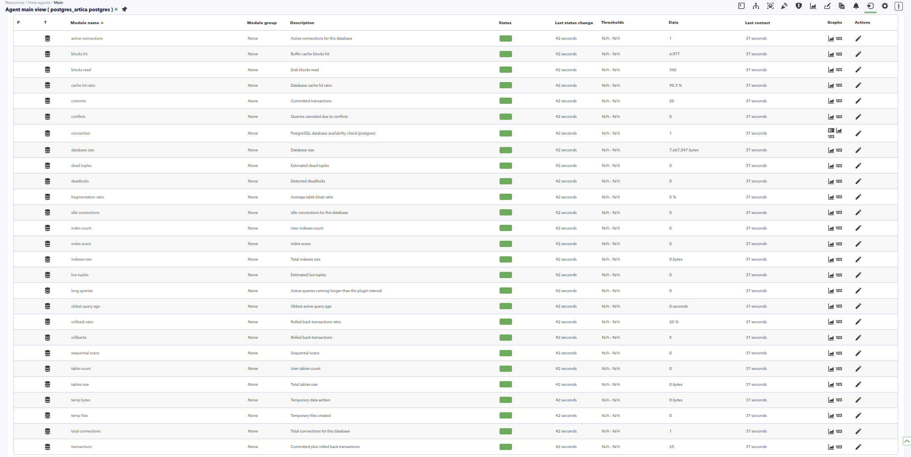

# PostgreSQL Discovery

*Article last updated: 2026-09-14.*

## What it monitors

The PostgreSQL Discovery plugin monitors PostgreSQL instances and their databases by running SQL queries against them and turning the results into Pandora FMS monitoring modules. It collects availability, uptime, query activity, connection usage, buffer cache, fragmentation, storage, per-database connection and transaction activity, table statistics, and any custom SQL query the operator defines.

The plugin creates **one main agent per target**. When **Scan databases** is enabled it discovers the databases of the instance and creates their modules either on the main agent or on **one agent per database**.

The plugin is designed for use through the Pandora FMS **Discovery** system. It does not generate XML agent files: it returns the discovered agents and modules in the JSON output of the execution, and the Discovery task creates them.

## Prepare

### Compatibility

| Scope | State | Evidence |
|-------|-------|----------|
| Plugin version `1.6` (`pandorafms.postgresql`) | Documented target | The version this page describes. See [Plugin identity](#plugin-identity) |
| Discovery of instance and per-database agents with per-database metrics | `Tested` | Verification run: a task completed with `Targets up 3` and `Total agents 3`, and a database agent was created with its modules. See [Verify the first run](#verify-the-first-run) |
| Network reachability from the Discovery server to every target database | `Required` | The plugin opens a remote PostgreSQL connection per target |
| A PostgreSQL role that can connect to the monitored instances and databases | `Required` | Prerequisite. See [Prerequisites](#prerequisites) |
| PostgreSQL 17 and later, buffer cache modules | `Not validated` | The official quick guide states the `backend used buffer cache`, `checkpoints buffer cache` and `cleaned buffer cache` modules are not available |
| Host operating system running the plugin | `Not validated` | No host operating system has been recorded |
| PostgreSQL server versions | `Not validated` | Compatibility was established against the SQL queries and connection contract, not a version matrix |

### Prerequisites

1. **Network connectivity** between the Discovery server and every target PostgreSQL instance.
2. **Pandora FMS**: a Discovery server to run the task, and the console to define it.
3. **A PostgreSQL role** that can connect to the monitored databases. The modules read `pg_stat_activity`, `pg_settings`, `pg_database`, `pg_class`, `pg_namespace`, `pg_tables`, `pg_indexes`, `pg_stat_user_tables`, `pg_stat_database` and `pg_stat_bgwriter`.
4. **A stored credential** with that role's username and password. See [Create the credential](#create-the-credential).

The plugin is distributed as a self-contained Discovery application: the `.disco` package ships its own executable, so no additional runtime has to be installed for a normal run.

### Create the credential

The task does not ask for a raw username and password. It selects a **Custom** credential from the Pandora FMS credential store:

1. Go to **Management → Configuration → Credential store**.
2. Create a **Custom** credential with the PostgreSQL username and password.
3. Select it in the **PostgreSQL Credentials** field of the task.

Storing the credential in the credential store keeps the password out of the task definition and out of the generated configuration file.

### Install the plugin

Load the `.disco` package for `pandorafms.postgresql` from the Pandora FMS Marketplace:

[https://marketplace.pandorafms.com/entries/pandorafms.postgresql](https://marketplace.pandorafms.com/entries/pandorafms.postgresql)

Once loaded, the **PostgreSQL** application is available when creating Discovery tasks.

## Configure the Discovery task

Create the task from **Management → Discovery → Applications → PostgreSQL**. The console presents the fields in two steps: **PostgreSQL Base** and **PostgreSQL Detailed**. Every field is documented in [Task parameters](#task-parameters).

1. **PostgreSQL Base** — the targets and how to reach them:

    - **PostgreSQL target strings**: one or more targets, separated by commas or one per line. Each entry creates one main agent. See [Target strings](#target-strings).
    - **PostgreSQL Credentials**: a **Custom** credential from the credential store.

    

2. **PostgreSQL Detailed** — discovery scope and monitoring groups:

    - **Max threads**: number of concurrent connections used to monitor the targets.
    - **Target agent**: names to assign to the main agents, positionally matched with the target strings. Empty means the target address is used as the agent name.
    - **Custom module prefix**: prepended to every generated module name.
    - **Autodisabled agents**: create the generated agents in Autodisabled mode.
    - **Scan databases**: discover the databases of each instance.
    - **Create agent per database**: create one agent per discovered database instead of adding its modules to the main agent.
    - **Custom database agent prefix**: visible when **Create agent per database** is enabled. Prepended to the per-database agent names.
    - **Enable entities file re-scan interval** and **Re-scan entities file interval**: persist the discovered databases and revalidate the list periodically.
    - **Check engine uptime**, **Retrieve query statistics**, **Analyze connections**, **Calculate fragmentation ratio**, **Retrieve cache statistics**: instance-level module groups.
    - **Storage statistics**, **Query performance**, **Connections statistics**, **Transaction statistics**, **Table statistics**, **Advanced performance**: per-database module groups.
    - **Execute custom queries** and **Custom queries**: run operator-defined SQL and create one module per query.

    

The task's own name, group, interval and timeout are set in the generic task-definition step, which precedes these two. The group and interval become the agent group and the module interval.

## Verify the first run

Force the task from **Management → Discovery → Task list** and check the result in this order.

1. **The task summary.** A completed PostgreSQL task reports:

    - **Total agents**: the number of agents generated by the task.
    - **Targets up**: targets the plugin connected to.
    - **Targets down**: targets it could not connect to.

    

2. **The agents.** One main agent per target string. With **Scan databases** enabled, the discovered databases are added to the main agent or, with **Create agent per database**, created as separate agents.

3. **The modules on each agent.** The main agent always has `POSTGRESQL connection`. A database that is monitored produces at least its `connection` module. Every additional module depends on the enabled checkboxes.

    

If the task reports `Targets down` for a target, work back through [Troubleshoot](#troubleshoot).

## Understand the results

### Agents and cardinality

- **One main agent per target string.** Its name is the target address unless a **Target agent** name is given for that position. The agent's OS is reported as `POSTGRESQL` and its OS version as the connected server version.
- **Instance modules** are always created on the main agent. The `POSTGRESQL connection` module is always present and reflects whether the instance connection succeeded.
- **Database modules.** With **Scan databases** enabled, each discovered database produces at least a `connection` module.
    - With **Create agent per database** disabled, the database modules are added to the main agent and their names are prefixed with the database name, for example `<prefix><database> connection`.
    - With **Create agent per database** enabled, each database gets its own agent named `<database agent prefix><main agent name> <database>`, and its module names are not prefixed with the database name.

### Instance modules

The `POSTGRESQL connection` module is always created on the main agent.

| Module | Type | Unit | Enabled by |
|--------|------|------|------------|
| `<prefix>POSTGRESQL connection` | `generic_proc` | — | Always |
| `<prefix>restart detection` | `generic_proc` | — | Check engine uptime |
| `<prefix>queries` | `generic_data` | — | Retrieve query statistics |
| `<prefix>insert` | `generic_data` | — | Retrieve query statistics |
| `<prefix>delete` | `generic_data` | — | Retrieve query statistics |
| `<prefix>update` | `generic_data` | — | Retrieve query statistics |
| `<prefix>session usage` | `generic_data` | % | Analyze connections |
| `<prefix>allocated buffer cache` | `generic_data` | bytes | Retrieve cache statistics |
| `<prefix>backend used buffer cache` | `generic_data` | bytes | Retrieve cache statistics |
| `<prefix>checkpoints buffer cache` | `generic_data` | bytes | Retrieve cache statistics |
| `<prefix>cleaned buffer cache` | `generic_data` | bytes | Retrieve cache statistics |

The `queries`, `insert`, `delete` and `update` modules count the statements that were active during the last interval. `restart detection` is `0` when the engine restarted within the last two intervals and `1` otherwise. `session usage` is the percentage of connection slots in use against the configured maximum.

### Database modules

A monitored database always produces its **connection** module, with value `1` when the connection succeeded and `0` otherwise. The remaining modules depend on the enabled per-database groups.

| Module | Type | Unit | Enabled by |
|--------|------|------|------------|
| `<prefix>connection` | `generic_proc` | — | Always (per discovered database) |
| `<prefix>fragmentation ratio` | `generic_data` | % | Calculate fragmentation ratio **and** Table statistics |
| `<prefix>database size` | `generic_data` | bytes | Storage statistics |
| `<prefix>tables size` | `generic_data` | bytes | Storage statistics |
| `<prefix>indexes size` | `generic_data` | bytes | Storage statistics |
| `<prefix>temp bytes` | `generic_data` | bytes | Storage statistics |
| `<prefix>temp files` | `generic_data` | — | Storage statistics |
| `<prefix>long queries` | `generic_data` | — | Query performance |
| `<prefix>oldest query age` | `generic_data` | seconds | Query performance |
| `<prefix>sequential scans` | `generic_data` | — | Query performance |
| `<prefix>index scans` | `generic_data` | — | Query performance |
| `<prefix>cache hit ratio` | `generic_data` | % | Query performance |
| `<prefix>active connections` | `generic_data` | — | Connections statistics |
| `<prefix>idle connections` | `generic_data` | — | Connections statistics |
| `<prefix>total connections` | `generic_data` | — | Connections statistics |
| `<prefix>transactions` | `generic_data` | — | Transaction statistics |
| `<prefix>commits` | `generic_data` | — | Transaction statistics |
| `<prefix>rollbacks` | `generic_data` | — | Transaction statistics |
| `<prefix>rollback ratio` | `generic_data` | % | Transaction statistics |
| `<prefix>deadlocks` | `generic_data` | — | Transaction statistics |
| `<prefix>conflicts` | `generic_data` | — | Transaction statistics |
| `<prefix>table count` | `generic_data` | — | Table statistics |
| `<prefix>index count` | `generic_data` | — | Table statistics |
| `<prefix>live tuples` | `generic_data` | — | Table statistics |
| `<prefix>dead tuples` | `generic_data` | — | Table statistics |
| `<prefix>blocks read` | `generic_data` | — | Advanced performance |
| `<prefix>blocks hit` | `generic_data` | — | Advanced performance |

With **Create agent per database** disabled, insert the database name after the custom prefix: `<prefix><database> database size`. The database `fragmentation ratio` module requires both **Calculate fragmentation ratio** and **Table statistics** to be enabled.

### Entities file and disappeared databases

With **Enable entities file re-scan interval** enabled, the plugin persists the discovered databases in an entities file. When a previously discovered database no longer appears in the current scan, the plugin still generates its `connection` module, so the module can transition to a critical state instead of disappearing silently. Without this option, the list is not persisted and a database that is no longer discovered stops being reported.

### Custom queries

Each custom query generates one module on the agents its scope applies to. A query can target the instance level (`instances`), the database level (`databases`) or both (`all`), can be limited to specific databases, and can be scheduled with a five-field crontab expression. Scheduled queries keep their last successful execution, so an occurrence that was missed while the plugin was not running is executed on the next task run. See [Custom queries reference](#custom-queries-reference).

## Troubleshoot

The plugin reports its diagnostics in the JSON execution summary printed to standard output: connection errors are reported as `Connection failed: ...`, and skipped or failed queries are added there.

- **`Targets down` for a target** — the instance connection failed. Check network access from the Discovery server, the target string format and the selected credential.
- **A database is not monitored** — it was not discovered. Enable **Scan databases**, or list it explicitly in the target string with `\`, `|` or check the `!|` exclusion list.
- **The three buffer cache modules are missing** — `backend used buffer cache`, `checkpoints buffer cache` and `cleaned buffer cache` are not available on PostgreSQL 17 and later.
- **A database disappeared from monitoring** — enable **Enable entities file re-scan interval** to keep its `connection` module and let it go critical instead of removing it.
- **Query statistics are always zero** — the `queries`, `insert`, `delete` and `update` modules count statements active during the last interval. A quiet instance legitimately reports zero.
- **A custom query produces no module** — only `SELECT` statements are accepted; any other statement is discarded with a warning. A query whose `target_scope` does not match the agent (for example `databases` on the instance agent) is also skipped.
- **An invalid crontab expression is ignored** — a custom query `crontab` must have five fields. An invalid expression produces a warning and the query is skipped.

## Reference

### Task parameters

#### PostgreSQL Base

| Field | Macro | Type | Default | Notes |
|-------|-------|------|---------|-------|
| PostgreSQL target strings | `_dbstrings_` | textarea | — | Mandatory. Comma separated or one per line. `#` comments a line. Each entry creates one main agent. See [Target strings](#target-strings) |
| PostgreSQL Credentials | `_credentials_` | select | — | Mandatory. **Custom** credential from the credential store. See [Create the credential](#create-the-credential) |

#### PostgreSQL Detailed

| Field | Macro | Type | Default | Notes |
|-------|-------|------|---------|-------|
| Max threads | `_threads_` | number | `1` | Concurrent monitoring threads |
| Target agent | `_engineAgent_` | textarea | — | Agent names, positionally matched with the target strings. Empty uses the target address |
| Custom module prefix | `_prefixModuleName_` | string | — | Prepended to every generated module name |
| Autodisabled agents | `_autodisabledAgents_` | checkbox | off | Creates the generated agents in Autodisabled mode |
| Scan databases | `_scanDatabases_` | checkbox | off | Discovers the databases of each instance |
| Create agent per database | `_agentPerDatabase_` | checkbox | off | One agent per discovered database |
| Custom database agent prefix | `_prefixAgent_` | string | — | Visible when **Create agent per database** is enabled. Prepended to the per-database agent names |
| Enable entities file re-scan interval | `_enableEntitiesInterval_` | checkbox | off | Persist and revalidate the discovered database list |
| Re-scan entities file interval | `_entitiesInterval_` | select | `86400` | Visible when **Enable entities file re-scan interval** is enabled. Refresh interval |
| Check engine uptime | `_checkUptime_` | checkbox | on | Creates the restart detection module |
| Retrieve query statistics | `_queryStats_` | checkbox | on | Creates the `queries`, `insert`, `delete` and `update` modules |
| Analyze connections | `_checkConnections_` | checkbox | on | Creates the session usage module |
| Calculate fragmentation ratio | `_checkFragmentation_` | checkbox | on | Creates the fragmentation ratio module |
| Retrieve cache statistics | `_checkCache_` | checkbox | on | Creates the buffer cache modules |
| Storage statistics | `_checkStorage_` | checkbox | on | Creates the database storage modules |
| Query performance | `_checkQueryPerformance_` | checkbox | on | Creates the query performance modules |
| Connections statistics | `_checkConnectionStats_` | checkbox | on | Creates the per-database connection modules |
| Transaction statistics | `_checkTransactionStats_` | checkbox | on | Creates the transaction modules |
| Table statistics | `_checkTableStats_` | checkbox | on | Creates the table statistics modules |
| Advanced performance | `_checkAdvancedPerf_` | checkbox | on | Creates the blocks read and blocks hit modules |
| Execute custom queries | `_executeCustomQueries_` | checkbox | on | Enables the custom queries block |
| Custom queries | `_customQueries_` | textarea | — | Visible when **Execute custom queries** is enabled. See [Custom queries reference](#custom-queries-reference) |

### Target strings

The **PostgreSQL target strings** field accepts one target per line or comma separated. Blank lines and lines starting with `#` are ignored. Each target uses `HOST` or `HOST:PORT`, optionally with a database selection:

| Format | Meaning |
|--------|---------|
| `HOST` | The instance only, unless **Scan databases** is enabled |
| `HOST:PORT` | The instance on the given port |
| `HOST:PORT\DATABASE` | The instance plus that single database |
| `HOST:PORT\|db1;db2;db3` | The instance plus the listed databases |
| `HOST:PORT!\|db1;db2` | The instance plus every discovered database except the listed ones (requires **Scan databases**) |

Examples:

```
172.17.0.3:5432\postgres
172.17.0.4:5432|pandora;metadata
172.17.0.5:5432!|template0;template1
# This line is a comment and is ignored
172.17.0.6:5432
```

### Configuration file

A Discovery task builds this file from its own fields. A manual run supplies it with `--conf`.

| Key | Description |
| --- | --- |
| `agents_group_id` | Group id assigned to the generated agents |
| `interval` | Agent and module interval in seconds |
| `credentials` | Base64-encoded JSON with the `user` and `password` fields. Takes precedence over `user` and `password` |
| `user`, `password` | Plain connection credentials, used when `credentials` is not set |
| `threads` | Number of concurrent monitoring threads |
| `modules_prefix` | Prefix for generated module names |
| `autodisabled_agents` | `1` creates the generated agents in Autodisabled mode |
| `scan_databases` | `1` discovers the databases of each instance |
| `agent_per_database` | `1` creates one agent per discovered database |
| `db_agent_prefix` | Prefix for per-database agent names |
| `execute_custom_queries` | `1` runs custom queries |
| `analyze_connections` | `1` creates the session usage module |
| `engine_uptime` | `1` creates the restart detection module |
| `query_stats` | `1` creates the instance query statistics modules |
| `cache_stats` | `1` creates the buffer cache modules |
| `fragmentation_ratio` | `1` creates the fragmentation ratio module |
| `check_storage_stats` | `1` creates the storage modules |
| `check_query_performance` | `1` creates the query performance modules |
| `check_connection_stats` | `1` creates the per-database connection modules |
| `check_transaction_stats` | `1` creates the transaction modules |
| `check_table_stats` | `1` creates the table statistics modules |
| `check_advanced_perf` | `1` creates the advanced performance modules |
| `entities_list` | Path of the file where discovered databases are stored |
| `enable_entities_interval` | `1` enables the database list re-scan |
| `entities_interval` | Re-scan interval in seconds |
| `cron_state_dir` | Directory where the last successful execution of scheduled custom queries is stored |

Example:

```ini
agents_group_id=10
interval=300
user=<USERNAME>
password=<PASSWORD>
threads=1
modules_prefix=
execute_custom_queries=1
analyze_connections=1
engine_uptime=1
query_stats=1
fragmentation_ratio=1
cache_stats=1
scan_databases=1
agent_per_database=1
db_agent_prefix=
entities_list=/tmp/postgresql_entities_list.txt
enable_entities_interval=1
entities_interval=300
check_storage_stats=1
check_query_performance=1
check_connection_stats=1
check_transaction_stats=1
check_table_stats=1
check_advanced_perf=1
```

> The `credentials` value is Base64-encoded JSON, which is reversible, not encrypted. Protect the configuration file as a secret. When the credential is stored in the Pandora FMS credential store, the task does not write the password to the generated file.

### Command-line execution

The plugin can be executed by hand, which is the fastest way to confirm a target and its credentials before wiring it into a task.

```bash
./pandora_postgresql \
    --conf <PATH_TO_CONFIG> \
    --target_databases <PATH_TO_TARGETS> \
    [ --target_agents <PATH_TO_AGENT_NAMES> ] \
    [ --custom_queries <PATH_TO_CUSTOM_QUERIES> ]
```

| Parameter | Description |
| --- | --- |
| `--conf` | Path to the configuration file |
| `--target_databases` | Path to the file containing the target databases |
| `--target_agents` | Path to the file containing the agent names, positionally matched with the targets |
| `--custom_queries` | Path to the file containing the custom queries |

The run returns a JSON summary of the execution. The collected data is exposed in the summary's `monitoring_data` field for the Discovery server to consume.

A manual `--conf` can authenticate either with `credentials` (Base64-encoded JSON with `user` and `password`) or with the plain `user` and `password` keys. When both are present, `credentials` wins.

### Custom queries reference

Each custom query is a block delimited by `check_begin` and `check_end`. Only `SELECT` statements are allowed.

| Key | Description |
| --- | --- |
| `name` | Module name. Mandatory. Supports `$__self_dbname` |
| `description` | Module description |
| `target` | SQL query to execute. Mandatory. Only `SELECT` statements are accepted. `sql` is accepted as a synonym. Supports `$__self_dbname` |
| `target_scope` | `instances`, `databases` or `all`. Default `all` |
| `target_databases` | Comma-separated database names the query applies to. `all` or empty applies it everywhere. At instance level, `postgres` matches the instance |
| `operation` | `value` returns a single value; `full` returns all rows as a string |
| `datatype` | `generic_data`, `generic_data_string` or `generic_proc`. `full` operations are forced to `generic_data_string` |
| `min_warning`, `max_warning` | Warning thresholds |
| `min_critical`, `max_critical` | Critical thresholds |
| `warning_inverse`, `critical_inverse` | Set to `1` to invert the corresponding threshold interval |
| `str_warning`, `str_critical` | String thresholds |
| `module_interval` | Module interval as a multiplier of the agent interval |
| `crontab` | Five-field cron expression. When present, the query only runs when an occurrence is due |

Example:

```
check_begin
name Select 1
description Number of invalid objects
operation value
datatype generic_data
min_warning 5
target SELECT 1;
target_databases all
check_end
```

The reserved word `$__self_dbname` is replaced by the database where the query runs (or `postgres` at instance level) in both the `target` and the `name`. The console ships a commented guide with the field as the default content of the **Custom queries** textarea.

### Generated modules

All module names carry the **Custom module prefix** when one is set.

#### Main agent

| Module | Type | Unit | Enabled by |
|--------|------|------|------------|
| `<prefix>POSTGRESQL connection` | `generic_proc` | — | Always |
| `<prefix>restart detection` | `generic_proc` | — | Check engine uptime |
| `<prefix>queries`, `<prefix>insert`, `<prefix>delete`, `<prefix>update` | `generic_data` | — | Retrieve query statistics |
| `<prefix>session usage` | `generic_data` | % | Analyze connections |
| `<prefix>allocated buffer cache`, `<prefix>backend used buffer cache`, `<prefix>checkpoints buffer cache`, `<prefix>cleaned buffer cache` | `generic_data` | bytes | Retrieve cache statistics |

#### Database modules

A monitored database always produces its `connection` module. The rest depend on the enabled groups, as listed in [Database modules](#database-modules).

With **Create agent per database** enabled, each database gets its own agent and its modules use the plain names (`connection`, `database size`, ...). With the option disabled, the modules are added to the main agent and each name is prefixed with the database name (`<prefix><database> connection`, `<prefix><database> database size`, ...).

### Plugin identity

| Field | Value |
|-------|-------|
| App short name | `pandorafms.postgresql` |
| Plugin version | `1.6` |
| Type | Discovery application (`.disco`) |
| Section | Discovery → Applications |
| Availability | Pandora FMS Marketplace (`pandorafms.postgresql`) |
