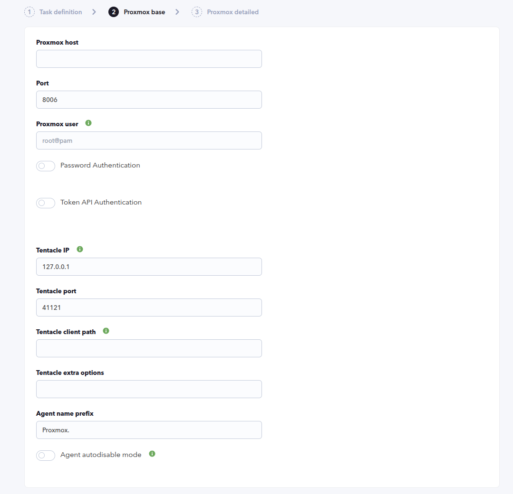
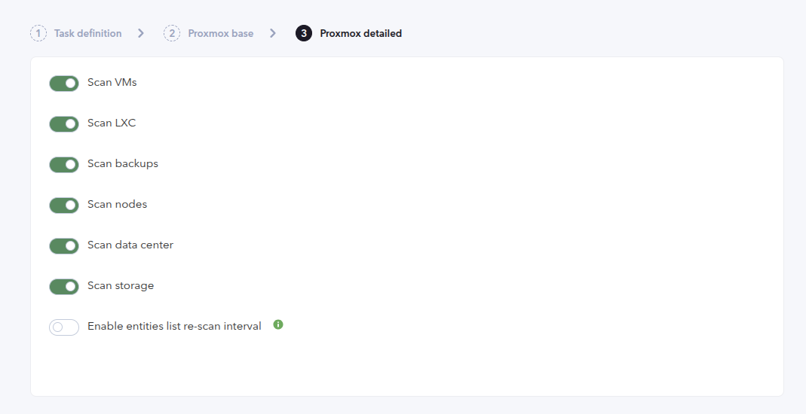
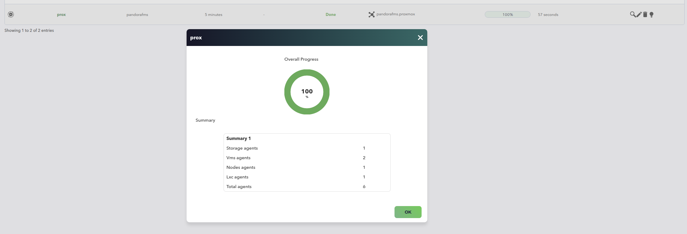
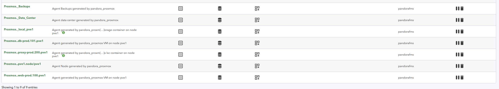
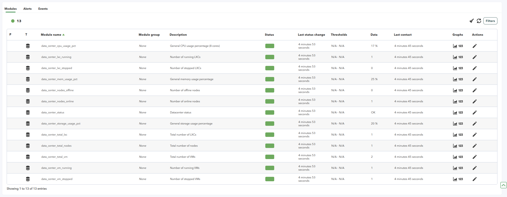
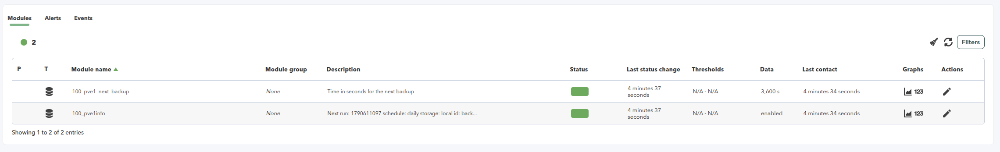

# Proxmox Discovery

*Article last updated: 2026-09-28.*

## What it monitors

The Proxmox Discovery plugin connects to a Proxmox VE cluster through the Proxmox VE API and discovers its resources. It generates one Pandora FMS agent per discovered resource and fills it with availability, capacity, configuration and performance modules read from the Proxmox API.

The plugin generates agents for:

- every Proxmox node;
- every QEMU virtual machine;
- every LXC container;
- every storage defined on a node;
- one cluster agent for scheduled backups;
- one data center agent with the cluster summary.

The resource categories are selectable in the task, and a per-task entities list lets you fine-tune which resources are monitored and rename the resulting agents.

The plugin runs as a Discovery task: the console creates the task, the Discovery server runs the plugin, and the generated agents and modules are created automatically. The task delivers the generated agent data through Tentacle.

## Prepare

### Compatibility

| Scope | State | Evidence |
| --- | --- | --- |
| Plugin version `1.6.1` (`pandorafms.proxmox`) | Documented target | The version this page describes, as identified by the package definition. |
| Proxmox VE cluster with the API reachable on the configured port (default `8006`) | `Required` | The plugin authenticates and reads every resource through the Proxmox VE API. |
| An account or API token with read access to nodes, guests, storage, backups and cluster status | `Required` | The plugin lists nodes, QEMU and LXC guests, storage and cluster backups; it never changes the Proxmox configuration. |
| A specific Proxmox VE version | `Not validated` | No published test record establishes compatibility with a concrete Proxmox VE release. |
| Host operating system running the plugin | `Not validated` | No published test record establishes operating-system compatibility. |

### Requirements

- A Pandora FMS server with Discovery enabled to run the task, and a console to define it.
- A Proxmox VE endpoint reachable from the Discovery server, with the API exposed on the configured port. The default Proxmox VE API port is `8006`.
- One of the following credentials:
    - a Proxmox user in the `user@realm` format, for example `root@pam`, with its password;
    - a Proxmox API token, provided as its token name and token secret.
- A target agent group and a monitoring interval for the generated agents. Both come from the Discovery task and are inherited by every generated agent.
- Network reachability to the Tentacle destination, because the task transfers the generated agent data through Tentacle.
- A writable path for the entities list file. The default is a file specific to the Discovery task under Pandora's temporary directory.
- The plugin is distributed as a Pandora FMS Discovery application (`.disco` package) that the Discovery server executes on the Pandora FMS server.

Grant the Proxmox account or API token only the read access your monitoring needs. The plugin only queries the API; it never modifies nodes, guests, storage or backups.

The plugin connects to the Proxmox VE API without verifying its TLS certificate. Run the task only over a network you trust, or protect the traffic through a tunnel. There is no option to enable certificate verification for this plugin.

### Install the plugin

Load the `.disco` package from **Management → Discovery → Manage disco packages**: choose **Select a file**, pick the package, and click **Upload DISCO**. After loading, **Proxmox** appears in the package list and under the **Applications** section of the Discovery wizard.

## Configure the Discovery task

Create the task from **Management → Discovery → Applications → Proxmox**. The wizard walks through the generic task definition and two plugin steps: **Proxmox base** and **Proxmox detailed**. Every field is documented in [Task parameters](#task-parameters).

### Step 1 — Task definition

The generic step asks for the task **name**, the **agent group** and **server** on which the task runs, and the **interval**. The group and the interval are passed to the plugin and inherited by every generated agent.

### Step 2 — Proxmox base

Connection details, authentication and the Tentacle destination:

- **Proxmox host** is the address or hostname of the Proxmox VE endpoint.
- **Port** is the API port. The default is `8006`.
- **Proxmox user** is the account in `user@realm` format, for example `root@pam`.
- **Password Authentication** controls the visibility of **Password**. Enter the password of the Proxmox user.
- **Token API Authentication** controls the visibility of **Token Name** and **Token Password**. Enter the name and secret of a Proxmox API token.
- **Tentacle IP**, **Tentacle port**, **Tentacle client path** and **Tentacle extra options** set how the generated data is sent. Leave the defaults unless your environment needs another Tentacle target.
- **Agent name prefix** is prepended to the generated agent names. The default is `Proxmox.`.
- **Agent autodisable mode** creates the generated agents in autodisabled mode.

The two authentication checkboxes only control which fields the wizard shows. The plugin authenticates with the API token when both **Token Name** and **Token Password** are set, and with the Proxmox user and password otherwise. Do not fill only one of the token fields: in that case the plugin falls back to password authentication.



### Step 3 — Proxmox detailed

Resource categories, the entities list and the re-scan behaviour:

- **Scan VMs**, **Scan LXC**, **Scan backups**, **Scan nodes**, **Scan data center** and **Scan storage** enable or disable each resource category. All of them are enabled by default.
- **Entities list file** is the path of the editable file that selects and renames resources. See [Entities list file](#entities-list-file).
- **Enable entities list re-scan interval** rebuilds the resource sections of the entities list after the configured interval. See [Entities list file](#entities-list-file) for the consequences.
- **Re-scan entities list interval** is how often the list is rebuilt. It is only shown when **Enable entities list re-scan interval** is on.



## Verify the first run

Run the task from **Management → Discovery → Task list** and check the result in this order.

1. **The task summary** reports the total number of generated agents and how many belong to each resource group.
2. **The agents.** Expect one agent per enabled and reachable resource, plus the cluster backups agent and the data center agent when their categories are enabled.
3. **The modules.** Every generated agent carries the modules of its resource type; a reachable environment populates availability, capacity and performance values.
4. **The execution information.** A successful run reports no errors; any per-resource failure is recorded there.



If the task fails before generating anything, the Proxmox host, the port and the credentials are the first things to check.

## Understand the results

### Agents and identity

The plugin creates one agent per discovered resource. Every generated agent belongs to the task's agent group and inherits its interval. Node, virtual machine and LXC agents also carry a custom field, `proxmox_device`, whose value is `Node`, `VM` or `LXC`.

Each agent has a stable internal name and a readable alias. The internal name is a hash scoped to the Discovery task, the Proxmox host and port, the resource type and the resource ID. The alias is built from the configured prefix and the resource identity, and can be rewritten with a rename rule.

| Resource | Alias template (default) | Scope |
| --- | --- | --- |
| Node | `<prefix>.<node>.<node id>` | One agent per node |
| Virtual machine | `<prefix>.<vm name>.<vmid>.<node>` | One agent per QEMU guest |
| LXC container | `<prefix>.<container name>.<vmid>.<node>` | One agent per LXC guest |
| Storage | `<prefix>_<storage>_<node>` | One agent per node storage |
| Backups | `<prefix>_Backups` | One agent for the whole cluster |
| Data center | `<prefix>_Data_Center` | One agent for the whole cluster |



Because the internal name includes the Discovery task ID and the Proxmox endpoint, two tasks monitoring different Proxmox environments cannot update the same agent even if their resource names coincide. The entities list filename is also specific to the task.

Rename rules change the visible alias only. The internal name is not affected, and guest agents are identified by VMID, so renaming a guest keeps updating the same agent.

### The entities list file

On its first run, the plugin creates the entities list file with a section heading per resource type and the resources it discovered:

```text
Node
pve1
VM
pve1/100
LXC
pve1/200
Storage
pve1/local
Backups
Backups
Datacenter
Data_Center
Rename
web-prod TO Production web
```

Remove a resource line to exclude it from monitoring. Changes take effect on the next task execution. See [Entities list file](#entities-list-file) in the reference for the exact semantics and the re-scan behaviour.

### Modules by agent

Each agent receives the modules of its resource type. The module values are read from the Proxmox API during every task run; the exact name and unit of each module are listed in [Generated modules](#generated-modules).

| Agent | Modules it carries |
| --- | --- |
| Node | Host status and state, CPU, memory, disk, storage capacity, kernel and manager version, SSL fingerprint and network traffic |
| Virtual machine | Power status and state, CPU, memory, disk and network usage |
| LXC container | Power status and state, CPU, memory, disk and network usage, plus usage percentages relative to the container and to the host |
| Storage | Used-space percentage, enabled and active state, total and used capacity, type, path and content types |
| Backups | One pair of modules per scheduled backup job: its state and the time remaining until the next run |
| Data center | Node, VM and LXC counters and the general CPU, memory and storage usage percentages |



## Operate

### Manual execution

The plugin can also be run outside the Discovery wizard with a configuration file. This is useful for testing connectivity, for a one-off run, or for a custom schedule. The configuration file is a plain list of `key=value` lines:

```bash
pandora_proxmox --conf <path to configuration file>
```

A minimal configuration file for a manual run looks like this:

```text
host=<PROXMOX_HOST>
port=8006
user=<PROXMOX_USER>
password=<PROXMOX_PASSWORD>
prefix=Proxmox.
interval=300
transfer_mode=tentacle
tentacle_ip=<TENTACLE_IP>
tentacle_port=41121
entities_list=/tmp/proxmox_entities_list.txt
```

All keys are documented in [Configuration file](#configuration-file). When no `task_id` is provided, manual executions fall back to the endpoint identity for the internal agent names.

### Limitations

- The plugin does not verify the Proxmox VE TLS certificate.
- The task writes the connection credentials to its configuration file on the Pandora FMS server. There is no password encryption option for this plugin, so protect access to the server and its temporary files.
- Backups are read at cluster level. Only scheduled cluster backup jobs are reported; per-guest backup retention is not exposed by this plugin.
- Storage discovery pairs the storage list of a node with the cluster storage list. If a node reports a different number of storages than the cluster list, that node's storage is skipped.
- The entities list only excludes or renames resources. Removing a resource from Proxmox does not delete its agent automatically.

## Troubleshoot

| Symptom | Check |
| --- | --- |
| The task reports an error logging into the Proxmox environment | Confirm **Proxmox host** and **Port**, that the API is reachable from the Discovery server, and that the credentials are valid. |
| Authentication fails with a password account | The Proxmox user must use the `user@realm` format, for example `root@pam`. |
| Token authentication is not used | Fill both **Token Name** and **Token Password**. With only one of them set, the plugin falls back to the user and password. |
| No agents are generated at all | Confirm the credentials, that the Proxmox cluster has the resources you expect, and that the relevant **Scan** options are enabled. |
| Expected resources are missing | Review the entities list file: a removed line excludes the resource, and a disabled category is not written when the list is first built. |
| A renamed agent is not updated | Use the original alias, the resource name or the resource identifier in the rename rule, and confirm the rule is under the `Rename` section. |
| Storage agents are missing for a node | The plugin skips a node whose node storage list does not match the cluster storage list. Confirm the node reports its storages correctly. |
| New agents appeared after upgrading the plugin | Version `1.6.1` changed the internal agent identity. Its first run creates new agents instead of updating the ones created by earlier versions. Review alerts and dashboards that refer to the old agents before removing them. |
| Tentacle transfer fails | Confirm the Discovery server can reach **Tentacle IP** on **Tentacle port** and that the Tentacle client is available, or set **Tentacle client path**. |

## Reference

### Task parameters

The console presents these fields after the generic task definition. The macro column is the identifier used in the generated task configuration.

#### Proxmox base

| Field | Macro | Type | Default | Notes |
| --- | --- | --- | --- | --- |
| Proxmox host | `_proxmoxHost_` | string | — | Address or hostname of the Proxmox VE endpoint. Required |
| Port | `_proxmoxPort_` | number | `8006` | Proxmox VE API port |
| Proxmox user | `_proxmoxUser_` | string | — | Account in `user@realm` format, for example `root@pam` |
| Password Authentication | `_passwordAuth_` | checkbox | off | Controls the visibility of the password field |
| Password | `_proxmoxPassword_` | password | — | Password of the Proxmox user |
| Token API Authentication | `_TokenAuth_` | checkbox | off | Controls the visibility of the token fields |
| Token Name | `_proxmoxTokenName_` | string | — | Name of the Proxmox API token |
| Token Password | `_proxmoxTokenPassword_` | password | — | Secret of the Proxmox API token |
| Tentacle IP | `_tentacleIP_` | string | `127.0.0.1` | Tentacle transfer destination |
| Tentacle port | `_tentaclePort_` | number | `41121` | Tentacle transfer destination port |
| Tentacle client path | `_tentaclePath_` | string | — | Optional path to the Tentacle client when it is not in the default `PATH` |
| Tentacle extra options | `_tentacleExtraOpt_` | string | — | Extra options passed to the Tentacle client |
| Agent name prefix | `_prefix_` | string | `Proxmox.` | Prepended to the generated agent aliases |
| Agent autodisable mode | `_agentautodisable_` | checkbox | off | Creates the generated agents in autodisabled mode |

#### Proxmox detailed

| Field | Macro | Type | Default | Notes |
| --- | --- | --- | --- | --- |
| Scan VMs | `_scanVM_` | checkbox | on | Generates an agent per QEMU virtual machine |
| Scan LXC | `_scanLXC_` | checkbox | on | Generates an agent per LXC container |
| Scan backups | `_scanBackups_` | checkbox | on | Generates the cluster backups agent |
| Scan nodes | `_scanNodes_` | checkbox | on | Generates an agent per node |
| Scan data center | `_scanDataCenter_` | checkbox | on | Generates the data center agent |
| Scan storage | `_scanStorage_` | checkbox | on | Generates an agent per node storage |
| Entities list file | `_entitiesList_` | string | Task-specific file under Pandora's temporary directory | Editable file that selects and renames resources |
| Enable entities list re-scan interval | `_enableEntitiesInterval_` | checkbox | off | Rebuilds the resource sections after the interval |
| Re-scan entities list interval | `_entitiesInterval_` | select (interval) | `86400` | Rebuild interval in seconds. Only shown when the re-scan is enabled |

The task always delivers data through Tentacle with the configured **Tentacle IP** and **Tentacle port**; the wizard does not offer a local transfer mode.

### Configuration file

The Discovery task builds a configuration file for the plugin. The same format is used for a manual execution. It is a plain text file of `key=value` lines. This is the configuration surface for every parameter.

| Key | Default | Description |
| --- | --- | --- |
| `host` | — | Proxmox VE address or hostname. Required |
| `port` | `8006` | Proxmox VE API port |
| `user` | — | Proxmox account in `user@realm` format |
| `password` | — | Proxmox user password |
| `proxmox_token_name` | — | Proxmox API token name |
| `proxmox_token_pass` | — | Proxmox API token secret |
| `prefix` | `Proxmox.` | Prefix for the generated agent aliases |
| `agents_group_name` | — | Agent group for the generated agents |
| `interval` | `300` | Agent interval for the generated agents |
| `task_id` | — | Discovery task identifier. Used to scope the internal agent names |
| `agent_autodisable` | `False` | Set to `true` to create the generated agents in autodisabled mode |
| `scan_nodes` | `1` | Generate an agent per node |
| `scan_backups` | `1` | Generate the cluster backups agent |
| `scan_vms` | `1` | Generate an agent per QEMU virtual machine |
| `scan_lxc` | `1` | Generate an agent per LXC container |
| `scan_data_center` | `1` | Generate the data center agent |
| `scan_storage` | `1` | Generate an agent per node storage |
| `discard_nodes` | `[]` | JSON list of node names to discard from node, guest and storage monitoring |
| `entities_list` | `/tmp/proxmox_entities_list.txt` | Path of the entities list file |
| `enable_entities_interval` | `False` | Set to `true` to rebuild the entities list on an interval |
| `entities_interval` | `86400` | Rebuild interval in seconds |
| `transfer_mode` | `tentacle` | `tentacle` sends the data through Tentacle; `local` writes it to `local_folder` |
| `tentacle_ip` | `127.0.0.1` | Tentacle destination address |
| `tentacle_port` | `41121` | Tentacle destination port |
| `tentacle_path` | — | Optional path to the Tentacle client |
| `tentacle_opts` | — | Extra options passed to the Tentacle client |
| `temporal` | `/tmp/` | Working folder for temporary files |
| `local_folder` | `/var/spool/pandora/data_in/` | Destination folder when `transfer_mode` is `local` |
| `pandora_url` | — | Console API URL |
| `api_user` | — | Console API user |
| `api_pass` | — | Console API password |
| `apiuser_pass` | — | Console API user password |

The console API parameters are used to create the `proxmox_device` custom field in Pandora FMS when it does not exist yet.

### Entities list file

The entities list is a plain text file that selects and renames resources. The plugin creates it on the first run and reads it on every run.

| Section | Entry format | Example |
| --- | --- | --- |
| `Node` | Node name | `pve1` |
| `VM` | `<node>/<vmid>` | `pve1/100` |
| `LXC` | `<node>/<vmid>` | `pve1/200` |
| `Storage` | `<node>/<storage>` | `pve1/local` |
| `Backups` | The fixed entry `Backups` | `Backups` |
| `Datacenter` | The fixed entry `Data_Center` | `Data_Center` |
| `Rename` | `ORIGINAL TO NEW` | `web-prod TO Production web` |

Rules:

- Remove a resource line to exclude it from monitoring. Changes take effect on the next task execution.
- The entry `all` inside a section permits every current resource of that type.
- Disabled scan categories are not written when the list is first built. Enable an interval or add entries manually if you enable a category later.
- **Enable entities list re-scan interval** rebuilds the resource sections after the configured interval. It is off by default so manual exclusions persist. A rebuild discovers new resources and retains the `Rename` rules, but it restores the resource lines you removed.
- The file must be writable by the account that runs the Discovery task.

### Rename rules

Add mappings under the `Rename` section using `ORIGINAL TO NEW`.

- `ORIGINAL` may be the original agent alias including the prefix, or the source resource name, for example `web-prod`.
- The target becomes the visible agent alias.
- A rename does not change the internal hashed agent name. Guest agents are identified by VMID.
- For equal resource names on different nodes, use the full original alias to target one agent.

### Generated modules

The following tables list the modules the plugin generates per resource.

#### Nodes

In the module names, `<node>` is the node name. Modules are generated only when the Proxmox API returns the corresponding field.

| Module name | Type | Unit | Description |
| --- | --- | --- | --- |
| `<node>_maxdisk` | generic_data | Bytes | Root disk size |
| `<node>_uptime` | generic_data | — | Uptime |
| `<node>_status` | generic_proc | — | `1` when the node is online, `0` otherwise |
| `<node>_state` | generic_data_string | — | Node status as reported by the API |
| `<node>_maxcpu` | generic_data | — | Maximum number of CPUs |
| `<node>_disk` | generic_data | Bytes | Disk usage |
| `<node>_mem` | generic_data | Bytes | Memory usage |
| `<node>_maxmem` | generic_data | Bytes | Maximum memory |
| `<node>_cpu` | generic_data | % | CPU usage, with the CPU model and core count in the description |
| `<node>_ssl_fingerprint` | generic_data_string | — | SSL fingerprint |
| `<node>_mem_usage_pct` | generic_data | % | Memory usage percentage |
| `<node>_disk_usage_pct` | generic_data | % | Disk usage percentage |
| `<node>_kernel_version` | generic_data_string | — | Kernel version |
| `<node>_manager_version` | generic_data_string | — | Proxmox manager version |
| `<node>_netin_traffic` | generic_data | bytes/s | Network traffic in |
| `<node>_netout_traffic` | generic_data | bytes/s | Network traffic out |

#### Virtual machines

In the module names, `<vm>` is the virtual machine name. Modules are generated only when the Proxmox API returns the corresponding field.

| Module name | Type | Unit | Description |
| --- | --- | --- | --- |
| `<vm>_Status` | generic_proc | — | `1` when the guest is running, `0` otherwise |
| `<vm>_State` | generic_data_string | — | Guest status as reported by the API |
| `<vm>_netout` | generic_data | — | Network traffic out |
| `<vm>_diskread` | generic_data | — | Disk read |
| `<vm>_cpu` | generic_data | % | CPU usage |
| `<vm>_disk` | generic_data | Bytes | Disk usage |
| `<vm>_mem` | generic_data | — | Memory usage in bytes |
| `<vm>_netin` | generic_data | — | Network traffic in |
| `<vm>_uptime` | generic_data | — | Uptime |
| `<vm>_maxmem` | generic_data | bytes | Maximum memory |
| `<vm>_maxdisk` | generic_data | bytes | Root disk size |
| `<vm>_diskwrite` | generic_data | — | Disk write |
| `<vm>_cpus` | generic_data | — | Maximum usable CPUs |

#### LXC containers

An LXC container generates the same modules as a virtual machine, with the container name as `<lxc>`, plus the following percentage modules.

| Module name | Type | Unit | Description |
| --- | --- | --- | --- |
| `<lxc>_cpu_usage_host_pct` | generic_data | % | Container CPU usage relative to the total host cores |
| `<lxc>_mem_usage_pct` | generic_data | % | Container memory usage percentage |
| `<lxc>_mem_usage_host_pct` | generic_data | % | Container memory usage relative to the total host memory |

#### Storage

In the module names, `<node>` is the node name and `<storage>` is the storage name.

| Module name | Type | Unit | Description |
| --- | --- | --- | --- |
| `<node>_<storage>_disk_usage_pct` | generic_data | % | Percentage of used space |
| `<node>_<storage>_enable` | generic_proc | — | `1` when the storage is enabled, `0` otherwise |
| `<node>_<storage>_is_active` | generic_proc | — | `1` when the storage is active, `0` otherwise |
| `<node>_<storage>_total_capacity` | generic_data | bytes | Total disk capacity |
| `<node>_<storage>_used_space` | generic_data | bytes | Used disk space |
| `<node>_<storage>_type` | generic_data_string | — | Storage type |
| `<node>_<storage>_path` | generic_data_string | — | Storage path |
| `<node>_<storage>_content` | generic_data_string | — | Content types supported by the storage, as a list |

#### Backups

The cluster backups agent generates one pair of modules per scheduled backup job. In the module names, `<vmid>` and `<node>` come from the backup job; they are `None` when the API does not return them.

| Module name | Type | Unit | Description |
| --- | --- | --- | --- |
| `<vmid>_<node>info` | generic_data_string | — | `enabled` or `disabled`. The description carries the next run, schedule, storage, backup ID and repeat-missed values |
| `<vmid>_<node>_next_backup` | generic_data | s | Time remaining until the next backup |



#### Data center

The data center agent carries the cluster summary.

| Module name | Type | Unit | Description |
| --- | --- | --- | --- |
| `data_center_status` | generic_data_string | — | `OK` when no node is offline, `Offline Nodes` otherwise |
| `data_center_nodes_online` | generic_data | — | Number of online nodes |
| `data_center_nodes_offline` | generic_data | — | Number of offline nodes |
| `data_center_total_nodes` | generic_data | — | Total number of nodes |
| `data_center_total_vm` | generic_data | — | Total number of virtual machines |
| `data_center_vm_running` | generic_data | — | Number of running virtual machines |
| `data_center_vm_stopped` | generic_data | — | Number of stopped virtual machines |
| `data_center_total_lxc` | generic_data | — | Total number of LXC containers |
| `data_center_lxc_running` | generic_data | — | Number of running LXC containers |
| `data_center_lxc_stopped` | generic_data | — | Number of stopped LXC containers |
| `data_center_cpu_usage_pct` | generic_data | % | General CPU usage |
| `data_center_mem_usage_pct` | generic_data | % | General memory usage |
| `data_center_storage_usage_pct` | generic_data | % | General storage usage |
