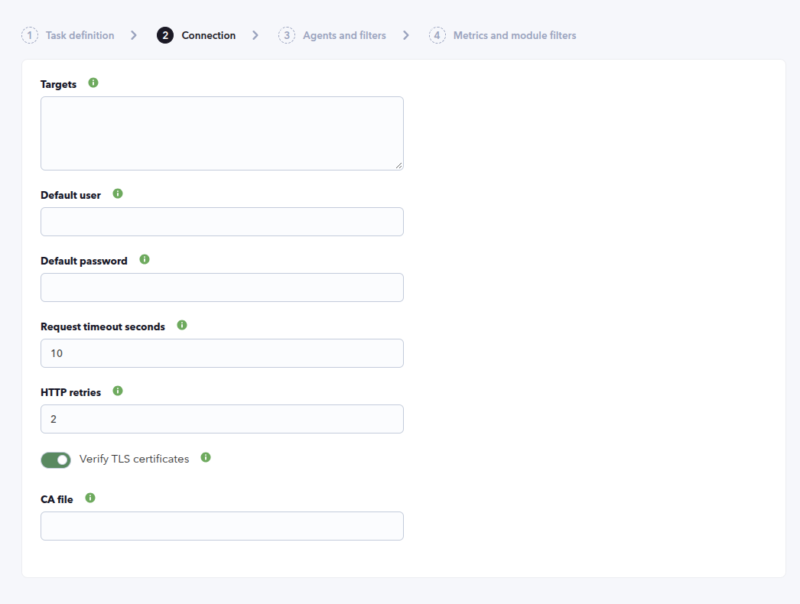
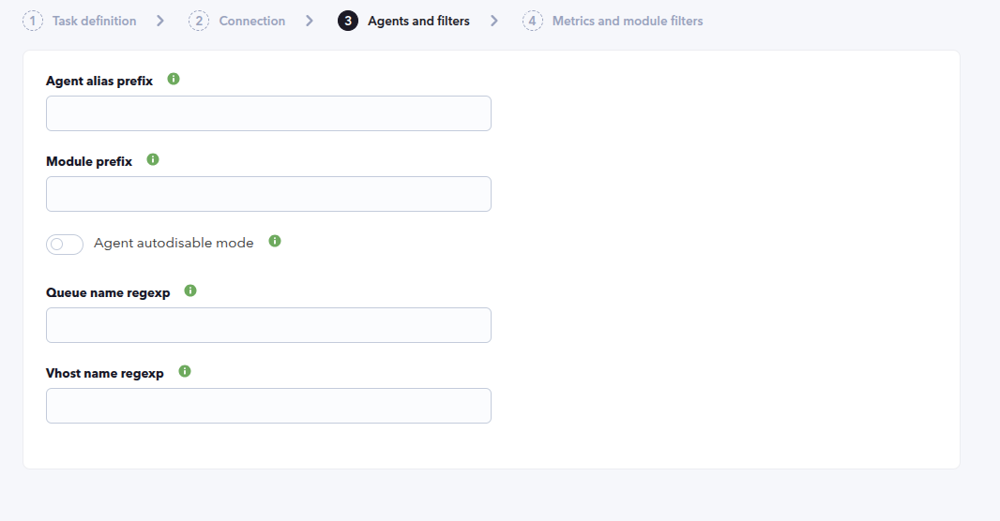
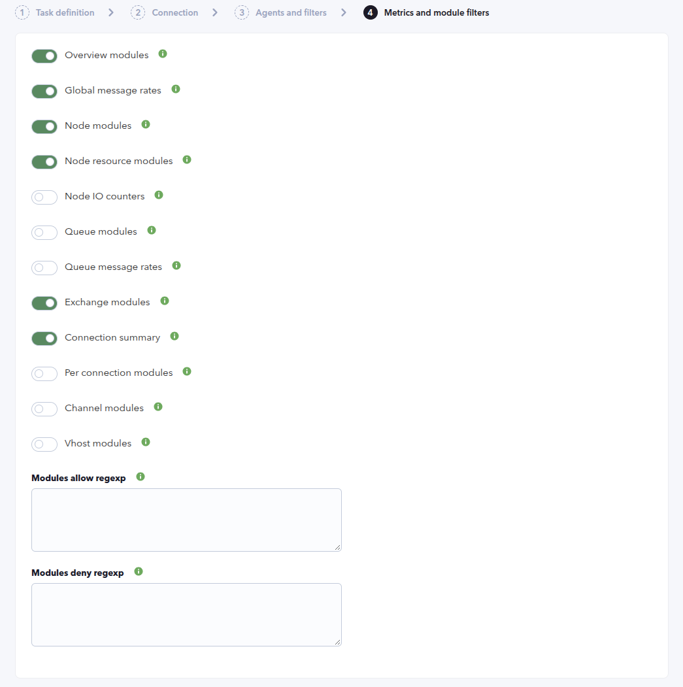
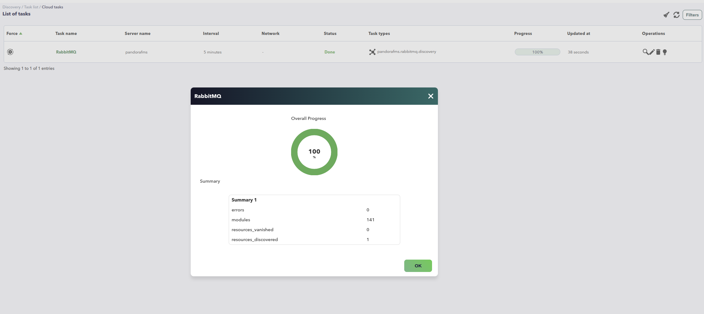
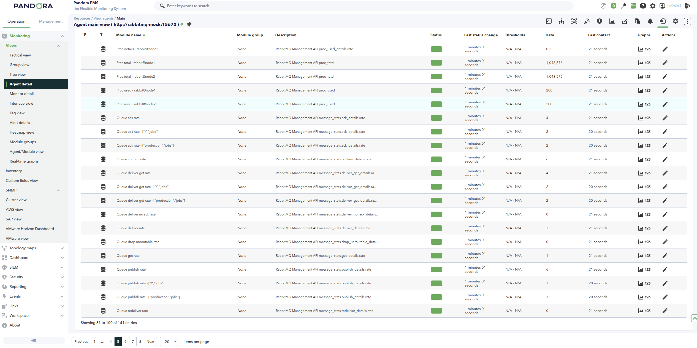
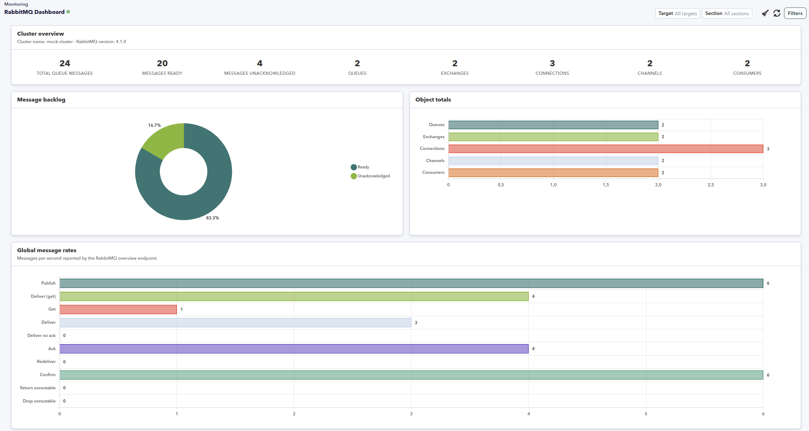
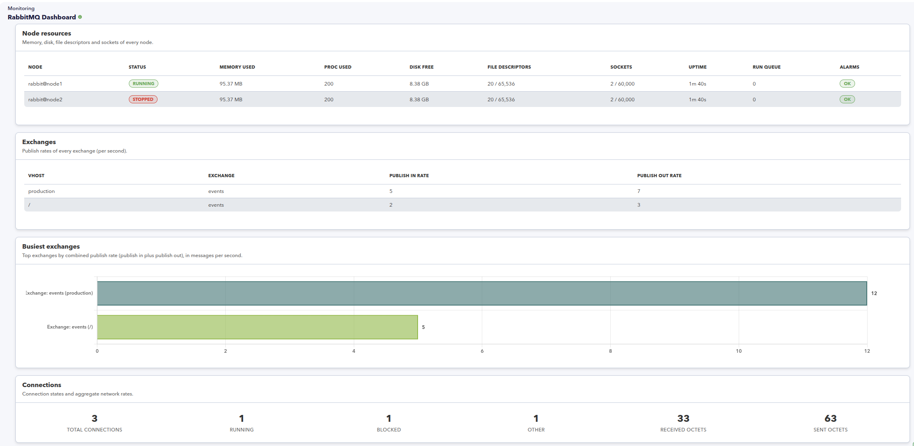
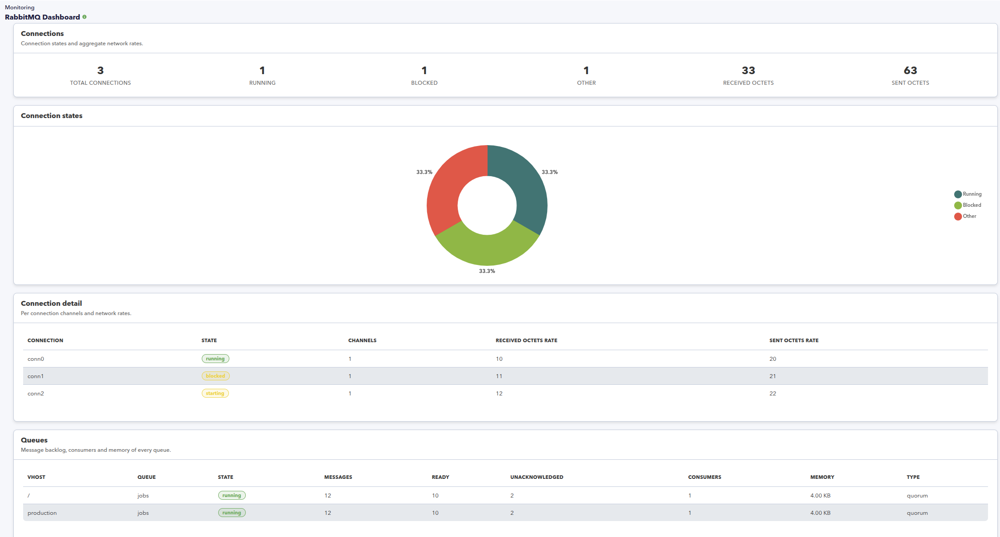
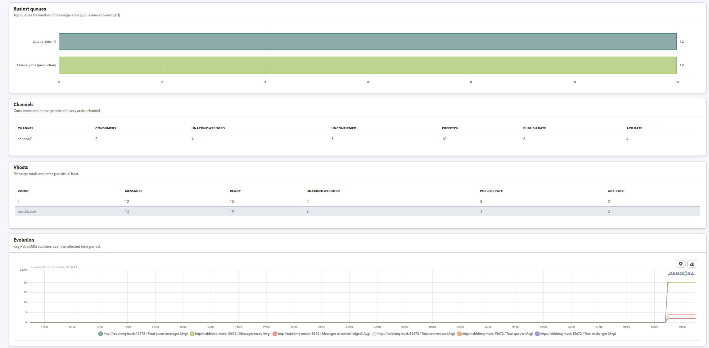

# RabbitMQ Discovery

*Article last updated: 2026-10-01.*

## What it monitors

The RabbitMQ Discovery plugin connects to one or more RabbitMQ brokers through their Management API and turns the state and performance of the cluster into Pandora FMS agents and modules. It reads a list of targets given as Management API URLs, authenticates with HTTP Basic credentials, and collects cluster, node, exchange, connection, queue, channel and virtual host data through the read endpoints of the API.

A Discovery task creates one agent per target. Every metric group is optional and controlled from the task, so the same plugin can collect only the cluster overview or the full inventory of queues, channels and virtual hosts.

A companion console extension, **RabbitMQ Dashboard**, presents the generated agents and modules in a single monitoring view.

## Prepare

### Compatibility

| Scope | State | Evidence |
| --- | --- | --- |
| Plugin version `1.0` (`pandorafms.rabbitmq.discovery`) | Documented target | The version this page describes, as identified by the package definition. See [Plugin identity](#plugin-identity). |
| A reachable RabbitMQ Management API endpoint | `Required` | The plugin establishes remote connections to each target and queries its `/api` endpoints. Prerequisite, not a compatibility statement. |
| The RabbitMQ management plugin enabled on each broker | `Required` | The collected data is served by the Management API. Without it the endpoints are not available. Prerequisite, not a compatibility statement. |
| A RabbitMQ user able to read the Management API | `Required` | The plugin authenticates with HTTP Basic credentials on every request. Prerequisite, not a compatibility statement. See [Prepare RabbitMQ access](#prepare-rabbitmq-access). |
| A specific RabbitMQ version | `Not validated` | No published test record establishes compatibility with a concrete RabbitMQ release. |
| A specific Pandora FMS version | `Not validated` | No published test record establishes console or server version compatibility. |
| A specific host operating system | `Not validated` | No published test record establishes operating-system compatibility for the machine that runs the plugin. |

### Prerequisites

1. **A Pandora FMS server with Discovery enabled** to run the task, and a console to define it.
2. **The RabbitMQ management plugin enabled** on every broker to monitor, so the Management API is served.
3. **Connectivity** between the Pandora FMS server and each broker's Management API (default port `15672` for HTTP, `443` for HTTPS).
4. **A RabbitMQ user with read access to the Management API.** See [Prepare RabbitMQ access](#prepare-rabbitmq-access).
5. **A target agent group and a monitoring interval** for the generated agents, taken from the Discovery task.

The plugin is distributed as a Pandora FMS Discovery application (`.disco` package) with its Python dependencies bundled, so no extra Python libraries have to be installed on the Discovery server.

### Prepare RabbitMQ access

The plugin authenticates against the Management API with HTTP Basic and only issues read (`GET`) requests, so the account only needs access to the endpoints the task queries.

- **Enable the management plugin** on each broker and confirm the Management API responds, for example `https://<TARGET_HOST>:15672/api/overview`.
- **Create a dedicated user** and grant it the least privileges that allow reading the Management API of the virtual hosts being monitored. No management write access is required.
- **Prefer HTTPS.** Over plain HTTP the Basic credentials travel unencrypted. To use HTTPS with a private certificate authority, set **CA file** to the PEM bundle on the Pandora server.

The plugin never publishes, consumes or changes RabbitMQ resources; it only reads the API.

### Install the plugin

Load the `.disco` package from **Management → Discovery → Extension manager** (the *Manage disco packages* view). Once loaded, **RabbitMQ** appears under the **Applications** category of the Discovery wizard.

The companion **RabbitMQ Dashboard** is a console extension. Install it as a console extension package; once installed it adds the **RabbitMQ Dashboard** entry to the **Monitoring** menu. It requires the agents generated by this plugin to exist.

## Configure the Discovery task

Create the task from **Management → Discovery → Applications → RabbitMQ**. The generic first step defines the task; the package adds **Connection**, **Agents and filters** and **Metrics and module filters**. Every field is documented in [Task parameters](#task-parameters).

**Step 1 — Task definition.** Name, agent group, server and interval. The group ID and the interval are passed to the plugin and applied to every generated agent.

**Step 2 — Connection.** The targets to connect to and how the API is reached:

- **Targets** is the list of Management API URLs, one per line or comma-separated. Each entry is a plain URL, for example `http://172.17.0.2:15672`, or a JSON object with `url`, `user`, `password` and `alias`. Lines starting with `#` are comments. See [Targets file](#targets-file).
- **Default user** and **Default password** apply to targets that do not carry their own credentials inline, and to plain URL targets.
- **Request timeout seconds** and **HTTP retries** tune how the API is called.
- **Verify TLS certificates** validates HTTPS certificates and hostnames, and **CA file** points to an optional PEM bundle on the Pandora server.



**Step 3 — Agents and filters.** Agent naming and the resource filters:

- **Agent alias prefix** is prepended to the agent display alias. The agent identity is not affected.
- **Module prefix** is prepended to every generated module name.
- **Agent autodisable mode** creates the generated agents in Pandora FMS mode `2`, which disables an agent when all its modules become unknown.
- **Queue name regexp** and **Vhost name regexp** restrict which queues, exchanges and virtual hosts are collected. Empty matches all.



**Step 4 — Metrics and module filters.** Which metric groups are collected and which modules are kept:

- The twelve toggles enable the cluster overview, the global message rates, the node metrics and resources, the node IO counters, the queue metrics and rates, the exchanges, the connection summary and per-connection detail, the channels and the virtual hosts.
- **Modules allow regexp** and **Modules deny regexp** filter the final module names. The deny list takes priority over the allow list.



## Verify the first run

Force the task from **Management → Discovery → Task list** and check the result in this order.

1. **The task summary** reports `resources_discovered`, `resources_vanished`, `modules` and `errors`. `resources_discovered` is the number of reachable targets; `errors` counts the API endpoints that failed during the run. The example below shows a single target discovered with `141` modules and no errors.

2. **The agent.** One agent appears per reachable target, named `rabbitmq-<identifier>` with the alias taken from the target URL or its `alias`. An unreachable target produces no agent and is reported in the execution information.

3. **The modules.** The agent carries the `Availability` module plus the metric groups enabled in step 4, according to what the broker reports.



The agent detail lists the generated modules with their current value, state and description.



## Understand the results

### Agents and identity

The plugin creates one agent per target. The agent name is `rabbitmq-` followed by a 32-character identifier derived from the task and the normalized target URL, so the name is stable across runs for the same task and target. The alias is the target alias when provided, or the target URL, with the **Agent alias prefix** prepended.

Each generated agent reports `Other` as its operating system, belongs to the task's group (by ID) with the task interval, and carries the base address of the target. It is marked with the agent-level `extra_data` value `rabbitmq:agent:<identifier>`, which lets the console and the companion dashboard identify it as a RabbitMQ discovery agent. With **Agent autodisable mode** enabled the agents are created in Pandora FMS mode `2`.

Targets are grouped by their normalized URL; duplicate normalized URLs are rejected. Targets that do not carry inline credentials use the task's **Default user** and **Default password**.

### Modules by agent

Every module is created on the target agent; the resource name is appended to the module name so a single agent can hold every node, queue, channel or virtual host. Resource suffixes are `<label> - <node>` for nodes, `<label> - channel <name>` for channels, `<label> - vhost <name>` for virtual hosts, `<label> - connection <name>` for connections, and `<label> - ["<vhost>","<name>"]` for queues and exchanges.

| Toggle | Modules it adds |
| --- | --- |
| **Overview modules** | Cluster name, RabbitMQ version, message totals and object totals |
| **Global message rates** | Global publish, deliver, get, ack, confirm and related rates |
| **Node modules** | Node status, memory and Erlang process metrics per node |
| **Node resource modules** | Limits, alarms, descriptors, sockets, uptime and run queue per node |
| **Node IO counters** | Read/write operation, byte and garbage-collection counters per node |
| **Queue modules** | Per-queue messages, consumers, memory, state and type |
| **Queue message rates** | Per-queue publish, deliver, ack and redeliver rates |
| **Exchange modules** | Aggregate exchange rates and per-exchange publish in/out rates |
| **Connection summary** | Connection totals and aggregate network rates |
| **Per connection modules** | Per-connection channels, network rates and state |
| **Channel modules** | Per-channel consumers, counters and rates |
| **Vhost modules** | Per-virtual-host message totals and rates |

Module names are `<Module prefix>` plus the module name. The exhaustive inventory and the exact API field behind each module are in [Generated modules and agents](#generated-modules-and-agents).

### RabbitMQ Dashboard

**RabbitMQ Dashboard** is a companion console extension that reads the agents marked with `rabbitmq:agent:` (and, as a fallback, agents named `rabbitmq-`) and their enabled modules, and presents them in one view. It appears in the **Monitoring** menu and requires the standard agent read permission.

The dashboard has three filters: **Target** (one agent or all), **Section** (one section or all) and **Chart period** for the history graph. The available sections are **Overview**, **Message rates**, **Nodes**, **Exchanges**, **Connections**, **Queues**, **Channels**, **Vhosts** and **History**.

- **Overview** shows the cluster KPIs, the message backlog (ready versus unacknowledged) and the object totals. **Message rates** charts the global rates reported by the overview endpoint.



- **Nodes** lists every node with its status, memory, process, disk, descriptor, socket, uptime, run queue and alarms. **Exchanges** lists the publish in/out rates and the busiest exchanges.



- **Connections** shows the connection summary, the state breakdown and the per-connection detail. **Queues** lists every queue with its state, backlog, consumers, memory and type.



- **Channels** and **Vhosts** list the per-resource consumers and message rates. **History** plots the key counters over the selected period.



When no RabbitMQ agent is found, the dashboard shows the message *No RabbitMQ data found* with the instruction to run the discovery task and verify that the agents and modules were created.

## Operate

### Manual execution

The plugin can run outside Discovery, from a Pandora FMS agent or directly from the command line, with a configuration file, a targets file and the optional module filter files:

```bash
./pandora_rabbitmq --conf <PATH_TO_CONFIG> --targets-file <PATH_TO_TARGETS> --module-allow-list-file <PATH_TO_ALLOW> --module-deny-list-file <PATH_TO_DENY>
```

Only `--conf` and `--targets-file` are required. The plugin reads each target, collects the enabled metric groups and prints the Discovery JSON output with the agents and modules on standard output. See [Configuration file](#configuration-file) and [Command-line execution](#command-line-execution).

The targets file may embed a username and a password. Restrict it to the account that runs the plugin and keep it out of shared directories, logs and version control. When the credentials travel in command arguments, shell history and the process list may expose them; prefer the configuration file.

## Troubleshoot

| Symptom | Check |
| --- | --- |
| No agent is created and the execution information logs a connection or timeout error | Confirm the broker is reachable from the Pandora FMS server on its Management API port (default `15672` for HTTP), that the management plugin is enabled and that the target URL is correct. |
| The execution information logs `HTTP 401` | The user or password is wrong, or the user cannot read the Management API. Review **Default user** and **Default password**, and the inline credentials of the target. |
| The execution information logs `HTTP 404` | The URL does not point to the Management API of the broker. Check the host and port, and remove any `/api` suffix, which the plugin strips automatically. |
| TLS certificate errors | Set **CA file** to the PEM bundle that signs the broker certificate, or disable **Verify TLS certificates** only for trusted test environments. |
| The queue or virtual host inventory is empty while the cluster overview works | Enable **Queue modules**, **Queue message rates**, **Channel modules** or **Vhost modules**, and review **Queue name regexp** and **Vhost name regexp**: an empty value matches everything, a non-matching expression keeps nothing. |
| Expected modules are missing | Review the **Metrics and module filters** toggles and the **Modules allow regexp** / **Modules deny regexp** filters. The deny list is applied after the allow list. |
| The dashboard shows *No RabbitMQ data found* | Run the discovery task and confirm the plugin created agents marked `rabbitmq:agent:` (or named `rabbitmq-`), and that the console account can read them. |

## Reference

### Task parameters

The console presents the task fields in three steps after the generic task definition. The macro column is the identifier used in the generated task configuration.

#### Connection

| Field | Macro | Type | Default | Notes |
| --- | --- | --- | --- | --- |
| Targets | `_targets_` | textarea | — | Management API URLs, one per line or comma-separated, or JSON target objects. Required |
| Default user | `_user_` | string | — | User for targets without their own credentials. Every target needs a user |
| Default password | `_password_` | password | — | Password for targets without their own credentials |
| Request timeout seconds | `_timeout_` | string | `10` | Timeout of every HTTP request. Must be positive |
| HTTP retries | `_retries_` | string | `2` | Retries for transient HTTP errors, between `0` and `5` |
| Verify TLS certificates | `_verifytls_` | checkbox | on | Validates HTTPS certificates and hostnames |
| CA file | `_cafile_` | string | — | Optional PEM CA bundle on the Pandora server, used for HTTPS targets |

#### Agents and filters

| Field | Macro | Type | Default | Notes |
| --- | --- | --- | --- | --- |
| Agent alias prefix | `_agentprefix_` | string | — | Prefix for the display alias; the agent identity is unchanged |
| Module prefix | `_moduleprefix_` | string | — | Prefix for all generated module names |
| Agent autodisable mode | `_agentautodisable_` | checkbox | off | Creates the agents in Pandora FMS mode `2` |
| Queue name regexp | `_queuefilter_` | string | — | Queue name filter. Empty matches all |
| Vhost name regexp | `_vhostfilter_` | string | — | Vhost filter for queues, exchanges and vhosts. Empty matches all |

#### Metrics and module filters

| Field | Macro | Type | Default | Notes |
| --- | --- | --- | --- | --- |
| Overview modules | `_overviewenabled_` | checkbox | on | Cluster name, version, message totals and object totals |
| Global message rates | `_messageratesenabled_` | checkbox | on | Global publish, deliver, get, ack, confirm and related rates |
| Node modules | `_nodesenabled_` | checkbox | on | Node status, memory and Erlang process metrics |
| Node resource modules | `_noderesourcesenabled_` | checkbox | on | Limits, alarms, descriptors, sockets, uptime and run queue |
| Node IO counters | `_nodeioenabled_` | checkbox | off | Read/write operation, byte and garbage-collection counters |
| Queue modules | `_queuesenabled_` | checkbox | off | Per-queue messages, consumers, memory, state and type |
| Queue message rates | `_queueratesenabled_` | checkbox | off | Per-queue publish, deliver, ack and redeliver rates |
| Exchange modules | `_exchangesenabled_` | checkbox | on | Aggregate and per-exchange publish rates |
| Connection summary | `_connectionsenabled_` | checkbox | on | Connection totals and aggregate network rates |
| Per connection modules | `_connectiondetailsenabled_` | checkbox | off | Per-connection channels, network rates and state |
| Channel modules | `_channelsenabled_` | checkbox | off | Per-channel consumers, counters and rates |
| Vhost modules | `_vhostsenabled_` | checkbox | off | Per-virtual-host message totals and rates |
| Modules allow regexp | `_moduleallowlist_` | textarea | — | One regular expression per line. Matches final module names |
| Modules deny regexp | `_moduledenylist_` | textarea | — | One regular expression per line. Deny takes priority over allow |

### Configuration file

The Discovery task builds a temporary `--conf` file from its own fields. A manual run supplies it directly. The file has a `[CONF]` section; a file without a section header is read as if it had one.

| Key | Default | Description |
| --- | --- | --- |
| `user` | Empty | Default user for targets without their own credentials |
| `pass` | Empty | Default password for targets without their own credentials |
| `timeout` | `10` | Timeout of every HTTP request, in seconds |
| `retries` | `2` | Retries for transient HTTP errors, between `0` and `5` |
| `verify_tls` | `1` | Validates HTTPS certificates and hostnames |
| `ca_file` | Empty | PEM CA bundle used for HTTPS targets |
| `task_id` | — | Task identifier; used to derive the stable agent name. Required |
| `group_id` | `0` | ID of the group where the agents are created. Must be positive |
| `interval` | `300` | Monitoring interval in seconds, inherited by the agents |
| `agent_prefix` | Empty | Prefix for the agent display alias |
| `module_prefix` | Empty | Prefix for all module names |
| `agent_autodisable` | `0` | Creates the agents in Pandora FMS mode `2` when enabled |
| `queue_filter` | Empty | Queue name regular expression |
| `vhost_filter` | Empty | Vhost regular expression for queues, exchanges and vhosts |
| `overview_enabled` | `1` | Enables the overview modules |
| `message_rates_enabled` | `1` | Enables the global message rates |
| `nodes_enabled` | `1` | Enables the node modules |
| `node_resources_enabled` | `1` | Enables the node resource modules |
| `node_io_enabled` | `0` | Enables the node IO counters |
| `queues_enabled` | `0` | Enables the queue modules |
| `queue_rates_enabled` | `0` | Enables the queue message rates |
| `exchanges_enabled` | `1` | Enables the exchange modules |
| `connections_enabled` | `1` | Enables the connection summary |
| `connection_details_enabled` | `0` | Enables the per-connection modules |
| `channels_enabled` | `0` | Enables the channel modules |
| `vhosts_enabled` | `0` | Enables the vhost modules |
| `module_allow_list` | Empty | Inline allow regular expressions, one per line |
| `module_deny_list` | Empty | Inline deny regular expressions, one per line |

### Targets file

The `--targets-file` file holds the targets. It accepts a JSON array of target objects:

```json
[
  {"url": "http://172.17.0.2:15672", "user": "monitor", "password": "<PASSWORD>", "alias": "RabbitMQ lab"},
  {"url": "https://rabbitmq-prod.internal.company.com", "user": "monitor", "password": "<PASSWORD>"}
]
```

or a plain list separated by commas or newlines, with lines starting by `#` ignored:

```text
# Production cluster
http://172.17.0.2:15672
https://rabbitmq-prod.internal.company.com
```

Each URL is normalized before use: `http://` is assumed when the scheme is missing, the port defaults to `443` for HTTPS and `15672` for HTTP, a trailing `/api` is removed, and embedded credentials, query strings and fragments are rejected. Duplicate normalized URLs are rejected, and every target requires a user, either inline or from the default.

### Module filter files

`--module-allow-list-file` and `--module-deny-list-file` hold one regular expression per line, matched against the final module names (after the module prefix). A module is kept when it matches the allow list (or the allow list is empty) and does not match the deny list. The same expressions can be supplied inline through the `module_allow_list` and `module_deny_list` configuration keys instead.

### Command-line execution

```bash
./pandora_rabbitmq --conf <PATH_TO_CONFIG> --targets-file <PATH_TO_TARGETS> --module-allow-list-file <PATH_TO_ALLOW> --module-deny-list-file <PATH_TO_DENY>
```

| Option | Description |
| --- | --- |
| `--conf` | Path to the configuration file. Required in Discovery |
| `--targets-file` | Path to the file with the targets |
| `--module-allow-list-file` | Path to the file with the allow regular expressions |
| `--module-deny-list-file` | Path to the file with the deny regular expressions |
| `--host` | Single target URL, used when no targets file is given |
| `--user`, `--pass` | Default credentials |
| `--group-id`, `--interval` | Group ID and interval for the generated agents |
| `--task-id` | Task identifier used to derive the agent name |
| `--timeout`, `--retries`, `--ca-file` | HTTP and TLS options |
| `--agent-prefix`, `--module-prefix` | Alias and module prefixes |
| `--version` | Prints the plugin version |

Example configuration file:

```ini
[CONF]
user=monitor
pass=<PASSWORD>
timeout=10
retries=2
verify_tls=1
task_id=manual
group_id=10
interval=300
overview_enabled=1
message_rates_enabled=1
nodes_enabled=1
node_resources_enabled=1
exchanges_enabled=1
connections_enabled=1
```

### Generated modules and agents

Module names are `<Module prefix><module name>`. Resource modules append ` - <resource>` as described in [Modules by agent](#modules-by-agent).

**Target agent** (one per reachable target)

Always created:

- `Availability`: `generic_proc`, `1` when the cluster overview was read, `0` otherwise.

Created when the matching toggle is enabled:

- **Overview modules**: `Cluster name` and `RabbitMQ version` (`generic_data_string`), `Total queue messages`, `Messages ready`, `Messages unacknowledged`, `Overview connections`, `Total queues`, `Total exchanges`, `Total channels` and `Total consumers` (`generic_data`).
- **Global message rates** (per rate): `Queue publish rate`, `Queue deliver get rate`, `Queue get rate`, `Queue deliver rate`, `Queue deliver no ack rate`, `Queue ack rate`, `Queue redeliver rate`, `Queue confirm rate`, `Queue return unroutable rate` and `Queue drop unroutable rate` (`generic_data`).
- **Node modules** (per node): `Node status` (`generic_proc`), `Memory used`, `Memory rate`, `Proc used` and `Proc details` (`generic_data`).
- **Node resource modules** (per node): `Memory limit`, `Disk free`, `Disk free limit`, `File descriptors used`, `File descriptors total`, `Sockets used`, `Sockets total`, `Proc total`, `Uptime ms` and `Run queue` (`generic_data`), and `Memory alarm` and `Disk alarm` (`generic_proc`).
- **Node IO counters** (per node): `Io read count`, `Io write count`, `Io read bytes`, `Io write bytes`, `Gc num` and `Gc bytes reclaimed` (`generic_data_inc`).
- **Queue modules** (per queue): `Messages`, `Messages ready`, `Messages unacknowledged`, `Consumers`, `Consumer capacity`, `Memory`, `Message bytes` and `Messages ram` (`generic_data`), and `State` and `Type` (`generic_data_string`).
- **Queue message rates** (per queue): `Queue publish rate`, `Queue deliver get rate`, `Queue ack rate` and `Queue redeliver rate` (`generic_data`).
- **Exchange modules**: `Exchanges in rate` and `Exchanges out rate` (`generic_data`), plus `Exchange publish in rate` and `Exchange publish out rate` (`generic_data`) per exchange. The aggregate rates are created only when every exchange reports the underlying rate.
- **Connection summary**: `Total connections`, `Connections running`, `Connections blocked`, `Connections other`, `Total received octets rate` and `Total sent octets rate` (`generic_data`).
- **Per connection modules** (per connection): `Channels`, `Received octets rate` and `Sent octets rate` (`generic_data`), and `State` (`generic_data_string`).
- **Channel modules** (per channel): `Consumers`, `Messages unacknowledged`, `Messages unconfirmed` and `Prefetch count` (`generic_data`), plus `Channel publish rate`, `Channel deliver get rate`, `Channel ack rate` and `Channel redeliver rate` (`generic_data`).
- **Vhost modules** (per vhost): `Messages`, `Messages ready` and `Messages unacknowledged` (`generic_data`), plus `Vhost publish rate`, `Vhost deliver get rate`, `Vhost ack rate` and `Vhost redeliver rate` (`generic_data`).

### Agent fields

| Field | Value |
| --- | --- |
| Agent name | `rabbitmq-<identifier>`, where `<identifier>` is derived from the task and the normalized target URL |
| Agent alias | `<Agent alias prefix>` plus the target `alias`, or the target URL |
| Operating system | `Other` |
| Address | Host name of the target URL |
| Group | The Discovery task group, by ID |
| Interval | The Discovery task interval |
| Agent mode | `1`, or `2` when **Agent autodisable mode** is enabled |
| `extra_data` | `rabbitmq:agent:<identifier>` |
| Description | `RabbitMQ Management API <target URL>` |

### Plugin identity

| Field | Value |
| --- | --- |
| App short name | `pandorafms.rabbitmq.discovery` |
| Plugin version | `1.0` |
| Type | Discovery application (`.disco`) |
| Section | Discovery → Applications |
| Companion extension | RabbitMQ Dashboard |
