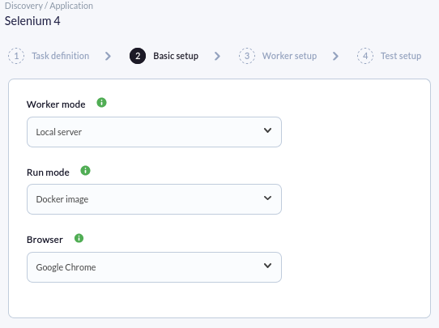
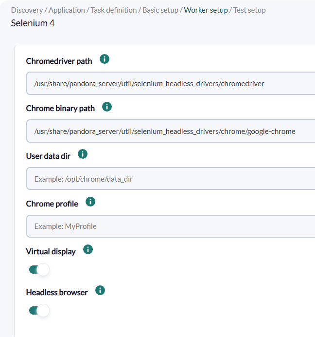
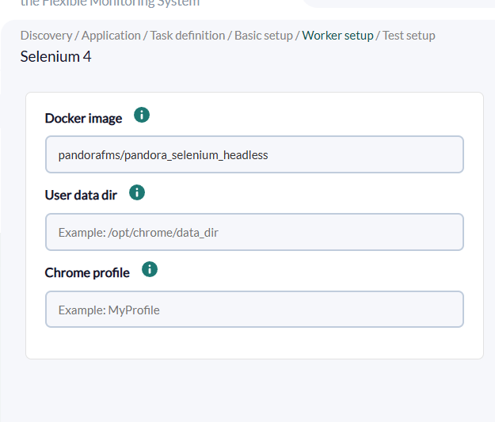
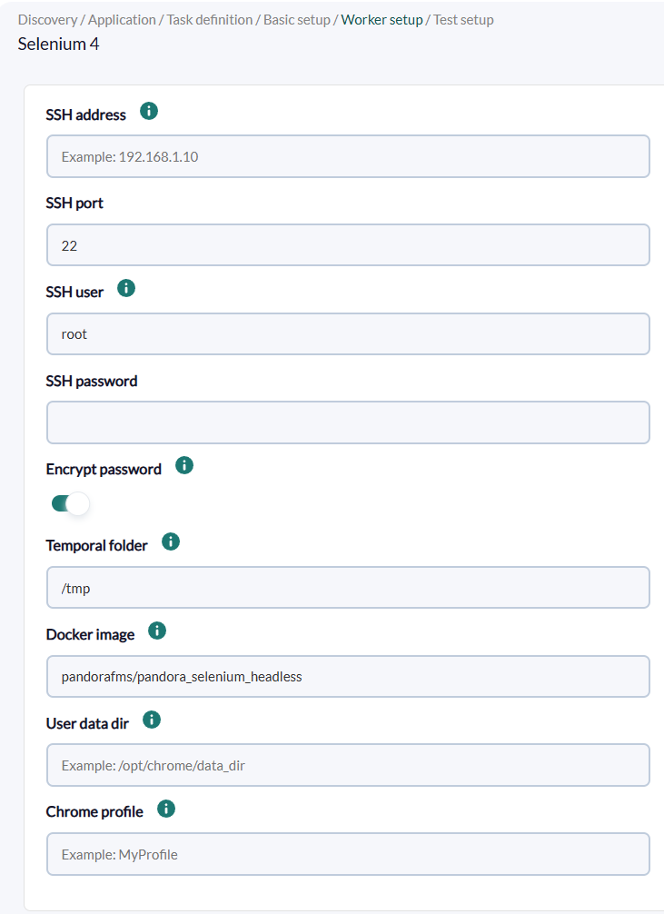
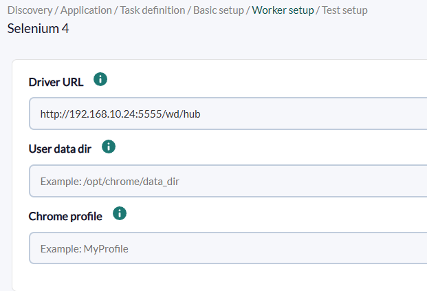
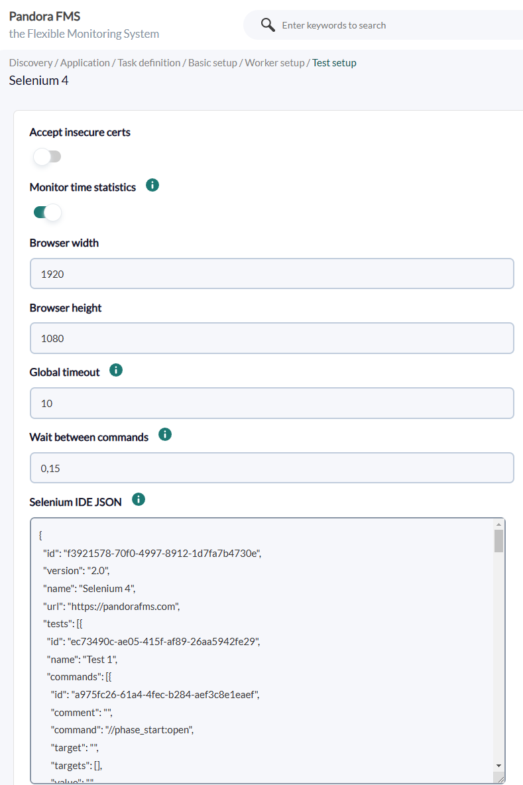
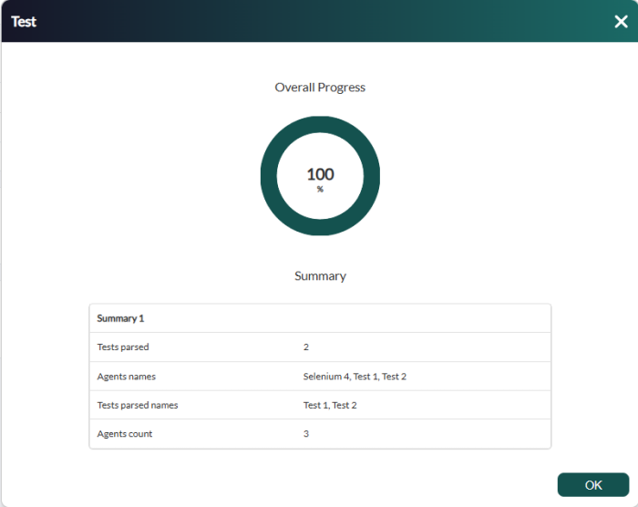

# Selenium 4 Discovery

*Article last updated: 2026-09-08.*

## What it monitors

The Selenium 4 Discovery plugin (WUX, web user experience monitoring) runs web transactions recorded with the Selenium IDE browser extension against a real Google Chrome or Mozilla Firefox browser and turns each recorded test into a Pandora FMS agent with the transaction results. It reads the transaction from a Selenium IDE `.side` file (Selenium JSON format) and drives the browser through the Selenium 4 WebDriver API.

A Discovery task can execute the recorded tests in four modes: a local Selenium driver on the Pandora FMS server, a remote Selenium 4 server, a Docker container on the Discovery server, or a Docker container on a remote worker reached over SSH. One agent is created per test in the project, plus one agent per project with connection statistics when **Monitor time statistics** is enabled.

## Prepare

### Compatibility

| Scope | State | Evidence |
| --- | --- | --- |
| Plugin version `1.8` (`pandorafms.selenium.4`) | Documented target | The version this page describes, as identified by the package definition. See [Plugin identity](#plugin-identity). |
| Pandora FMS Discovery, version `780` or later | `Known compatible` | The official WUX manual states WUX centralized in Discovery is based on Selenium 4, is available since Pandora FMS 780 and is the recommended method from version 782. |
| Google Chrome and Mozilla Firefox | `Supported` | The official WUX manual describes the plugin running transactions with these browsers and recommends using the same browser where the transaction was recorded. |
| A specific host operating system for the worker | `Not validated` | No published test record establishes operating-system compatibility for the machine that executes the tests. |
| A Selenium 4 server reachable over HTTP | `Required` | Remote Driver mode connects to the WebDriver endpoint of the configured URL. Prerequisite, not a compatibility statement. |
| A Docker engine | `Required` | Docker modes run the browser container on the Discovery server (Local Docker) or on the SSH worker (Remote Docker). Prerequisite, not a compatibility statement. |
| `curl` for connection statistics | `Required` | URL statistics are measured with `curl`. Prerequisite, not a compatibility statement. |
| An SSH account able to start Docker containers and write to the temporary folder | `Required` | Remote Docker mode copies the plugin and the transaction to the worker and runs Docker there. Prerequisite, not a compatibility statement. |

### Prerequisites

1. **A Pandora FMS server with Discovery enabled** to run the task, and a console to define it.
2. **A transaction recorded with Selenium IDE** (Google Chrome or Mozilla Firefox extension). The project is exported as a `.side` file, whose JSON content is pasted into the task's **Selenium IDE JSON** field.
3. **A target agent group and a monitoring interval** for the generated agents, taken from the Discovery task. Agents are created in that group by its ID and inherit the interval.
4. **The chosen execution mode prepared on the machine that runs it.** See [Prepare the execution mode](#prepare-the-execution-mode).

The plugin is distributed as a Pandora FMS Discovery application (`.disco` package) with its runtime dependencies bundled, so no Python packages have to be installed on the Discovery server. The package also ships the `worker_setup` and `password_encrypter` helpers used by the Discovery wizard.

### Prepare the execution mode

**Local Driver.** The plugin uses Google Chrome or Mozilla Firefox installed on the machine where the task runs. The binaries are searched by default under `/usr/share/pandora_server/util/selenium_headless_drivers/` (`chrome/google-chrome`, `chromedriver`, `firefox/firefox`, `geckodriver`); a driver package for these paths is available from the Pandora FMS library, or you can configure different paths in the task. The browser system dependencies must also be installed: for Firefox `gtk3`, `alsa-lib` and `libX11-xcb`; for Google Chrome `nss`, `libdrm` and `mesa-libgbm`. The task runs the browser either headless or on a virtual display (Xvfb); otherwise the machine needs a physical desktop attached.

**Remote Driver.** The plugin connects to a Selenium 4 server through its WebDriver endpoint, for example `http://<SELENIUM_SERVER>:4444/wd/hub`. The Discovery server must be able to reach that endpoint; the default listening port of a Selenium Grid is `4444`.

**Local Docker.** The plugin starts a Docker container on the Discovery server with an image that bundles the browsers and drivers under `/tmp/lib`. The default image is `pandorafms/pandora_selenium_headless:el9`; make sure it is available on the server (for example with `docker pull`). The image bundles `curl` for the connection statistics.

**Remote Docker.** The plugin connects over SSH to a remote worker that has Docker, copies itself and the transaction file there, and runs the Docker container remotely. The SSH user must be able to start containers and write to the temporary folder (default `/tmp`). The SSH password is encrypted by the wizard before it is stored in the task configuration.

Browser profiles are optional in every mode. A **Firefox profile** path, a Chrome **User data dir** and a Chrome **profile** must exist on the machine that starts the browser; in Docker modes those folders are mounted into the container as volumes, so the paths are read from the host that runs Docker.

### Install the plugin

Load the `.disco` package from **Management → Discovery → Extension manager** (the *Manage disco packages* view). The package is available from the Pandora FMS library at the [Selenium 4 Marketplace entry](https://marketplace.pandorafms.com/entries/pandorafms.selenium.4). Once loaded, **Selenium 4** appears under the **Applications** category of the Discovery wizard.

## Configure the Discovery task

Create the task from **Management → Discovery → Applications → Selenium 4**. The generic first step defines the task; the package adds **Basic setup**, **Worker setup** and **Test setup**. Every field is documented in [Task parameters](#task-parameters).

**Step 1 — Task definition.** Name, agent group, server and interval. The group ID and the interval are passed to the plugin and applied to every generated agent.

**Step 2 — Basic setup.** Execution mode and browser:

- **Worker mode** selects where the tests run: **Local server** or **Remote server**.
- **Run mode** selects how the browser is driven: **Selenium driver** or **Docker image**.
- **Browser** selects **Mozilla Firefox** or **Google Chrome**. Pandora recommends using the same browser where the transaction was recorded.



**Step 3 — Worker setup.** The fields shown here depend on the combination chosen in Step 2:

- **Remote server + Selenium driver**: **Driver URL**, the Selenium 4 WebDriver endpoint, for example `http://192.168.1.10:4444/wd/hub`.
- **Remote server + Docker image**: **SSH address**, **SSH port** (default `22`), **SSH user**, **SSH password** (encrypted by default via **Encrypt password**) and **Temporal folder** (default `/tmp`).
- **Docker image** (either Docker mode): image name. Leave empty to use the default `pandorafms/pandora_selenium_headless:el9`. The image must contain the browser drivers under `/tmp/lib`.
- **Firefox**: **Geckodriver path** and **Firefox binary path** (Local server + Selenium driver only), and **Firefox profile** (any mode).
- **Chrome**: **Chromedriver path** and **Chrome binary path** (Local server + Selenium driver only), **User data dir** and **Chrome profile** (any mode).
- **Local server + Selenium driver**: **Virtual display** and **Headless browser**. Pandora recommends leaving both enabled.









**Step 4 — Test setup.** Transaction behaviour:

- **Accept insecure certs** accepts self-signed or invalid TLS certificates during the transaction.
- **Monitor time statistics** creates the project statistics agent with connection timings for the main URL of the transaction.
- **Browser width** and **Browser height** set the browser window size (defaults `1920`×`1080`).
- **Global timeout** is the default timeout, in seconds, for the Selenium commands and for operations such as opening the session (default `10`).
- **Wait between commands** adds a pause, in seconds, between the commands of the transaction (default `0.15`).
- **Monitor errors** creates dedicated string modules — `Global error` and `Phase <N> error` — that report `OK` or the latest error text of each transaction and phase, preserving the failure history.
- **Selenium IDE JSON** holds the full JSON content of the recorded `.side` file.



When **Encrypt password** is enabled, the SSH password is encrypted by the packaged `password_encrypter` helper before it is stored in the task configuration, and decrypted by the plugin when the task runs.

## Verify the first run

Force the task from **Management → Discovery → Task list** and check the result in this order.

1. **The task summary** reports the parsed tests and the generated agents. Expect **Tests parsed** to match the tests in the project and **Agents count** to match the number of test agents, plus the statistics agent when **Monitor time statistics** is enabled.

2. **The agents.** One agent `WUX Discovery - <test name>` appears per test in the project, and one agent `WUX Discovery - <project name>` appears when **Monitor time statistics** is enabled.

3. **The transaction modules.** Every test agent carries **Global status** (`1` on success), **Global time** (seconds) and **Last error screenshot** (a screenshot when the test failed, `None` when it succeeded).

4. **The statistics modules.** When **Monitor time statistics** is enabled, the project agent carries **URL status** and the **URL stat** timing modules.

If no agent appears, the execution mode requirements — drivers, Docker, SSH access or the Selenium server URL — are the first thing to check.



## Understand the results

### Agents and identity

The plugin creates one agent per test in the Selenium IDE project, named `WUX Discovery - <test name>`, and one agent per project, named `WUX Discovery - <project name>`, only when **Monitor time statistics** is enabled. Agents are created in the task's group (by ID) and inherit the task interval.

The internal Pandora FMS name of each agent is `a` + the MD5 hash of the test or project name, so repeated runs of the same task update the same agents, and renaming a test or project in the Selenium IDE changes the agent.

### Modules by agent

| Agent | Created when | Modules it carries |
| --- | --- | --- |
| `WUX Discovery - <test name>` | The project contains a test | `Global status`, `Global time`, `Last error screenshot`; `Phase <name> status`, `Phase <name> time` and, with **Monitor errors**, `Phase <name> error` for each phase; custom modules |
| `WUX Discovery - <project name>` | **Monitor time statistics** enabled | `URL status`, `URL stat TT`, `URL stat DNS`, `URL stat TTCP`, `URL stat TST`, `URL stat TTC` and, for HTTPS URLs, `URL stat TSSL` |

**Global time** measures the whole test run, including the time the browser takes to open and close, so it is not necessarily the sum of the phase times. **Last error screenshot** is declared critical when it contains a screenshot, that is, when the test failed. The failure text is kept in the description of **Global status** and, with **Monitor errors**, in the **Global error** and phase error modules.

The exhaustive module inventory and the transaction commands are in [Generated modules and agents](#generated-modules-and-agents) and [Commands for SIDE files](#commands-for-side-files).

## Operate

### Manual execution

The plugin can run outside Discovery, from a Pandora FMS agent (as an agent plugin) or directly from the command line. The execution needs a configuration file and a `.side` file, both created manually:

```bash
./pandora_selenium -c <PATH_TO_CONFIG> -s <PATH_TO_SIDE> -t <TASK_NAME> -i <AGENT_INTERVAL> -g <GROUP_ID> -x
```

The `-x` flag makes the plugin generate agent XML files and send them through Tentacle instead of printing the Discovery JSON output. Use `-S <SERVER>:<PORT>` to point to a Tentacle server when it is not the default (`127.0.0.1:41121`). Each XML corresponds to a different generated agent, never to the agent that runs the plugin.

The plugin also accepts `-v` for verbose progress messages on the standard error stream.

### Debug

Run the plugin with `-v` (or `--verbose`) to print the progress of the execution, including the current test, command, target and value, to the standard error stream. In Docker modes the same flag is forwarded to the execution inside the container.

## Troubleshoot

| Symptom | Check |
| --- | --- |
| No agent is created and the task fails | Review the execution mode: browser binaries and drivers present in **Local Driver**, Selenium server reachable in **Remote Driver**, Docker image available and engine running in **Docker** modes, SSH connectivity and permissions in **Remote Docker**. |
| The session creation fails or times out | **Global timeout** also bounds the session opening; a too-low value or an unreachable driver/browser aborts it. Check the browser and driver paths. |
| A Local Driver task cannot start the browser | Confirm the browser system dependencies (`gtk3`, `alsa-lib`, `libX11-xcb` for Firefox; `nss`, `libdrm`, `mesa-libgbm` for Chrome) and that **Virtual display** or **Headless browser** is enabled, or that a physical desktop is attached. |
| A Remote Driver task cannot connect | Check the **Driver URL** and that the Discovery server can reach the Selenium server through its port (default `4444`). |
| A Docker task reports a missing image or Docker errors | Pull the configured **Docker image** on the machine that runs Docker and verify the Docker engine and user permissions. |
| A Remote Docker task fails to authenticate | Confirm **SSH address**, **SSH port**, **SSH user** and **SSH password**, and that the encrypted password was generated for this plugin. The SSH user must be able to start containers and write to the **Temporal folder**. |
| Statistics modules are missing or at `0` | **Monitor time statistics** requires `curl` on the machine running the plugin (bundled in the default Docker image). In Remote Driver mode the statistics are measured from the Discovery server, not from the Selenium server. |
| The task reports a SIDE parse error | The **Selenium IDE JSON** field must contain the JSON content of the exported `.side` file. |
| A test fails with `Global status` at `0` | Open the **Last error screenshot** module and the description of **Global status** for the failure text. Phases and error modules point to the command that failed. |
| A Selenium IDE command seems to be ignored | Commands that are not in the [supported list](#commands-for-side-files) are silently skipped. Commands that generate modules must start with `//`. |

## Reference

### Task parameters

The console presents the task fields in three steps after the generic task definition. The macro column is the identifier used in the generated task configuration.

#### Basic setup

| Field | Macro | Type | Default | Notes |
| --- | --- | --- | --- | --- |
| Worker mode | `_workerMode_` | select | `local` | `local` (Local server) or `remote` (Remote server) |
| Run mode | `_runMode_` | select | `docker` | `driver` (Selenium driver) or `docker` (Docker image) |
| Browser | `_browser_` | select | `chrome` | `chrome` (Google Chrome) or `firefox` (Mozilla Firefox) |

#### Worker setup

The fields shown depend on **Worker mode**, **Run mode** and **Browser**.

| Field | Macro | Type | Default | Notes |
| --- | --- | --- | --- | --- |
| Driver URL | `_driverURL_` | string | — | Selenium 4 WebDriver endpoint. **Remote server + Selenium driver** only |
| SSH address | `_sshAddress_` | string | — | Remote worker that runs Docker. **Remote server + Docker image** only |
| SSH port | `_sshPort_` | number | `22` | SSH port. **Remote server + Docker image** only |
| SSH user | `_sshUser_` | string | `root` | SSH user with Docker permissions. **Remote server + Docker image** only |
| SSH password | `_sshPassword_` | password | — | SSH password, encrypted when **Encrypt password** is enabled. **Remote server + Docker image** only |
| Encrypt password | `_sshPasswordEncrypt_` | checkbox | on | Encrypts the SSH password in the task configuration. **Remote server + Docker image** only |
| Temporal folder | `_sshTemp_` | string | `/tmp` | Folder where the plugin and the transaction are copied on the worker. **Remote server + Docker image** only |
| Docker image | `_dockerImage_` | string | `pandorafms/pandora_selenium_headless:el9` | Image with the browsers and drivers under `/tmp/lib`. Docker image modes only |
| Geckodriver path | `_geckodriver_` | string | `/usr/share/pandora_server/util/selenium_headless_drivers/geckodriver` | Local server + Selenium driver + Firefox only |
| Firefox binary path | `_firefoxBinary_` | string | `/usr/share/pandora_server/util/selenium_headless_drivers/firefox/firefox` | Local server + Selenium driver + Firefox only |
| Firefox profile | `_firefoxProfile_` | string | — | Firefox profile folder; must exist on the machine that starts the browser |
| Chromedriver path | `_chromedriver_` | string | `/usr/share/pandora_server/util/selenium_headless_drivers/chromedriver` | Local server + Selenium driver + Chrome only |
| Chrome binary path | `_chromeBinary_` | string | `/usr/share/pandora_server/util/selenium_headless_drivers/chrome/google-chrome` | Local server + Selenium driver + Chrome only |
| User data dir | `_chromeUserDataDir_` | string | — | Chrome user data directory; must exist on the machine that starts the browser |
| Chrome profile | `_chromeProfile_` | string | — | Chrome profile folder inside the user data directory |
| Virtual display | `_virtualDisplay_` | checkbox | on | Runs the browser on a virtual display (Xvfb). Local server + Selenium driver only |
| Headless browser | `_headless_` | checkbox | on | Runs the browser in headless mode. Local server + Selenium driver only |

#### Test setup

| Field | Macro | Type | Default | Notes |
| --- | --- | --- | --- | --- |
| Accept insecure certs | `_acceptInsecureCerts_` | checkbox | off | Accepts invalid TLS certificates during the transaction |
| Monitor time statistics | `_monitorStats_` | checkbox | on | Creates the project statistics agent with connection timings |
| Browser width | `_browserWidth_` | number | `1920` | Browser window width in pixels |
| Browser height | `_browserHeight_` | number | `1080` | Browser window height in pixels |
| Global timeout | `_globalTimeout_` | number | `10` | Default timeout in seconds for Selenium commands and session operations. The plugin falls back to `5` when the key is absent |
| Wait between commands | `_waitBetweenCommands_` | number | `0.15` | Seconds to wait between each command of the transaction |
| Monitor errors | `_monitorErrors_` | checkbox | off | Creates the `Global error` and `Phase <N> error` string modules |
| Selenium IDE JSON | `_side_` | textarea | — | Full JSON content of the Selenium IDE `.side` file |

### Configuration file

The Discovery task builds a temporary JSON file from its own fields and passes it to the plugin with `-c`. A manual run supplies that file directly. Keys marked *task-only* are written by the wizard; the remaining keys are read when present.

| Key | Default | Description |
| --- | --- | --- |
| `worker_mode` | — | `local` or `remote` |
| `run_mode` | — | `driver` or `docker` |
| `browser` | — | `chrome` or `firefox` |
| `driver_url` | — | Selenium 4 WebDriver endpoint. Remote driver mode only |
| `ssh_address` | — | Remote worker address. Remote docker mode only |
| `ssh_port` | `22` | SSH port. Remote docker mode only |
| `ssh_user` | `root` | SSH user. Remote docker mode only |
| `ssh_password` | — | SSH password, plain or encrypted. Remote docker mode only |
| `ssh_password_encrypt` | `0` | `1` decrypts the SSH password with the embedded key |
| `ssh_temp_folder` | `/tmp` | Temporary folder for the files copied to the worker. Remote docker mode only |
| `docker_image` | `pandorafms/pandora_selenium_headless` | Docker image; the wizard writes `pandorafms/pandora_selenium_headless:el9` |
| `chromedriver_path` | `/usr/share/pandora_server/util/selenium_headless_drivers/chromedriver` | Local driver mode, Chrome |
| `chrome_binary_path` | `/usr/share/pandora_server/util/selenium_headless_drivers/chrome/google-chrome` | Local driver mode, Chrome |
| `chrome_user_data_dir` | Empty | Chrome user data directory; mounted into the container in Docker modes |
| `chrome_profile` | Empty | Chrome profile folder inside the user data directory |
| `geckodriver_path` | `/usr/share/pandora_server/util/selenium_headless_drivers/geckodriver` | Local driver mode, Firefox |
| `firefox_binary_path` | `/usr/share/pandora_server/util/selenium_headless_drivers/firefox/firefox` | Local driver mode, Firefox |
| `firefox_profile` | Empty | Firefox profile folder; mounted into the container in Docker modes |
| `accept_insecure_certs` | `0` | `1` accepts invalid TLS certificates |
| `monitor_stats` | `0` | `1` creates the project statistics agent |
| `browser_width` | `1920` | Browser width in pixels |
| `browser_height` | `1080` | Browser height in pixels |
| `global_timeout` | `5` | Timeout in seconds for commands and session operations |
| `wait_between_commands` | `0` | Seconds to wait between commands |
| `monitor_errors` | `0` | `1` creates the `Global error` and phase error modules |
| `headless` | `1` | `1` runs the browser headless. Local driver mode |
| `virtual_display` | `1` | `1` runs the browser on a virtual display. Local driver mode |
| `phase_summarize` | `0` | Task-only — `1` makes `Global time` the sum of the phase times |
| `legacy_data_structure` | `0` | Task-only — `1` uses the Selenium 3 compatible module naming and sends a single legacy agent |
| `legacy_data_agent_name` | `a` + MD5 of the side file name | Task-only — legacy agent name |
| `legacy_data_agent_group` | Empty | Task-only — legacy agent group |

The SSH password, encrypted or not, and any credentials embedded in the Selenium IDE JSON are stored in the task configuration. The encryption used for the SSH password is a cipher with a key embedded in the plugin; it hides the password in stored configuration but does not replace protecting access to Pandora FMS and to the Discovery configuration and temporary files. Follow your deployment's security policy for both.

### Command-line execution

The main plugin reads a JSON configuration file and a SIDE file:

```bash
./pandora_selenium -c <PATH_TO_CONFIG> -s <PATH_TO_SIDE> -t <TASK_NAME> -i <AGENT_INTERVAL> -g <GROUP_ID>
```

| Option | Description |
| --- | --- |
| `-c`, `--conf` | Required path to the task configuration file |
| `-s`, `--side` | Required path to the SIDE file |
| `-t`, `--task` | Required task name, used to derive the agent names and the temporary elements |
| `-i`, `--interval` | Agent interval in seconds. Default `300` |
| `-g`, `--group` | Group ID for the generated agents. Default `0` |
| `-v`, `--verbose` | Prints progress messages to STDERR |
| `-x`, `--xml_mode` | Generates agent XML files and sends them through Tentacle instead of the Discovery JSON output |
| `-S`, `--server` | Tentacle `server:port`. Default `127.0.0.1:41121`. Used with `-x` |
| `-T`, `--temp` | Temporary folder for the XML files. Default `/tmp`. Used with `-x` |

Example configuration file:

```json
{
    "worker_mode": "local",
    "run_mode": "docker",
    "browser": "chrome",
    "driver_url": "",
    "ssh_address": "",
    "ssh_port": "",
    "ssh_user": "",
    "ssh_password": "",
    "ssh_password_encrypt": "",
    "ssh_temp_folder": "",
    "docker_image": "",
    "chromedriver_path": "",
    "chrome_binary_path": "",
    "chrome_user_data_dir": "",
    "chrome_profile": "",
    "geckodriver_path": "",
    "firefox_binary_path": "",
    "firefox_profile": "",
    "accept_insecure_certs": "0",
    "monitor_stats": "1",
    "browser_width": "1920",
    "browser_height": "1080",
    "global_timeout": "10",
    "wait_between_commands": "0.15",
    "monitor_errors": "0"
}
```

The plugin prints a JSON Discovery output with the generated agents when run without `-x`, and one XML data file per generated agent when run with `-x`. In Docker modes the configuration and the SIDE content are copied into the container, which runs the plugin internally and returns its output.

The wizard also uses two packaged helpers:

- `./worker_setup -w <local|remote> -r <driver|docker> -b <chrome|firefox>` prints the JSON form fields of the **Worker setup** step for the selected combination.
- `./password_encrypter -e -p <PASSWORD>` encrypts and `-d -p <PASSWORD>` decrypts a password with the plugin key. The wizard invokes it when **Encrypt password** is enabled.

### Commands for SIDE files

The plugin executes Selenium IDE commands. In addition to the Selenium IDE command set below, custom commands that generate modules must start with `//`:

| Custom command | Purpose |
| --- | --- |
| `//phase_start:<name>` | Starts a phase; it lasts until the next `//phase_start` or the end of the test, and generates `Phase <name> status` and `Phase <name> time` modules (and `Phase <name> error` with **Monitor errors**). Example: `//phase_start:Login` |
| `//getValue;<module>;<type>;<regexp>` | Creates a module with the first regexp capture group of the page source. Example: `//getValue;Temperature;generic_data;<span class="temperature">(\d+\.*\,*\d*).*</span>` |
| `//getVariable;<module>;<type>;<variable>` | Creates a module with the value of a variable stored with a `store` command. Example: `//getVariable;List count;generic_data;listCount` |
| `//getScreenshot;<module>` | Creates a module with a screenshot of the current browser, as `generic_data_string`. Example: `//getScreenshot;URL home` |

The supported Selenium IDE commands are:

- **Navigation and browser**: `open`, `close`, `selectWindow`, `selectFrame`, `setWindowSize`, `run`, `runScript`, `executeScript`, `executeAsyncScript`, `pause`, `setSpeed`.
- **Element actions**: `click`, `clickAt`, `doubleClick`, `doubleClickAt`, `mouseDown`, `mouseDownAt`, `mouseMoveAt`, `mouseOut`, `mouseOver`, `mouseUp`, `mouseUpAt`, `dragAndDropToObject`, `type`, `sendKeys`, `check`, `uncheck`, `select`, `addSelection`, `removeSelection`, `submit`, `editContent`, `answerOnNextPrompt`, `chooseCancelOnNextConfirmation`, `chooseCancelOnNextPrompt`, `chooseOkOnNextConfirmation`, `webdriverAnswerOnVisiblePrompt`, `webdriverChooseCancelOnVisibleConfirmation`, `webdriverChooseCancelOnVisiblePrompt`, `webdriverChooseOkOnVisibleConfirmation`.
- **Store**: `store`, `storeAttribute`, `storeJson`, `storeText`, `storeTitle`, `storeValue`, `storeWindowHandle`, `storeXpathCount`.
- **Asserts**: `assert`, `assertAlert`, `assertChecked`, `assertConfirmation`, `assertEditable`, `assertElementNotPresent`, `assertElementPresent`, `assertNotChecked`, `assertNotEditable`, `assertNotSelectedValue`, `assertNotText`, `assertPrompt`, `assertSelectedLabel`, `assertSelectedValue`, `assertText`, `assertTitle`, `assertValue`.
- **Verifies**: `verify`, `verifyChecked`, `verifyEditable`, `verifyElementNotPresent`, `verifyElementPresent`, `verifyNotChecked`, `verifyNotEditable`, `verifyNotSelectedValue`, `verifyNotText`, `verifySelectedLabel`, `verifySelectedValue`, `verifyText`, `verifyTitle`, `verifyValue`.
- **Waits**: `waitForElementEditable`, `waitForElementNotEditable`, `waitForElementNotPresent`, `waitForElementNotVisible`, `waitForElementPresent`, `waitForElementVisible`, `waitForText`.
- **Control flow**: `if`, `elseIf`, `else`, `do`, `while`, `times`, `forEach`, closed with `end` (and `repeatIf` for `do`).

Commands that are not in this list are silently skipped. Locator targets are resolved with the `id=`, `name=`, `css=`, `linkText=`, `xpath=`, `className=`, `partialLinkText=`, `tagName=`, `index=` and `relative=` strategies; a target without a recognized prefix is treated as XPath. Stored variables are referenced as `${variable}` and are available to the custom commands.

**Web scraping.** The custom commands turn the browser into a web scraper: capture a value with a Selenium IDE `storeText` command and publish it with `//getVariable`, or extract it directly from the page source with `//getValue` and a regular expression. The resulting module type is the one given to the custom command (for example `generic_data` for a number).

### Generated modules and agents

Every module below is created on the agent of its transaction. The `wux:` prefixes are internal module identifiers used to keep module names stable across runs.

**Test agent** (`WUX Discovery - <test name>`)

- `Global status`: `generic_proc`, `1` when the test completed without failure, `0` otherwise. The description carries the failure text or `Test succeeded`.
- `Global error`: `generic_data_string`, `OK` or the latest error text of the transaction. Created only when **Monitor errors** is enabled.
- `Global time`: `generic_data`, seconds taken by the whole test run, including browser startup and shutdown; unit `seconds`.
- `Last error screenshot`: `generic_data_string`, base64 PNG screenshot of the browser at the moment of the failure, or `None` when the test succeeded. Declared critical when it contains a screenshot.
- `Phase <name> status`: `generic_proc`, `1` or `0` for the phase.
- `Phase <name> error`: `generic_data_string`, `OK` or the latest error text of the phase. Created only when **Monitor errors** is enabled.
- `Phase <name> time`: `generic_data`, seconds spent in the phase; unit `seconds`.
- Custom modules created by `//getValue`, `//getVariable` and `//getScreenshot` commands, with the type requested in the command.

**Statistics agent** (`WUX Discovery - <project name>`, created when **Monitor time statistics** is enabled)

- `URL status`: `generic_proc`, `1` when the main URL of the project responds, `0` otherwise.
- `URL stat TT`: `generic_data`, total time to access the URL.
- `URL stat DNS`: `generic_data`, DNS resolution time.
- `URL stat TTCP`: `generic_data`, time to establish the TCP connection.
- `URL stat TST`: `generic_data`, time to receive the first byte.
- `URL stat TTC`: `generic_data`, time from the first byte to the end of the transfer.
- `URL stat TSSL`: `generic_data`, time to establish the TLS connection; created only when the URL is HTTPS.

The statistics modules are measured with `curl` by the machine running the plugin and report the unit `miliseconds` as set by the plugin; the values are milliseconds. In Remote Driver mode the measurement is made by the Discovery server, not by the Selenium server.

### Plugin identity

| Field | Value |
| --- | --- |
| App short name | `pandorafms.selenium.4` |
| Plugin version | `1.8` |
| Type | Discovery application (`.disco`) |
| Section | Discovery → Applications |