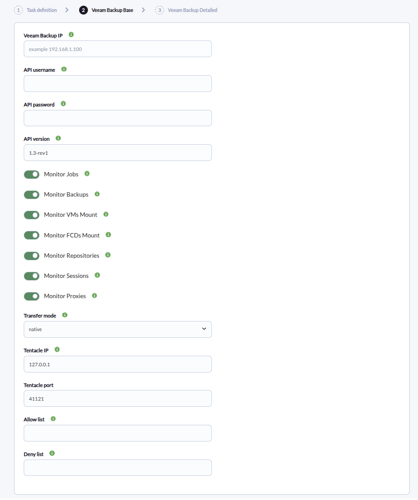
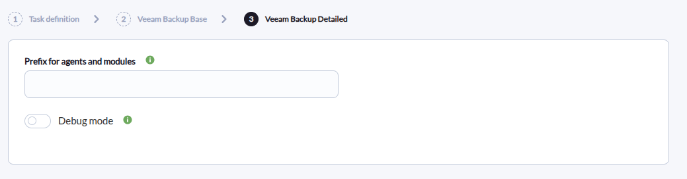

# Veeam Backup Discovery

*Article last updated: 2026-09-08.*

## What it monitors

The Veeam Backup Discovery plugin reads a Veeam Backup & Replication server through its REST API and turns the state of seven resource categories into Pandora FMS agents and modules: backup jobs, backups, instant-recovery mounts of VMs and of FCDs, backup repositories, backup sessions, and backup proxies.

A Discovery task creates one Pandora FMS agent per resource category that is enabled and whose API query returns data. All seven categories are enabled by default, so a fully reachable server produces up to seven agents. Each agent carries the modules of a single category: a total module plus one module per resource the API reports for that category.

## Prepare

### Compatibility

| Scope | State | Evidence |
| --- | --- | --- |
| Plugin version `1.0` (`pandorafms.veeam.backup`) | Documented target | The version this page describes, as identified by the package definition. See [Plugin identity](#plugin-identity). |
| Veeam Backup REST API reachable over HTTPS | `Required` | The plugin authenticates and reads resources through `https://<veeam_ip>/api/...`. Prerequisite, not a compatibility statement. See [Requirements](#requirements). |
| A specific Veeam Backup & Replication version | `Not validated` | No published test record establishes compatibility with a concrete Veeam release. |
| Host operating system running the plugin | `Not validated` | No published test record establishes operating-system compatibility. |
| A Veeam API account able to authenticate and read the monitored resources | `Required` | The plugin authenticates with a username and password and reads the monitored resources. Prerequisite, not a compatibility statement. |

### Requirements

- A Pandora FMS server with Discovery enabled to run the task, and a console to define it.
- A Veeam Backup & Replication server that exposes the REST API over HTTPS and is reachable from the system that runs the plugin.
- A Veeam user account that can authenticate against the REST API and read the resources to be monitored. Grant it the access your backup policy requires; the plugin only reads state and never changes backup configuration.
- A target agent group and a monitoring interval for the generated agents. Both come from the Discovery task and are inherited by every generated agent.
- Network reachability to the Tentacle destination when the task transfers data in **Tentacle** mode.

The plugin is distributed as a Pandora FMS Discovery application (`.disco` package) that the console executes on the Discovery server.

### Install the plugin

Load the `.disco` package from **Management → Discovery → Extension manager**. Once loaded, **Veeam Backup** appears under the **Cloud** category of the Discovery wizard.

## Configure the Discovery task

Create the task from **Management → Discovery → Cloud → Veeam Backup**. The generic first step defines the task; the package adds **Veeam Backup Base** and **Veeam Backup Detailed**. Every field is documented in [Task parameters](#task-parameters).

**Step 1 — Task definition.** Name, agent group, server and interval. The group name and ID and the interval are passed to the plugin and inherited by every generated agent.

**Step 2 — Veeam Backup Base.** Connection, monitored categories and delivery:

- **Veeam Backup IP**, **API username** and **API password** are the REST API endpoint address and its credentials. All three are required.
- **API version** is the Veeam REST API version string sent with every request. Leave the default unless your Veeam server requires another value.
- The seven toggles **Monitor Jobs**, **Monitor Backups**, **Monitor VMs Mount**, **Monitor FCDs Mount**, **Monitor Repositories**, **Monitor Sessions** and **Monitor Proxies** enable or disable each resource category. All are enabled by default.
- **Transfer mode** selects how the generated agents are delivered, and **Tentacle IP** and **Tentacle port** set the Tentacle destination. See the note under [Task parameters](#task-parameters) for how version `1.0` behaves.
- **Allow list** and **Deny list** are regular expressions applied to the generated module names. Allow keeps only matching modules; deny removes matching modules. Both are applied on top of the category toggles.



**Step 3 — Veeam Backup Detailed.** Output naming and diagnostics:

- **Prefix for agents and modules** is prepended verbatim to every generated agent alias and module name, with no separator inserted. A typical value therefore ends in a space, hyphen or similar separator, for example `LAB-`.
- **Debug mode** adds diagnostic messages to the execution information when a timestamp cannot be converted. Disabled by default.



The API password supplied in the task is written to the temporary configuration that the Discovery server builds for the plugin. Restrict access to Pandora FMS and its configuration and temporary files according to your deployment's security policy.

## Verify the first run

Force the task from **Management → Discovery → Task list** and check the result in this order.

1. **The task summary** reports the generated agents and modules. Expect one agent per enabled category whose API query succeeds, up to seven.

2. **The agents.** Each appears as `<Prefix>Veeam Backup <Category>`, for example `Veeam Backup Jobs` or `LAB-Veeam Backup Repositories`. An enabled category whose API query fails produces no agent and records the failure in the execution information instead.

3. **The per-category totals.** Every generated agent carries a total module for its category (for example `Total jobs`), and per-resource modules appear when the API reports resources.

4. **The module values.** A successful first run shows reachable jobs, backups, repositories, sessions and proxies counted, and the instant-recovery mounts in their current state.

If no agent appears at all, the credentials or the reachability of the REST API are the first thing to check.

## Understand the results

### Agents and identity

The plugin creates one agent per enabled resource category, never one agent per Veeam server or per individual resource. Modules for the resources of a category accumulate on that category's agent.

Each agent alias is `<Prefix>Veeam Backup <Category>`, and its internal Pandora FMS name is the MD5 hash of that alias. The category labels the plugin uses are **Veeam Backup Jobs**, **Veeam Backup Backups**, **Veeam Backup VMs Mounted**, **Veeam Backup FCDs Mounted**, **Veeam Backup Repositories**, **Veeam Backup Sessions** and **Veeam Backup Proxies**. A configured prefix is prepended verbatim and therefore also becomes part of the hashed identity; changing the prefix later renames the agents.

Agents belong to the task's agent group and inherit its interval. An agent is created whenever its category's API query succeeds and returns data — even an empty list still produces the agent with its total module set to `0`. A query that fails produces no agent for that category. Allow and deny filters run before the agent is created: if every module is filtered out, the agent is skipped and the event is recorded in the execution information.

### Modules by agent

| Agent | Created when | Modules it carries |
| --- | --- | --- |
| `Veeam Backup Jobs` | **Monitor Jobs** enabled and `/jobs/states` responds | `Total jobs`, plus `<job>.lastResult` and `<job>.lastRun` for each job |
| `Veeam Backup Backups` | **Monitor Backups** enabled and `/backups` responds | `Total backups`, plus one module per backup reporting its creation age |
| `Veeam Backup VMs Mounted` | **Monitor VMs Mount** enabled and the instant-recovery query responds | `Total VMs mount`, `VMs mount active`, `VMs mount not active`, plus `<vm>.status` and `<vm>.powerState` for each mounted VM |
| `Veeam Backup FCDs Mounted` | **Monitor FCDs Mount** enabled and the instant-recovery query responds | `Total FCDs mount`, `FCDs mount active`, `FCDs mount not active`, plus `<fcd>.status` for each mounted FCD |
| `Veeam Backup Repositories` | **Monitor Repositories** enabled and `/repositories/states` responds | `Total repositories`, plus `freeGB`, `capacityGB` and `usedSpaceGB` for each repository |
| `Veeam Backup Sessions` | **Monitor Sessions** enabled and `/sessions` responds | `Veeam.Total_Sessions`, `Veeam.Running_Sessions`, `Veeam.Failed_Sessions_24h`, `Veeam.Warning_Sessions_24h` and `Veeam.All_Sessions` |
| `Veeam Backup Proxies` | **Monitor Proxies** enabled and `/proxies` responds | `Total proxies` |

Resource names inside module names come from the Veeam API and keep the characters the API reports. Module names therefore vary with your backup environment; the exhaustive name patterns and value semantics are in [Generated modules and agents](#generated-modules-and-agents).

## Troubleshoot

| Symptom | Check |
| --- | --- |
| The task fails and the execution information reports an authentication error | Confirm **Veeam Backup IP**, **API username** and **API password**, that the REST API is reachable over HTTPS, and that **API version** is accepted by the Veeam server. |
| A whole category produces no agent and its total in the summary is `0` | The category's API query failed. Review the execution information for the connection, HTTP status, JSON or API error recorded for that endpoint. |
| Expected agents or modules are missing | Review **Allow list** and **Deny list**: they run against the final module name, including any prefix, and a category whose modules are all filtered out produces no agent. |
| Tentacle transfer fails | Confirm **Transfer mode** is **Tentacle** and that the server can reach **Tentacle IP** on **Tentacle port**. |
| The 24-hour session counters do not match a 24-hour window | `Veeam.Failed_Sessions_24h` and `Veeam.Warning_Sessions_24h` count the failed and warning results among the sessions returned by the current `/sessions` query. The module names and descriptions keep the `24h` wording, but the plugin applies no explicit 24-hour filter. |

## Reference

### Task parameters

The console presents the fields in two steps after the generic task definition. The macro column is the identifier used in the generated task configuration.

#### Veeam Backup Base

| Field | Macro | Type | Default | Notes |
| --- | --- | --- | --- | --- |
| Veeam Backup IP | `_veeamIp_` | string | — | IP address or hostname of the Veeam Backup server. Required |
| API username | `_veeamUser_` | string | — | Veeam Backup REST API username. Required |
| API password | `_veeamPass_` | password | — | Veeam Backup REST API password. Required |
| API version | `_veeamApiVersion_` | string | `1.3-rev1` | Veeam REST API version string sent with every request |
| Monitor Jobs | `_monitorJobs_` | checkbox | on | Monitors backup jobs |
| Monitor Backups | `_monitorBackups_` | checkbox | on | Monitors backups |
| Monitor VMs Mount | `_monitorVmsMount_` | checkbox | on | Monitors VMs instant-recovery mounts |
| Monitor FCDs Mount | `_monitorFcdMount_` | checkbox | on | Monitors FCDs instant-recovery mounts |
| Monitor Repositories | `_monitorRepositories_` | checkbox | on | Monitors backup repositories |
| Monitor Sessions | `_monitorSessions_` | checkbox | on | Monitors backup sessions |
| Monitor Proxies | `_monitorProxies_` | checkbox | on | Monitors backup proxies |
| Transfer mode | `_transferMode_` | select | `native` | Options `native` and `tentacle` |
| Tentacle IP | `_tentacleIp_` | string | `127.0.0.1` | Tentacle transfer destination |
| Tentacle port | `_tentaclePort_` | number | `41121` | Tentacle transfer destination port |
| Allow list | `_allowList_` | string | — | Regex allow list for module names. Only modules matching it are kept |
| Deny list | `_denyList_` | string | — | Regex deny list for module names. Matching modules are excluded |

**Transfer mode in version `1.0`.** The field tip describes *native* as the Discovery server reading the agent data directly and *tentacle* as sending it through the Tentacle client. In the distributed version `1.0`, both selectable values make the plugin write agent XML data files and delegate the transfer to the plugin transfer helper with the selected mode and the configured **Tentacle IP** and **Tentacle port**; the helper decides whether that is a local ingest or a Tentacle push. The plugin's native JSON Discovery-output accumulation is reached only when the configuration file sets `transfer_mode=local`, a value the wizard does not offer.

#### Veeam Backup Detailed

| Field | Macro | Type | Default | Notes |
| --- | --- | --- | --- | --- |
| Prefix for agents and modules | `_prefix_` | string | — | Text prepended verbatim to every agent alias and module name. No separator is added |
| Debug mode | `_debugMode_` | checkbox | off | Adds diagnostic messages to the execution information when a timestamp cannot be converted |

### Configuration file keys

The Discovery task builds a temporary key/value file from its own fields and passes it to the plugin with `--conf`. A manual run supplies that file directly. The file has no section header; the plugin reads it as a `[CONF]` section.

| Key | Default | Description |
| --- | --- | --- |
| `veeam_ip` | Empty | Veeam Backup server address. Required |
| `veeam_user` | Empty | Veeam REST API username. Required |
| `veeam_pass` | Empty | Veeam REST API password. Required |
| `veeam_api_version` | `1.0-rev2` | Veeam REST API version. The task always writes the value configured in the wizard (default `1.3-rev1`); the plugin falls back to `1.0-rev2` only when the key is absent |
| `agents_group` | Empty | Agent group name, from the task. Used as the group of the generated agents |
| `agents_group_id` | Empty | Agent group ID, from the task |
| `interval` | `300` | Monitoring interval in seconds, inherited by the generated agents |
| `transfer_mode` | `local` | `native`, `tentacle` or `local`. `native` and `tentacle` write and transfer agent XML data files; `local` accumulates the agents in the native JSON Discovery output |
| `tentacle_ip` | `127.0.0.1` | Tentacle transfer destination |
| `tentacle_port` | `41121` | Tentacle transfer destination port |
| `allow_list` | Empty | Regex allow list applied to module names |
| `deny_list` | Empty | Regex deny list applied to module names |
| `prefix` | Empty | Text prepended verbatim to agent aliases and module names |
| `monitor_jobs` | `true` | Enables the Jobs category |
| `monitor_backups` | `true` | Enables the Backups category |
| `monitor_vms_mount` | `true` | Enables the VMs Mount category |
| `monitor_fcd_mount` | `true` | Enables the FCDs Mount category |
| `monitor_repositories` | `true` | Enables the Repositories category |
| `monitor_sessions` | `true` | Enables the Sessions category |
| `monitor_proxies` | `true` | Enables the Proxies category |
| `debug_mode` | `false` | Adds diagnostic messages when a timestamp cannot be converted |

The file holds the API password in plain text when the task runs. Restrict it and the Discovery temporary directory to the account that runs the plugin, keep them out of shared directories, logs and version control, and follow your deployment's policy for the Veeam credentials.

### Command-line execution

A manual run replicates what the Discovery server does per task execution. The plugin accepts a single configuration file:

```bash
./pandora_veeam_backup --conf <PATH_TO_CONFIG>
```

| Option | Description |
| --- | --- |
| `--conf` | Required path to the configuration file |
| `--help`, `-h` | Displays command help |

Example configuration file:

```ini
veeam_ip=<VEEAM_SERVER_IP>
veeam_user=<VEEAM_API_USER>
veeam_pass=<VEEAM_API_PASSWORD>
veeam_api_version=1.0-rev2
interval=300
transfer_mode=tentacle
tentacle_ip=<PANDORA_FMS_SERVER_IPV4>
tentacle_port=41121
agents_group=<AGENT_GROUP_NAME>
prefix=<PREFIX>
monitor_jobs=true
monitor_backups=true
monitor_vms_mount=true
monitor_fcd_mount=true
monitor_repositories=true
monitor_sessions=true
monitor_proxies=true
debug_mode=false
```

That file holds a credential in plain text. Restrict it to the account that runs the plugin and keep it out of shared directories, logs and version control. Avoid echoing it to a shell command line, where shell history and the operating-system process list may reveal it.

### Generated modules and agents

Modules are named `<Prefix><module name>`; the patterns below omit the prefix. Per-resource module names embed the name or identifier that the Veeam API reports for the resource.

**Veeam Backup Jobs**

- `Total jobs`: `generic_data`, number of jobs returned.
- `<job>.lastResult`: `generic_data`, `1` for a successful last result, `2` for a warning, `0` otherwise. The module definition carries thresholds that mark `0` as critical and `2` as warning.
- `<job>.lastRun`: `generic_data`, elapsed time since the job last ran, expressed in Pandora timeticks; unit `_timeticks_`.

**Veeam Backup Backups**

- `Total backups`: `generic_data`, number of backups returned.
- `<backup>`: `generic_data`, elapsed time since the backup was created, expressed in Pandora timeticks; unit `_timeticks_`.

**Veeam Backup VMs Mounted**

- `Total VMs mount`: `generic_data`, number of instant-recovery VM mounts returned.
- `VMs mount active`: `generic_data`, mounts whose state is considered active.
- `VMs mount not active`: `generic_data`, mounts whose state is considered inactive.
- `<vm>.status`: `generic_data_string`, state text of the mounted VM.
- `<vm>.powerState`: `generic_data_string`, power state text of the mounted VM.

**Veeam Backup FCDs Mounted**

- `Total FCDs mount`: `generic_data`, number of instant-recovery FCD mounts returned.
- `FCDs mount active`: `generic_data`, mounts whose state is considered active.
- `FCDs mount not active`: `generic_data`, mounts whose state is considered inactive.
- `<fcd>.status`: `generic_data_string`, state text of the mounted FCD.

**Veeam Backup Repositories**

- `Total repositories`: `generic_data`, number of repositories returned.
- `<repository>.freeGB`: `generic_data`, free space in GiB; unit `GB`.
- `<repository>.capacityGB`: `generic_data`, capacity in GiB; unit `GB`.
- `<repository>.usedSpaceGB`: `generic_data`, used space in GiB; unit `GB`.

**Veeam Backup Sessions**

- `Veeam.Total_Sessions`: `generic_data`, number of sessions returned.
- `Veeam.Running_Sessions`: `generic_data`, sessions whose state is not terminal (`success`, `completed`, `failed`, `error`, `warning`, `stopped` or `stopping`).
- `Veeam.Failed_Sessions_24h`: `generic_data`, sessions with a failed result. The count covers the sessions returned by the current query; the plugin applies no explicit 24-hour filter.
- `Veeam.Warning_Sessions_24h`: `generic_data`, sessions with a warning result. Same scope as the failed counter.
- `Veeam.All_Sessions`: `generic_data_string`, one line per returned session describing its state, progress, result and message. Created only when at least one session is returned.

**Veeam Backup Proxies**

- `Total proxies`: `generic_data`, number of proxies returned.

### Plugin identity

| Field | Value |
| --- | --- |
| App short name | `pandorafms.veeam.backup` |
| Plugin version | `1.0` |
| Type | Discovery application (`.disco`) |
| Section | Discovery → Cloud |
