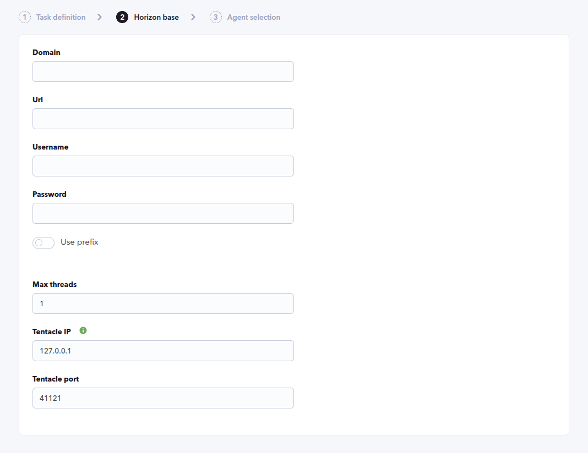
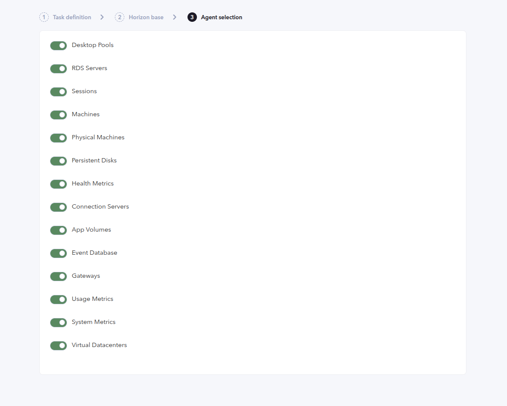
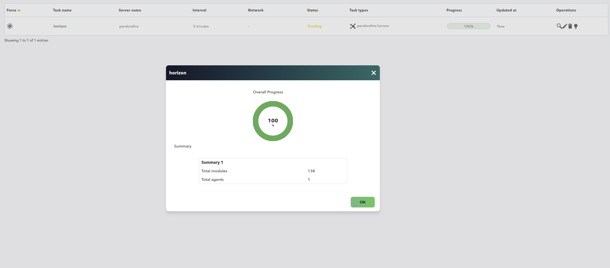
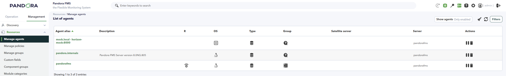
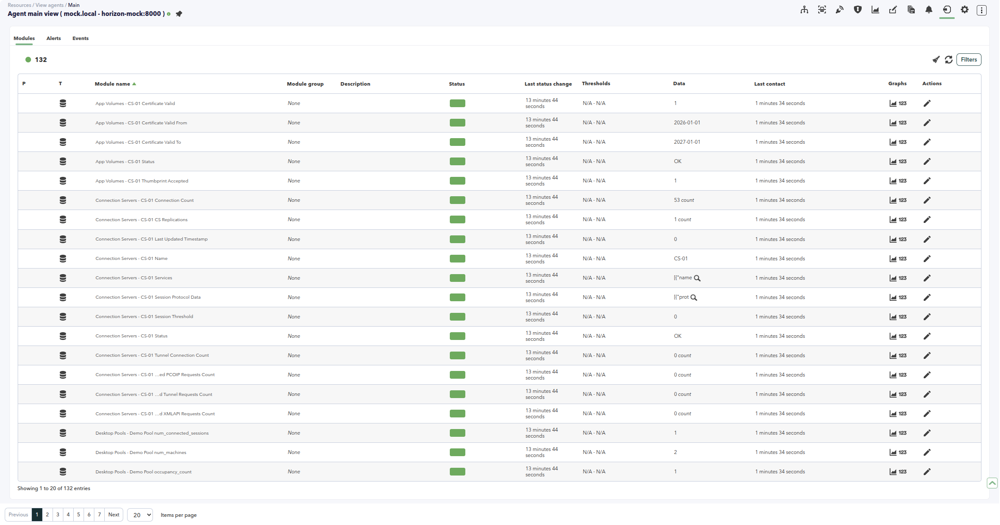
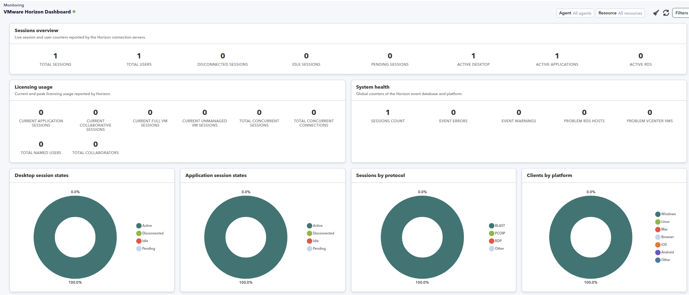
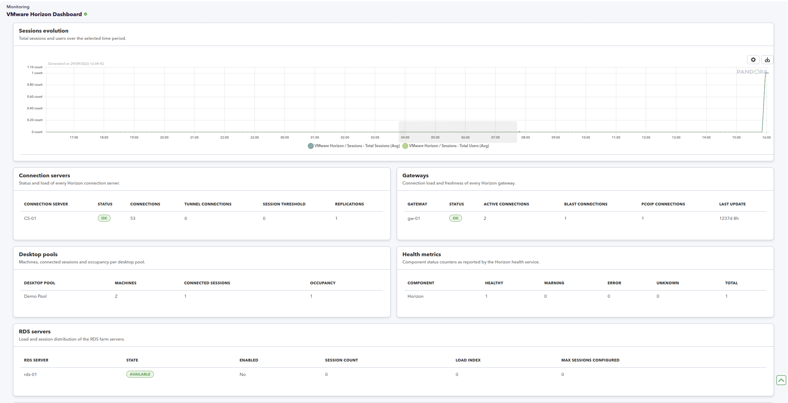
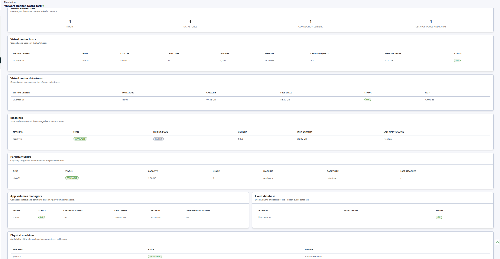

# VMware Horizon Discovery

*Article last updated: 2026-09-29.*

## What it monitors

The VMware Horizon Discovery plugin connects to a VMware Horizon environment through its REST API and turns its inventory and monitoring data into Pandora FMS agents and modules: sessions and users, desktop pools, RDS servers, machines, physical machines, persistent disks, health metrics, connection servers, gateways, App Volumes, the event database, virtual datacenters, licensing usage and system metrics.

Unlike plugins that create one agent per discovered resource, this plugin consolidates every enabled resource category into a **single agent**, named after the domain and URL configured in the task. Each module name is prefixed with its resource category to keep names unique inside the agent, and every module carries a resource marker so the companion console dashboard can group and filter the data.

The plugin runs as a Discovery task: the console creates the task, the Discovery server runs the plugin, and the generated agent and modules are created automatically. The task delivers the generated data through Tentacle.

## Prepare

### Compatibility

| Scope | State | Evidence |
| --- | --- | --- |
| Plugin version `1.2` (`pandorafms.horizon`) | Documented target | The version this page describes, as identified by the package definition |
| A VMware Horizon environment whose REST API is reachable | `Required` | The plugin authenticates and reads the inventory and monitoring endpoints through the Horizon REST API |
| A Horizon account with read access to the inventory and monitoring endpoints | `Required` | The plugin authenticates and reads data. It never changes the Horizon configuration |
| A specific VMware Horizon version | `Not validated` | No published test record establishes compatibility with a concrete Horizon release |
| Host operating system running the plugin | `Not validated` | No published test record establishes operating-system compatibility |

### Requirements

- A Pandora FMS server with Discovery enabled to run the task, and a console to define it.
- A VMware Horizon environment whose REST API is reachable from the server that runs the plugin. The plugin addresses it through the URL configured in the task.
- A Horizon account able to authenticate with the configured domain and read the inventory and monitoring endpoints used by the task. Grant only the read permissions your monitoring requires.
- A target agent group and a monitoring interval for the generated agent. Both come from the Discovery task and are inherited by the generated agent.
- Network reachability to the Tentacle destination, because the task transfers the generated data through Tentacle.
- The plugin is distributed as a Pandora FMS Discovery application (`.disco` package) that the Discovery server executes.

### Prepare Horizon access

The plugin authenticates to the Horizon REST API with the **Domain**, **Username** and **Password** configured in the task, and uses the returned access token for the inventory and monitoring requests. It only reads Horizon data and never changes the Horizon configuration, so a read-only account is enough.

The connection does not verify the TLS certificate presented by the Horizon endpoint, so run the task only over a trusted network or through a protected tunnel.

### Install the plugin

Load the `.disco` package from **Management → Discovery → Manage disco packages**: choose **Select a file**, pick the package and click **Upload DISCO**. After loading, **VMware Horizon** appears in the package list and under the **Applications** section of the Discovery wizard.

## Configure the Discovery task

Create the task from **Management → Discovery → Applications → VMware Horizon**. The wizard walks through the generic task definition and two plugin steps: **Horizon base** and **Agent selection**. Every field is documented in [Task parameters](#task-parameters).

### Step 1 — Task definition

The generic step asks for the task **name**, the **agent group** and **server** on which the task runs, and the **interval**. The group and the interval are passed to the plugin and inherited by the generated agent.

### Step 2 — Horizon base

Connection details and the Tentacle destination:

- **Domain** is the Horizon domain used to authenticate.
- **Url** is the base URL of the Horizon environment to connect to, for example `https://horizon.example.com`.
- **Username** and **Password** are the Horizon credentials.
- **Use prefix** shows the **Prefix** field, which the current plugin version does not apply to the generated agent or module names.
- **Max threads** is present in the wizard but the current plugin version does not use it.
- **Tentacle IP**, **Tentacle port** and **Tentacle extra options** set how the generated data is sent. Leave the defaults unless your environment needs another Tentacle target.



### Step 3 — Agent selection

Which resource categories the task collects. All categories are enabled by default:

- **Desktop Pools**, **RDS Servers**, **Sessions**, **Machines**, **Physical Machines**, **Persistent Disks**, **Health Metrics**, **Connection Servers**, **App Volumes**, **Event Database**, **Gateways**, **Usage Metrics**, **System Metrics** and **Virtual Datacenters**.

Disabling a category removes its modules from the generated agent; the plugin does not query the endpoints of a disabled category.



## Verify the first run

Force the task from **Management → Discovery → Task list** and check the result in this order.

1. **The task summary** reports `Total agents` and `Total modules`. Expect `Total agents` at `1`, because the plugin consolidates every enabled category into a single agent.

2. **The generated agent.** It is named `<domain> - <url>`, so a task with domain `mock.local` and URL `https://horizon-mock:8000` produces the agent `mock.local - horizon-mock:8000`. It inherits the task's group and interval.

3. **The modules.** The agent carries one module per collected metric, prefixed with its resource category, for example `Sessions - Total Sessions` or `Gateways - gw-01 Status`.







If no agent appears at all, the URL, the domain and the credentials are the first things to check.

## Understand the results

### Agent layout and naming

The plugin creates **one agent per task**, not one agent per resource. The agent name is built from the task's domain and URL as `<domain> - <url>`, with the URL scheme removed and any character outside letters, digits, dot, underscore, hyphen and colon replaced by a hyphen. Two tasks configured with the same domain and URL therefore address the same agent.

Because every category shares one agent, module names are prefixed with the resource category (`<Category> - <metric>`) to keep them unique. This matters when reading the results: a module such as `Connection Servers - CS-01 Status` belongs to the Connection Servers category, and the same field name can appear under another category with a different prefix.

Resources removed from Horizon are not deleted automatically from Pandora FMS.

### Module groups

| Category | What it collects |
| --- | --- |
| Desktop Pools | Machines, connected sessions and occupancy per desktop pool |
| RDS Servers | Server state and status, enabled flag, session count, load index and configured maximum sessions |
| Sessions | Total sessions and users, desktop, application and RDS session states, client platforms, protocols and gateway counts |
| Machines | Machine state, pairing state, memory, disk capacity and last maintenance time |
| Physical Machines | Availability of each physical machine |
| Persistent Disks | Capacity, usage, status, machine, datastore and last attached time per disk |
| Health Metrics | Healthy, warning, error, unknown and total counts per component |
| Connection Servers | Status, connections, tunnel connections, session threshold and replications per server |
| App Volumes | Status, certificate validity and thumbprint acceptance per connection server |
| Event Database | Event count and status of the Horizon event database |
| Gateways | Status, active, BLAST and PCOIP connection counts per gateway |
| Usage Metrics | Current and highest licensing usage of sessions, connections and named users |
| System Metrics | Event errors and warnings, problem RDS hosts and vCenter VMs, and session count |
| Virtual Datacenters | Hosts, datastores and connection servers, with capacity, usage and status |

The exhaustive module inventory is in [Generated modules](#generated-modules).

### Companion console dashboard

A companion console extension, **VMware Horizon Dashboard**, presents the collected data as a dashboard under **Monitoring**. It reads the resource markers written by the plugin and offers two filters, **Agent** and **Resource**, plus a chart period, so a single Horizon environment or a single resource category can be reviewed on its own.







## Troubleshoot

- **The task reports an authentication error** — check the **Url**, **Domain**, **Username** and **Password**, and confirm the Horizon endpoint is reachable and accepts the account.
- **No agent is generated** — confirm the URL is reachable from the server that runs the plugin and that at least one resource category is enabled.
- **A module group is missing** — the corresponding category is disabled in the **Agent selection** step. Disabled categories are not queried and their modules are not generated.
- **The task succeeds but some endpoints report errors** — the run continues when an individual endpoint fails; the task execution information lists the failing endpoint and its HTTP status.
- **Requests fail with a retryable HTTP status** — the plugin retries the HTTP statuses `429`, `500`, `502`, `503` and `504` up to three times before recording an error.
- **Tentacle transfer fails** — confirm the server that runs the plugin can reach **Tentacle IP** on **Tentacle port**.
- **Resources removed from Horizon remain in Pandora FMS** — generated agents and modules are not deleted automatically. Remove them manually if they are no longer needed.

## Operate

### Manual execution

The plugin can be run outside the Discovery wizard with a configuration file. This is useful for testing connectivity or for a one-off run. The file is built by the Discovery task for a normal run; a manual run supplies the same keys.

```bash
./pandora_horizon --conf <PATH_TO_CONFIG>
```

A minimal configuration file:

```ini
[CONF]
domain=<DOMAIN>
url=<HORIZON_URL>
user=<USERNAME>
password=<PASSWORD>
agents_group_name=<GROUP_NAME>
interval=300
tentacle_ip=127.0.0.1
tentacle_port=41121
```

That file holds a credential in plain text. Restrict it to the account that runs the plugin and keep it out of shared directories and version control.

## Reference

### Task parameters

The console presents these fields after the generic task definition. The macro column is the identifier used in the generated task configuration.

#### Horizon base

| Field | Macro | Type | Default | Notes |
| --- | --- | --- | --- | --- |
| Domain | `_domain_` | string | — | Horizon domain used to authenticate |
| Url | `_url_` | string | — | Base URL of the Horizon environment. Required |
| Username | `_username_` | string | — | Horizon user. Required |
| Password | `_password_` | password | — | Horizon password. Required |
| Use prefix | `_usePrefix_` | checkbox | off | Shows the **Prefix** field. Not applied by the current plugin version |
| Prefix | `_prefix_` | string | — | Shown only when **Use prefix** is enabled. Not applied by the current plugin version |
| Max threads | `_threads_` | number | `1` | Present in the wizard. Not used by the current plugin version |
| Tentacle IP | `_tentacleIP_` | string | `127.0.0.1` | Tentacle transfer destination |
| Tentacle port | `_tentaclePort_` | number | `41121` | Tentacle transfer destination port |
| Tentacle extra options | `_tentacleExtraOpt_` | string | — | Extra options passed to the Tentacle client |

#### Agent selection

Each field below is a checkbox, enabled by default, that turns on one resource category.

| Field | Macro |
| --- | --- |
| Desktop Pools | `_monitorDesktopPools_` |
| RDS Servers | `_monitorRdsServers_` |
| Sessions | `_monitorSessions_` |
| Machines | `_monitorMachines_` |
| Physical Machines | `_monitorPhysicalMachines_` |
| Persistent Disks | `_monitorPersistentDisks_` |
| Health Metrics | `_monitorHealthMetrics_` |
| Connection Servers | `_monitorConnectionServers_` |
| App Volumes | `_monitorAppVolumes_` |
| Event Database | `_monitorEventDatabase_` |
| Gateways | `_monitorGateways_` |
| Usage Metrics | `_monitorUsageMetrics_` |
| System Metrics | `_monitorSystemMetrics_` |
| Virtual Datacenters | `_monitorVirtualDatacenters_` |

### Configuration file keys

The Discovery task builds this file from its own fields; a manual run supplies it with `--conf`.

| Key | Description | Default |
| --- | --- | --- |
| `agents_group_name` | Agent group assigned to the generated agent | Inherited from the task |
| `interval` | Monitoring interval inherited from the Discovery task | `300` for manual runs |
| `domain` | Horizon domain used to authenticate | Empty |
| `url` | Base URL of the Horizon environment | Empty |
| `user` | Horizon user | Empty |
| `password` | Horizon password | Empty |
| `transfer_mode` | Delivery mode; `tentacle` sends the data through Tentacle | `tentacle` |
| `tentacle_ip` | Tentacle destination address | `127.0.0.1` |
| `tentacle_port` | Tentacle destination port | `41121` |
| `tentacle_client` | Tentacle client command | `tentacle_client` |
| `tentacle_opts` | Extra options passed to the Tentacle client | Empty |
| `data_dir` | Data input directory | `/var/spool/pandora/data_in/` |
| `temporal` | Working folder for temporary files | `/tmp` |
| `monitor_desktop_pools` | Collect the Desktop Pools category | `1` |
| `monitor_rds_servers` | Collect the RDS Servers category | `1` |
| `monitor_sessions` | Collect the Sessions category | `1` |
| `monitor_machines` | Collect the Machines category | `1` |
| `monitor_physical_machines` | Collect the Physical Machines category | `1` |
| `monitor_persistent_disks` | Collect the Persistent Disks category | `1` |
| `monitor_health_metrics` | Collect the Health Metrics category | `1` |
| `monitor_connection_servers` | Collect the Connection Servers category | `1` |
| `monitor_app_volumes` | Collect the App Volumes category | `1` |
| `monitor_event_database` | Collect the Event Database category | `1` |
| `monitor_gateways` | Collect the Gateways category | `1` |
| `monitor_usage_metrics` | Collect the Usage Metrics category | `1` |
| `monitor_system_metrics` | Collect the System Metrics category | `1` |
| `monitor_virtual_datacenters` | Collect the Virtual Datacenters category | `1` |

### Generated modules

Every module name is prefixed with its resource category, `<Category> - <metric>`. The tables below list the metric part; the category is the one in each group heading. Module type `generic_data` is numeric and `generic_data_string` is text.

#### Desktop Pools

One set per desktop pool. `<pool>` is the desktop pool display name.

| Module | Type |
| --- | --- |
| `<pool> num_machines` | generic_data |
| `<pool> num_connected_sessions` | generic_data |
| `<pool> occupancy_count` | generic_data |

#### RDS Servers

One set per RDS server. `<server>` is the server name.

| Module | Type |
| --- | --- |
| `<server> Agent Build` | generic_data_string |
| `<server> Agent Version` | generic_data_string |
| `<server> Max Sessions Count Configured` | generic_data |
| `<server> Operating System` | generic_data_string |
| `<server> State` | generic_data_string |
| `<server> Enabled` | generic_data |
| `<server> Farm ID` | generic_data_string |
| `<server> Server ID` | generic_data_string |
| `<server> Load Index` | generic_data |
| `<server> Load Preference` | generic_data_string |
| `<server> Name` | generic_data_string |
| `<server> Session Count` | generic_data |
| `<server> Status` | generic_data_string |

The inventory endpoint also produces one module per returned field, named `<server name><field name>`.

#### Sessions

| Module | Type |
| --- | --- |
| `Sessions` | generic_data |
| `Total Sessions` | generic_data |
| `Total Users` | generic_data |
| `Active App Sessions`, `Disconnected App Sessions`, `Idle App Sessions`, `Pending App Sessions` | generic_data |
| `Active Desktop Sessions`, `Disconnected Desktop Sessions`, `Idle Desktop Sessions`, `Pending Desktop Sessions` | generic_data |
| `Active RDS Sessions`, `Disconnected RDS Sessions`, `Idle RDS Sessions`, `Pending RDS Sessions` | generic_data |
| `Android Clients`, `Browser Clients`, `iOS Clients`, `Linux Clients`, `Mac Clients`, `Other Clients`, `Windows Clients` | generic_data |
| `BLAST Sessions`, `PCOIP Sessions`, `RDP Sessions`, `Other Protocols` | generic_data |
| `External Gateways`, `Internal Gateways`, `Unknown Gateways` | generic_data |

#### Machines

One set per managed machine. `<machine>` is the host name when the managed machine data provides it, or the machine name otherwise.

| Module | Type | Notes |
| --- | --- | --- |
| `<machine> State` | generic_data_string | |
| `<machine> Pairing State` | generic_data_string | |
| `<machine> Memory MB` | generic_data | When reported |
| `<machine> Operation State` | generic_data_string | When reported |
| `<machine> Last Maintenance Time` | generic_data | When reported, unit `_timeticks_` |
| `<machine> Disk Capacity MB` | generic_data | One per reported virtual disk |

#### Physical Machines

One module per physical machine, of type `generic_proc`, with value `1` when the machine state is `AVAILABLE` and `0` otherwise. Its description records the state and operating system.

#### Persistent Disks

One set per persistent disk. `<disk>` is the disk name.

| Module | Type |
| --- | --- |
| `<disk> Access Group ID` | generic_data_string |
| `<disk> Capacity MB` | generic_data |
| `<disk> Datastore ID` | generic_data_string |
| `<disk> Datastore Name` | generic_data_string |
| `<disk> Desktop Pool ID` | generic_data_string |
| `<disk> Desktop Pool Name` | generic_data_string |
| `<disk> Disk ID` | generic_data_string |
| `<disk> Last Attached Time` | generic_data |
| `<disk> Machine ID` | generic_data_string |
| `<disk> Machine Name` | generic_data_string |
| `<disk> Status` | generic_data_string |
| `<disk> Usage` | generic_data |
| `<disk> User ID` | generic_data_string |
| `<disk> User Name` | generic_data_string |
| `<disk> vCenter ID` | generic_data_string |

#### Health Metrics

One set per component. `<component>` is the component name.

| Module | Type |
| --- | --- |
| `<component> Error Count` | generic_data |
| `<component> Healthy Count` | generic_data |
| `<component> Total Count` | generic_data |
| `<component> Unknown Count` | generic_data |
| `<component> Warning Count` | generic_data |

#### Connection Servers

One set per connection server. `<server>` is the server name.

| Module | Type |
| --- | --- |
| `<server> Connection Count` | generic_data |
| `<server> CS Replications` | generic_data |
| `<server> Last Updated Timestamp` | generic_data |
| `<server> Name` | generic_data_string |
| `<server> Services` | generic_data_string |
| `<server> Session Protocol Data` | generic_data_string |
| `<server> Session Threshold` | generic_data |
| `<server> Status` | generic_data_string |
| `<server> Tunnel Connection Count` | generic_data |
| `<server> Unrecognized PCOIP Requests Count` | generic_data |
| `<server> Unrecognized Tunnel Requests Count` | generic_data |
| `<server> Unrecognized XMLAPI Requests Count` | generic_data |

#### App Volumes

One set per connection server reported by an App Volumes manager. `<server>` is the connection server name.

| Module | Type |
| --- | --- |
| `<server> Certificate Valid` | generic_data |
| `<server> Certificate Valid From` | generic_data_string |
| `<server> Certificate Valid To` | generic_data_string |
| `<server> Status` | generic_data_string |
| `<server> Thumbprint Accepted` | generic_data |

#### Event Database

| Module | Type |
| --- | --- |
| `<server_name> <database_name> Event Count` | generic_data |
| `<server_name> <database_name> Status` | generic_data_string |

#### Gateways

One set per gateway. `<gateway>` is the gateway name.

| Module | Type |
| --- | --- |
| `<gateway> Active Connection Count` | generic_data |
| `<gateway> Blast Connection Count` | generic_data |
| `<gateway> Last Updated Timestamp` | generic_data |
| `<gateway> PCOIP Connection Count` | generic_data |
| `<gateway> Status` | generic_data_string |

#### Usage Metrics

| Module | Type |
| --- | --- |
| `Usage Metrics Current Concurrent Application Sessions` | generic_data |
| `Usage Metrics Current Collaborative Sessions` | generic_data |
| `Usage Metrics Current Full VM Sessions` | generic_data |
| `Usage Metrics Current Unmanaged VM Sessions` | generic_data |
| `Usage Metrics Total Collaborators` | generic_data |
| `Usage Metrics Total Concurrent Connections` | generic_data |
| `Usage Metrics Total Concurrent Sessions` | generic_data |
| `Usage Metrics Total Named Users` | generic_data |
| `Usage Metrics Highest Concurrent Application Sessions` | generic_data |
| `Usage Metrics Highest Collaborative Sessions` | generic_data |
| `Usage Metrics Highest Full VM Sessions` | generic_data |
| `Usage Metrics Highest Unmanaged VM Sessions` | generic_data |
| `Usage Metrics Highest Total Collaborators` | generic_data |
| `Usage Metrics Highest Total Concurrent Connections` | generic_data |
| `Usage Metrics Highest Total Concurrent Sessions` | generic_data |
| `Usage Metrics Highest Total Named Users` | generic_data |

#### System Metrics

| Module | Type |
| --- | --- |
| `System Metrics Event Error Count` | generic_data |
| `System Metrics Event Warning Count` | generic_data |
| `System Metrics Health Metrics Component` | generic_data_string |
| `System Metrics Health Metrics Error Count` | generic_data |
| `System Metrics Health Metrics Healthy Count` | generic_data |
| `System Metrics Health Metrics Total Count` | generic_data |
| `System Metrics Health Metrics Unknown Count` | generic_data |
| `System Metrics Health Metrics Warning Count` | generic_data |
| `System Metrics Problem RDS Hosts Count` | generic_data |
| `System Metrics Problem vCenter VMs Count` | generic_data |
| `System Metrics Sessions Count` | generic_data |

#### Virtual Datacenters

One set per virtual center. `<vc>` is the virtual center name, `<host>` a host, `<datastore>` a datastore and `<server>` a connection server.

| Module | Type |
| --- | --- |
| `<vc> Connection Server <server> Server Status` | generic_data_string |
| `<vc> Datastore <datastore> Path` | generic_data_string |
| `<vc> Datastore <datastore> URL` | generic_data_string |
| `<vc> Datastore <datastore> Capacity MB` | generic_data |
| `<vc> Datastore <datastore> Free Space MB` | generic_data |
| `<vc> Datastore <datastore> Status` | generic_data_string |
| `<vc> Host <host> Cluster Name` | generic_data_string |
| `<vc> Host <host> CPU Core Count` | generic_data |
| `<vc> Host <host> CPU MHz` | generic_data |
| `<vc> Host <host> Memory Size MB` | generic_data |
| `<vc> Host <host> Overall CPU Usage MHz` | generic_data |
| `<vc> Host <host> Overall Memory Usage MB` | generic_data |
| `<vc> Host <host> Status` | generic_data_string |
| `<vc> Desktop Pools and Farms Count` | generic_data |

### Plugin identity

| Field | Value |
| --- | --- |
| App short name | `pandorafms.horizon` |
| Plugin version | `1.2` |
| Type | Discovery application (`.disco`) |
| Section | Discovery → Applications |
