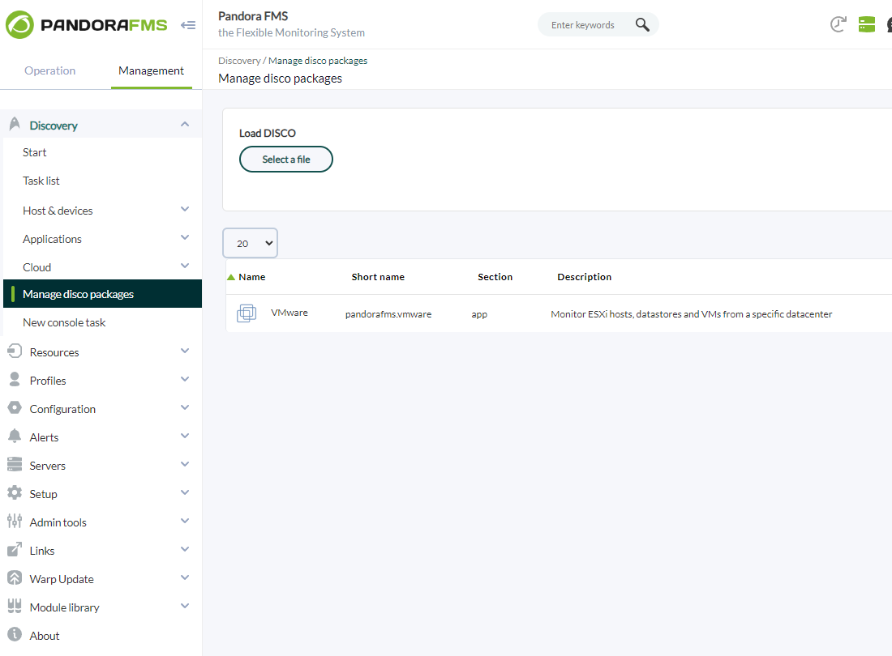
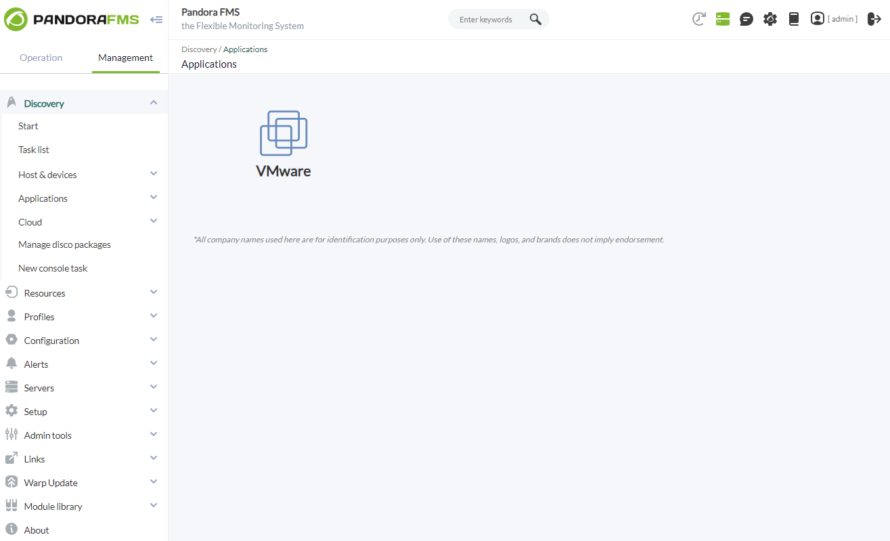
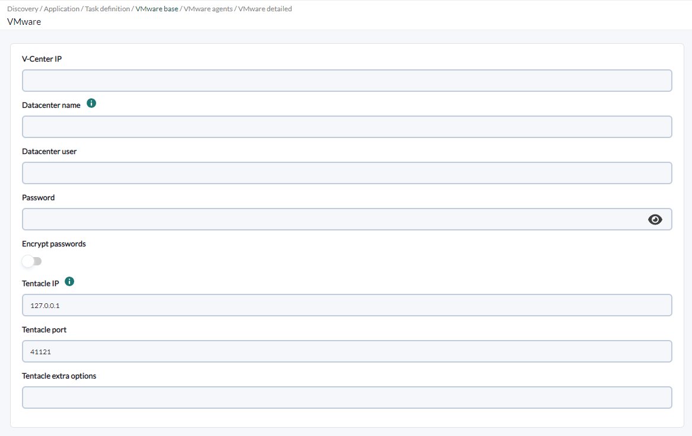
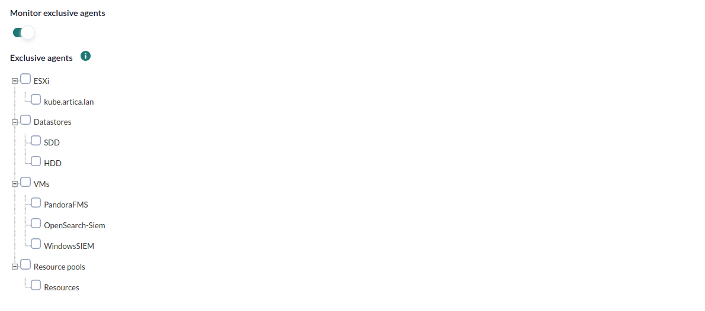
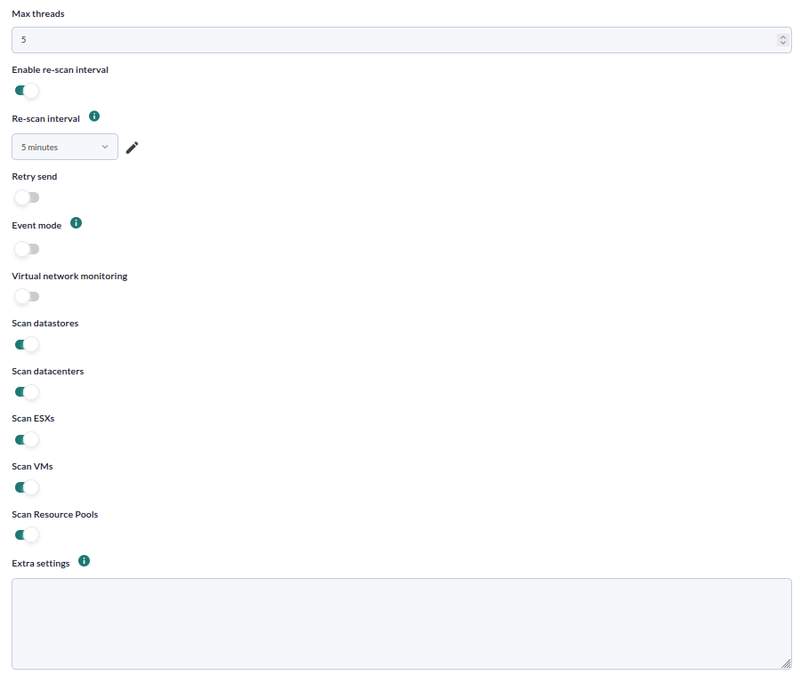
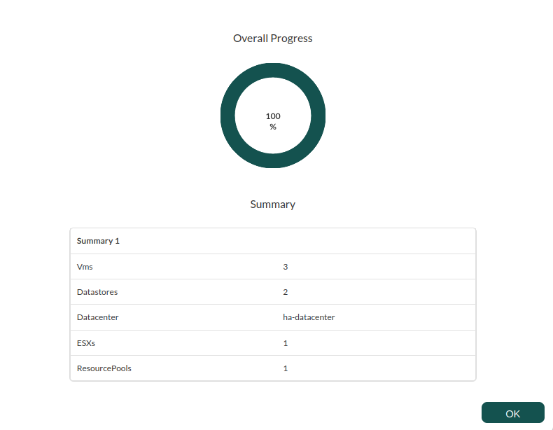

# VMware Discovery

*Article last updated: 2026-09-24.*

## What it monitors

The VMware Discovery plugin connects to a VMware vCenter Server through the vSphere API and discovers the resources of one datacenter. It generates one Pandora FMS agent per discovered resource and fills it with availability, capacity, configuration and performance modules read from vCenter.

The plugin generates agents for:

- the datacenter itself;
- every ESXi host in the datacenter;
- every datastore;
- every virtual machine, including those nested in VMware folders;
- every resource pool, when **Scan Resource Pools** is enabled;
- optionally, one agent per virtual switch (vSwitch) of each ESXi host when **Virtual network monitoring** is enabled.

When **Event mode** is enabled, the plugin also reads vCenter events and forwards them to the Pandora FMS event console, where they follow the normal event flow.

The plugin runs as a Discovery task: the console creates the task, the Discovery server runs the plugin, and the generated agents and modules are created automatically. The task delivers the generated agent data through Tentacle.

## Prepare

### Compatibility

| Scope | State | Evidence |
| --- | --- | --- |
| Plugin version `1.23` (`pandorafms.vmware`) | Documented target | The version this page describes, as identified by the package definition. |
| VMware vCenter Server with at least one datacenter | `Required` | The plugin resolves every managed object through a datacenter container and connects to a vCenter endpoint. |
| A vCenter account with read access to the target datacenter | `Required` | The plugin authenticates and reads resource and performance data. It never changes vCenter configuration. |
| A specific vCenter or ESXi version | `Not validated` | No published test record establishes compatibility with a concrete VMware release. |
| Host operating system running the plugin | `Not validated` | No published test record establishes operating-system compatibility. |

### Requirements

- A Pandora FMS server with Discovery enabled to run the task, and a console to define it.
- A VMware vCenter Server that exposes the vSphere API and is reachable from the Discovery server. The plugin addresses the datacenter by the exact name shown in vCenter.
- A vCenter user account that can authenticate and read the datacenter, hosts, datastores, VMs, resource pools and performance counters. Grant only the read permissions your monitoring requires.
- A target agent group and a monitoring interval for the generated agents. Both come from the Discovery task and are inherited by every generated agent.
- Network reachability to the Tentacle destination, because the task transfers the generated agent data through Tentacle.
- For **Event mode**, a reachable Pandora FMS console API and valid API credentials. The task passes the console API endpoint and credentials to the plugin.
- The plugin is distributed as a Pandora FMS Discovery application (`.disco` package) that the Discovery server executes on the Pandora FMS server.

### Install the plugin

Load the `.disco` package from **Management → Discovery → Manage disco packages**: choose **Select a file**, pick the package, and click **Upload DISCO**. After loading, **VMware** appears in the package list and under the **Applications** section of the Discovery wizard.





## Configure the Discovery task

Create the task from **Management → Discovery → Applications → VMware**. The wizard walks through the generic task definition and three plugin steps: **VMware base**, **VMware agents** and **VMware detailed**. Every field is documented in [Task parameters](#task-parameters).

### Step 1 — Task definition

The generic step asks for the task **name**, the **agent group** and **server** on which the task runs, and the **interval**. The group and the interval are passed to the plugin and inherited by every generated agent.

### Step 2 — VMware base

Connection details and the Tentacle destination:

- **V-Center IP** is the address or hostname of the vCenter server.
- **Datacenter name** must match exactly the datacenter name that appears in the VMware manager.
- **Datacenter user** and **Password** are the vCenter credentials.
- **Encrypt passwords** encrypts the password before it is stored in the task configuration.
- **Tentacle IP**, **Tentacle port** and **Tentacle extra options** set how the generated data is sent. Leave the defaults unless your environment needs another Tentacle target.



### Step 3 — VMware agents

Once the connection details are valid, the task queries vCenter and shows the discovered tree: **ESXi**, **Datastores**, **VMs** and **Resource pools**.

- **Monitor exclusive agents**, when enabled, restricts the task to the entities selected in the tree instead of the automatic scan. This option takes precedence over the scanning options in the next step.
- **Exclusive agents** is the tree where you select the entities to monitor. Select the checkbox next to an entity, a group or the whole category to include it.



### Step 4 — VMware detailed

Fine-grained task behaviour:

- **Max threads** sets how many entities are monitored concurrently. Raising it reduces execution time and increases CPU usage.
- **Autodisabled agents**, when enabled, creates the generated agents in autodisabled mode.
- **Enable re-scan interval** and **Re-scan interval** control how often the plugin refreshes the list of entities to look for new ones. The re-scan interval is not the task execution interval.
- **Retry send** retries the Tentacle transfer when it fails.
- **Event mode** forwards vCenter events to the Pandora FMS event console. It is only available for vCenter and it requires the datacenter agent to exist in Pandora FMS.
- **Virtual network monitoring** generates one agent per virtual switch (vSwitch) of each ESXi host, with modules for each port group.
- **Scan datastores**, **Scan datacenters**, **Scan ESXs**, **Scan VMs** and **Scan Resource Pools** enable or disable each entity category. They are ignored for entity selection when **Monitor exclusive agents** is enabled.
- **Extra settings** is a raw configuration block that is appended to the configuration file the task builds. Use it to set options that the wizard does not expose, for example a **Rename** block. See [Configuration file](#configuration-file).
- **Disable non-explicit monitoring**, when enabled, stops the plugin from creating its default module set automatically and creates only the modules explicitly enabled or configured in the `Datacenter`, `Datastore`, `ESX`, `VM` and `RP` blocks. Modules that already exist on an agent are not deleted. See [Explicit and non-explicit monitoring](#explicit-and-non-explicit-monitoring).



## Verify the first run

Run the task from **Management → Discovery → Task list** and check the result in this order.

1. **The task summary** shows the overall progress and a summary with the datacenter name and the number of ESXs, datastores, VMs and resource pools processed.
2. **The agents.** Expect one agent per enabled entity category that is reachable, plus one vSwitch agent per ESXi host when **Virtual network monitoring** is enabled.
3. **The modules.** Every generated agent carries its entity modules; a reachable environment populates availability, capacity and performance values.
4. **The execution information.** A successful run reports no errors; any per-entity failure is recorded there.



If the task fails before generating anything, the vCenter address, the datacenter name and the credentials are the first things to check.

## Understand the results

### Agents and identity

The plugin creates one agent per discovered entity. Every generated agent belongs to the task's agent group, inherits its interval, reports `VMware` as its operating system, and carries custom fields with the vCenter address (`vmware_vcenter_ip`), the datacenter (`vmware_datacenter`), the entity type (`vmware_type`) and, when it has one, its parent agent (`vmware_parent`).

Agent names are built from the original entity name plus an optional prefix, and each entity type has its own parent:

| Entity | Agent name | Parent agent |
| --- | --- | --- |
| Datacenter | The datacenter name | — |
| Datastore | The datastore managed object ID by default; the datastore name when configured to use it | The datacenter agent |
| ESXi host | The ESXi host name | The datacenter agent |
| Virtual machine | The virtual machine name | The ESXi host agent that runs it |
| Resource pool | The resource pool name | — |
| vSwitch (virtual network monitoring) | `<ESXi host>_<vSwitch>` | The ESXi host agent |

Prefixes per entity type are configured with the **Header** block, and entity names can be rewritten with the **Rename** block; both are described in [Configuration file](#configuration-file). Changing a prefix or a rename later changes the generated agent identity.

The datacenter agent is the entry point: the plugin looks it up by name when **Event mode** creates events, so keep **Scan datacenters** enabled (or create the datacenter agent by another means) before relying on events.

When **Enable re-scan interval** is active, the plugin caches the list of discovered entities and refreshes it again only after the configured **Re-scan interval** has elapsed. New entities appear after a re-scan; entities removed from vCenter are not deleted automatically.

### Modules by agent

Each agent receives the modules of its entity type. The module values are read from vCenter during every task run; the exact name and default state of each module are listed in [Generated modules](#generated-modules).

| Agent | Modules it carries |
| --- | --- |
| Datacenter | vCenter availability: `Ping` and `Check 443 port` |
| Datastore | Capacity, free space, overallocation and path status of the datastore |
| ESXi host | Host state, configuration and hardware modules, plus CPU, memory, disk and network performance modules |
| Virtual machine | Power and tools state, configuration, resource allocation, disks, snapshots and performance modules |
| Resource pool | CPU and memory consumption, granted, shared, swapped, balloon and overhead memory |
| vSwitch | Per port group: received/transmitted octets, operational status, overall status and connected VM count |

### Explicit and non-explicit monitoring

The plugin distinguishes two ways in which a module reaches an agent:

- **Non-explicit monitoring** is the default module set the plugin creates automatically for each entity type. These are the modules whose default state is **on** in [Generated modules](#generated-modules); you never declare them.
- **Explicit monitoring** is a module you declare yourself inside an entity block, either with `enabled` or with any `option=value` configuration.

With **Disable non-explicit monitoring** off (the default), the plugin creates the automatic default set plus every module you declare explicitly. With it on, the automatic default set is not created and only the modules you declare explicitly are created. The option never deletes modules that already exist on an agent, so enabling it stops the default set from being generated on the next run but does not remove what is already there.

## Operate

### Manual execution

The plugin can also be run outside the Discovery wizard with a configuration file. This is useful for testing connectivity, for a one-off run, or for a custom schedule. Write a configuration file that uses at least the `Configuration` block with `server`, `datacenter`, `user` and `pass`, then run the plugin entry point with the file as argument. All blocks and parameters are documented in [Configuration file](#configuration-file).

The manual run prints a single module, `VMware Plugin <datacenter>`, of type `async_proc`: its value is `1` when the execution finished with no error and `0` otherwise, and its description contains the execution summary and any errors. When the plugin runs as a Discovery task, the same information becomes the task execution information.

### Events monitoring

With **Event mode** enabled, the plugin reads the vCenter events that occurred since the previous run and creates them in the Pandora FMS event console. The time window starts at the timestamp stored by the previous run and ends at the current time, so the first run reads only events newer than the configured interval.

- The events are created on the datacenter agent, with `VMware` as their source.
- The vCenter severity is mapped to the Pandora FMS severity: `error` events become critical, `warning` events become warning, and any other event is informational.
- Event correlation is only available when connecting to vCenter; a standalone connection cannot return events.
- Event mode requires the Pandora FMS console API to be reachable and the datacenter agent to exist.

The password supplied in the task is encrypted with a symmetric algorithm before it is stored in the task configuration. Treat this as obfuscation, not as a substitute for access control: protect the Pandora FMS console, its server and its temporary files according to your security policy.

## Troubleshoot

| Symptom | Check |
| --- | --- |
| The task reports an error connecting to vCenter | Confirm **V-Center IP** and that the vCenter server is reachable over the network from the Discovery server. |
| The task reports that the datacenter was not found | The message lists the available datacenters. Correct **Datacenter name** so it matches the vCenter name exactly. |
| No agents are generated at all | Confirm the credentials, that the target datacenter has the entities you expect, and that the relevant **Scan** options are enabled. |
| Expected entities are missing | Review **Monitor exclusive agents** and its tree: when it is enabled, the scanning options are ignored and only the selected entities are monitored. Also confirm the re-scan interval has elapsed. |
| Event mode reports that the datacenter agent does not exist | Enable **Scan datacenters** so the datacenter agent is generated, and confirm the console API is reachable with valid credentials. |
| Event mode reports that event correlation is only available in vCenter | Events cannot be read from a connection that does not expose the vCenter event manager. |
| Tentacle transfer fails | Confirm the Discovery server can reach **Tentacle IP** on **Tentacle port**, and enable **Retry send**. |
| The execution takes too long | Raise **Max threads** to monitor more entities concurrently, keeping in mind the extra CPU usage. |

## Reference

### Task parameters

The console presents these fields after the generic task definition. The macro column is the identifier used in the generated task configuration.

#### VMware base

| Field | Macro | Type | Default | Notes |
| --- | --- | --- | --- | --- |
| V-Center IP | `_server_` | string | — | Address or hostname of the vCenter server. Required |
| Datacenter name | `_datacenter_` | string | — | Datacenter to monitor. Must match the vCenter name. Required |
| Datacenter user | `_user_` | string | — | vCenter user. Required |
| Password | `_pass_` | password | — | vCenter password. Required. Encrypted when **Encrypt passwords** is enabled |
| Encrypt passwords | `_useEncryptedPassword_` | checkbox | off | Encrypts the password stored in the task configuration |
| Tentacle IP | `_tentacleIP_` | string | `127.0.0.1` | Tentacle transfer destination |
| Tentacle port | `_tentaclePort_` | number | `41121` | Tentacle transfer destination port |
| Tentacle extra options | `_tentacleExtraOpt_` | string | — | Extra options passed to the Tentacle client |

#### VMware agents

| Field | Macro | Type | Default | Notes |
| --- | --- | --- | --- | --- |
| Monitor exclusive agents | `_monitorExclusiveAgents_` | checkbox | off | Monitors only the entities selected in **Exclusive agents** and ignores the scanning options |
| Exclusive agents | `_exclusiveAgents_` | tree | — | Selection tree. The chosen entities are stored in `_exclusiveESXi_`, `_exclusiveDatastores_`, `_exclusiveVMs_` and `_exclusiveRP_` |

#### VMware detailed

| Field | Macro | Type | Default | Notes |
| --- | --- | --- | --- | --- |
| Max threads | `_threads_` | number | `5` | Number of entities monitored concurrently |
| Autodisabled agents | `_autodisabledAgents_` | checkbox | off | Creates the generated agents in autodisabled mode |
| Enable re-scan interval | `_enableReconInterval_` | checkbox | on | Enables refreshing the entity list |
| Re-scan interval | `_reconInterval_` | select (interval) | `5 minutes` | How often the entity list is refreshed. Only shown when **Enable re-scan interval** is on |
| Retry send | `_retrySend_` | checkbox | off | Retries the Tentacle transfer on failure |
| Event mode | `_eventMode_` | checkbox | off | Forwards vCenter events. Only for vCenter |
| Virtual network monitoring | `_virtualNetworkMonitoring_` | checkbox | off | Generates an agent per vSwitch |
| Scan datastores | `_scanDatastore_` | checkbox | on | Generates an agent per datastore |
| Scan datacenters | `_scanDatacenter_` | checkbox | on | Generates the datacenter agent |
| Scan ESXs | `_scanESX_` | checkbox | on | Generates an agent per ESXi host |
| Scan VMs | `_scanVM_` | checkbox | on | Generates an agent per virtual machine |
| Scan Resource Pools | `_scanRP_` | checkbox | off | Generates an agent per resource pool |
| Extra settings | `_extraSettings_` | textarea | — | Raw configuration block appended to the generated configuration file |
| Disable non-explicit monitoring | `_disableNonExplicitMonitoring_` | checkbox | off | Creates only the modules explicitly enabled or configured in the entity blocks; the default module set is not created automatically. Existing modules are not deleted |

The task always delivers data through Tentacle with the configured **Tentacle IP** and **Tentacle port**; the wizard does not offer a local transfer mode.

### Configuration file

The Discovery task builds a configuration file for the plugin. The same format is used for a manual execution. It is a plain text file of blocks and `key value` lines; empty lines and lines starting with `#` are ignored.

#### Configuration block

These parameters apply to the whole execution and are read from the `Configuration` block.

| Parameter | Default | Description |
| --- | --- | --- |
| `server` | — | vCenter address or hostname. Required |
| `datacenter` | — | Datacenter name. Required |
| `user` | — | vCenter user. Required |
| `pass` | — | vCenter password. Required |
| `group` | `1` | Agent group for the generated agents |
| `interval` | `1` | Agent interval for the generated agents |
| `use_encrypted_password` | `0` | Set to `1` when `pass` is encrypted |
| `threads` | `4` | Number of entities monitored concurrently |
| `autodisabled_agents` | `0` | Set to `1` to create the generated agents in autodisabled mode |
| `enable_recon_interval` | `1` | Enables refreshing the entity list |
| `recon_interval` | `1` | Seconds before the entity list is refreshed again |
| `scan_datacenter` | `1` | Generate the datacenter agent |
| `scan_datastore` | `1` | Generate an agent per datastore |
| `scan_esx` | `1` | Generate an agent per ESXi host |
| `scan_vm` | `1` | Generate an agent per virtual machine |
| `scan_rp` | `0` | Generate an agent per resource pool |
| `monitor_exclusive_agents` | `0` | Monitor only the entities listed in the exclusive lists |
| `exclusive_esx` | `[]` | JSON list of ESXi host names to monitor |
| `exclusive_datastores` | `[]` | JSON list of datastore names to monitor |
| `exclusive_vm` | `[]` | JSON list of virtual machine names to monitor |
| `exclusive_rp` | `[]` | JSON list of resource pool names to monitor |
| `virtual_network_monitoring` | `0` | Generate an agent per vSwitch |
| `event_mode` | `0` | Forward vCenter events to Pandora FMS |
| `transfer_mode` | `tentacle` | `tentacle` sends the data through Tentacle; `local` writes it to `local_folder` |
| `tentacle_ip` | `127.0.0.1` | Tentacle destination address |
| `tentacle_port` | `41121` | Tentacle destination port |
| `tentacle_opts` | — | Extra options passed to the Tentacle client |
| `local_folder` | `/var/spool/pandora/data_in` | Destination folder when `transfer_mode` is `local` |
| `temporal` | `/tmp` | Working folder for temporary files |
| `logfile` | `/tmp/vmware_plugin.log` | Execution log file |
| `entities_list` | `/tmp/vmware_entities_list.txt` | Cached entity list |
| `event_pointer_file` | `/tmp/vmware_events_pointer.txt` | Timestamp of the last processed event |
| `retry_send` | `0` | Retry the Tentacle transfer on failure |
| `pandora_url` | — | Console API URL, required by event mode |
| `api_user` | `admin` | Console API user, required by event mode |
| `api_pass` | `1234` | Console API password, required by event mode |
| `apiuser_pass` | `pandora` | Console API user password, required by event mode |
| `verbosity` | `1` | Set to `0` to suppress informational log messages |
| `use_ds_entity_name` | `0` | Set to `1` to name datastore agents after the datastore name instead of the managed object ID |
| `use_ds_alias_as_name` | `0` | Set to `1` to name datastore agents after the datastore name |
| `flat_datastore_agents` | `0` | Set to `1` to group every datastore of the datacenter into a single agent |
| `discard_empty_adapters` | `0` | Set to `1` to skip ESXi HBA adapters with no targets, devices or paths |
| `disable_non_explicit_monitoring` | `0` | Set to `1` to create only the modules explicitly enabled or configured in the entity blocks; the default module set is not created automatically. Existing modules are not deleted |

#### Entity module blocks

Module generation is configured per entity type inside the `Datacenter`, `Datastore`, `ESX` and `VM` blocks. Each line inside one of these blocks starts with a module identifier followed by one of:

- `enabled` or `disabled` to turn a module on or off.
- One or more `option=value` pairs separated by `;`, which set module options and enable the module.

| Option | Description |
| --- | --- |
| `name` | Module name. Use `%s` to insert the module index |
| `desc` | Module description |
| `limits_warn` | Warning limits, either `min max` or a string value |
| `limits_crit` | Critical limits, either `min max` or a string value |
| `min_warn`, `max_warn`, `str_warning` | Warning thresholds |
| `min_crit`, `max_crit`, `str_critical` | Critical thresholds |
| `min_warn_forced`, `max_warn_forced`, `str_warning_forced` | Forced warning thresholds |
| `min_crit_forced`, `max_crit_forced`, `str_critical_forced` | Forced critical thresholds |
| `critical_inverse`, `warning_inverse` | Inverse the threshold direction |
| `min`, `max` | Allowed module range |

The available module identifiers and their default state per entity are listed in [Generated modules](#generated-modules).

#### Rename, Reject and Header blocks

- **Rename** rewrites entity names before they become agent names. Each line is `<current name> TO <new name>`.
- **Reject** excludes named entities from the scan. Each line is an entity name. The special entry `all_ipaddresses` toggles whether the datacenter agent is created without an explicit address (default) or bound to the vCenter address.
- **Header** adds a prefix to the generated agent names. Valid entries are `dc <prefix>`, `ds <prefix>`, `esx <prefix>`, `vm <prefix>` and `rp <prefix>`.

#### Custom performance counters

Custom performance modules can be added per entity type with a line that starts with `custom_performance`:

```
custom_performance type=<cpu|mem|disk|net|sys>;metric=<counter>;name=<name>;desc=<description>;limits_warn=<min max>;limits_crit=<min max>
```

The `type` and `metric` values identify the vCenter performance counter to read; the remaining options match the module options above.

### Generated modules

The following tables list the modules the plugin generates per entity. **Default** is the state in which the module is generated when the task does not configure it explicitly.

#### Datacenter

| Module key | Module name | Type | Default |
| --- | --- | --- | --- |
| `ping` | `Ping` | generic_proc | on |
| `check443` | `Check 443 port` | generic_proc | on |

#### Datastores

In the module names, `<id>` is the datastore managed object ID by default, or the datastore name when the datastore naming options are set.

| Module key | Module name | Type | Unit | Default |
| --- | --- | --- | --- | --- |
| `capacity` | `CAPACITY - <id>` | generic_data | B | on |
| `freeSpace` | `Free Space - <id>` | generic_data | % | on |
| `freeSpaceBytes` | `Free Space Bytes - <id>` | generic_data | B | on |
| `overallocation` | `Disk Overallocation - <id>` | generic_data | — | on |
| `dsPathStatus` | `ESX-DS Paths Status - <id>` | generic_data | — | on |

#### ESXi hosts

These modules are generated by default for a connected, powered-on ESXi host. They belong to the non-explicit default set, so **Disable non-explicit monitoring** stops them from being generated unless you declare them explicitly:

| Module name | Type | Unit |
| --- | --- | --- |
| `Overall CPU Usage` | generic_data | MHz |
| `Host Alive` | generic_proc | — |
| `Connection State` | generic_data_string | — |
| `Uptime` | generic_data | — |
| `Overall Memory Usage` | generic_data | KB |
| `Boot Time` | generic_data_string | — |
| `SSL Thumbprint` | generic_data_string | — |
| `Power State` | generic_data_string | — |
| `Memory Size` | generic_data | B |

These modules are configurable with a module key:

| Module key | Module name | Type | Unit | Default |
| --- | --- | --- | --- | --- |
| `cpuUsagePercent` | `CPU Usage` | generic_data | % | on |
| `memoryUsagePercent` | `Memory Usage` | generic_data | % | on |
| `netReceived` | `Data received` | generic_data | KBps | on |
| `netTransmitted` | `Data transmitted` | generic_data | KBps | on |
| `netUsage` | `Net Usage` | generic_data | KBps | on |
| `kernelReadLatency` | `Disk Read Latency` | generic_data | ms | on |
| `kernelWriteLatency` | `Disk Write Latency` | generic_data | ms | on |
| `diskRate` | `Disk Rate` | generic_data | KBps | on |
| `haStatus` | `HA Status` | generic_proc | — | on |
| `pathStatus` | `<path name>` | generic_proc | — | on |
| `systemHealthInfoMetrics` | `Sensor <type> <name>.metric` | generic_data | — | on |
| `cpuInfo` | `CPU Info [<i>]` | generic_data_string | — | off |
| `pciDevice` | `Physical Disk <device>` | generic_proc | — | off |
| `hbaDevice` | `HBA <device>` | generic_proc | — | off |
| `pnicInfo` | `PNIC Info <device>` | generic_data_string | — | off |
| `vnicInfo` | `VNIC Info [<i>]` | generic_data_string | — | off |
| `systemHealthInfo` | `Sensor <type> <name>` | generic_data | — | off |
| `disksState` | `Disk State <device>` | generic_proc | — | off |
| `diskRead` | `Disk Read` | generic_data | KBps | off |
| `diskWrite` | `KBps disk write` | generic_data | KBps | off |
| `deviceReadLatency` | `Device Read Latency` | generic_data | ms | off |
| `deviceWriteLatency` | `Device Write Latency` | generic_data | ms | off |
| `netPkgRx` | `Packages Received` | generic_data | Packets | off |
| `netPkgTx` | `Packages Transmitted` | generic_data | Packets | off |
| `maxDiskLatency` | `Max Disk Latency` | generic_data | ms | off |

#### Virtual machines

| Module key | Module name | Type | Unit | Default |
| --- | --- | --- | --- | --- |
| `hostAlive` | `Host Alive` | generic_proc | — | on |
| `cpuUsagePercent` | `CPU Usage` | generic_data | % | on |
| `memoryUsagePercent` | `Memory Usage` | generic_data | % | on |
| `toolsRunningStatus` | `Tools Running Status` | generic_data_string | — | on |
| `diskUsed` | `vDiskUsed <path>` | generic_data | % | on |
| `provisioningUsed` | `ProvisioningUsed` | generic_data | % | on |
| `totalReadLatency` | `Disk Read Latency` | generic_data | ms | on |
| `totalWriteLatency` | `Disk Write Latency` | generic_data | ms | on |
| `netReceived` | `Data received` | generic_data | KBps | on |
| `netTransmitted` | `Data transmitted` | generic_data | KBps | on |
| `netUsage` | `Net Usage` | generic_data | KBps | on |
| `haStatus` | `HA Status` | generic_data | — | on |
| `virtualImagePath` | `Virtual Image Path` | generic_data_string | — | off |
| `host` | `Host Info` | generic_data_string | — | off |
| `connectionState` | `Connection State` | generic_data_string | — | off |
| `guestState` | `Guest State` | generic_data_string | — | off |
| `guestOS` | `Guest OS` | generic_data_string | — | off |
| `hostName` | `Host Name` | generic_data_string | — | off |
| `powerState` | `Power State` | generic_data_string | — | off |
| `bootTime` | `Boot Time` | generic_data_string | — | off |
| `vcpuAllocation` | `CPU Allocation - vCPU` | generic_data | CPUs | off |
| `cpuAllocation` | `CPU Allocation` | generic_data_string | — | off |
| `consumedOverheadMemory` | `Consumed Overhead Memory` | generic_data | KB | off |
| `hostMemoryUsage` | `Host Memory Usage` | generic_data | KB | off |
| `maxCpuUsage` | `Max CPU Usage` | generic_data | MHz | off |
| `maxMemoryUsage` | `Max Memory Usage` | generic_data | KB | off |
| `memoryMBAllocation` | `Memory Allocation - MB` | generic_data | MB | off |
| `memoryAllocation` | `Memory Allocation` | generic_data_string | — | off |
| `uptimeSeconds` | `Memory Seconds` | generic_data | s | off |
| `memoryOverhead` | `Memory Overhead` | generic_data | KB | off |
| `overallCpuDemand` | `Overall CPU Demand` | generic_data | MHz | off |
| `overallCpuUsage` | `Overall CPU Usage` | generic_data | MHz | off |
| `privateMemory` | `Private Memory` | generic_data | KB | off |
| `sharedMemory` | `Shared Memory` | generic_data | KB | off |
| `macAddress` | `MAC Address Net [<i>]` | generic_data_string | — | off |
| `ipAddress` | `IP Address [<i>]` | generic_data_string | — | off |
| `snapshotCounter` | `Number Snapshots` | generic_data | — | off |
| `snapshotDate` | `Snapshot Date <name>` | generic_data_string | — | off |
| `triggeredAlarmState` | `Trigger Alarm State` | generic_data_string | — | off |
| `diskRead` | `Disk Read` | generic_data | KBps | off |
| `diskWrite` | `Disk Write` | generic_data | KBps | off |
| `netPkgRx` | `Packages Received` | generic_data | Packets | off |
| `netPkgTx` | `Packages Transmitted` | generic_data | Packets | off |
| `diskRate` | `Disk Rate` | generic_data | KBps | off |
| `maxDiskLatency` | `Max Disk Latency` | generic_data | ms | off |
| `heartbeat` | `HeartBeat` | generic_data | — | off |
| `cpuReady` | `CPU Ready` | generic_data | — | off |

#### Resource pools

| Module key | Module name | Type | Unit | Default |
| --- | --- | --- | --- | --- |
| `cpuUsageMhz` | `CPU usage MHz` | generic_data | MHz | on |
| `memActive` | `Active memory` | generic_data | KB | on |
| `memGranted` | `Granted memory` | generic_data | KB | on |
| `memShared` | `Shared memory` | generic_data | KB | on |
| `memSwapped` | `Swapped memory` | generic_data | KB | on |
| `memVmmemctl` | `Balloon memory` | generic_data | KB | on |
| `memOverhead` | `Overhead memory` | generic_data | KB | on |

#### Virtual switches

When **Virtual network monitoring** is enabled, the plugin creates one agent per vSwitch. For every port group of the vSwitch it generates:

| Module name | Type | Description |
| --- | --- | --- |
| `<port group>_ifInOctects` | generic_data | Received octets |
| `<port group>_ifOutOctects` | generic_data | Transmitted octets |
| `<port group>_ifOperStatus` | generic_proc | Port group accessibility |
| `<port group>_overallStatus` | generic_proc | Port group overall status |
| `<port group>_connectedVMs` | generic_data | Number of active ports |

### Command line

| Command | Description |
| --- | --- |
| `pandora_vmware <configuration file>` | Runs the plugin with a configuration file |
| `pass_encrypter --Encrypt '<password>'` | Encrypts a password for `use_encrypted_password` |
| `pass_encrypter --Decrypt '<encrypted password>'` | Decrypts a password produced by the plugin |
