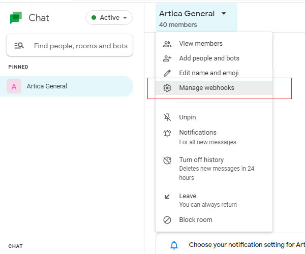
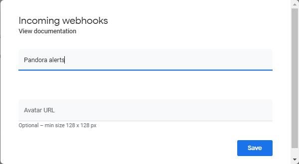
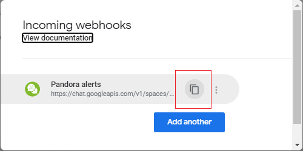
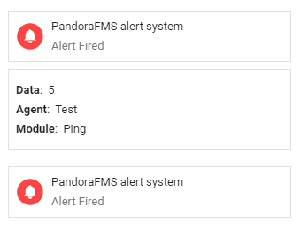
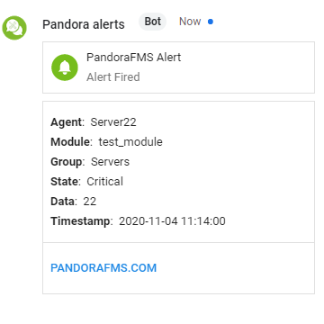
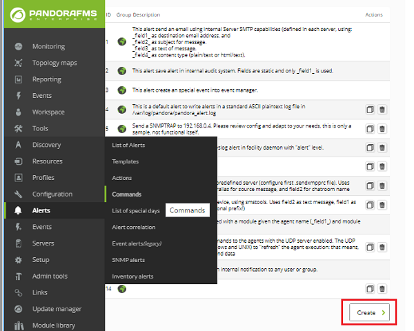
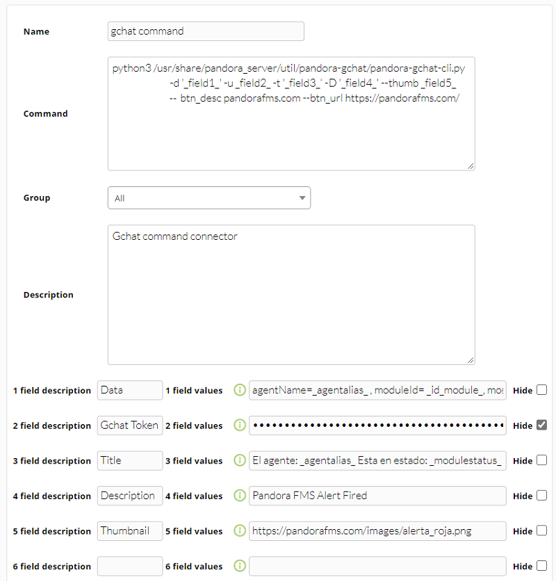
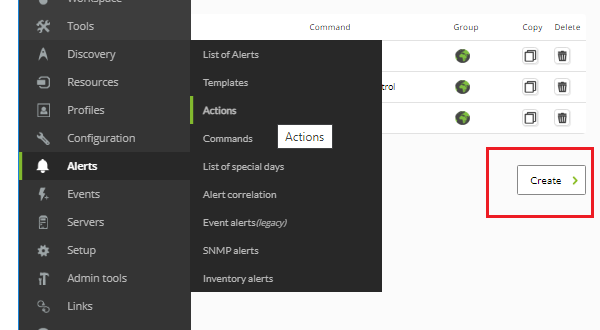
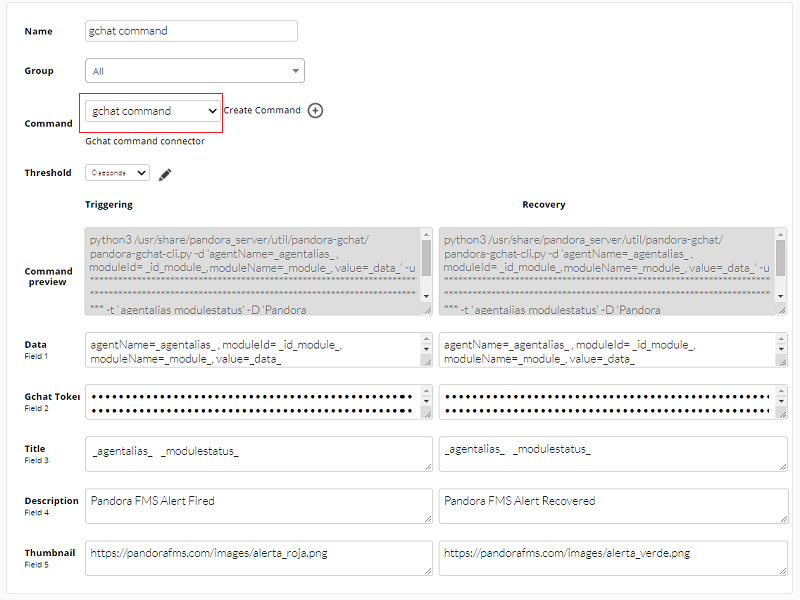

# Google Chat integration

## Google Chat settings: chat room

Once you have [logged in](https://mail.google.com/chat/u/0/#chat/welcome) and have been identified with your user credentials, go to the chat room (or add a new one) where the Pandora FMS alert messages will be published. Click on **Manage webhooks**:

In the pop-up dialog box, name the webhook and, if desired, place a link to a public online image to better identify it (visually).

Click the **Save** button. Then it will show a summary with a [link to the documentation](https://developers.google.com/chat/how-tos/webhooks) about this technology and a blue button inviting to create another webhook; **copy the webhook identifier link** as it will be used to configure Pandora FMS in the next page.

## Pandora FMS configuration: creation of an alert command

Open a terminal window and access the Pandora FMS server. Download (and unzip) from the [Pandora FMS library](https://pandorafms.com/library/google-chat-connector-cli/) the *Google Chat connector CLI* in the following path:

`/usr/share/pandora_server/util/pandora-gchat`

Or in a location that Pandora FMS server can access. You should have installed `python3` (with the modules **argparse, requests** and **json**) and `python3-pip` to be able to use the `pandora-gchat-cli.py` program. Once you have installed both, with the `pip3` command you must install the requirements or dependencies (minimum versions) with the following instruction:

`pip3 install -r requirements.txt`

In the file `test-exec.txt` you will find an example that you can reuse to configure the alert command. It is recommended that from the same terminal window you send a basic test message to the chat room, for example:

Messages can be further elaborated by additional parameters, compare with the following example:

Go to the Pandora FMS Web Console and click on **Alerts** -&gt; **Commands** -&gt; **Create**.

With the help of the text that is in the file `test-exec.txt` complete the following fields, pay attention in the second field where you will copy the link identifier obtained in the previous page, make sure to mark its content as hidden in Pandora FMS:

Click on the **Create** button to save the alert command.

## Pandora FMS configuration: creating an alert action

The [alert actions](https://pandorafms.com/manual/en/documentation/04_using/01_alerts) allow you to define how to launch the command. Go to menu **Alerts** -&gt; **Actions** -&gt; **Create**.

Select in **Command** the alert command created on the previous page, the fields will be filled in automatically. However, you can always customize the icons for **Triggering** and **Recovery** events, for example.

To save click on **Create**. To apply this action to either a [Module or Policy](https://pandorafms.com/manual/en/documentation/05_big_environments/02_policy), set up an [alert template](https://pandorafms.com/manual/en/documentation/04_using/01_alerts#alert_templates) for this purpose.

You can get more information in the video tutorial «[Create alerts in Google Chat with Pandora FMS](https://www.youtube.com/watch?v=f0oXKyrVMQU)».