# Microsoft Teams integration (Workflows)

## Introduction

This integration sends Pandora FMS alerts to a Microsoft Teams channel as Adaptive Cards. A Power
Automate workflow exposes a webhook for the channel, and the `pandora-msteams-workflow` CLI, launched
from a Pandora FMS alert command, posts the alert data to it. Use it when you want alerts to reach a
Teams channel with the agent, module and status rendered as readable fields rather than plain text.

## MS Teams settings: creating a channel

To integrate MS Teams with Pandora FMS, first go to the group where the alert messages will be sent. Once there, select the **Add channel** option:

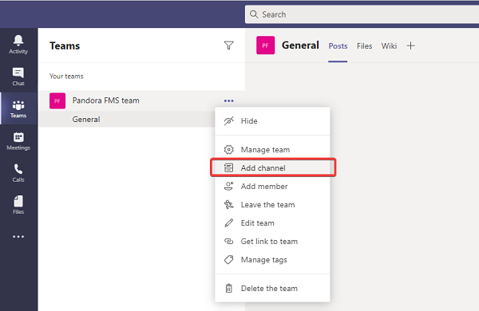

Enter a name, an optional description, and the permissions so that each team member has access to the new channel, then click the **Add** button.

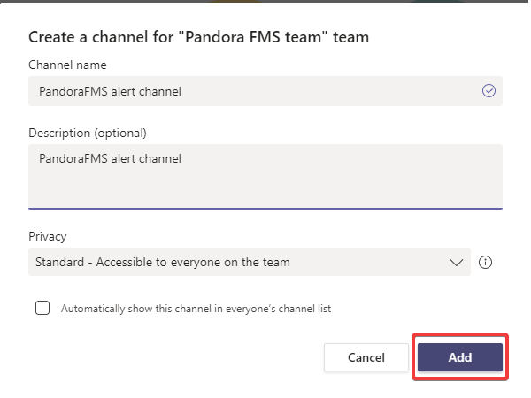

## MS Teams settings: creating an authorization URL

Microsoft Teams has replaced the classic "Incoming Webhooks" with **Workflows** (based on Power Automate). Follow these steps to get your URL directly from a channel:

1. **Select the Channel:** Go to the specific team and channel where you want to receive Pandora FMS notifications.  
      
    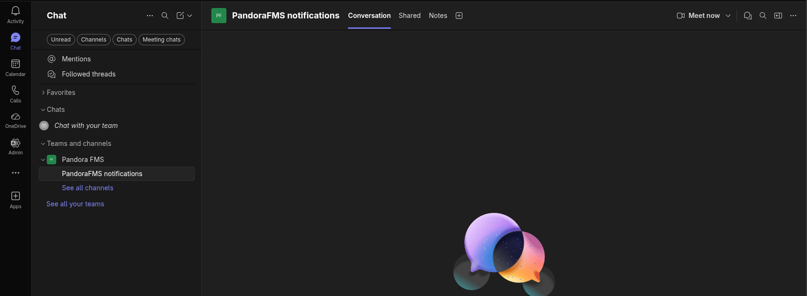
2. **Access Workflows:**
    - Haz clic en los tres puntos (`...`) junto al nombre del canal.
    - Selecciona la opción **Workflows**
3. **Create a New Workflow:**
    - Click the **+ New workflow** or **Create** button.
    - In the template search box, type: `"Send webhook alerts to channel"`
    - Select the template with that exact name.
        
        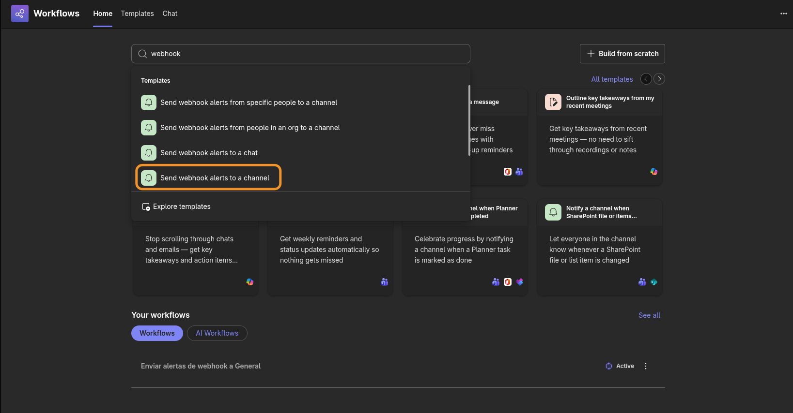
4. **Configure the Flow:**
    - Select a group and channel to send the message to.  
          
        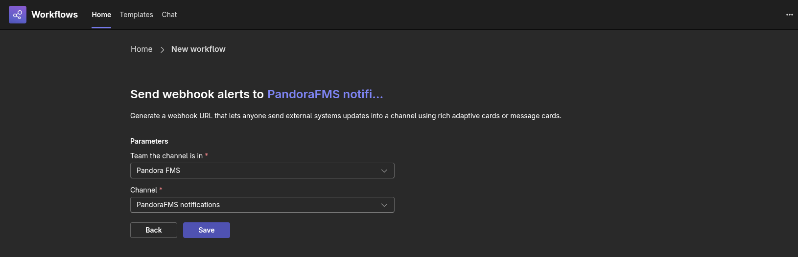
    - Click **Save**.
5. **Get the URL:**
    - Once created, a confirmation screen will appear.  
        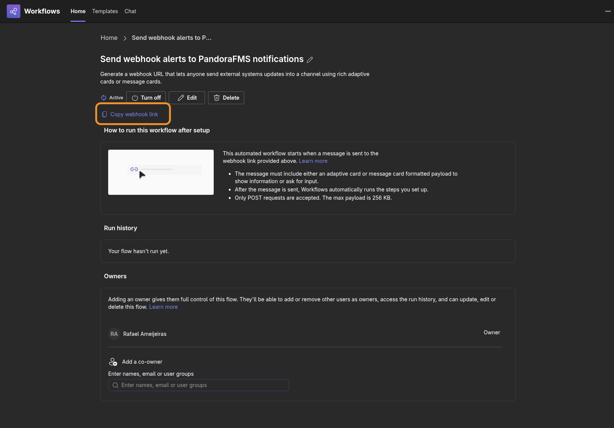
    - Copy the URL that appears by clicking the **Copy webhook link** button. **This is the URL you should use in the `-u` or `--url` parameter of the script.**
6. **Finish:** Everything is now configured; you can return to the chat window.

> **Note:** If you need to retrieve the URL later, you can go to the **Workflows** app in the Teams sidebar, enter **Manage workflows**, and edit the corresponding flow.

## Pandora FMS configuration: creation of an alert command

The zip package where the binary comes also contains a file called `test-exec.txt` which contains information about additional parameters that will enrich the sent message (subtitle, color, web link button, etc.).

To create an [alert command](https://prewebs.pandorafms.com/docs/index.php?title=Pandora:Documentation_en:Alerts#Introduction_to_the_alert_system), go to the [Pandora FMS Web Console](https://prewebs.pandorafms.com/docs/index.php?title=Pandora:Documentation_en:Interface) and click on **Alerts** -&gt; **Commands** -&gt; **Create**.

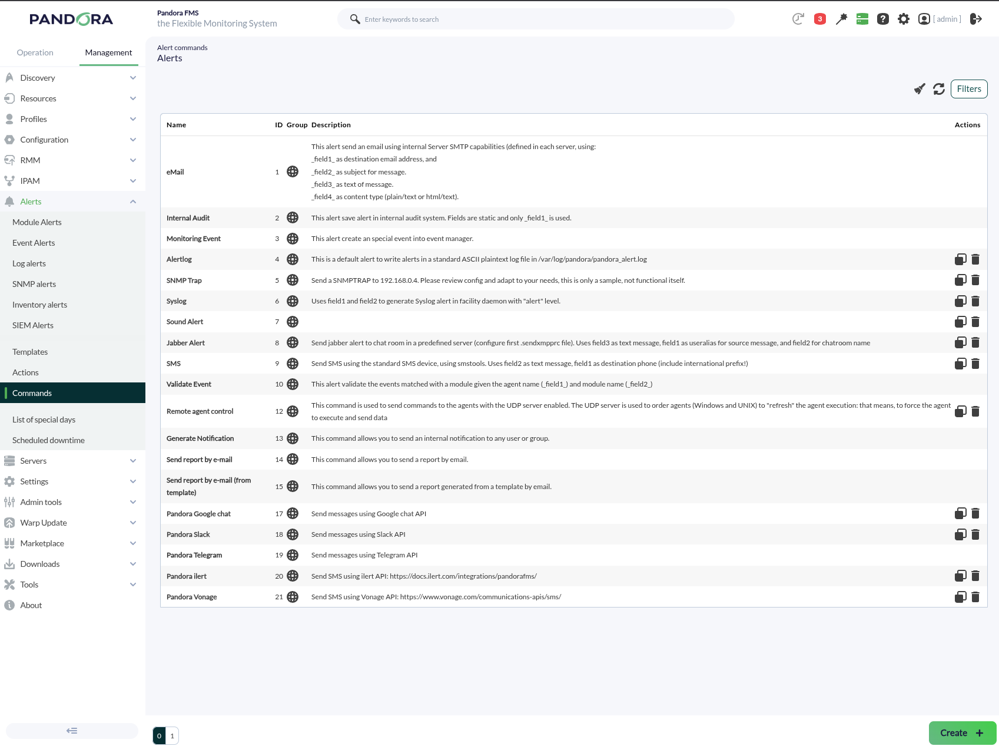

Next, define the eight necessary fields plus the last two parameters which are constants. Make sure that field number two has the **Hide** box checked and enter the authorization link obtained on the previous page there.

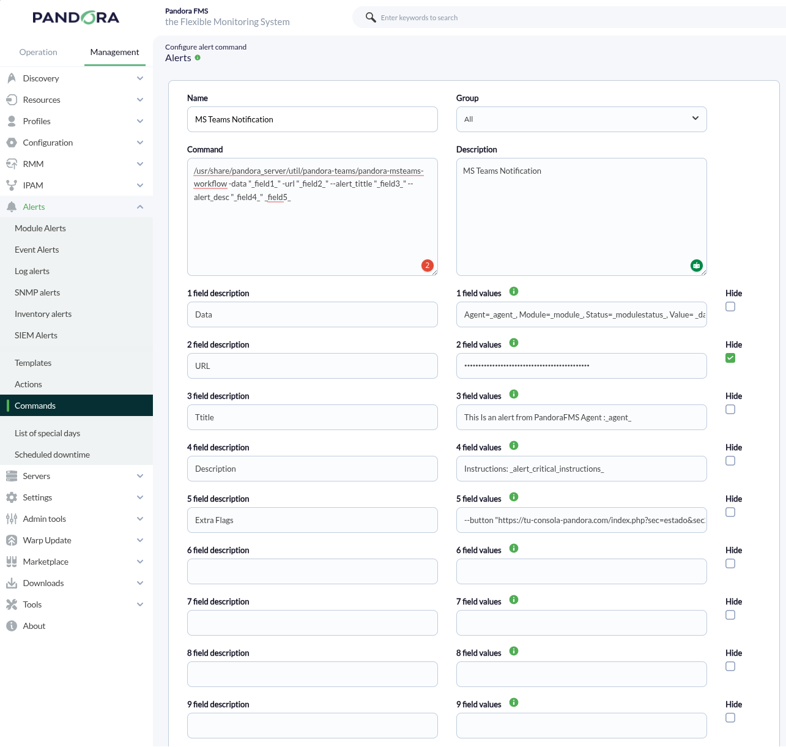

The `test-exec` file that accompanies the *Slack connector CLI* contains information that you can use to fill in these fields. Click the **Create** button to save the alert command.

## Pandora FMS configuration: creating an alert action

[Alert actions](https://prewebs.pandorafms.com/docs/index.php?title=Pandora:Documentation_en:Alerts#Action) allow you to define *how* to launch the command. Go to the **Alerts** -&gt; **Actions** -&gt; **Create** menu.

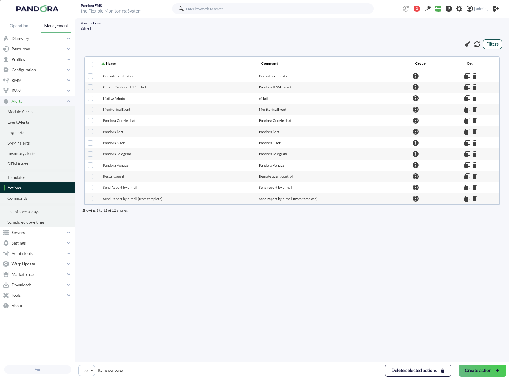

Select the alert command created on the previous page in **Command**; the fields will be filled automatically. However, you can always customize the icons or messages for **Triggering** and **Recovery** events, for example.

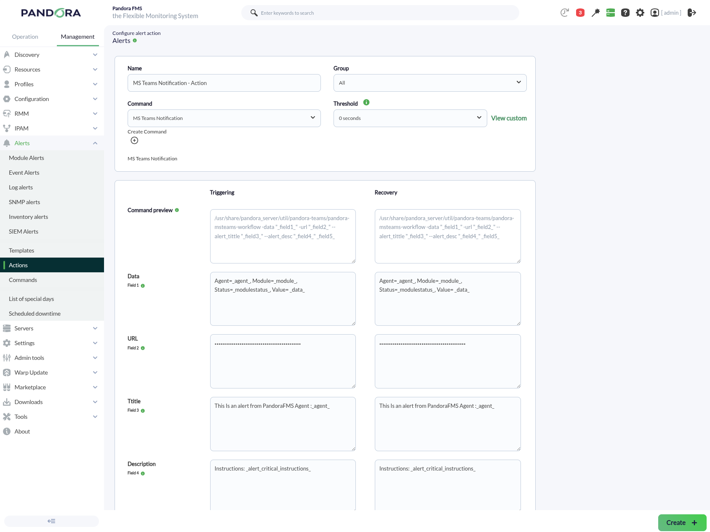

To save, click **Create**. To apply this action, whether to a [Module or Policy](https://pandorafms.com/docs/index.php?title=Pandora:Documentation_en:Policies#Modules), set an [alert template](https://pandorafms.com/docs/index.php?title=Pandora:Documentation_en:Alerts#Alert_template) for that purpose.

## Parameters and manual execution

Download the *CLI* from the Pandora FMS marketplace and unzip it on the Pandora FMS server (the recommended location is `/usr/share/pandora_server/util/pandora-msteams-workflow` or any other where the Pandora FMS server has read and execute permissions).

It is recommended to perform a test in the command terminal with the following format:

#### Script Parameters

| Parameter (Short) | Parameter (Long) | Description | Required | Default Value |
| --- | --- | --- | --- | --- |
| `-u` | `--url` | **Teams Webhook URL**. Generated by the Power Automate flow. | **Yes** | - |
| `-d` | `--data` | **Alert data** in `key=value` format separated by commas. | **Yes** | - |
| `-t` | `--alert_tittle` | Main title that will appear on the card. | No | `PandoraFMS alert fired` |
| `-D` | `--alert_desc` | Description or additional alert text. | No | `Alert Fired` |
| - | `--image` | URL of the image to be displayed on the card. | No | Pandora FMS Logo |
| - | `--image_size` | Image size (`Small`, `Medium`, `Large`, `Stretch`). | No | `Medium` |
| - | `--button` | URL to which the action button will redirect. | No | `https://pandorafms.com` |
| - | `--button_desc` | Text that will be displayed inside the button. | No | `Open web console` |

---

#### Usage Examples

##### 1. Basic Example

Sending a simple alert with the minimum required data:

```bash
./pandora-msteams-workflow \
  --url "https://your-webhook-url" \
  --data "Agent=Server_Web_01,Module=CPU_Load,Status=Critical"

```

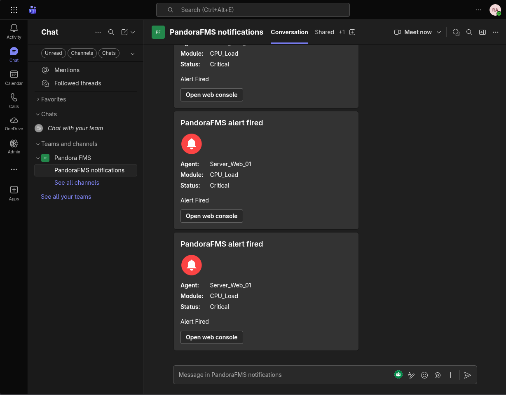

##### 2. Full Example with Customization

Customizing the title, description, button, and image size:

```bash
./pandora-msteams-workflow \
  --url "https://your-webhook-url" \
  --data "Hostname=DB-Server-05,IP=10.0.0.50,Error=MySQL service is down" \
  --alert_tittle "CRITICAL: Database Failure" \
  --alert_desc "The database service has stopped responding. Please check immediately." \
  --image "https://img.icons8.com/color/96/error.png" \
  --image_size "Large" \
  --button "https://your-pandora-console.com/index.php?sec=estado&sec2=lista_agentes" \
  --button_desc "Open PandoraFMS Console"

```

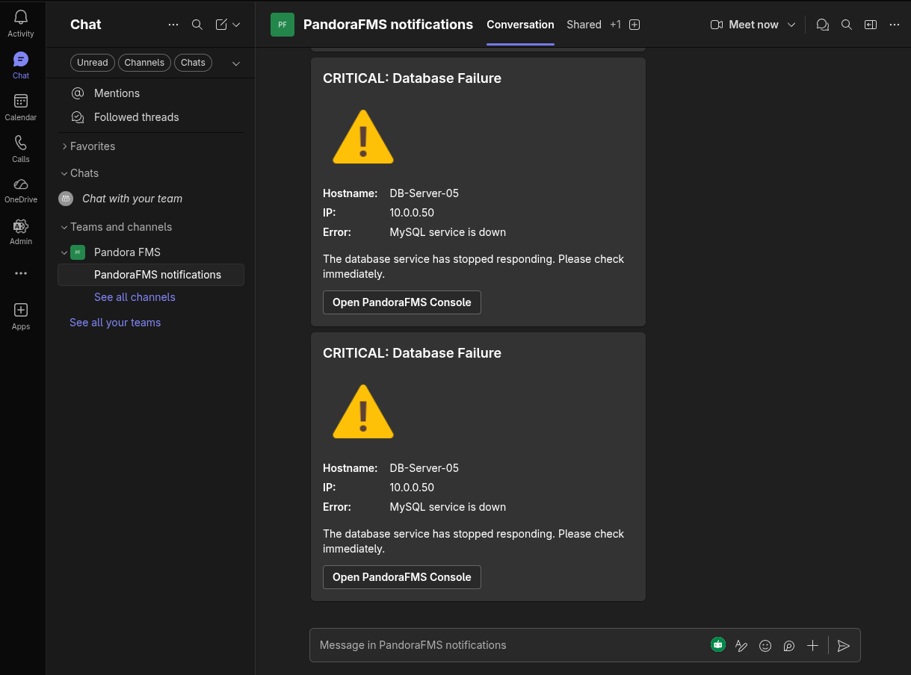

---

#### Internal Operation of the `--data` Parameter

The `--data` parameter processes a text string and converts it into a list of "Facts" within the Teams Adaptive Card.

- **Correct format:** `Name=Value,OtherName=OtherValue`
- **Note:** Avoid using commas (`,`) or equals signs (`=`) within values, as the script uses them as delimiters.
