# Telegram integration

## Telegram settings: bot creation

First, you must [create a *bot* in Telegram](https://core.telegram.org/bots/faq)®:

- From your account in Telegram, start a conversation with the user[ BotFather](https://telegram.me/botfather)

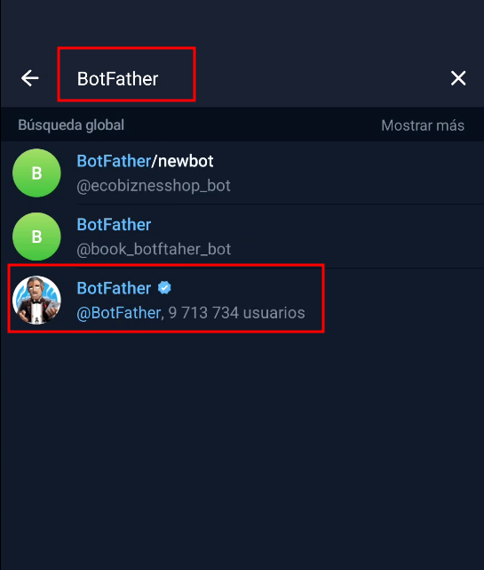

- Once the conversation is initiated, use the `/start `command:

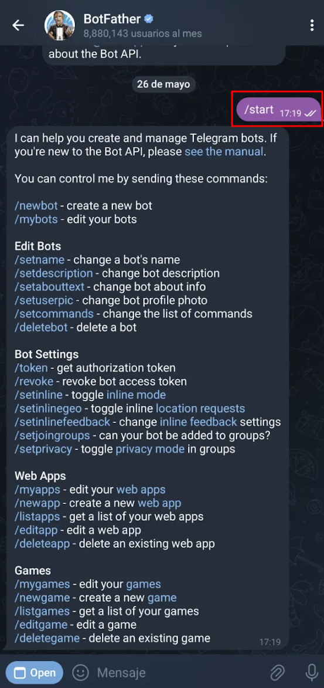

- Next, enter the `/newbot` command. You will be prompted to provide a display name for the bot and a username, which must end in “bot”.

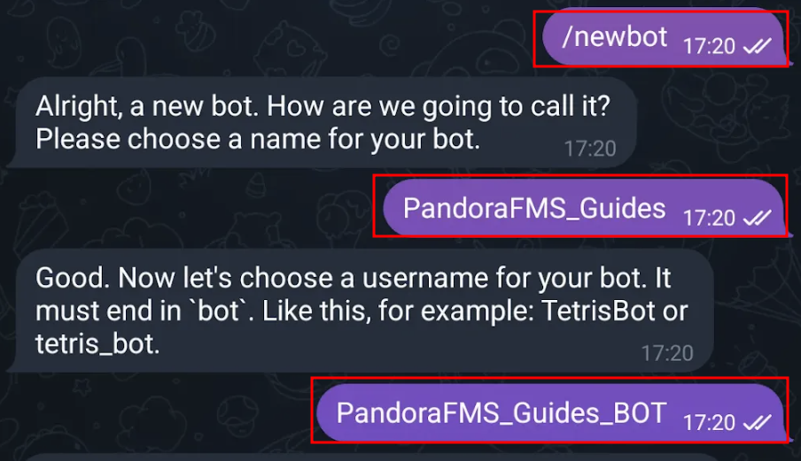

Once these steps have been completed, you will be provided with the API key for the bot you created. It is very important to save the API key and remember the bot’s username.

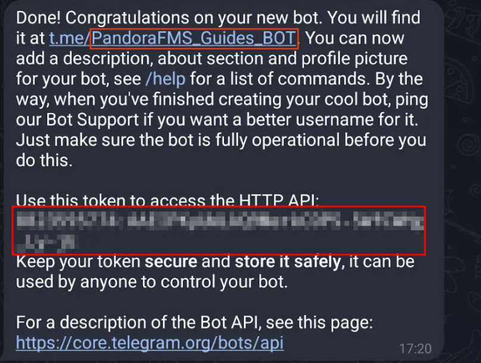

## Telegram settings: create a group and add the bots.

- The next step is to create a group.

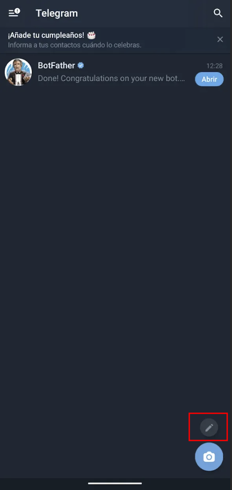

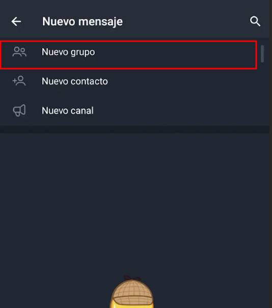

- During the creation of this group, add the bot created in the previous step and assign a name to the group.

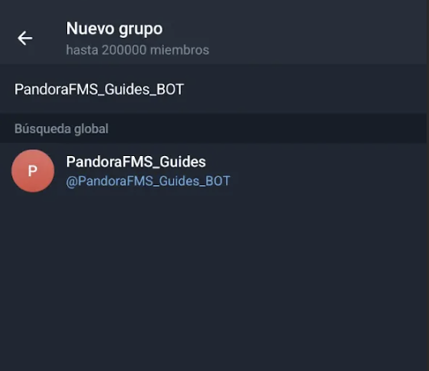

- Once the group has been created, add the bot named “getidsbot” **(it is very important to add the correct bot, as there are several bots with similar alias).**

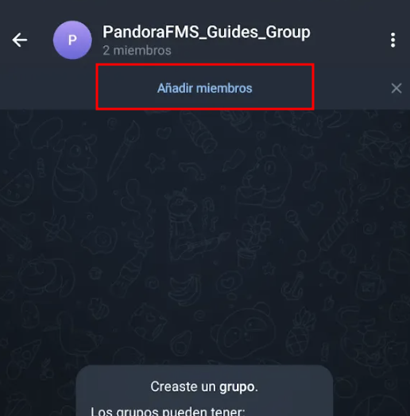

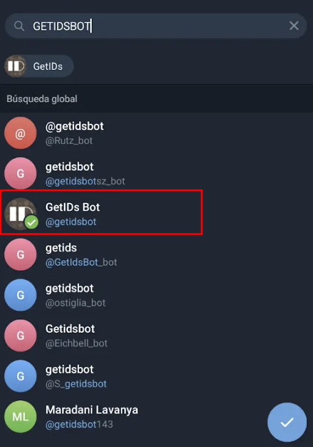

- When the bot is added, it will return the group ID. You must save it in order to complete the configuration in the Pandora console, along with the API key and the username of the bot you created and added earlier.

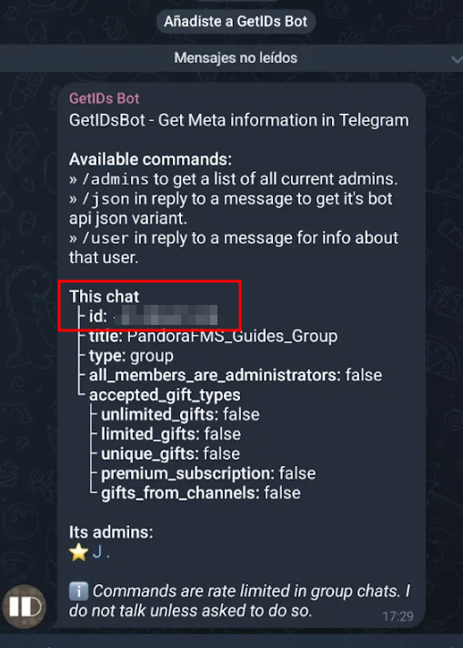

## Pandora FMS configuration: Bot integration with alerts

To configure the alerts, first enter the API token in the following section:

**Management → Settings → System settings → General setup → Alerts configuration → Telegram Configuration → Telegram Token**

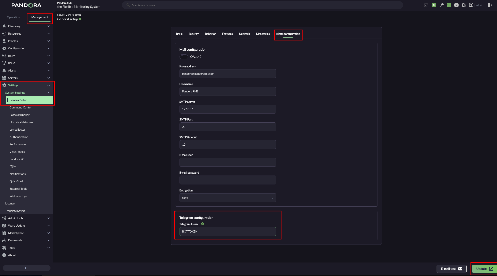

The field displays the token in plain text; take appropriate precautions to prevent it from being viewed by third parties.

Once finished, click the “**Update**” button to save the Telegram token in the database.

## Configuration in Pandora FMS: creating an alert action

The Telegram® plugin is fully integrated into Pandora FMS 800.

Go to the **Management→Alerts→ Actions** menu and in **Filter** select **Pandora Telegram** in the **Command or search** field. The alert actions that use the **Pandora Telegram** command will be displayed:

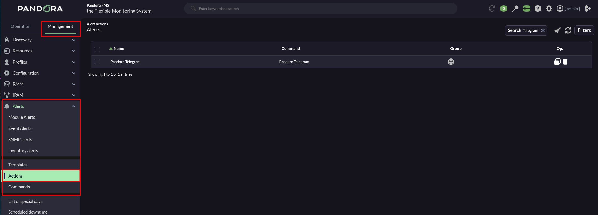

You may:

- Use the default action on Pandora FMS.
- Copy the previous action and customize it as needed. (It may be the case that several groups of agents use different alert actions configured according to each case)
- Create an action based on the Telegram alert command (read-only).

In any case, the configuration is similar:

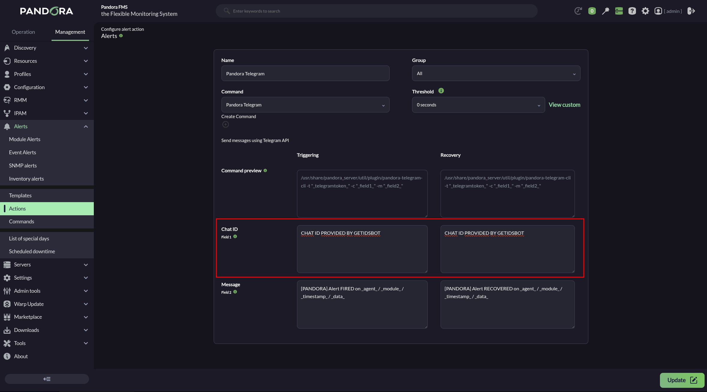

- Indicate and select the name and group.
- Ensure that **Pandora Telegram** is selected in **Command** list.
- In **Chat ID**, enter the corresponding identifier*.*
- The default **Message** field for **Triggering** is `[PANDORA] Alert FIRED on _agent_ / _module_ / _timestamp_ / _data_` . See the other [macros available](https://pandorafms.com/manual/en/documentation/pandorafms/management_and_operation/01_alerts#ks15) to insert more information.
- The default **Message** field for **Recovery** is `[PANDORA] Alert RECOVERED on _agent_ / _module_ / _timestamp_ / _data_` . See the other [macros available](https://pandorafms.com/manual/en/documentation/pandorafms/management_and_operation/01_alerts#ks15) to insert more information.
- Press the **Create** button if you are creating an alert action or **Update** if you are editing to save the parameters.

Click **Create**. Once you have created this alert action, it can be included in [a policy](https://pandorafms.com/manual/en/documentation/pandorafms/complex_environments_and_optimization/02_policy "PFMS: Policies monitoring"), [a template](https://pandorafms.com/manual/en/documentation/pandorafms/technical_annexes/34_pfms_templates_policies_massives "PFMS: Differences between Templates, Policies, and Mass Operations"), or [Module](https://pandorafms.com/manual/es/documentation/pandorafms/management_and_operation/01_alerts#ks5_2 "PFMS: Gestionar alertas desde el agente").

Sometimes it may take a while for a newly created bot to work properly.
