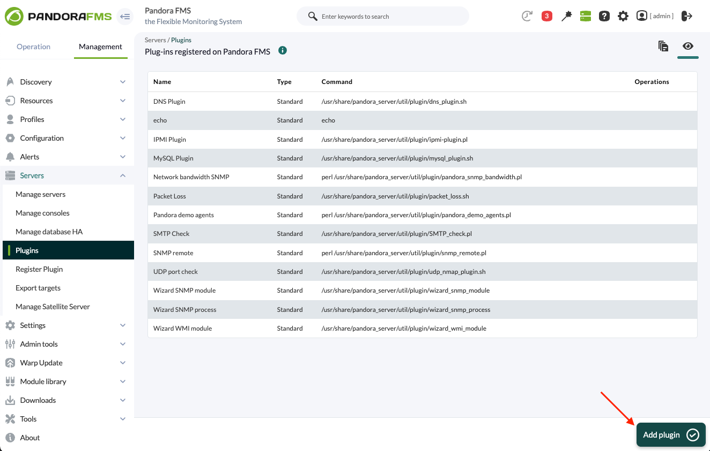
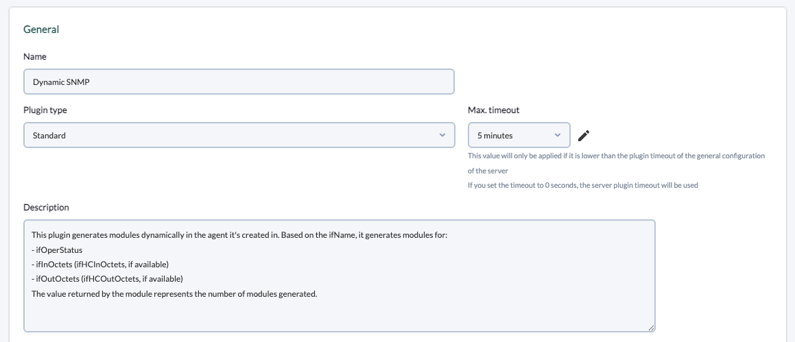
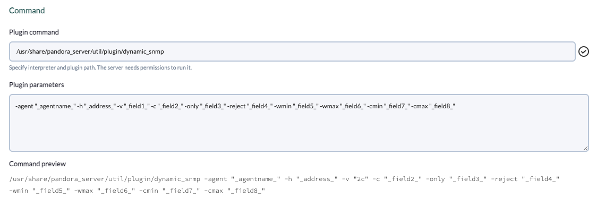
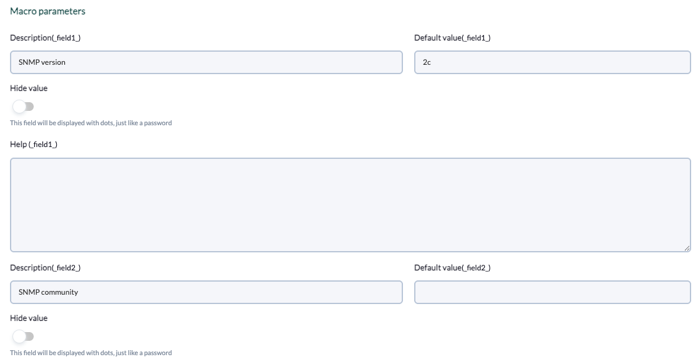
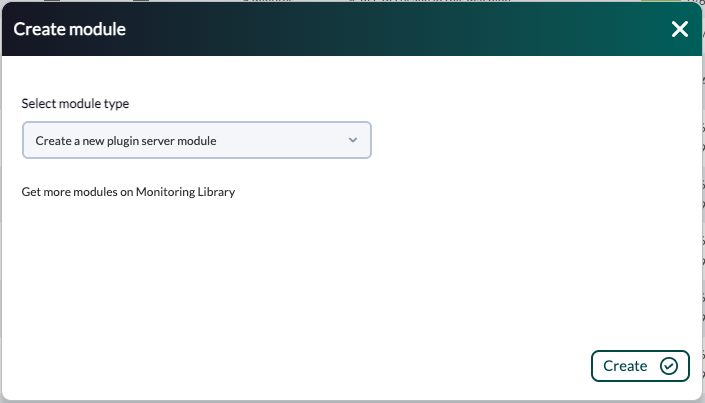
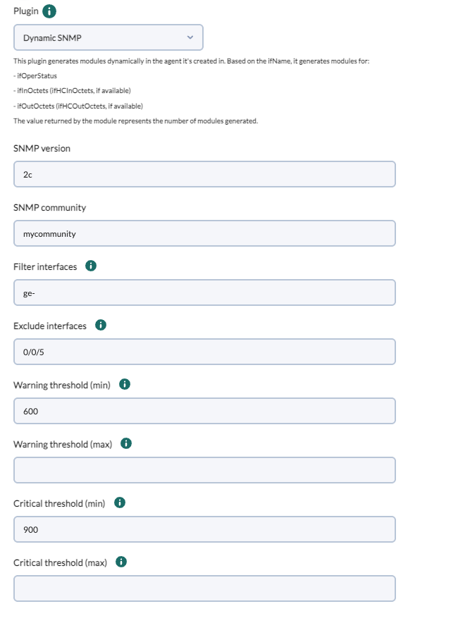
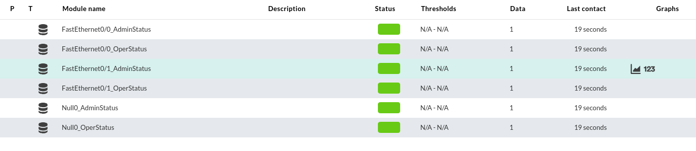
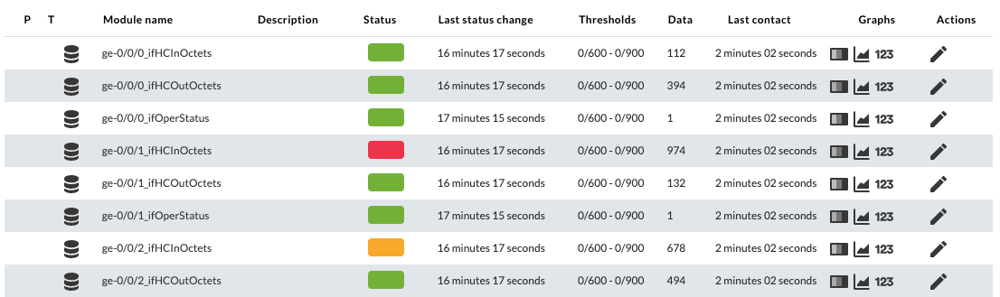

# Dynamic SNMP plugin

*Article last updated: 2026-09-23.*

## What it does

The Dynamic SNMP plugin performs an SNMP scan of a target device and generates Pandora FMS modules dynamically. Instead of predefining the OID of each interface, the plugin walks the interface table, uses the interface name (`ifName`) to identify each one, and builds one module per interface and metric. Monitoring therefore survives OID changes that happen between device reboots.

By default, for every interface the plugin monitors:

- `ifOperStatus`.
- Inbound and outbound traffic: `ifHCInOctets` and `ifHCOutOctets` when the device exposes 64-bit counters, or `ifInOctets` and `ifOutOctets` otherwise.

It can filter interfaces by name, assign numeric and string thresholds to the generated modules, and attach alert templates to them.

The plugin runs in two modes:

- **Agent plugin** — without `-agent`, it prints the generated modules as XML on standard output, and the Pandora FMS agent that runs it ingests them.
- **Server plugin** — with `-agent <name>`, it builds the agent report and transfers it to the Pandora FMS server, creating the agent and its modules when that agent does not exist yet.

## Prepare

### Compatibility

The plugin has been developed and tested on Rocky Linux and Fedora 34, and it is expected to work on any Linux system.

### Requirements

1. **A Pandora FMS deployment** with the server or agent that will run the plugin.
2. **Perl 5.x.**
3. **The `snmpget` and `snmpwalk` commands** from the net-snmp package, available in `PATH`.
4. **The `PandoraFMS::PluginTools` Perl library.**
5. **Network connectivity to the target device**, plus its SNMP community (v1/v2c) or SNMPv3 user and keys.
6. **For server plugin mode**, a reachable `tentacle_client` (tentacle transfer) or write access to the `data_in` directory (localcopy transfer).

### Install the plugin

The plugin is distributed as the `dynamic_snmp` script. Upload it to the machine that will run it:

- **Server plugin** — `/usr/share/pandora_server/util/plugin/`.
- **Agent plugin** — the plugin directory of the endpoint.

Give the file execution permissions and make sure `snmpwalk` and `snmpget` are installed there.

## Configure

The plugin has no configuration file: every option is passed on the command line. Choose the mode according to where the plugin runs.

### Run as an agent plugin

Register the plugin as an agent plugin in the endpoint, with the command and its parameters, and **do not** use `-agent`. On every execution the plugin prints the module XML on standard output and the agent stores the modules under its own agent.

### Register as a server plugin

To let the plugin create and feed a different agent, register it in the console as a server plugin and pass `-agent` on every execution:

1. Upload the plugin script to `/usr/share/pandora_server/util/plugin/` on the Pandora FMS server.
2. Go to **Servers → Plugins** and click **Add plugin**:

   

3. Set a **Name**, keep **Plugin type** as `Standard`, and set **Max timeout**. SNMP scans can take a while, so a timeout of at least 20 seconds is recommended; the global `plugin_timeout` of `pandora_server.conf` may also need to be raised.

   

   Example description:

   ```text
   This plugin generates modules dynamically in the agent it's created in.
   Based on the ifName, it generates modules for:
   - ifOperStatus
   - ifInOctets (ifHCInOctets, if available)
   - ifOutOctets (ifHCOutOctets, if available)
   The value returned by the module represents the number of modules generated.
   ```

4. Set the **Plugin command** and the **Plugin parameters**. Each parameter is written as a macro `_fieldX_`, where `X` is the positional number of the parameter:

   

   The `_agentname_` and `_address_` server macros fill in the agent name and the device address automatically, so the example parameters are:

   ```text
   -agent "_agentname_" -h "_address_" -v "_field1_" -c "_field2_" -only "_field3_" -reject "_field4_" -wmin "_field5_" -wmax "_field6_" -cmin "_field7_" -cmax "_field8_"
   ```

5. Define each macro under **Macro parameters**, giving a description, a default value and, optionally, a help text:

   

6. In the target agent, create a new module and choose **Create a new plugin server module**:

   

7. In the module configuration, select the **Dynamic SNMP** plugin and fill in the macro fields:

   

On each execution the server plugin transfers the report using the selected transfer mode and prints the number of generated modules. If the agent named by `-agent` does not exist, it is created automatically.

## Verify

Run the plugin manually on the host that will execute it. This example scans a device over SNMPv2c in agent plugin mode:

```bash
./dynamic_snmp -h "192.168.51.1" -v "2c" -c "mycommunity"
```

A successful agent-plugin run prints one `<module>` XML block per generated module on standard output. A successful server-plugin run transfers the report and prints the number of generated modules instead.

The generated modules then appear in the target agent:



With filters and thresholds applied, only the matching interfaces are generated and the thresholds are attached to their modules:



## Understand the results

The plugin walks the interface name branch first, and for every interface name it queries each configured branch. The module name is the interface name followed by the branch name, separated by an underscore, for example `ge-0/0/0_ifHCInOctets` or `FastEthernet0/0_OperStatus`.

- **Interface status.** `ifOperStatus` is generated as a `generic_proc` module: `1` while the interface is operational. Values greater than `1` are forced to `0` for Pandora FMS compatibility.
- **Traffic.** `ifHCInOctets`, `ifHCOutOctets`, `ifInOctets` and `ifOutOctets` are generated as incremental modules (`generic_data_inc`).
- **64-bit counters.** When the device answers the walk of the 64-bit counter branch (`.1.3.6.1.2.1.31.1.1.1.6`), the plugin uses the HC branches; otherwise it falls back to the 32-bit branches.
- **Automatic typing.** For custom branches the plugin detects the module type from the SNMP data type of the returned value; the type is not predefined.
- **Filters.** `-only` keeps only the interfaces whose name matches any of its regular expressions, and `-reject` drops the interfaces whose name matches any of them.

## Operate and troubleshoot

- **Enable debug output.** Add `-debug 1` to print diagnostic messages, prefixed with a timestamp, on standard error.
- **No modules are generated.** Check connectivity to the device, the SNMP version, the community or SNMPv3 credentials, and that `snmpwalk` and `snmpget` are installed and reachable in `PATH`.
- **Some interfaces are missing.** Review the `-only` and `-reject` regular expressions; they are matched against the interface name, so a value such as `0/0/5` excludes every interface whose name contains that string.
- **The execution times out.** Large interface tables take longer to scan. Raise the module or plugin timeout and keep the interval (`-interval`) matched to the expected execution time.
- **A server plugin run reports no modules.** Verify that the console can receive from the server: the `tentacle_client` address and port for tentacle mode, or the `data_in` path for localcopy mode.

## Reference

### General parameters

| Name | Required | Default | Description |
| --- | --- | --- | --- |
| `-agent <name>` | No | — | Target agent name. When set, the plugin runs as a server plugin and transfers the report; when omitted, it runs as an agent plugin and prints the modules on standard output |
| `-interval <seconds>` | No | `300` | Agent interval written in the generated report (server plugin mode). A non-numeric value or `0` falls back to `300` |
| `-group <name>` | No | — | Module group assigned to every generated module |
| `-debug 0\|1` | No | `0` | When `1`, prints timestamped diagnostic messages on standard error |

### SNMP parameters

| Name | Required | Default | Description |
| --- | --- | --- | --- |
| `-v <version>` | Yes | — | SNMP version: `1`, `2`, `2c` or `3` |
| `-h <host>` | Yes | — | IP address or host name of the device to scan |
| `-c <community>` | For `1`, `2` and `2c` | — | SNMP community |
| `-p <port>` | No | `161` | SNMP port of the device |
| `-d <type>` | No | — | Data type. The plugin determines each module type automatically, so this value is accepted but not applied |

SNMPv3 parameters:

| Name | Required | Default | Description |
| --- | --- | --- | --- |
| `-n <context>` | No | — | SNMPv3 context |
| `-l <level>` | For `3` | — | Security level: `noAuthNoPriv`, `authNoPriv` or `authPriv` |
| `-u <name>` | No | — | SNMPv3 security name (user) |
| `-a <protocol>` | With `authNoPriv` and `authPriv` | — | Authentication protocol, such as `MD5` or `SHA` |
| `-A <key>` | With `authNoPriv` and `authPriv` | — | Authentication key |
| `-x <protocol>` | With `authPriv` | — | Privacy protocol, such as `DES` or `AES` |
| `-X <key>` | With `authPriv` | — | Privacy key |

### Monitoring and filtering parameters

| Name | Required | Default | Description |
| --- | --- | --- | --- |
| `-o <oid>` | No | `.1.3.6.1.2.1` | Base OID that the branch subtrees are appended to |
| `-names <subtree>` | No | Automatic | Subtree under `-o` used as the source of interface names |
| `-branches <name:subtree,...>` | No | Automatic | Branches to retrieve, in the form `Branch1:SubTree1,Branch2:SubTree2`. The subtree is appended to `-o` |
| `-nodefaults 1` | No | — | Disables the default branches, so only `-names` and `-branches` are used |
| `-only <regex,...>` | No | — | Comma-separated list of regular expressions. Only interfaces whose name matches any of them are monitored |
| `-reject <regex,...>` | No | — | Comma-separated list of regular expressions. Interfaces whose name matches any of them are excluded |

### Threshold and alert parameters

| Name | Required | Default | Description |
| --- | --- | --- | --- |
| `-wmin <value>` | No | — | Minimum warning threshold for the generated modules |
| `-wmax <value>` | No | — | Maximum warning threshold for the generated modules |
| `-cmin <value>` | No | — | Minimum critical threshold for the generated modules |
| `-cmax <value>` | No | — | Maximum critical threshold for the generated modules |
| `-string_warning <string>` (`-wstr`) | No | — | String warning threshold for the generated modules |
| `-string_critical <string>` (`-cstr`) | No | — | String critical threshold for the generated modules |
| `-warning_inverse 0\|1` (`-winv`) | No | — | Inverts the warning threshold comparison |
| `-critical_inverse 0\|1` (`-cinv`) | No | — | Inverts the critical threshold comparison |
| `-alrt <name,...>` | No | — | Comma-separated list of alert templates applied to every generated module |

### Data transfer parameters

Used only in server plugin mode.

| Name | Required | Default | Description |
| --- | --- | --- | --- |
| `-m <mode>` | No | `tentacle` | Transfer mode: `tentacle` or `localcopy` |
| `-t_ip <ip>` | No | `127.0.0.1` | Target Pandora FMS address for tentacle transfer |
| `-t_port <port>` | No | `41121` | Tentacle port |
| `-t_opts <options>` | No | — | Extra tentacle options |
| `-t_file_path <path>` | No | `/var/spool/pandora/data_in/` | Destination directory for localcopy transfer |

### Generated modules

For every interface and branch, the module name is `<ifName>_<branch>`. The default branches are:

| Module name | Meaning | Type |
| --- | --- | --- |
| `<ifName>_ifOperStatus` | Operational status of the interface: `1` when operational, `0` otherwise (values greater than `1` are forced to `0`) | `generic_proc` |
| `<ifName>_ifHCInOctets` | Inbound octets, 64-bit counter | `generic_data_inc` |
| `<ifName>_ifHCOutOctets` | Outbound octets, 64-bit counter | `generic_data_inc` |
| `<ifName>_ifInOctets` | Inbound octets, 32-bit counter | `generic_data_inc` |
| `<ifName>_ifOutOctets` | Outbound octets, 32-bit counter | `generic_data_inc` |

Custom branches are generated with the same `<ifName>_<branch>` naming and their type detected from the SNMP data type.

### Default OID tree

The subtrees below are appended to the base OID (`-o`, `.1.3.6.1.2.1` by default).

| Branch | 32-bit tree | 64-bit tree |
| --- | --- | --- |
| Interface names (`__names__`) | `.2.2.1.2` | `.31.1.1.1.1` |
| `ifInOctets` / `ifHCInOctets` | `.2.2.1.16` | `.31.1.1.1.6` |
| `ifOutOctets` / `ifHCOutOctets` | `.2.2.1.10` | `.31.1.1.1.10` |
| `ifOperStatus` | `.2.2.1.8` | `.2.2.1.8` |

### Examples

Basic SNMPv2c scan in agent plugin mode, with all defaults:

```bash
./dynamic_snmp -h "192.168.51.1" -v "2c" -c "mycommunity"
```

Server plugin mode with inclusion and exclusion filters. Only interfaces whose name contains `Ge` are monitored, and those containing `0/3` are excluded:

```bash
./dynamic_snmp -agent "Test-agentname" -h "192.168.51.1" -v "2c" -c "mycommunity" -only "Ge" -reject "0/3"
```

The same example over SNMPv3:

```bash
./dynamic_snmp -agent "Test-agentname" -h "192.168.51.1" -v "3" \
  -l "authPriv" -u "snmpv3user" -a "SHA" -A "PASSWORD1" -x "AES" -X "PASSWORD2" \
  -only "Ge" -reject "0/3"
```

Custom branches with the default monitoring disabled:

```bash
./dynamic_snmp -agent "Test-agentname" -h "192.168.51.1" -v "2c" -c "mycommunity" \
  -o ".1.3.6.1.2.1" -names ".2.2.1.2" \
  -branches "OperStatus:.2.2.1.8,AdminStatus:.2.2.1.7" -nodefaults 1
```

Quotes are not mandatory in the examples, but they prevent shell interpretation issues.
