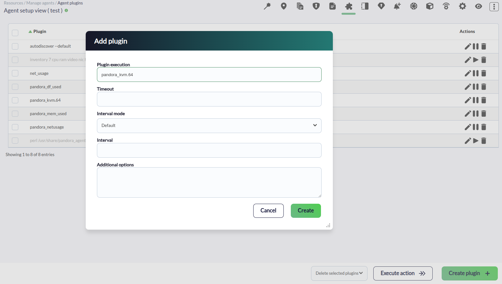
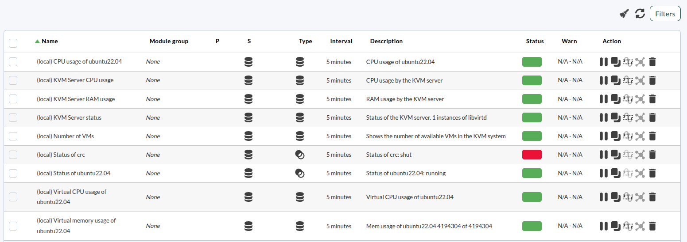

# KVM monitoring plugin

*Article last updated: 2026-09-03.*

## What it does

The KVM monitoring plugin monitors the state of a running KVM environment from Pandora FMS. To gather that state it uses two elements: `virsh`, which returns the state of the virtual machines (VMs) and their performance metrics, and `libvirtd`, which reports the state of the KVM server and the resources it is consuming.

The plugin is executed as a Pandora FMS agent plugin: each run prints the generated modules as XML on standard output, and every module belongs to the `KVM` module group.

## Prepare

### Compatibility and availability

The plugin has been tested on CentOS, Ubuntu 24.04 and Rocky Linux 9, and it is expected to work on Linux-based systems. The package requires libvirt (`libvirt-bin` or `libvirt`) together with the `virsh` command.

### Requirements

1. **A Pandora FMS Endpoint deployed on your system.**
2. **Perl 5.x or newer.**
3. **Permission to execute `virsh` and to connect to the libvirtd instance**, for the user that runs the plugin.
4. **The `unzip` command**, required only when the plugin is deployed through collections.

### Install the plugin

The plugin is distributed as the `pandora_kvm.pl` script and its `pandora_kvm.conf` configuration file. Two deployment paths are available:

- **Manual upload** — upload `pandora_kvm.pl` and `pandora_kvm.conf` to the endpoint that will run the plugin.
- **Collections** — deploy both files to the endpoints through Enterprise collections.

## Configure

Once the plugin files are in place, register the plugin in the **Endpoint Plugins** section of the endpoint:



The plugin reads the list of KVM servers to monitor from its configuration file, `pandora_kvm.conf`, which the script receives as its argument:

- One `user@server` entry per line monitors that remote KVM host.
- Several lines monitor several KVM servers with a single execution of the plugin.
- The shipped file contains the single entry `root@localhost`, which monitors the libvirtd instance running on the host itself.
- Lines that start with `#` are comments and are skipped.

Access to the monitored hosts must be unattended. When an entry points to a remote server, copy the SSH public key of the host that runs the plugin to the target servers.

## Verify

Run the plugin manually from the directory that contains it:

```bash
./pandora_kvm.pl pandora_kvm.conf
```

A successful run prints one XML `<module>` block per generated module on standard output. The sample below shows the output of an execution in local mode — `(local)` prefix — for a KVM environment with two VMs, `ubuntu22.04` running and `crc` shut:

```xml
<module>
    <name><![CDATA[(local) KVM Server status]]></name>
    <type></type>
    <data><![CDATA[1]]></data>
    <description><![CDATA[Status of the KVM server. 1 instances of libvirtd]]></description>
    <module_group>KVM</module_group>
</module>
<module>
    <name><![CDATA[(local) KVM Server RAM usage]]></name>
    <type>generic_data</type>
    <data><![CDATA[0]]></data>
    <description><![CDATA[RAM usage by the KVM server]]></description>
    <module_group>KVM</module_group>
</module>
<module>
    <name><![CDATA[(local) KVM Server CPU usage]]></name>
    <type>generic_data</type>
    <data><![CDATA[0]]></data>
    <description><![CDATA[CPU usage by the KVM server]]></description>
    <module_group>KVM</module_group>
</module>
<module>
    <name><![CDATA[(local) Number of VMs]]></name>
    <type>generic_data</type>
    <data><![CDATA[2]]></data>
    <description><![CDATA[Shows the number of available VMs in the KVM system]]></description>
    <module_group>KVM</module_group>
</module>
<module>
    <name><![CDATA[(local) Status of ubuntu22.04]]></name>
    <type>generic_proc</type>
    <data><![CDATA[1]]></data>
    <description><![CDATA[Status of ubuntu22.04: running]]></description>
    <module_group>KVM</module_group>
</module>
<module>
    <name><![CDATA[(local) Status of crc]]></name>
    <type>generic_proc</type>
    <data><![CDATA[0]]></data>
    <description><![CDATA[Status of crc: shut]]></description>
    <module_group>KVM</module_group>
</module>
<module>
    <name><![CDATA[(local) CPU usage of ubuntu22.04]]></name>
    <type></type>
    <data><![CDATA[4,5]]></data>
    <description><![CDATA[CPU usage of ubuntu22.04]]></description>
    <module_group>KVM</module_group>
</module>
<module>
    <name><![CDATA[(local) Virtual CPU usage of ubuntu22.04]]></name>
    <type></type>
    <data><![CDATA[0,5]]></data>
    <description><![CDATA[Virtual CPU usage of ubuntu22.04]]></description>
    <unit><![CDATA[%]]></unit>
    <module_group>KVM</module_group>
</module>
<module>
    <name><![CDATA[(local) Virtual memory usage of ubuntu22.04]]></name>
    <type></type>
    <data><![CDATA[100.00]]></data>
    <description><![CDATA[Mem usage of ubuntu22.04 4194304 of 4194304]]></description>
    <unit><![CDATA[%]]></unit>
    <module_group>KVM</module_group>
</module>
```

The generated modules are then visible in the Pandora FMS console:



If the run does not print module XML, see [Troubleshoot](#troubleshoot).

## Understand the results

For every monitored node the plugin reports the state of the KVM server and of each of its VMs:

- **Server level.** `(<node>) KVM Server status` is `1` while libvirtd is running and `0` otherwise. `(<node>) KVM Server RAM usage` and `(<node>) KVM Server CPU usage` report the resources consumed by the KVM server, and `(<node>) Number of VMs` reports the total number of VMs in the KVM system.
- **VM level.** `(<node>) Status of <vm>` is `1` while the VM is running and `0` otherwise; its description carries the libvirt state of the VM, such as `running` or `shut`.
- **Running VMs only.** `(<node>) CPU usage of <vm>`, `(<node>) Virtual CPU usage of <vm>` and `(<node>) Virtual memory usage of <vm>` are generated only while the VM is running; the last two carry the `%` unit. The computation of each module is described in [Generated modules](#generated-modules).

Module names start with the node name between parentheses: `(local)` when the plugin monitors the local libvirtd instance, and the host of each `user@server` entry for remote nodes. All modules are emitted with `module_group` `KVM`.

As printed by the plugin, `KVM Server status`, `CPU usage of <vm>`, `Virtual CPU usage of <vm>` and `Virtual memory usage of <vm>` carry an empty `<type>` element in the XML output, as the sample in [Verify](#verify) shows.

## Troubleshoot

- **A node produces no VM or resource modules** — the plugin first checks whether libvirtd is running (`ps aux | grep libvirtd | grep -v grep`) and, when it finds no process, it emits only `(<node>) KVM Server status` with value `0` and skips the rest of the node. Check that libvirtd is running and that the user executing the plugin may see the process.
- **A remote KVM host is not monitored** — the plugin reaches each remote entry over SSH, and the connection must not require user intervention. Copy the SSH public key of the host that runs the plugin to every target server, and make sure each entry uses the `user@server` form.
- **The plugin prints its usage text and no module XML** — the configuration file passed as its argument does not exist, or more than one argument was given. Check the path and run the plugin with a single existing file, for example `./pandora_kvm.pl pandora_kvm.conf`.
- **A node with libvirtd running still reports no VMs** — the plugin lists the VMs with `virsh list --all` and falls back to the read-only `/usr/bin/virsh -r -c qemu:///system` when that command returns no list. Check that `virsh` is installed and that the user executing the plugin can run it and connect to the libvirtd instance (the package requires libvirt, `libvirt-bin` or `libvirt`).

## Reference

### Configuration file

The plugin monitors the KVM hosts listed in a plain-text configuration file, `pandora_kvm.conf`, which the script receives as its argument:

| Entry | Default | Description |
| --- | --- | --- |
| `user@server` | `root@localhost` | One entry per line. Each entry monitors one KVM host as SSH user `user` on host `server`; several entries monitor several KVM servers with a single execution of the plugin |
| `#` comment | — | A line that starts with `#` is a comment and is skipped |

The file shipped with the plugin contains the single entry `root@localhost`, which monitors the libvirtd instance running on the host itself. To monitor remote servers, add one `user@server` entry per server, as described in [Configure](#configure).

### Command-line execution

The plugin receives its configuration file as a command-line argument:

```bash
./pandora_kvm.pl <config-file>
```

| Condition | Behavior |
| --- | --- |
| The argument names an existing file | The plugin monitors every host listed in the file and prints one XML `<module>` block per generated module on standard output |
| The argument names a file that does not exist | The plugin prints its usage text and stops without generating modules |
| More than one argument is given | The plugin prints its usage text and stops without generating modules |
| No argument is given | The plugin runs in local mode against the local libvirtd instance |

On success, the module XML printed on standard output is the stream that the Pandora FMS agent ingests for the endpoint.

### Generated modules

Module names start with the node name between parentheses: `(local)` when the plugin monitors the local libvirtd instance, or the host of the entry for remote nodes (`server` in `user@server`). In the names below, `<node>` is that prefix and `<vm>` is the name of a VM:

| Module name | Meaning | Type as printed | Unit |
| --- | --- | --- | --- |
| `(<node>) KVM Server status` | Status of the KVM server: `1` while libvirtd is running, `0` otherwise | (empty) | — |
| `(<node>) KVM Server RAM usage` | RAM usage by the KVM server | `generic_data` | — |
| `(<node>) KVM Server CPU usage` | CPU usage by the KVM server | `generic_data` | — |
| `(<node>) Number of VMs` | Total number of VMs in the KVM system (`virsh list --all`) | `generic_data` | — |
| `(<node>) Status of <vm>` | Status of the VM: `1` while running, `0` otherwise; the description carries the libvirt state, such as `running` or `shut` | `generic_proc` | — |
| `(<node>) CPU usage of <vm>` | Average of the `CPU` values reported by `virsh vcpuinfo` over the vCPUs of the VM; running VMs only | (empty) | — |
| `(<node>) Virtual CPU usage of <vm>` | Average of the `VCPU` values reported by `virsh vcpuinfo` over the vCPUs of the VM; running VMs only | (empty) | `%` |
| `(<node>) Virtual memory usage of <vm>` | Used over maximum memory of the VM (`virsh dominfo`); running VMs only | (empty) | `%` |

`(empty)` in the type column means that the module is printed with an empty `<type>` element, as the sample in [Verify](#verify) shows.
