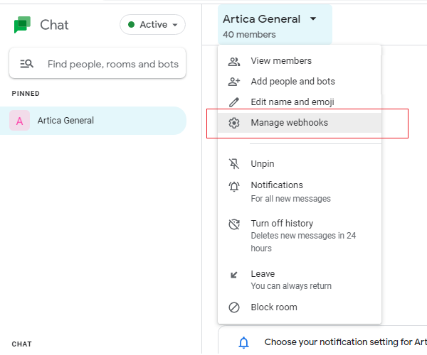
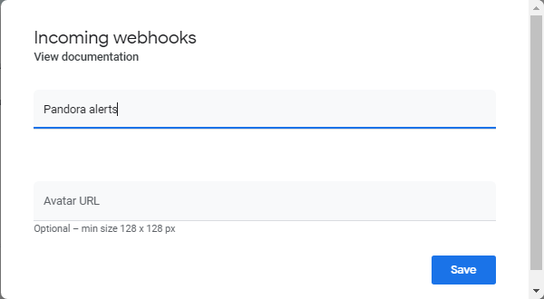
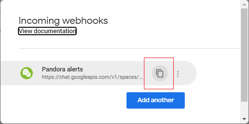
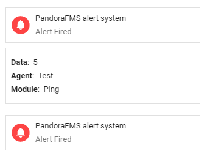
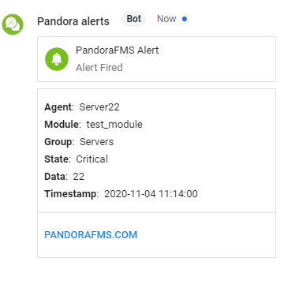
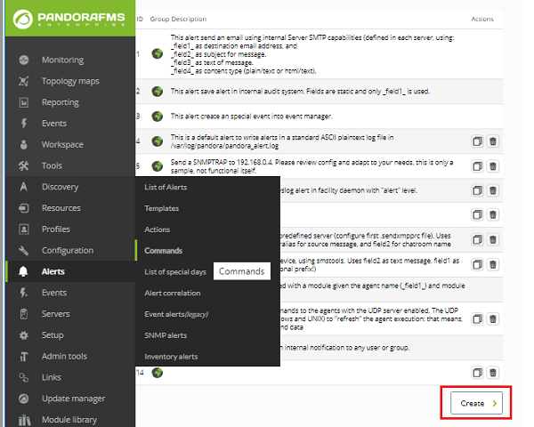
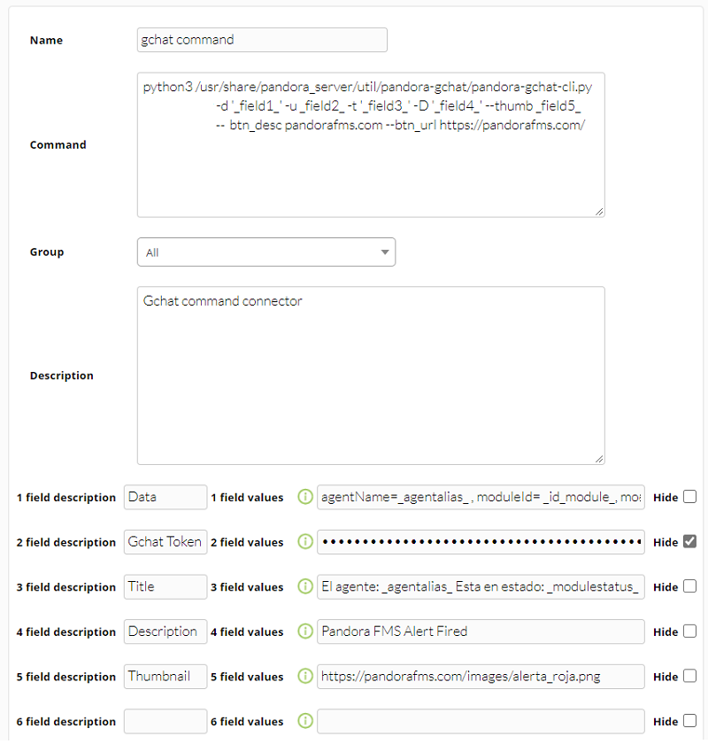
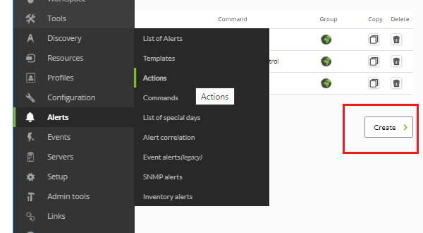
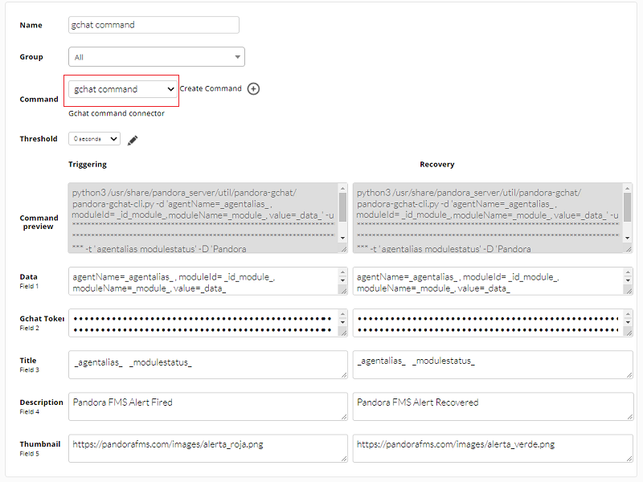

# Integración con Google Chat

## Introducción

Esta integración publica las alertas de Pandora FMS en una sala de Google Chat mediante un webhook
entrante. La sala expone una URL de webhook y un comando de alerta de Pandora FMS envía a ella el texto
de la alerta, de modo que las alertas aparecen como mensajes en la sala junto a la conversación del
equipo.

## Configuración en Google Chat: sala de conversación

Una vez [usted haya accedido](https://chat.google.com/) y haya sido identificado con su credencial de usuario vaya a la sala de conversación o *chat room* (o agregue una nueva) donde serán publicados los mensajes de alertas de Pandora FMS. Haga clic en **Manage webhooks**:

En el cuadro de diálogo emergente coloque un nombre al *webhook* y, si desea, coloque un enlace a una imagen pública en línea para identificarlo mejor (visualmente).

Pulse el botón **Save** para guardar. A continuación mostrará un resumen con un [enlace para la documentación](https://developers.google.com/hangouts/chat/how-tos/webhooks) sobre esta tecnología y un botón azul invitando a crear otro *webhook*; ***copie el enlace identificador del webhook*** ya que será usado para configurar Pandora FMS en la siguiente página.

## Configuración en Pandora FMS: creación de un comando de alerta

Abra una ventana terminal y acceda al servidor Pandora FMS. Descargue (y descomprima) desde la [librería de Pandora FMS](https://pandorafms.com/library/google-chat-connector-cli/) el *Google Chat connector CLI* en la siguiente ruta:

`/usr/share/pandora_server/util/pandora-gchat`

O en una ubicación que pueda acceder el servidor Pandora FMS. Debe tener instalado `python3` (con los módulos **argparse**, **requests** y **json**) y `python3-pip` para poder usar el programa `pandora-gchat-cli.py` . Una vez haya instalado ambos, con el comando `pip3` debe instalar los requerimientos o dependencias (versiones mínimas) con la siguiente instrucción:

`pip3 install -r requirements.txt`

En el fichero `test-exec.txt` encontrará un ejemplo que puede reutilizar para configurar el comando de alerta. Se recomienda que desde la misma ventana terminal envie un mensaje básico de prueba al *chat room*, por ejemplo:

Los mensajes pueden ser más elaborados mediante parámetros adicionales, compare con el siguiente ejemplo:

Diríjase a la [Consola Web de Pandora FMS](https://pandorafms.com/manual/es/documentation/02_installation/03_interface) y haga clic en **Alerts** -&gt; **Commands** -&gt; **Create**.

Con ayuda del texto que está en el fichero `test-exec.txt` complete los siguientes campos, preste atención en el segundo campo donde copiará el enlace identificador obtenido en la página anterior, asegúrese de marcar su contenido como oculto en Pandora FMS:

Haga clic en el botón **Create** para guardar el comando de alerta.

## Configuración en Pandora FMS: creación de una acción de alerta

Las [acciones de alerta](https://pandorafms.com/manual/es/documentation/04_using/01_alerts) permiten definir *el cómo* lanzar el comando. Vaya al menú **Alerts** -&gt; **Actions** -&gt; **Create**.

Seleccione en **Command** el comando de alerta creado en la página anterior, los campos se rellenarán automáticamente. Sin embargo siempre podrá personalizar los iconos para los eventos **Triggering** y **Recovery**, por ejemplo.

Para guardar haga clic en **Create**. Para aplicar esta acción bien sea a un [Módulo o Política](https://pandorafms.com/manual/es/documentation/05_big_environments/02_policy), establezca una [plantilla de alerta](https://pandorafms.com/manual/es/documentation/04_using/01_alerts#plantilla_de_alerta) para tal fin.

Puede obtener más información en el vídeo tutorial «[Crea alertas en Google Chat con Pandora FMS](https://www.youtube.com/watch?v=99g4_aGSwTQ)».
