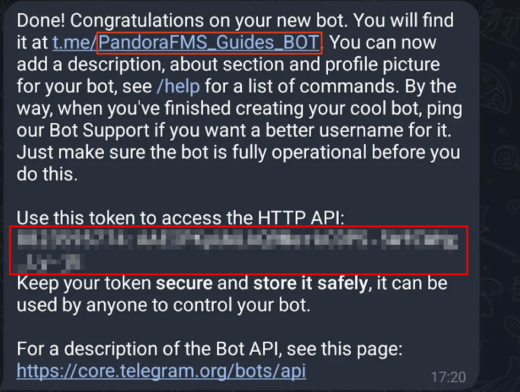

# Integración con Telegram

## Introducción

Esta integración envía las alertas de Pandora FMS a un grupo de Telegram mediante un bot de Telegram. La
consola incorpora soporte nativo para Telegram, por lo que no interviene ningún CLI externo: se registra
un bot, se añade al grupo que recibirá las alertas, se guarda su token de API en la consola y se crea una
acción de alerta que publica en el identificador de chat del grupo.

## Configuración en Telegram: creación de bot

Primero debe [crear un *bot* en Telegram](https://core.telegram.org/bots/faq)®:

- Desde su cuenta en Telegram inicie una conversación con el [usuario BotFather](https://telegram.me/botfather)

- Una vez iniciada la conversación, use el comando `/start`:

- A continuación responda con el comando `/newbot`, nos solicitará un Nombre alias para el bot y un nombre de usuario que debe finalizar en "bot"

Una vez realizados los pasos, se nos proporcionara una clave API del bot que hemos creado, es muy importante guardar la clave API y recuerde el nombre de usuario del bot

## Configuración en Telegram: crear grupo y añadir bots

- El siguiente paso es crear un grupo

- Durante la creación de este grupo añadiremos el bot que hemos creado en el paso anterior y le asignaremos un nombre al grupo

- Una vez creado, añadiremos el bot con nombre "getidsbot" **(Es muy importante añadir el bot correcto ya que hay varios nombres con alias similares)**

- Al añadir el bot, nos devolverá el ID del grupo, debemos guardarlo para realizar la configuración en la consola de Pandora, junto con el API key y el nombre de usuario del bot que hemos creado y añadido anteriormente

## Configuración en Pandora FMS: integración del bot con las alertas

Para configurar las alertas primero introduciremos el Token API en el apartado:

**Management → Settings → System settings → General setup → Alerts configuration → Telegram Configuration → Telegram Token**

El campo muestra en *texto plano* el *token*, tómese las precauciones del caso antes visualizaciones por terceros del mismo.

Al finalizar pulse el botón **Update** para guardar el *token* de Telegram en la base de datos.

## Configuración en Pandora FMS: creación de una acción de alerta

El *plugin* Telegram® viene integrado plenamente en Pandora FMS 800.

Vaya al menú **Management→ Alerts→ Actions** y en **Filter** busque **Pandora Telegram** en el campo **Command o Search**. Serán mostradas las acciones de alerta que utilizan el comando **Pandora Telegram**:

Bien puede:

- Utilizar la acción que viene por defecto al instalar Pandora FMS.
- Copiar la acción anterior y personalizar según necesidades. (Puede que varios grupos de agentes utilicen distintas acciones de alerta configuradas según cada caso)
- Crear una acción basada en el comando de alerta (de solo lectura) Telegram.

En cualquier caso, la configuración es similar:

- En nombre y grupo indique y elija según el caso.
- Asegúrese que en la lista **Command,** esté seleccionado **Pandora Telegram**.
- En **Chat ID** introduzca el ID que le proporcionó GetIDsBot en los pasos anteriores.
- El campo **Message** para **Triggering**, por defecto es `[PANDORA] Alert FIRED on _agent_ / _module_ / _timestamp_ / _data_` . Consulte las demás [macros disponibles](https://pandorafms.com/manual/es/documentation/pandorafms/management_and_operation/01_alerts#ks15) para insertar más información.
- El campo **Message** para **Recovery**, por defecto es `[PANDORA] Alert RECOVERED on _agent_ / _module_ / _timestamp_ / _data_` . Consulte las demás [macros disponibles](https://pandorafms.com/manual/es/documentation/pandorafms/management_and_operation/01_alerts#ks15) para insertar más información.
- Presione el botón **Create** si es está creando una acción de alerta o **Update** si se está editando para guardar los parámetros.

Haga clic en **Create**. Una vez haya creado esta acción de alerta, esta puede ser incluida en [una política](https://pandorafms.com/manual/es/documentation/pandorafms/complex_environments_and_optimization/02_policy "PFMS: Políticas de monitorización"), [una plantilla](https://pandorafms.com/manual/es/documentation/pandorafms/technical_annexes/34_pfms_templates_policies_massives "PFMS: Diferencias entre Plantillas, Políticas y Operaciones Masivas") o [Módulo](https://pandorafms.com/manual/es/documentation/pandorafms/management_and_operation/01_alerts#ks5_2 "PFMS: Gestionar alertas desde el agente").

En ocasiones es probable que el bot recién creado tarde un tiempo en funcionar correctamente.

